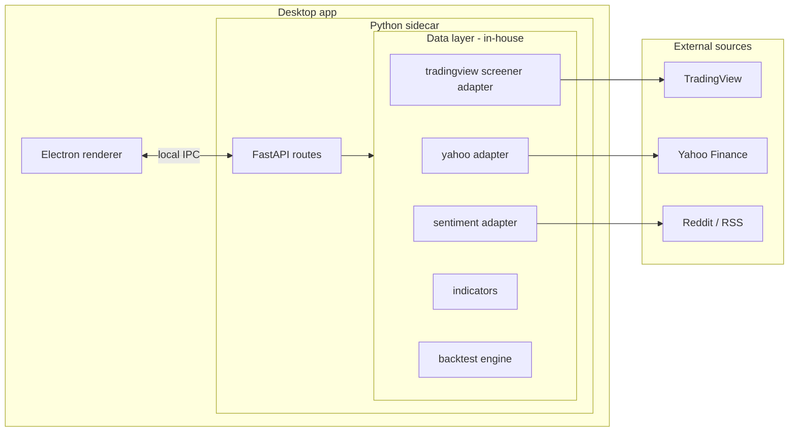
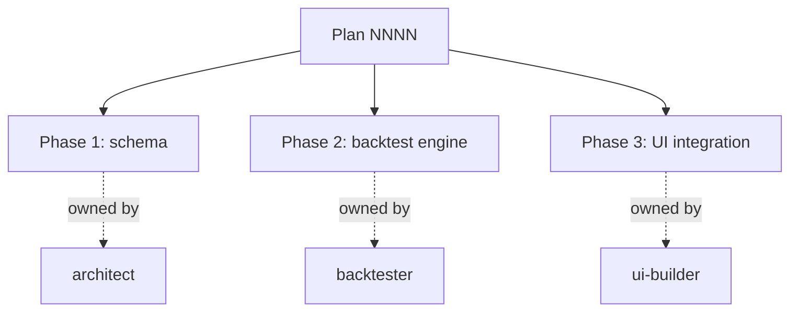
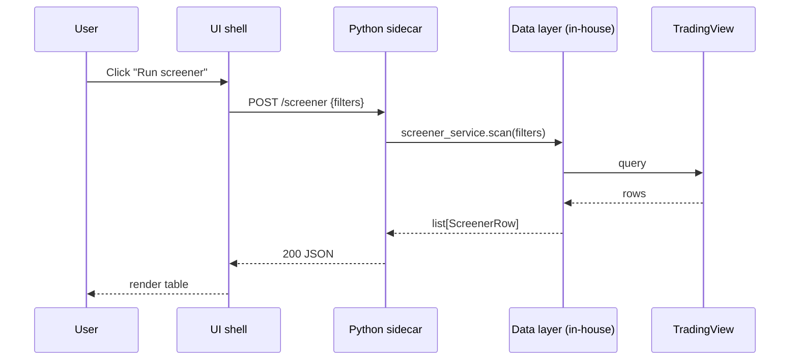
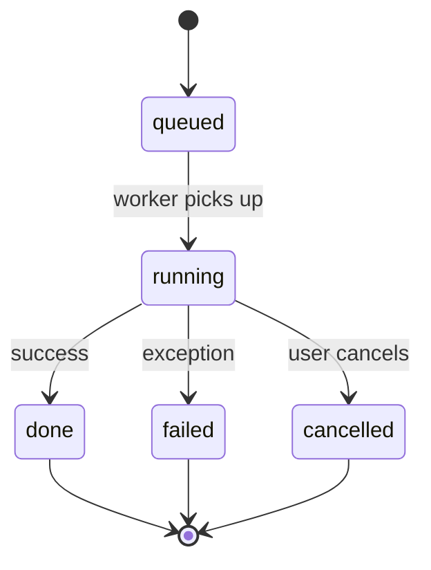
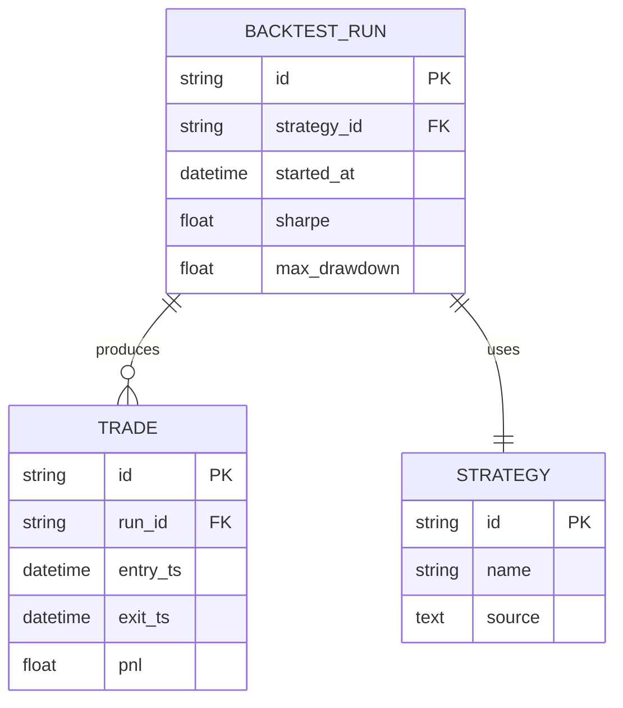

# Mermaid diagram patterns for market-analyser

Patterns reused across plans, ADRs, and the `diagrams/` directory. Use these as starting points — adapt the labels to the specific subsystem you're documenting.

## 1. High-level component map

Use for the "what is this whole thing?" diagram. Note the three subgraph boundaries: the desktop renderer, the sidecar (with its in-house data layer), and external services.

## 2. Sibling-skill handoff

Use in plans to show which skill owns which phase. Keep it minimal — the point is to make ownership obvious at a glance.

## 3. Sequence: UI → sidecar → data layer

Use when documenting interactions across the IPC boundary. Forces you to be explicit about which side of the boundary each step happens on.

## 4. State: backtest job lifecycle

Use anywhere there's an explicit lifecycle the user/UI cares about.

## 5. Persisted data shape (ER)

Use for SQLite tables / parquet layouts when the relationships matter.

## Style rules

- Prefer `flowchart LR` for component maps (left-to-right reads naturally for data flow).
- Use `subgraph` blocks to make boundaries explicit. Boundary names should be nouns (`Desktop app`, `External sources`), not verbs.
- Don't put more than ~12 nodes in one diagram. If you have more, split into separate diagrams.
- Avoid color/styling directives — they don't render consistently across editors, and add noise to diffs.
