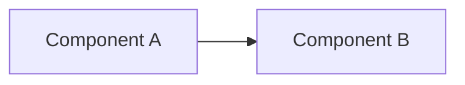

# NNNN — <short title>

> **Status:** draft | in-progress | done | abandoned
> **Created:** YYYY-MM-DD
> **Owner skill(s):** <dev | strategy-author | backtester | ui-builder | human> (list all that appear in phase owner tags below)
> **Related ADRs:** NNNN-foo, NNNN-bar (link if any)

## TL;DR

One paragraph. What we're building, why, and what the first user-visible behavior will be. A reader who only reads this section should be able to repeat the decision in a Slack message.

## Context & problem

What forces drove this? Reference the user's request or the issue. Be specific about the *problem*, not the chosen *solution* — the rest of the doc handles that.

## Decision

State the chosen approach in one paragraph, active voice. If this plan was picked from multiple options during the interview phase, name the rejected options in a single sentence at the end: "We rejected option B (eventing) because of [reason] and option C (polling) because of [reason]."

## Architecture diagram



## Implementation phases

Each phase is a discrete unit of work that ships as its own commit. The implementer runs all phases they own in one batch — no architect review between phases — and the architect reviews the whole plan once at the end. Order phases so the first one is valuable on its own (a "walking skeleton"), not just plumbing.

**Phase owner tags are machine-readable.** Every phase MUST carry a single `**Owner skill:**` line with exactly one value from the fixed vocabulary: `dev`, `strategy-author`, `backtester`, `ui-builder`, `human`. The implementing skills read this tag at the start of each phase and hand off to the named sibling when the owner changes — see `cross-skill-handoff.md`. Plans that mix owners across phases without the tag are unimplementable cleanly; Mode 4 review flags missing tags as a blocker.

### Phase 1 — <name>
- **Owner skill:** <dev | strategy-author | backtester | ui-builder | human>
- **What:** One sentence on what this phase produces.
- **Files touched:** Rough list — `src/market_analyser/foo/bar.py`, etc.
- **Done when:** Concrete acceptance — "running `uv run market-analyser screener BTCUSDT` returns a JSON list of indicators". For test files, phrase the behavioral claim the spec defends, not "spec X passes" — see the `feedback_tests_are_acceptance_criteria` memory.

### Phase 2 — <name>
…

## Data shapes

If this plan introduces new data structures (config, persisted records, API payloads), pin them down here. A small JSON or Python sketch is fine.

```python
# illustrative — not the final interface
class BacktestResult(BaseModel):
    strategy_id: str
    sharpe: float
    max_drawdown: float
    trades: list[Trade]
```

## Risks & open questions

Bullet list. Each item: what could go wrong, what we'd do about it. Don't pretend everything is solved.

- Risk: the cost-application path in the backtest engine uses `set()` iteration to deduplicate trades — backtests may be non-deterministic across runs. Mitigation: audit `backtest/adapter.py` in phase 1 and switch to a deterministic dict-based dedup before phase 2.

## What this plan does NOT do

Cut the scope explicitly. Things that are tempting to bundle but are out of scope for this plan. Future plans can address them; reference them by name if you can.

- Live trading integration — separate plan.
- Multi-account portfolio aggregation — separate plan.

## Followups (after this lands)

Track followups here as a list so they don't get lost. Empty list is fine at draft time; fill as you go.
