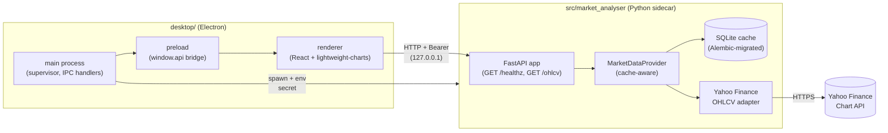

# market-analyser

A desktop application for analyzing markets and authoring trading strategies. Electron + React renderer on top of a local Python sidecar (FastAPI on `127.0.0.1`) with SQLite caching.

**Status:** walking skeleton. The bootstrap ([Plan 0001](docs/architecture/plans/done/0001-bootstrap.md), closed 2026-05-18) ships one symbol, one timeframe, candlestick chart, end-to-end SQLite cache. Strategies, backtesting, screeners, and DeFi analysis are **designed but not yet built**. See [Roadmap](#roadmap) for what's next.

This README is the entrypoint for developers cloning the repo. End-user installers are not yet published.

## What works today

- **OHLCV view for one symbol.** Pick a symbol (default `AAPL`), pick a timeframe (`1d`, `1h`, `15m`, …), see a candlestick chart for the last 365 days. Refresh rolls the window forward to "now".
- **SQLite cache behind the data layer.** First fetch hits Yahoo Finance; subsequent loads serve from a local cache (`%APPDATA%\market-analyser\cache.sqlite` on Windows, equivalent XDG paths on macOS/Linux). The cache is keyed on `(symbol, timeframe, bar timestamp)` and survives app restarts.
- **Secure Electron shell.** `contextIsolation: true`, `nodeIntegration: false`, `sandbox: true`, double-layer CSP, no `remote` module. The renderer reaches the sidecar only through a typed `window.api.*` bridge exposed by a preload script.
- **Per-launch bearer auth.** The Electron main process spawns the Python sidecar with a freshly generated 32-byte hex secret, passed via `MARKET_ANALYSER_SECRET` in the child's environment. `/healthz` is public; every other route requires `Authorization: Bearer <secret>`. The secret is never persisted and never written to logs.
- **Heavy dev toolchain.** `uv` + `ruff` + `mypy --strict` + `pytest` on the Python side; `pnpm` + `tsc` (five tsconfigs) + ESLint + Jest + Playwright on the desktop side. Pre-commit hooks, conventional-commit enforcement, CI on push.
- **Reproducible builds.** `pnpm package:win|mac|linux` produces an installer that bundles the Python source under `extraResources` and spawns it at runtime.

## Architecture at a glance



Key seams:

- **Renderer ↔ sidecar:** the only outbound network call the renderer is allowed to make is to `http://127.0.0.1:<port>` (enforced by CSP `connect-src`). Every call goes through `desktop/renderer/api/client.ts`, which injects the bearer token once.
- **Sidecar ↔ data sources:** the renderer never knows what's behind `/ohlcv`. The `MarketDataProvider` Protocol ([`src/market_analyser/data/provider.py`](src/market_analyser/data/provider.py)) is the stable contract; adapters under `data/adapters/` plug into it.
- **Anti-lookahead seam:** every provider method takes `as_of: datetime | None`. Live callers pass `None`; backtest callers will pass a fixed datetime, and the data layer must never reach for "future" data beyond it. See [ADR-0007](docs/architecture/adrs/0007-market-data-provider.md).

For a deeper map see [`docs/architecture/diagrams/bootstrap-component-map.md`](docs/architecture/diagrams/bootstrap-component-map.md).

## Requirements

- **Python ≥ 3.12** (the sidecar declares `requires-python = ">=3.12"`)
- **Node.js ≥ 20** with **pnpm ≥ 9** (the desktop workspace is a pnpm workspace)
- **[uv](https://docs.astral.sh/uv/)** for Python dependency management
- **Windows / macOS / Linux** — all three are supported by `electron-builder`; CI runs on push

## Quickstart

```bash
# 1. Clone and install
git clone <repo-url> market-analyser
cd market-analyser

# 2. Python sidecar deps
uv sync

# 3. Desktop workspace deps (one pnpm install handles both root and desktop/)
pnpm install

# 4. Run the app in dev mode
pnpm dev
```

`pnpm dev` is a one-shot. Under the hood it runs four watchers concurrently:

| Watcher           | What it produces                                       |
| ----------------- | ------------------------------------------------------ |
| `build-main`      | `desktop/dist/main/index.cjs` (Electron main process)  |
| `build-preload`   | `desktop/dist/preload/index.cjs` (preload bridge)      |
| `vite`            | the renderer at `http://localhost:5173`                |
| `electron .`      | the Electron app once the three above are ready        |

The Electron main process spawns the Python sidecar automatically — you do **not** need a second terminal running `uv run`. The sidecar binds to a free port on `127.0.0.1`, prints `PORT=<n>` on stdout, and the main process polls `/healthz` until ready (10s timeout) before opening the window.

### Running the sidecar standalone

For debugging the API in isolation:

```bash
export MARKET_ANALYSER_SECRET=$(openssl rand -hex 32)  # PowerShell: $env:MARKET_ANALYSER_SECRET = "..."
uv run python -m market_analyser.api --port=8765
```

Then:

```bash
curl http://127.0.0.1:8765/healthz
curl -H "Authorization: Bearer $MARKET_ANALYSER_SECRET" \
  "http://127.0.0.1:8765/ohlcv?symbol=AAPL&timeframe=1d&start=2025-01-01T00:00:00&end=2026-01-01T00:00:00"
```

Pass `--port=0` to let the OS pick an ephemeral port (the sidecar still prints `PORT=<n>` on stdout).

### Packaging

```bash
pnpm package:win    # NSIS installer under desktop/release/
pnpm package:mac    # DMG
pnpm package:linux  # AppImage
```

The installer bundles `src/market_analyser/` as `extraResources` so the runtime sidecar lives next to the Electron app.

## Configuration

The sidecar accepts an optional `--config <path>` pointing to a JSON file. Defaults are sensible for development.

| Key       | Default                                       | What it controls                                |
| --------- | --------------------------------------------- | ----------------------------------------------- |
| `db_path` | `<user-data-dir>/market-analyser/cache.sqlite` | SQLite cache location for the bars table       |

Bearer secrets are **never** in config — they live only in the child process's environment, are rotated on every launch by the Electron supervisor, and are never persisted. See [ADR-0002](docs/architecture/adrs/0002-ipc-local-http.md).

## Project structure

```
market-analyser/
├── src/market_analyser/          # Python sidecar
│   ├── api/                      # FastAPI app, routes, bearer auth middleware
│   ├── data/                     # MarketDataProvider Protocol + adapters
│   │   └── adapters/yahoo.py     # Yahoo Finance OHLCV
│   ├── persistence/              # SQLite engine, Alembic migrations, repositories
│   └── config.py                 # AppConfig (paths, defaults)
│
├── desktop/                      # pnpm workspace: Electron + React + TypeScript
│   ├── electron/                 # main process + sidecar supervisor + IPC
│   ├── electron/preload/         # window.api preload bridge
│   ├── renderer/                 # React (Vite + lightweight-charts)
│   ├── shared/                   # IPC channels, Zod schemas, types used both sides
│   ├── scripts/                  # esbuild build scripts
│   └── tests/                    # Playwright e2e specs
│
├── tests/                        # pytest tests (mirrors src/ layout)
│
├── docs/architecture/            # ADRs, plans, diagrams (see "Documentation map")
│
├── .claude/skills/               # Project-specific Claude Code skills (see below)
│
├── pyproject.toml                # uv-managed Python project
├── pnpm-workspace.yaml           # pnpm workspace root
├── package.json                  # root scripts (dev, build, test, typecheck)
└── README.md
```

The `runs/` directory (gitignored) holds backtest and analysis artifacts when those subsystems land. `positions/` (gitignored) holds the DeFi analyst's positions file when that subsystem lands.

## Development workflow

### Python sidecar

```bash
uv run pytest                 # unit tests with coverage
uv run pytest -m network      # tests that hit the live network (off by default)
uv run ruff check src tests   # lint
uv run ruff format src tests  # format
uv run mypy                   # strict type-check (configured in pyproject.toml)
```

### Desktop

```bash
pnpm typecheck                # five tsconfigs: main, preload, renderer, test, e2e
pnpm lint                     # ESLint across electron/, renderer/, shared/
pnpm test                     # Jest renderer
pnpm test:main                # Jest main process
pnpm test:e2e                 # Playwright (requires `pnpm build` first)
pnpm gen-types                # regenerate TS types from the sidecar's Pydantic models
pnpm gen-types:check          # CI check that committed types are in sync
```

### Cross-cutting non-negotiables

These apply to every change (also documented in [`CLAUDE.md`](CLAUDE.md)):

- **No lookahead bias.** Decisions at bar `i` only see data from `bars[0..=i]`. Indicators are trailing, never centered.
- **Determinism.** Same inputs → byte-identical outputs. No `set` iteration, no wall-clock reads outside designated boundaries, no unseeded randomness.
- **No secrets in code or logs.** Bearer tokens, API keys, IPC secrets — never persisted, never logged.
- **Validate at boundaries.** Pydantic at sidecar HTTP boundary; Zod at IPC boundary; typed responses for sidecar HTTP. Don't re-validate inside trusted code paths.
- **Conditions are facts, decisions are the user's.** Analyst surfaces (when they exist) report conditions; they never recommend buy/sell.

### Commit style

Conventional commits, enforced by `commitizen` and a `commit-msg` Husky hook. Examples:

```
feat(api): add /screener route
fix(desktop): clear chart series when symbol changes
refactor(data): collapse Yahoo adapter retry into transport layer
docs(adr): supersede ADR-0001 with ADR-0005
```

Implementers commit per phase; pushes are user-driven. CI runs on push and tag.

## The skill ecosystem

This repo is set up to be worked on by [Claude Code](https://claude.com/claude-code) using project-scoped skills under [`.claude/skills/`](.claude/skills/). Skills are not required to develop the app — you can read the code and edit normally — but if you use Claude Code, the skills route work to the right specialist automatically.

| Skill              | Owns                                              | Routes on                                                        |
|--------------------|---------------------------------------------------|------------------------------------------------------------------|
| `architect`        | `docs/architecture/` (ADRs, plans, diagrams)      | Design questions, "should we…", new ADRs, plan authoring, reviews |
| `dev`              | Python sidecar + tooling + CI                     | "Implement plan N", "do phase X", architect-authored work        |
| `strategy-author`  | `src/market_analyser/strategies/` (not yet built) | Writing/editing/porting trading strategies                       |
| `backtester`       | `src/market_analyser/backtest/` (not yet built)   | Running backtests, computing metrics, building the engine        |
| `ui-builder`       | `desktop/`                                        | React views, charts, Electron shell, IPC, renderer plumbing      |
| `market-analyst`   | Read-only TradFi analysis → `runs/analysis/`      | Candlestick scans, trend/momentum snapshots, screeners           |
| `defi-analyst`     | Read-only DeFi analysis → `runs/defi/`            | Pool screens, LP positions, lending health, on-chain audits      |
| `skill-creator`    | `.claude/skills/`                                 | Creating, editing, or measuring skills (meta)                    |

The canonical workflow for a new feature: `architect` designs and writes a plan → user signs off → `dev` (or the named sibling) implements every phase → a fresh `architect` session reviews and closes the plan. See [`CLAUDE.md`](CLAUDE.md) for the full conventions.

## Documentation map

| Path                                          | What lives there                                              |
| --------------------------------------------- | ------------------------------------------------------------- |
| [`CLAUDE.md`](CLAUDE.md)                      | Project orientation: skill responsibilities, hand-offs, non-negotiables |
| [`docs/architecture/adrs/`](docs/architecture/adrs/) | Architecture Decision Records (numbered, durable, append-only) |
| [`docs/architecture/plans/`](docs/architecture/plans/) | Implementation plans (per feature/initiative; see [`plans/README.md`](docs/architecture/plans/README.md) for the active roster) |
| [`docs/architecture/diagrams/`](docs/architecture/diagrams/) | Standalone mermaid diagrams                            |

ADRs that gate frequent decisions:

- **[ADR-0002](docs/architecture/adrs/0002-ipc-local-http.md)** — IPC over localhost HTTP with bearer auth
- **[ADR-0005](docs/architecture/adrs/0005-desktop-shell-electron.md)** — why Electron (supersedes ADR-0001's Tauri pick)
- **[ADR-0006](docs/architecture/adrs/0006-persistence-layout.md)** — persistence layout (SQLite + config.json)
- **[ADR-0007](docs/architecture/adrs/0007-market-data-provider.md)** — `MarketDataProvider` Protocol and the `as_of` anti-lookahead seam
- **[ADR-0008](docs/architecture/adrs/0008-electron-shell-conventions.md)** — Electron shell conventions (build pipeline, IPC discipline, CSP, packaging)
- **[ADR-0009](docs/architecture/adrs/0009-rewrite-data-layer-in-house.md)** — rewrite the data layer in-house (supersedes ADR-0003)
- **[ADR-0010](docs/architecture/adrs/0010-tsconfig-solution-layout.md)** — five-tsconfig layout for the desktop workspace

## Roadmap

Honest current state. "Designed" means an ADR or plan exists; "not started" means no code yet.

| Capability                                 | State                                                                              |
| ------------------------------------------ | ---------------------------------------------------------------------------------- |
| OHLCV chart for one symbol                 | **Done** ([Plan 0001](docs/architecture/plans/done/0001-bootstrap.md), closed 2026-05-18) |
| SQLite cache + Alembic migrations          | **Done**                                                                           |
| Yahoo Finance adapter (in-house)           | **Done** ([Plan 0003](docs/architecture/plans/done/0003-excise-vendored-upstream.md), closed 2026-05-19) |
| Bootstrap review followups                 | **Done** ([Plan 0004](docs/architecture/plans/done/0004-bootstrap-review-followups.md), closed 2026-05-18) |
| Dependency discipline (cooldown + pins)    | **Designed** ([Plan 0005](docs/architecture/plans/0005-dependency-cooldown.md)) — not started |
| MCP server + annotations on chart          | **Designed** ([Plan 0006](docs/architecture/plans/0006-annotations-via-mcp.md) + [ADR-0014](docs/architecture/adrs/0014-mcp-as-second-sidecar-protocol.md)) — not started |
| Strategy contract (`Params`, `Signal`, `META`) | **Designed** ([Plan 0002](docs/architecture/plans/0002-strategy-interface.md)) — not started |
| Backtest engine + metrics                  | **Designed** (engine in [ADR-0004](docs/architecture/adrs/0004-strategy-interface.md)) — not started |
| Multi-symbol screener / watchlist          | Not started                                                                        |
| Multi-route navigation                     | Not started                                                                        |
| TradFi pattern/trend analysis surface      | Not started                                                                        |
| DeFi pool / LP / lending analysis          | Not started                                                                        |
| Auto-update                                | Deferred to a future packaging plan                                                |

The [`docs/architecture/plans/README.md`](docs/architecture/plans/README.md) index has the recommended execution order and the current status of every active plan. For the **long-horizon vision** — agent-first MCP application, predictive surface, news & investigation — see [`docs/architecture/roadmap.md`](docs/architecture/roadmap.md). That document is aspirational, not committed; this table is the source of truth for current state.

## Security model

Brief, because the defaults are non-negotiable:

- **Renderer is fully sandboxed.** `contextIsolation`, `sandbox`, no node integration, double-CSP (one in the index.html `<meta>`, one in the response header injected by the main process), `connect-src` narrowed to `127.0.0.1`.
- **Sidecar binds `127.0.0.1` only.** Never `0.0.0.0`; the bind socket is created explicitly with that host.
- **Bearer auth on every non-health route.** Constant-time comparison (no early-out on first mismatched byte).
- **Secrets live in process env, not argv.** `MARKET_ANALYSER_SECRET` is generated per launch, passed through the child's environment, never logged, never persisted. Process listings (`ps`, Task Manager) do not reveal it.
- **No third-party network calls from the renderer.** All upstream data is fetched by the sidecar; the renderer talks only to `127.0.0.1`.

If you find a security issue, please open an issue with the `security` label rather than a public PR.

## Contributing

The codebase is in active bootstrap; PRs from outside the team aren't being accepted yet. Once the strategy contract and backtest engine land (Plans 0002 + the future backtest plan), this section will explain how to contribute strategies and adapters.

For now: the most useful external feedback is on the public ADRs in [`docs/architecture/adrs/`](docs/architecture/adrs/). Issues or discussions challenging a specific decision are welcome.

## License

[MIT](LICENSE) © 2026 Igor Konovalov.
