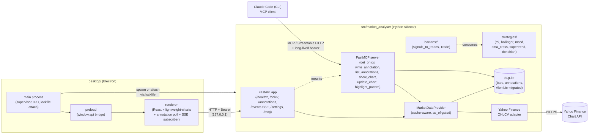

# market-analyser

A desktop application for analyzing markets and authoring trading strategies. Electron + React renderer on top of a local Python sidecar (FastAPI on `127.0.0.1`) with SQLite caching and a Streamable-HTTP MCP server mounted at `/mcp`.

**Primary control surface: Claude Code (CLI) via MCP** ([ADR-0015](docs/architecture/adrs/0015-claude-code-primary-control-surface.md)). The user drives the app by talking to an agent, which calls MCP tools on the sidecar. The Electron viewer is a live visualisation surface — it subscribes to a sidecar event stream ([ADR-0017](docs/architecture/adrs/0017-live-ui-updates-via-sse.md)) and renders agent-issued chart commands. The sidecar runs as a standalone process ([ADR-0016](docs/architecture/adrs/0016-standalone-sidecar-mode.md)): Electron auto-attaches via a lockfile if one is already running, and closing the viewer does not stop the sidecar.

**Status.** Bootstrap is closed ([Plan 0001](docs/architecture/plans/done/0001-bootstrap.md), 2026-05-18). MCP server + annotations ([Plan 0006](docs/architecture/plans/done/0006-annotations-via-mcp.md), 2026-05-20), strategy contract + six reference strategies ([Plan 0002](docs/architecture/plans/done/0002-strategy-interface.md), 2026-05-20), and the live agent-driven viewer — standalone sidecar + SSE + three `show_*` MCP tools + Electron SSE subscriber ([Plan 0007](docs/architecture/plans/done/0007-live-agent-driven-viewer.md), closed 2026-05-22 after five hardening sub-phases 4.1–4.5) — are all live. Next approved and queued for implementation: backtest engine ([Plan 0008](docs/architecture/plans/0008-backtest-engine-v1.md)), Tier 2 data adapters ([Plans 0009–0012](docs/architecture/plans/) — screener, news, sentiment, fear-and-greed), auto-backfill on cache miss ([Plan 0013](docs/architecture/plans/0013-auto-backfill-on-cache-miss.md)), interactive chart + agent-mode toggle ([Plan 0014](docs/architecture/plans/0014-interactive-chart-and-agent-mode.md) + [ADR-0021](docs/architecture/adrs/0021-renderer-to-agent-feedback.md)), and a one-command dev startup ([Plan 0015](docs/architecture/plans/0015-pnpm-dev-all.md), recommended to land first). See [Roadmap](#roadmap).

This README is the entrypoint for developers cloning the repo. End-user installers are not yet published.

## What works today

- **OHLCV view for one symbol.** Pick a symbol (default `AAPL`), pick a timeframe (`1d`, `1h`, …), see a candlestick chart for the last 365 days. Refresh rolls the window forward to "now".
- **SQLite cache behind the data layer.** First fetch hits Yahoo Finance; subsequent loads serve from a local cache (`%APPDATA%\market-analyser\cache.sqlite` on Windows, equivalent XDG paths on macOS/Linux). The cache is keyed on `(symbol, timeframe, bar timestamp)` and survives app restarts. Adapter is written in-house under `src/market_analyser/data/` per [ADR-0009](docs/architecture/adrs/0009-rewrite-data-layer-in-house.md).
- **MCP server at `/mcp`.** Streamable HTTP (rev 2025-03-26), dual-bearer auth ([ADR-0014](docs/architecture/adrs/0014-mcp-as-second-sidecar-protocol.md)). Six tools shipped: `get_ohlcv`, `write_annotation`, `list_annotations`, and the agent-driven viewer triplet `show_chart`, `update_chart`, `highlight_pattern` (Plan 0007). The agent's bearer lives in a long-lived `mcp-secret.json` under the user-data dir; the renderer's per-launch bearer is unchanged.
- **Annotations on the chart.** Agents call `write_annotation`; bullish/bearish markers appear on the live chart within ~1 s via the renderer's annotation poll loop. Annotations persist in a SQLite table and survive restarts.
- **Settings page.** Reveal / copy / rotate the MCP secret without leaving the app. Reveal is gated; rotated secrets invalidate all in-flight MCP sessions.
- **SSE event stream at `/events`.** Renderer-bearer-gated (header or `?token=` query string for `EventSource`). Typed envelope schema with synthetic `chart.update_dropped v1` notifications on subscriber overflow. The mechanism behind [ADR-0017](docs/architecture/adrs/0017-live-ui-updates-via-sse.md). The renderer's `useEventStream` hook + `lightweight-charts`-driven overlay handlers consume `chart.show`, `chart.update`, and `chart.highlight_pattern` envelopes — agents issue them via the `show_*` MCP tools and the viewer reflects them within a second.
- **Standalone sidecar.** Lockfile under the user-data dir, idempotent attach. Run `python -m market_analyser.api` once; Electron sessions attach to it instead of double-spawning, and closing the viewer leaves the sidecar running so the agent keeps working. See [ADR-0016](docs/architecture/adrs/0016-standalone-sidecar-mode.md).
- **Strategy contract + six reference strategies.** Pure `generate_signals(bars, params) -> list[Signal]` modules with a `Params` pydantic model and a `META` constant ([ADR-0004](docs/architecture/adrs/0004-strategy-interface.md)). Live: `rsi`, `bollinger`, `macd`, `ema_cross`, `supertrend`, `donchian`. Discover them via `market-analyser strategies list [--json]`. A `signals_to_trades` adapter and `Trade` type already live under `src/market_analyser/backtest/` so the engine has a stable target.
- **Secure Electron shell.** `contextIsolation: true`, `nodeIntegration: false`, `sandbox: true`, double-layer CSP, no `remote` module. The renderer reaches the sidecar only through a typed `window.api.*` bridge exposed by a preload script.
- **Per-launch bearer auth.** The Electron main process spawns the Python sidecar with a freshly generated 32-byte hex secret, passed via `MARKET_ANALYSER_SECRET` ([ADR-0011](docs/architecture/adrs/0011-bearer-secret-transport.md)). `/healthz` is public; every other renderer route requires `Authorization: Bearer <secret>`. The secret is never persisted and never written to logs.
- **Dependency discipline.** 14-day cooldown via `[tool.uv] exclude-newer` + `pnpm-workspace.yaml`'s `minimumReleaseAge`; every direct dep pinned to `==X.Y.Z` / `X.Y.Z`. See [ADR-0012](docs/architecture/adrs/0012-dependency-cooldown.md) and [ADR-0013](docs/architecture/adrs/0013-pin-direct-dependencies.md).
- **Heavy dev toolchain.** `uv` + `ruff` + `mypy --strict` + `pytest` on the Python side; `pnpm` + `tsc` (five tsconfigs) + ESLint + Jest + Playwright on the desktop side. Pre-commit hooks, conventional-commit enforcement, CI on push.
- **Reproducible builds.** `pnpm package:win|mac|linux` produces an installer that bundles the Python source under `extraResources` and spawns it at runtime.

## Architecture at a glance



Key seams:

- **Agent ↔ sidecar.** Claude Code is the primary driver. It speaks MCP Streamable HTTP to `/mcp` with the long-lived `mcp-secret.json` bearer. The renderer is not in the loop for agent-issued reads/writes.
- **Renderer ↔ sidecar.** The only outbound network call the renderer is allowed to make is to `http://127.0.0.1:<port>` (enforced by CSP `connect-src`). Every call goes through `desktop/renderer/api/client.ts`, which injects the per-launch bearer once. The renderer never reads or learns the MCP secret.
- **Sidecar ↔ data sources.** Callers never know what's behind `/ohlcv`. The `MarketDataProvider` Protocol ([`src/market_analyser/data/provider.py`](src/market_analyser/data/provider.py)) is the stable contract; adapters under `data/adapters/` plug into it.
- **Anti-lookahead seam.** Every provider method takes `as_of: datetime | None`. Live callers pass `None`; backtest callers pass a fixed datetime, and the data layer must never reach for "future" data beyond it. See [ADR-0007](docs/architecture/adrs/0007-market-data-provider.md).

For a deeper map see [`docs/architecture/diagrams/bootstrap-component-map.md`](docs/architecture/diagrams/bootstrap-component-map.md).

## Requirements

- **Python ≥ 3.12** (the sidecar declares `requires-python = ">=3.12"`)
- **Node.js ≥ 20** with **pnpm ≥ 9** (the desktop workspace is a pnpm workspace)
- **[uv](https://docs.astral.sh/uv/)** for Python dependency management
- **Windows / macOS / Linux** — all three are supported by `electron-builder`; CI runs on push

## Quickstart

```bash
# 1. Clone and install
git clone <repo-url> market-analyser
cd market-analyser

# 2. Python sidecar deps
uv sync

# 3. Desktop workspace deps (one pnpm install handles both root and desktop/)
pnpm install

# 4. Run the app in dev mode
pnpm dev
```

`pnpm dev` is a one-shot. Under the hood it runs four watchers concurrently:

| Watcher           | What it produces                                       |
| ----------------- | ------------------------------------------------------ |
| `build-main`      | `desktop/dist/main/index.cjs` (Electron main process)  |
| `build-preload`   | `desktop/dist/preload/index.cjs` (preload bridge)      |
| `vite`            | the renderer at `http://localhost:5173`                |
| `electron .`      | the Electron app once the three above are ready        |

The Electron main process either attaches to an already-running sidecar (via the lockfile under the user-data dir) or spawns a new one. When spawning, the child binds a free port on `127.0.0.1`, prints `PORT=<n>` on stdout, and the main process polls `/healthz` until ready (10s timeout) before opening the window. Closing the viewer does **not** stop a sidecar that was already running standalone.

### Running the sidecar standalone

For agent-driven workflows (the canonical mode) or for debugging the API in isolation:

```bash
# PowerShell: $env:MARKET_ANALYSER_SECRET = "..."
export MARKET_ANALYSER_SECRET=$(openssl rand -hex 32)
uv run python -m market_analyser.api --port=8765
```

Then:

```bash
curl http://127.0.0.1:8765/healthz
curl -H "Authorization: Bearer $MARKET_ANALYSER_SECRET" \
  "http://127.0.0.1:8765/ohlcv?symbol=AAPL&timeframe=1d&start=2025-01-01T00:00:00&end=2026-01-01T00:00:00"
```

The MCP endpoint at `/mcp` uses a separate, long-lived bearer stored in `mcp-secret.json` under the user-data dir (rotated from the Settings page). Pass `--port=0` to let the OS pick an ephemeral port (the sidecar still prints `PORT=<n>` on stdout).

### Configuring Claude Code

To drive the app from an agent, point Claude Code's MCP config at the running sidecar's `/mcp` endpoint with the bearer from `mcp-secret.json`. A repo-local `.mcp.json` is the canonical project-scoped config (gitignored — it carries the bearer inline). [Plan 0015](docs/architecture/plans/0015-pnpm-dev-all.md) lands `pnpm dev:all`, which atomic-writes `.mcp.json` from the live `sidecar.lock` + `mcp-secret.json` on every sidecar boot so no manual port/bearer juggling is needed; until that plan ships, copy the port from the sidecar's stdout `PORT=<n>` line and the bearer from `mcp-secret.json` by hand, or see [ADR-0014](docs/architecture/adrs/0014-mcp-as-second-sidecar-protocol.md) for the long-form transport details.

### Packaging

```bash
pnpm package:win    # NSIS installer under desktop/release/
pnpm package:mac    # DMG
pnpm package:linux  # AppImage
```

The installer bundles `src/market_analyser/` as `extraResources` so the runtime sidecar lives next to the Electron app.

## Configuration

The sidecar accepts an optional `--config <path>` pointing to a JSON file. Defaults are sensible for development.

| Key       | Default                                       | What it controls                                |
| --------- | --------------------------------------------- | ----------------------------------------------- |
| `db_path` | `<user-data-dir>/market-analyser/cache.sqlite` | SQLite location for `bars` + `annotations` tables |

Secrets:

- **`MARKET_ANALYSER_SECRET`** — per-launch renderer bearer. Generated by the Electron supervisor on every spawn, passed via the child's environment, never persisted, never logged. Constant-time compare. See [ADR-0002](docs/architecture/adrs/0002-ipc-local-http.md) and [ADR-0011](docs/architecture/adrs/0011-bearer-secret-transport.md).
- **`mcp-secret.json`** — long-lived MCP bearer. Lives under the user-data dir (gitignored), readable only by the OS user. Rotate from the Settings page in the Electron app. See [ADR-0014](docs/architecture/adrs/0014-mcp-as-second-sidecar-protocol.md).

## Project structure

```
market-analyser/
├── src/market_analyser/          # Python sidecar
│   ├── api/                      # FastAPI app, routes, middleware
│   │   ├── app.py                # app factory, bearer + CORS middleware
│   │   ├── mcp_app.py            # FastMCP server (get_ohlcv, write_annotation, list_annotations)
│   │   ├── mcp_secret.py         # long-lived MCP secret read/rotate
│   │   ├── lockfile.py           # standalone-sidecar lockfile + idempotent attach
│   │   ├── events/               # SSE event bus
│   │   └── routes/               # /ohlcv, /annotations, /events, /settings
│   ├── contracts/                # Strategy contract (Signal, BaseParams, META, discover())
│   ├── strategies/               # rsi, bollinger, macd, ema_cross, supertrend, donchian
│   ├── backtest/                 # signals_to_trades adapter + Trade type (engine pending)
│   ├── data/                     # MarketDataProvider Protocol + Yahoo adapter
│   ├── annotations/              # repository + Pydantic model
│   ├── persistence/              # SQLite engine, Alembic migrations
│   ├── cli.py                    # `market-analyser strategies list` etc.
│   └── config.py                 # AppConfig (paths, defaults)
│
├── desktop/                      # pnpm workspace: Electron + React + TypeScript
│   ├── electron/                 # main process, sidecar supervisor, IPC, lockfile attach
│   ├── electron/preload/         # window.api preload bridge
│   ├── renderer/                 # React (Vite + lightweight-charts)
│   │   ├── views/                # OhlcvView, SettingsView
│   │   ├── components/           # CandlestickChart, SymbolPicker
│   │   ├── hooks/                # useOhlcv, useAnnotationsPoll
│   │   └── api/                  # typed sidecar fetch client (injects bearer)
│   ├── shared/                   # IPC channels, Zod schemas, types used both sides
│   ├── scripts/                  # esbuild build scripts
│   └── tests/                    # Playwright e2e specs
│
├── tests/                        # pytest tests (mirrors src/ layout)
│
├── docs/architecture/            # ADRs, plans, diagrams (see "Documentation map")
│
├── .claude/skills/               # Project-specific Claude Code skills (see below)
│
├── pyproject.toml                # uv-managed Python project
├── pnpm-workspace.yaml           # pnpm workspace root (currently lists `desktop` only;
│                                 #   Plan 0015 adds the repo root to the workspace
│                                 #   so `pnpm dev:all` can orchestrate sidecar + viewer)
└── README.md                     # this file
```

The `runs/` directory (gitignored) will hold backtest and analysis artifacts when those subsystems land. `positions/` (gitignored) will hold the DeFi analyst's positions file when that subsystem lands.

## Development workflow

### Python sidecar

```bash
uv run pytest                 # unit tests with coverage
uv run pytest -m network      # tests that hit the live network (off by default)
uv run ruff check src tests   # lint
uv run ruff format src tests  # format
uv run mypy                   # strict type-check (configured in pyproject.toml)
```

### Desktop

```bash
pnpm typecheck                # five tsconfigs: main, preload, renderer, test, e2e
pnpm lint                     # ESLint across electron/, renderer/, shared/
pnpm test                     # Jest renderer
pnpm test:main                # Jest main process
pnpm test:e2e                 # Playwright (requires `pnpm build` first)
pnpm gen-types                # regenerate TS types from the sidecar's Pydantic models
pnpm gen-types:check          # CI check that committed types are in sync
```

### Cross-cutting non-negotiables

These apply to every change (also documented in [`CLAUDE.md`](CLAUDE.md)):

- **No lookahead bias.** Decisions at bar `i` only see data from `bars[0..=i]`. Indicators are trailing, never centered.
- **Determinism.** Same inputs → byte-identical outputs. No `set` iteration, no wall-clock reads outside designated boundaries, no unseeded randomness.
- **No secrets in code or logs.** Bearer tokens, API keys, IPC secrets — never persisted (except `mcp-secret.json` under the user-data dir), never logged.
- **Validate at boundaries.** Pydantic at sidecar HTTP boundary; Zod at IPC boundary; typed responses for sidecar HTTP. Don't re-validate inside trusted code paths.
- **Conditions are facts, decisions are the user's.** Analyst surfaces (when they exist) report conditions; they never recommend buy/sell.

### Commit style

Conventional commits, enforced by `commitizen` and a `commit-msg` Husky hook. Examples:

```
feat(api): add /screener route
fix(desktop): clear chart series when symbol changes
refactor(data): collapse Yahoo adapter retry into transport layer
docs(adr): supersede ADR-0001 with ADR-0005
```

Implementers commit per phase; pushes are user-driven. CI runs on push and tag.

## The skill ecosystem

This repo is set up to be worked on by [Claude Code](https://claude.com/claude-code) using project-scoped skills under [`.claude/skills/`](.claude/skills/). Skills are not required to develop the app — you can read the code and edit normally — but if you use Claude Code, the skills route work to the right specialist automatically.

| Skill              | Owns                                              | Routes on                                                        |
|--------------------|---------------------------------------------------|------------------------------------------------------------------|
| `architect`        | `docs/architecture/` (ADRs, plans, diagrams)      | Design questions, "should we…", new ADRs, plan authoring, reviews |
| `dev`              | Python sidecar + tooling + CI                     | "Implement plan N", "do phase X", architect-authored work        |
| `strategy-author`  | `src/market_analyser/strategies/`                 | Writing/editing/porting trading strategies                       |
| `backtester`       | `src/market_analyser/backtest/`, `runs/`          | Running backtests, computing metrics, building the engine        |
| `ui-builder`       | `desktop/`                                        | React views, charts, Electron shell, IPC, renderer plumbing      |
| `market-analyst`   | Read-only TradFi analysis → `runs/analysis/`      | Candlestick scans, trend/momentum snapshots, screeners           |
| `defi-analyst`     | Read-only DeFi analysis → `runs/defi/`            | Pool screens, LP positions, lending health, on-chain audits      |
| `skill-creator`    | `.claude/skills/`                                 | Creating, editing, or measuring skills (meta)                    |

The canonical workflow for a new feature: `architect` designs and writes a plan → user signs off → `dev` (or the named sibling) implements every phase → a fresh `architect` session reviews and closes the plan. See [`CLAUDE.md`](CLAUDE.md) for the full conventions.

## Documentation map

| Path                                          | What lives there                                              |
| --------------------------------------------- | ------------------------------------------------------------- |
| [`CLAUDE.md`](CLAUDE.md)                      | Project orientation: skill responsibilities, hand-offs, non-negotiables |
| [`docs/architecture/adrs/`](docs/architecture/adrs/) | Architecture Decision Records (numbered, durable, append-only) |
| [`docs/architecture/plans/`](docs/architecture/plans/) | Implementation plans (per feature/initiative; see [`plans/README.md`](docs/architecture/plans/README.md) for the active roster) |
| [`docs/architecture/diagrams/`](docs/architecture/diagrams/) | Standalone mermaid diagrams                            |
| [`docs/architecture/roadmap.md`](docs/architecture/roadmap.md) | Long-horizon vision — aspirational, not committed scope    |

ADRs that gate frequent decisions:

- **[ADR-0002](docs/architecture/adrs/0002-ipc-local-http.md)** — IPC over localhost HTTP with bearer auth
- **[ADR-0004](docs/architecture/adrs/0004-strategy-interface.md)** — strategy interface (pure function + pydantic Params)
- **[ADR-0005](docs/architecture/adrs/0005-desktop-shell-electron.md)** — why Electron (supersedes ADR-0001's Tauri pick)
- **[ADR-0006](docs/architecture/adrs/0006-persistence-layout.md)** — persistence layout (SQLite + config.json)
- **[ADR-0007](docs/architecture/adrs/0007-market-data-provider.md)** — `MarketDataProvider` Protocol and the `as_of` anti-lookahead seam
- **[ADR-0008](docs/architecture/adrs/0008-electron-shell-conventions.md)** — Electron shell conventions (build pipeline, IPC discipline, CSP, packaging)
- **[ADR-0009](docs/architecture/adrs/0009-rewrite-data-layer-in-house.md)** — rewrite the data layer in-house (supersedes ADR-0003)
- **[ADR-0011](docs/architecture/adrs/0011-bearer-secret-transport.md)** — bearer secret via `MARKET_ANALYSER_SECRET` env var, not argv
- **[ADR-0012](docs/architecture/adrs/0012-dependency-cooldown.md)** + **[ADR-0013](docs/architecture/adrs/0013-pin-direct-dependencies.md)** — dependency cooldown + exact pinning
- **[ADR-0014](docs/architecture/adrs/0014-mcp-as-second-sidecar-protocol.md)** — MCP as the second sidecar protocol; `/mcp` + long-lived bearer
- **[ADR-0015](docs/architecture/adrs/0015-claude-code-primary-control-surface.md)** — Claude Code is the primary control surface; Electron is the viewer
- **[ADR-0016](docs/architecture/adrs/0016-standalone-sidecar-mode.md)** — standalone sidecar (lockfile + idempotent attach)
- **[ADR-0017](docs/architecture/adrs/0017-live-ui-updates-via-sse.md)** — live UI updates via Server-Sent Events on `/events`
- **[ADR-0018](docs/architecture/adrs/0018-backtest-result-schema.md)** — `BacktestResult` schema (paired with Plan 0008)
- **[ADR-0019](docs/architecture/adrs/0019-external-http-adapter-resilience.md)** — shared resilience module for every external HTTP adapter (TTL cache + retry + backoff + concurrency cap); anchors the Tier 2 data series
- **[ADR-0020](docs/architecture/adrs/0020-shared-data-dir-contract.md)** — single canonical data dir resolution shared by Python sidecar and Electron main (closes the Plan 0007 smoke divergence)
- **[ADR-0021](docs/architecture/adrs/0021-renderer-to-agent-feedback.md)** — renderer→agent feedback via MCP resources + `notifications/resources/updated`, gated by an agent-mode toggle (paired with Plan 0014)

## Roadmap

Honest current state. "Designed" means an ADR or plan exists; "approved" means the user signed off but no code has landed; "not started" means no design either.

| Capability                                 | State |
| ------------------------------------------ | ----- |
| OHLCV chart for one symbol                 | **Done** ([Plan 0001](docs/architecture/plans/done/0001-bootstrap.md), closed 2026-05-18) |
| SQLite cache + Alembic migrations          | **Done** |
| Yahoo Finance adapter (in-house)           | **Done** ([Plan 0003](docs/architecture/plans/done/0003-excise-vendored-upstream.md), closed 2026-05-19) |
| Bootstrap review followups                 | **Done** ([Plan 0004](docs/architecture/plans/done/0004-bootstrap-review-followups.md), closed 2026-05-18) |
| Dependency discipline (cooldown + pins)    | **Done** ([Plan 0005](docs/architecture/plans/done/0005-dependency-cooldown.md), closed 2026-05-19) |
| MCP server + annotations on the chart      | **Done** ([Plan 0006](docs/architecture/plans/done/0006-annotations-via-mcp.md), closed 2026-05-20) |
| Strategy contract + 6 reference strategies | **Done** ([Plan 0002](docs/architecture/plans/done/0002-strategy-interface.md), closed 2026-05-20) |
| Standalone sidecar + SSE stream + agent-driven viewer | **Done** ([Plan 0007](docs/architecture/plans/done/0007-live-agent-driven-viewer.md), closed 2026-05-22 after five hardening sub-phases 4.1–4.5; [ADR-0020](docs/architecture/adrs/0020-shared-data-dir-contract.md) accepted in the same close) |
| One-command dev startup (`pnpm dev:all`)   | **Approved** ([Plan 0015](docs/architecture/plans/0015-pnpm-dev-all.md)) — recommended to land first; pure dev tooling, no production code |
| Backtest engine v1                         | **Approved** ([Plan 0008](docs/architecture/plans/0008-backtest-engine-v1.md) + [ADR-0018](docs/architecture/adrs/0018-backtest-result-schema.md)) — Plan 0007 gate satisfied |
| Shared HTTP resilience + TradingView screener | **Approved** ([Plan 0009](docs/architecture/plans/0009-resilience-and-tradingview-screener.md) + [ADR-0019](docs/architecture/adrs/0019-external-http-adapter-resilience.md)) |
| News (RSS) + VADER per-headline sentiment  | **Approved** ([Plan 0010](docs/architecture/plans/0010-news-and-vader-sentiment.md)) |
| Crypto Fear & Greed index                  | **Approved** ([Plan 0011](docs/architecture/plans/0011-fear-and-greed-indices.md)) |
| StockTwits sentiment                       | **Approved** ([Plan 0012](docs/architecture/plans/0012-stocktwits-sentiment.md)) |
| Auto-backfill on cache miss + typed adapter errors | **Approved** ([Plan 0013](docs/architecture/plans/0013-auto-backfill-on-cache-miss.md)) — closes a Plan 0007 followup; surfaces fetch progress via SSE |
| Interactive chart + agent-mode toggle (renderer→agent feedback) | **Approved** ([Plan 0014](docs/architecture/plans/0014-interactive-chart-and-agent-mode.md) + [ADR-0021](docs/architecture/adrs/0021-renderer-to-agent-feedback.md)) — drag-select range, click candle, server-side gated by an explicit toggle |
| TradFi pattern/trend analysis surface      | Not started |
| DeFi pool / LP / lending analysis          | Not started |
| Multi-route navigation                     | Not started |
| Auto-update                                | Deferred to a future packaging plan |

The [`docs/architecture/plans/README.md`](docs/architecture/plans/README.md) index has the recommended execution order and the current status of every active plan. For the **long-horizon vision** — agent-first MCP application, predictive surface, news & investigation — see [`docs/architecture/roadmap.md`](docs/architecture/roadmap.md). That document is aspirational, not committed; this table is the source of truth for current state.

## Security model

Brief, because the defaults are non-negotiable:

- **Renderer is fully sandboxed.** `contextIsolation`, `sandbox`, no node integration, double-CSP (one in the index.html `<meta>`, one in the response header injected by the main process), `connect-src` narrowed to `127.0.0.1`.
- **Sidecar binds `127.0.0.1` only.** Never `0.0.0.0`; the bind socket is created explicitly with that host.
- **Dual-bearer auth.** Renderer routes (`/ohlcv`, `/annotations`, `/events`, `/settings`) require the per-launch `MARKET_ANALYSER_SECRET`; the `/mcp` endpoint requires the long-lived `mcp-secret.json` bearer. Both use constant-time comparison.
- **Secrets live in process env or under the user-data dir, never in argv.** `MARKET_ANALYSER_SECRET` is generated per launch and passed through the child's environment; process listings (`ps`, Task Manager) do not reveal it. `mcp-secret.json` is gitignored and lives under the user-data dir.
- **No third-party network calls from the renderer.** All upstream data is fetched by the sidecar; the renderer talks only to `127.0.0.1`.

If you find a security issue, please open an issue with the `security` label rather than a public PR.

## Contributing

The codebase is in active bootstrap; PRs from outside the team aren't being accepted yet. Once the backtest engine lands ([Plan 0008](docs/architecture/plans/0008-backtest-engine-v1.md)), this section will explain how to contribute strategies and adapters.

For now: the most useful external feedback is on the public ADRs in [`docs/architecture/adrs/`](docs/architecture/adrs/). Issues or discussions challenging a specific decision are welcome.

## License

[MIT](LICENSE) © 2026 Igor Konovalov.
