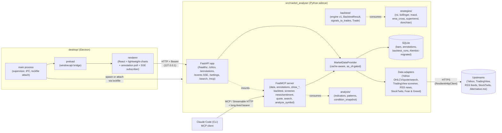

# market-analyser

A desktop application for analyzing markets and authoring trading strategies. An Electron + React renderer on top of a local Python sidecar (FastAPI on `127.0.0.1`) with SQLite caching and a Streamable-HTTP MCP server mounted at `/mcp`.

**The primary control surface is Claude Code (CLI) via MCP.** You drive the app by talking to an agent, which calls MCP tools on the sidecar. The Electron viewer is a live visualisation surface: it subscribes to a sidecar event stream and renders agent-issued chart commands. The sidecar runs as a standalone process — Electron auto-attaches via a lockfile if one is already running, and closing the viewer does not stop the sidecar.

This README is the entrypoint for developers cloning the repo; design docs live under `docs/architecture/`. End-user installers are not yet published.

## Capabilities

- **OHLCV candlestick charts** for one symbol at a time, timeframes `15m`/`1h`/`4h`/`1d`/`1w`. First fetch hits Yahoo Finance; subsequent loads serve from a local SQLite cache keyed on `(symbol, timeframe, bar timestamp)`, with auto-backfill on cache miss. The data adapter is written in-house under `src/market_analyser/data/`.
- **Agent control over MCP** at `/mcp` (Streamable HTTP, long-lived bearer). Tools span market data, chart annotations, the agent-driven viewer (`show_chart`/`update_chart`/`highlight_pattern`), backtests, the TradingView screener, news & sentiment, live quotes, symbol search, and a technical-analysis snapshot.
- **Live agent-driven viewer** over an SSE stream at `/events`. Agents issue chart commands and the viewer reflects them within ~1 s; chart annotations persist in SQLite and survive restarts.
- **Strategy contract + six reference strategies** (`rsi`, `bollinger`, `macd`, `ema_cross`, `supertrend`, `donchian`) — pure `generate_signals(bars, params) -> list[Signal]` modules with a pydantic `Params` model and a `META` constant. Discover them via `market-analyser strategies list [--json]`.
- **Backtest engine v1** — pure `run(strategy, bars, params, **costs) -> BacktestResult` producing an equity curve, trade log, and metrics; deterministic and cross-process byte-identical modulo run provenance. Results persist to disk + a SQLite index and render in the chart's backtest views.
- **Technical-analysis surface** under `src/market_analyser/analysis/` — trailing/anti-lookahead indicators, candlestick-pattern detectors, and a `condition_snapshot` (trend / momentum / support-resistance / recent patterns).
- **Data breadth** — a shared resilient HTTP client (TTL cache + retry + backoff + concurrency cap) behind the TradingView screener, RSS news + per-headline VADER sentiment, StockTwits sentiment, and the crypto Fear & Greed index.
- **Secure Electron shell** — `contextIsolation`, `sandbox`, no node integration, double-CSP, dual-bearer auth. The renderer reaches the sidecar only through a typed `window.api.*` bridge.

## Architecture at a glance



Key seams:

- **Agent ↔ sidecar.** Claude Code is the primary driver. It speaks MCP Streamable HTTP to `/mcp` with the long-lived `mcp-secret.json` bearer. The renderer is not in the loop for agent-issued reads/writes.
- **Renderer ↔ sidecar.** The renderer's only outbound call is to `http://127.0.0.1:<port>` (enforced by CSP `connect-src`), always through `desktop/renderer/api/client.ts`, which injects the per-launch bearer once. The renderer never learns the MCP secret.
- **Sidecar ↔ data sources.** Callers never know what's behind `/ohlcv`. The `MarketDataProvider` Protocol (`src/market_analyser/data/provider.py`) is the stable contract; adapters under `data/adapters/` plug into it.
- **Anti-lookahead seam.** Every provider method takes `as_of: datetime | None`. Live callers pass `None`; backtest callers pass a fixed datetime, and the data layer never reaches for data beyond it.

## Requirements

- **Python ≥ 3.12** and **[uv](https://docs.astral.sh/uv/)** for the sidecar
- **Node.js ≥ 20** with **pnpm ≥ 9** for the desktop workspace
- **Windows / macOS / Linux** — all supported by `electron-builder`

## Quickstart

```bash
git clone <repo-url> market-analyser
cd market-analyser
uv sync          # Python sidecar deps
pnpm install     # desktop workspace deps (root + desktop/)
pnpm dev         # run the app in dev mode
```

`pnpm dev` runs four watchers concurrently:

| Watcher         | Produces                                              |
| --------------- | ---------------------------------------------------- |
| `build-main`    | `desktop/dist/main/index.cjs` (Electron main)        |
| `build-preload` | `desktop/dist/preload/index.cjs` (preload bridge)    |
| `vite`          | the renderer at `http://localhost:5173`              |
| `electron .`    | the Electron app once the three above are ready      |

The main process either attaches to an already-running sidecar (via the lockfile under the user-data dir) or spawns one. When spawning, the child binds a free port on `127.0.0.1`, prints `PORT=<n>` on stdout, and the main process polls `/healthz` (10 s timeout) before opening the window. Closing the viewer does **not** stop a sidecar that was already running standalone.

### Running the sidecar standalone

For agent-driven workflows (the canonical mode) or for debugging the API in isolation:

```bash
# PowerShell: $env:MARKET_ANALYSER_SECRET = "..."
export MARKET_ANALYSER_SECRET=$(openssl rand -hex 32)
uv run python -m market_analyser.api --port=8765
```

```bash
curl http://127.0.0.1:8765/healthz
curl -H "Authorization: Bearer $MARKET_ANALYSER_SECRET" \
  "http://127.0.0.1:8765/ohlcv?symbol=AAPL&timeframe=1d&start=2025-01-01T00:00:00&end=2026-01-01T00:00:00"
```

`/mcp` uses a separate, long-lived bearer stored in `mcp-secret.json` under the user-data dir (rotated from the Settings page). Pass `--port=0` to let the OS pick an ephemeral port.

### Configuring Claude Code

To drive the app from an agent, point Claude Code's MCP config at the running sidecar's `/mcp` endpoint with the bearer from `mcp-secret.json`. A repo-local `.mcp.json` is the canonical project-scoped config (gitignored — it carries the bearer inline). `pnpm dev:all` atomic-writes `.mcp.json` from the live `sidecar.lock` + `mcp-secret.json` on every sidecar boot, so there's no manual port/bearer juggling. To wire it by hand, copy the port from the sidecar's stdout `PORT=<n>` line and the bearer from `mcp-secret.json`.

### Packaging

```bash
pnpm package:win    # NSIS installer under desktop/release/
pnpm package:mac    # DMG
pnpm package:linux  # AppImage
```

The installer bundles `src/market_analyser/` as `extraResources` so the runtime sidecar lives next to the Electron app.

## Configuration

The sidecar accepts an optional `--config <path>` to a JSON file; defaults are sensible for development. The one key today is `db_path` (default `<user-data-dir>/market-analyser/cache.sqlite`), the SQLite location for the `bars`, `annotations`, and `backtest_runs` tables.

Secrets:

- **`MARKET_ANALYSER_SECRET`** — per-launch renderer bearer. Generated by the Electron supervisor on every spawn, passed via the child's environment, never persisted, never logged. Constant-time compare.
- **`mcp-secret.json`** — long-lived MCP bearer under the user-data dir (gitignored, OS-user-readable only). Rotate from the Settings page.
- **Third-party data-source keys (e.g. `MARKET_ANALYSER_ZERION_API_KEY`)** — per [ADR-0038](docs/architecture/adrs/0038-third-party-api-key-storage.md), stored in a `0600` `secrets.json` under the user-data dir, with a per-key `MARKET_ANALYSER_<KEY>` env-var override that takes precedence. The value is never logged and never returned by any endpoint (`GET /settings/secrets` reports only `"set"`/absent).

  **DeFi wallet discovery requires a Zerion key.** The `scan_wallet` MCP tool and `POST /defi/scan` need `zerion_api_key`; without it a scan returns a typed "no API key configured" error. Provide it either by **exporting** the variable in the sidecar's launch shell:

  ```bash
  # PowerShell: $env:MARKET_ANALYSER_ZERION_API_KEY = "zk_..."
  export MARKET_ANALYSER_ZERION_API_KEY=zk_...
  ```

  or at runtime via the write-only endpoint (persists to `secrets.json`, survives restart):

  ```bash
  curl -X POST -H "Authorization: Bearer $MARKET_ANALYSER_SECRET" \
    -H "Content-Type: application/json" \
    -d '{"key":"zerion_api_key","value":"zk_..."}' \
    http://127.0.0.1:<port>/settings/secret
  ```

  In a **dev / source checkout** the sidecar auto-loads a repo-root `.env` (see [`.env.example`](.env.example)) at startup, so putting `MARKET_ANALYSER_ZERION_API_KEY=zk_…` there is enough — no manual export needed. A real environment variable still wins over `.env` (`override=False`), and **packaged builds load nothing** (no `.env` ships next to the bundled source), so the endpoint / `secrets.json` path remains the mechanism for installed apps. Free Developer tier: <https://zerion.io/api>.

## Project structure

```
market-analyser/
├── src/market_analyser/          # Python sidecar
│   ├── api/                      # FastAPI app, routes, middleware
│   │   ├── app.py                # app factory, bearer + CORS middleware
│   │   ├── mcp_app.py            # FastMCP server — thin hub wiring the register_* tools
│   │   ├── mcp_tools/            # one module per MCP tool (register_* + input models)
│   │   ├── mcp_secret.py         # long-lived MCP secret read/rotate
│   │   ├── lockfile.py           # standalone-sidecar lockfile + idempotent attach
│   │   ├── events/               # SSE event bus
│   │   └── routes/               # /ohlcv, /annotations, /events, /settings, /search, /backtests, /ui_events
│   ├── contracts/                # Strategy contract (Signal, BaseParams, META, discover())
│   ├── strategies/               # rsi, bollinger, macd, ema_cross, supertrend, donchian
│   ├── backtest/                 # backtest engine v1 + BacktestResult + signals_to_trades + Trade
│   ├── analysis/                 # indicators, candlestick patterns, condition_snapshot
│   ├── data/                     # MarketDataProvider Protocol, timeframes registry, adapters/
│   ├── annotations/              # repository + Pydantic model
│   ├── persistence/              # SQLite engine, Alembic migrations
│   ├── cli.py                    # `market-analyser strategies list` etc.
│   └── config.py                 # AppConfig (paths, defaults)
│
├── desktop/                      # pnpm workspace: Electron + React + TypeScript
│   ├── electron/                 # main process, sidecar supervisor, IPC, lockfile attach
│   ├── electron/preload/         # window.api preload bridge
│   ├── renderer/                 # React (Vite + lightweight-charts)
│   │   ├── views/                # OhlcvView, BacktestView, RecentBacktestsView, SettingsView
│   │   ├── components/           # CandlestickChart, SymbolPicker, AgentModeToggle, Toast
│   │   ├── handlers/             # SSE chart-command handlers
│   │   ├── hooks/                # useOhlcv, useEventStream, useAnnotationsPoll, …
│   │   ├── api/                  # typed sidecar fetch client (injects bearer)
│   │   └── types/                # TS types generated from the sidecar's Pydantic models
│   ├── shared/                   # IPC channels, Zod schemas, types used both sides
│   ├── scripts/                  # esbuild build scripts + gen-types
│   └── tests/                    # Playwright e2e specs
│
├── tests/                        # pytest tests (mirrors src/ layout)
├── docs/architecture/            # ADRs, plans, diagrams
├── .claude/skills/               # Project-specific Claude Code skills
├── pyproject.toml                # uv-managed Python project
├── package.json                  # root scripts: `pnpm dev:all`, `pnpm smoke`
├── pnpm-workspace.yaml           # pnpm workspace root (repo root + desktop)
└── README.md                     # this file
```

The `runs/` directory (gitignored) holds backtest and analysis run artifacts. `positions/` (gitignored) holds the DeFi analyst's positions file when that subsystem lands.

## Development

### Python sidecar

```bash
uv run pytest                 # unit tests with coverage
uv run pytest -m network      # tests that hit the live network (off by default)
uv run ruff check src tests   # lint
uv run ruff format src tests  # format
uv run mypy                   # strict type-check
```

### Desktop

```bash
pnpm typecheck                # five tsconfigs: main, preload, renderer, test, e2e
pnpm lint                     # ESLint across electron/, renderer/, shared/
pnpm test                     # Jest renderer
pnpm test:main                # Jest main process
pnpm test:e2e                 # Playwright (requires `pnpm build` first)
pnpm gen-types                # regenerate TS types from the sidecar's Pydantic models
pnpm gen-types:check          # CI check that committed types are in sync
```

### End-to-end smoke

`pnpm smoke` drives one path through every shipped layer against live upstreams and prints PASS / FAIL / UPSTREAM-DOWN per step.

### Non-negotiables

These apply to every change (also in [`CLAUDE.md`](CLAUDE.md)):

- **No lookahead bias.** Decisions at bar `i` only see `bars[0..=i]`; indicators are trailing, never centered.
- **Determinism.** Same inputs → byte-identical outputs. No `set` iteration, no wall-clock reads outside designated boundaries, no unseeded randomness in the financially-meaningful path.
- **No secrets in code or logs.** Bearer tokens and IPC secrets are never persisted (except `mcp-secret.json` under the user-data dir) and never logged.
- **Validate at boundaries.** Pydantic at the sidecar HTTP boundary, Zod at the IPC boundary; don't re-validate inside trusted code paths.
- **Conditions are facts, decisions are the user's.** Analyst surfaces report conditions; they never recommend buy/sell.

### Commit style

Conventional commits, enforced by `commitizen` and a `commit-msg` Husky hook. Implementers commit per phase; pushes are user-driven. CI runs on push and tag.

## Security model

- **Renderer is fully sandboxed** — `contextIsolation`, `sandbox`, no node integration, double-CSP (index.html `<meta>` + response header), `connect-src` narrowed to `127.0.0.1`.
- **Sidecar binds `127.0.0.1` only**, never `0.0.0.0`.
- **Dual-bearer auth.** Renderer routes require the per-launch `MARKET_ANALYSER_SECRET`; `/mcp` requires the long-lived `mcp-secret.json` bearer. Both use constant-time comparison; `/healthz` is public.
- **Secrets live in process env or under the user-data dir, never in argv** — process listings never reveal them.
- **No third-party network calls from the renderer** — all upstream data is fetched by the sidecar.

If you find a security issue, please open an issue with the `security` label rather than a public PR.

## License

[MIT](LICENSE) © 2026 Igor Konovalov.
