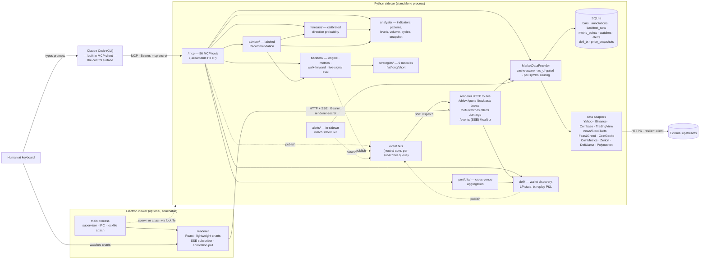
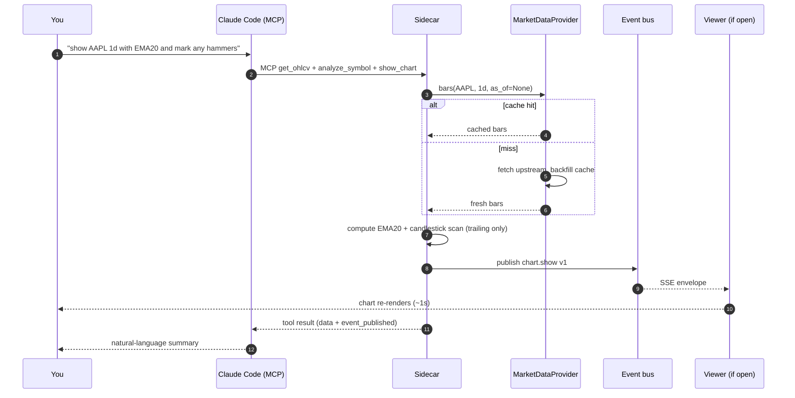
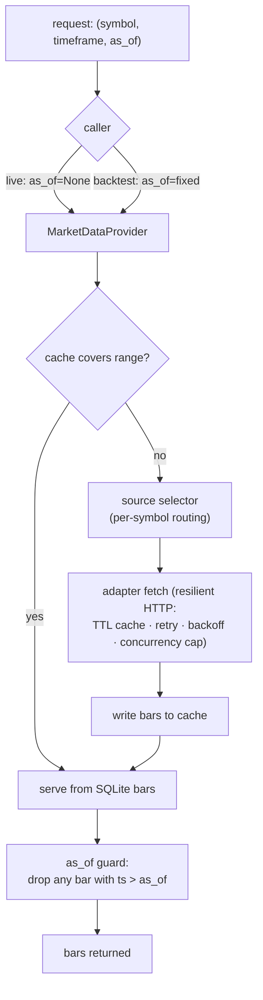

# market-analyser

A desktop app for analysing markets and authoring trading strategies — **driven by an AI agent, watched through a live chart**.

You talk to Claude Code (the CLI); it calls tools on a local Python service; a chart window reflects the results in real time. Ask for "AAPL daily with a 20-EMA and any candlestick patterns", "backtest this RSI strategy over the last two years", or "what's my P&L on this DeFi wallet", and the answer is computed locally and drawn on screen. Nothing runs in the cloud; no live trading exists (yet — see [Roadmap](#roadmap)).

> This README is the entrypoint for developers cloning the repo. Design decisions live under [`docs/architecture/`](docs/architecture/); a generated, always-current API reference lives under [`docs/reference/`](docs/reference/). End-user installers are not yet published.

---

## Why it's built this way

The app is deliberately split into two processes with a hard boundary between them:

- A **Python sidecar** does all the thinking — fetching market data, computing indicators, running backtests, talking to on-chain RPCs. It exposes its capability twice on one loopback port: as **MCP tools** for the agent, and as **HTTP routes** for the viewer.
- An **Electron viewer** does only display — it renders whatever the agent asks for and never touches the network except to talk to its own sidecar.

The point of that split ([ADR-0015](docs/architecture/adrs/0015-claude-code-primary-control-surface.md)): the **agent is the control surface**, not a chat box bolted onto a GUI. You steer with natural language; the viewer is a windshield, not a cockpit. The sidecar runs standalone ([ADR-0016](docs/architecture/adrs/0016-standalone-sidecar-mode.md)), so an agent can work with the window closed, and closing the window never kills your session.

Everything downstream is shaped by two non-negotiables that come with the trading domain: **no lookahead bias** (a decision at bar *i* only sees bars up to *i*) and **determinism** (same inputs → byte-identical outputs). These aren't style preferences — a backtest that peeks at the future or drifts between runs is worse than useless because it looks confident.

---

## What it does

Version **0.8.0**. The surface today, grouped by what you'd ask for:

**See a chart.** OHLCV candlesticks for one symbol at a time across `15m`/`1h`/`4h`/`1d`/`1w`/`1mo`. Quotes route per symbol to Yahoo Finance, Binance, or Coinbase (exchange pairs like `BTCUSDT` go to Binance/Coinbase spot); the first fetch backfills, and everything after serves from a local SQLite cache with scroll-left lazy history. The agent can draw on it live — trendlines, level markers, pattern highlights — and those annotations persist across restarts.

**Read the technical condition.** Trailing (anti-lookahead) indicators, Japanese candlestick patterns, classical chart patterns (head-and-shoulders, double tops/bottoms, triangles, wedges — with a forming→confirmed lifecycle), Ichimoku, volume-weighted support/resistance, Fibonacci/pivot levels, momentum divergences, market-structure reads, and a one-shot `condition_snapshot`. Facts only — the analysis surface never says buy or sell.

**Test a strategy.** Nine strategies ship (`rsi`, `rsi_stop`, `bollinger`, `macd`, `ema_cross`, `supertrend`, `donchian`, `ichimoku`, `chart_pattern_breakout`), each a pure `generate_signals(bars, params)` module (flat/long/**short**) with a typed `Params` model. The backtest engine produces an equity curve, trade log, and extended metrics (Sharpe/Sortino/Calmar/profit factor/…), long and short, plus rolling walk-forward validation — deterministic and cross-process byte-identical modulo run provenance.

**Get a forecast, or a call.** The forecaster reports next-bar direction as a *calibrated* up/down/flat probability from causal features (price/indicators plus BTC-cycle and lagged exogenous series — Fear & Greed, dominance, funding, open interest, MVRV), multi-horizon (1/5/21 bars), each horizon independently gated by walk-forward-beats-baseline — or an honest "no edge". The **advisor** is the one layer allowed to turn conditions into a recommendation ([ADR-0029](docs/architecture/adrs/0029-advisory-recommendation-boundary.md)): it fuses snapshot + live signal + walk-forward edge + forecast into a labeled call (direction, entry/stop/target, conviction, rationale) or an honest flat. Advisory only — it holds no keys and places no orders.

**Analyse a DeFi wallet.** Paste an EVM address to discover decoded positions across Ethereum / Base / Arbitrum / Optimism (Zerion), enriched with deep on-chain LP state (tick range, in-range, uncollected fees) via direct RPC. Deterministic average-cost P&L is reconstructed by transaction replay with block-time pricing, realized/unrealized per position with vs-HODL for LPs — and positions the replay can't fully book are flagged `incomplete` with the reason named, never guessed.

**Get alerted, and screen.** Persisted condition watches (indicator threshold / pattern / strategy signal) run in-sidecar on closed bars and fire edge-triggered, condition-only alerts to a viewer toast and an agent polling leg. A TradingView screener, news + per-headline sentiment, StockTwits crowd sentiment, and Polymarket prediction-market odds round out the read-only signal breadth.

All of this is reachable as **56 MCP tools** (pinned by an exhaustive registration test) and, where a view exists, through the Electron tabs. The full, auto-generated catalogue — every tool, route, and event with its parameters and payload shapes — is at [`docs/reference/`](docs/reference/) ([ADR-0064](docs/architecture/adrs/0064-generated-sidecar-api-reference.md)).

---

## Architecture

### The big picture

Two processes, one loopback port, a hard display/logic boundary. The agent and the viewer authenticate with **different bearer tokens** and reach **different transports** on the same sidecar.



**The seams that matter** (each is a swappable boundary, not an accident):

| Seam | Contract | Why it's a boundary |
| --- | --- | --- |
| Agent ↔ sidecar | MCP Streamable HTTP at `/mcp`, long-lived `mcp-secret.json` bearer | The agent is the primary driver; the renderer is never in the loop for agent reads/writes ([ADR-0014](docs/architecture/adrs/0014-mcp-as-second-sidecar-protocol.md)). |
| Renderer ↔ sidecar | HTTP + SSE to `127.0.0.1` only, per-launch bearer, always via `desktop/renderer/api/client.ts` | CSP pins `connect-src` to loopback; the renderer never learns the MCP secret and never calls a third party ([ADR-0002](docs/architecture/adrs/0002-ipc-local-http.md)). |
| Sidecar ↔ data sources | `MarketDataProvider` Protocol; adapters plug in behind it | Callers never know what's behind `/ohlcv` — Yahoo, Binance, Coinbase, or cache ([ADR-0007](docs/architecture/adrs/0007-market-data-provider.md), [ADR-0031](docs/architecture/adrs/0031-data-source-adapter-contract.md)). |
| Live vs. historical | every provider method takes `as_of: datetime \| None` | Live callers pass `None`; backtest callers pass a fixed time and the data layer never reaches past it. This is the anti-lookahead guarantee, enforced at the data layer. |

### How one agent turn flows

The canonical loop: you ask, the agent calls a tool, the sidecar computes and publishes an event, the open viewer redraws. If no viewer is open, the compute still happens — the event is simply dropped (agent-only mode).



### The request lifecycle & the anti-lookahead seam

A single chart request resolves through the provider, which is the only component that decides *cache vs. fetch* and the only one that ever sees `as_of`. Backtests reuse the exact same provider — they just pass a fixed `as_of`, so the historical path is provably the same code as the live path with the clock pinned.



That `as_of` guard is why the same `MarketDataProvider` can safely back both a live quote and a walk-forward backtest — the historical caller cannot see a bar that hadn't closed yet.

### Where the state lives

The sidecar persists to one SQLite database (Alembic-migrated) and three `0600` files in the user-data dir:

- **SQLite** (`cache.sqlite`) — `bars`, `annotations`, `backtest_runs`, `metric_points`, `watches`, `alerts`, `defi_tx`, `price_snapshots`. Single-writer, which falls out of single-instance enforcement.
- **`sidecar.lock`** — per-launch: pid, port, renderer bearer, process-create-time (for liveness cross-check). How the viewer attaches ([ADR-0016](docs/architecture/adrs/0016-standalone-sidecar-mode.md)).
- **`mcp-secret.json`** — the long-lived MCP bearer, rotatable from Settings.
- **`secrets.json`** — optional third-party API keys ([ADR-0038](docs/architecture/adrs/0038-third-party-api-key-storage.md)); values are never logged and never returned by any endpoint.

The full process/component map, cold-start-vs-attach lifecycle, and out-of-band recovery sequences are diagrammed in [`docs/architecture/diagrams/claude-cli-driven-architecture.md`](docs/architecture/diagrams/claude-cli-driven-architecture.md).

---

## Requirements

- **Python ≥ 3.12** and **[uv](https://docs.astral.sh/uv/)** for the sidecar
- **Node.js ≥ 20** with **pnpm ≥ 9** for the desktop workspace
- **Windows / macOS / Linux** — all supported by `electron-builder`

## Quickstart

```bash
git clone <repo-url> market-analyser
cd market-analyser
uv sync          # Python sidecar deps
pnpm install     # desktop workspace deps (root + desktop/)
pnpm dev         # run the app in dev mode
```

`pnpm dev` runs four watchers concurrently — Electron main, preload bridge, the Vite renderer (`http://localhost:5173`), and the Electron app once those are ready. On launch the main process either **attaches** to an already-running sidecar (via the lockfile) or **spawns** one, which binds a free `127.0.0.1` port, prints `PORT=<n>`, and answers `/healthz` before the window opens. Closing the viewer does **not** stop a standalone sidecar.

### Running the sidecar standalone

The canonical agent-driven mode — or for debugging the API in isolation:

```bash
# PowerShell: $env:MARKET_ANALYSER_SECRET = "..."
export MARKET_ANALYSER_SECRET=$(openssl rand -hex 32)
uv run python -m market_analyser.api --port=8765

curl http://127.0.0.1:8765/healthz
curl -H "Authorization: Bearer $MARKET_ANALYSER_SECRET" \
  "http://127.0.0.1:8765/ohlcv?symbol=AAPL&timeframe=1d&start=2025-01-01T00:00:00&end=2026-01-01T00:00:00"
```

`/mcp` uses the separate long-lived bearer in `mcp-secret.json` (rotated from Settings). Pass `--port=0` to let the OS pick a port.

### Pointing Claude Code at it

To drive the app from an agent, point Claude Code's MCP config at the running sidecar's `/mcp` with the `mcp-secret.json` bearer. A repo-local `.mcp.json` is the canonical project-scoped config (gitignored — it carries the bearer). **`pnpm dev:all` writes `.mcp.json` automatically** from the live `sidecar.lock` + `mcp-secret.json` on every boot, so there's no port/bearer juggling.

### Packaging

```bash
pnpm package:win    # NSIS installer under desktop/release/
pnpm package:mac    # DMG
pnpm package:linux  # AppImage
```

The installer bundles `src/market_analyser/` as `extraResources` so the runtime sidecar ships next to the Electron app.

---

## Configuration

The sidecar takes an optional `--config <path>` (a JSON file); development defaults are sensible. The one key today is `db_path` (default `<user-data-dir>/market-analyser/cache.sqlite`).

### Secrets

**The core app needs no secrets.** Charts, backtests, strategies, TradFi/technical analysis, and forecasting all work with zero keys — the only two tokens involved are internal bearers the app generates and manages itself.

Every key below is **optional** and unlocks **one specific crypto/DeFi feature**; if it's absent, only that feature returns a typed "no key configured" error and nothing else breaks.

| Key | Unlocks |
| --- | --- |
| `zerion_api_key` | DeFi wallet discovery + transaction history (`scan_wallet`, `compute_wallet_pnl`, `POST /defi/*`). Free Developer tier at <https://zerion.io/api>. |
| `eth_rpc_url` / `base_rpc_url` | On-chain reads (`eth_call`) for deep Uniswap-v3 LP state and pool-discrepancy scans, on Ethereum / Base. Any JSON-RPC endpoint. |
| `binance_read_api_key` + `binance_read_api_secret` | Read-only Binance account leg of cross-venue portfolio aggregation. Read scope only — **never a trade key** ([ADR-0044](docs/architecture/adrs/0044-trade-secret-store.md) keeps trade keys in a separate OS keychain). |
| `alchemy_prices_key` | DeFi P&L historical-price fallback for tokens DefiLlama can't price ([ADR-0081](docs/architecture/adrs/0081-defi-pnl-wallet-total-gap.md)). |
| `graph_api_key` | Reserved — no live consumer yet. |

**Where a key resolves from** ([ADR-0038](docs/architecture/adrs/0038-third-party-api-key-storage.md), [`persistence/secrets.py`](src/market_analyser/persistence/secrets.py)) — one store, one override, in order:

1. **Env override** `MARKET_ANALYSER_<KEY>` (the key uppercased, e.g. `MARKET_ANALYSER_BASE_RPC_URL`) — wins if non-empty.
2. **`secrets.json`** — the canonical `0600` file at `<user-data-dir>/secrets.json`, written by the Settings page / `POST /settings/secret`, surviving restarts.
3. Otherwise **unset** — a typed error, never a silent fallback.

A repo-root **`.env`** (dev checkout only, gitignored) is *not* a third store: at startup the sidecar loads it into the `MARKET_ANALYSER_*` env (`override=False`; **packaged builds ship no `.env`**), which just feeds layer 1. So `.env` and `secrets.json` carry the same keys — `.env` uses the `MARKET_ANALYSER_<UPPER>` form, `secrets.json` uses the bare key. See [`.env.example`](.env.example). One-off scripts must read via the real `SecretsStore`, never a bespoke bare env var.

> The two internal bearers you never set by hand: **`MARKET_ANALYSER_SECRET`** (per-launch renderer bearer, generated by the Electron supervisor, never persisted) and **`mcp-secret.json`** (long-lived MCP bearer under the user-data dir). You only set `MARKET_ANALYSER_SECRET` yourself when running the sidecar [standalone](#running-the-sidecar-standalone).

---

## Project structure

```
market-analyser/
├── src/market_analyser/          # Python sidecar
│   ├── api/                      # FastAPI app, routes, MCP server + one module per MCP tool, lockfile
│   ├── events/                   # neutral SSE event bus + typed envelope registry (no api dependency)
│   ├── contracts/                # Strategy contract (Signal, BaseParams, META, discover())
│   ├── strategies/               # 9 strategy modules
│   ├── backtest/                 # engine (flat/long/short) + metrics + walk-forward + live-signal eval
│   ├── analysis/                 # indicators, candlestick + chart patterns, levels, volume, cycles, snapshot
│   ├── forecast/                 # causal features, calibrated direction model, registry, walk-forward gate
│   ├── advisor/                  # Recommendation model + fuse() (the one sanctioned recommend layer)
│   ├── alerts/                   # watch evaluators + edge reducer + in-sidecar scheduler
│   ├── defi/                     # wallet discovery, scan job, deep LP enrichment, tx-replay P&L
│   ├── portfolio/                # cross-venue aggregation (Binance read + DeFi + manual file)
│   ├── data/                     # MarketDataProvider Protocol, timeframe/metric registries, adapters/
│   ├── persistence/              # SQLite engine, Alembic migrations, SecretsStore
│   ├── apiref/                   # introspects the live sidecar → generates docs/reference/ (ADR-0064)
│   ├── cli.py                    # `market-analyser strategies list` etc.
│   └── config.py                 # AppConfig (paths, defaults)
│
├── desktop/                      # pnpm workspace: Electron + React + TypeScript
│   ├── electron/                 # main process, sidecar supervisor, IPC, preload bridge
│   ├── renderer/                 # React (Vite + lightweight-charts): views, components, hooks, typed api client
│   ├── shared/                   # IPC channels, Zod schemas, types used both sides
│   └── tests/                    # Playwright e2e specs
│
├── tests/                        # pytest tests (mirrors src/ layout)
├── docs/architecture/            # ADRs, plans, diagrams, roadmap
├── docs/reference/               # GENERATED API reference (CI-gated; do not hand-edit)
├── .claude/skills/               # Project-specific Claude Code skills
└── pyproject.toml / package.json / pnpm-workspace.yaml
```

`runs/` (gitignored) holds backtest, analysis, DeFi, and advice artifacts. `positions/` (gitignored) holds the DeFi analyst's positions file.

---

## Development

### Python sidecar

```bash
uv run pytest                 # unit tests with coverage
uv run pytest -m network      # tests that hit the live network (off by default)
uv run ruff check src tests   # lint
uv run ruff format src tests  # format
uv run mypy                   # strict type-check
pnpm gen:api-docs             # regenerate docs/reference/ from the live sidecar
pnpm gen:api-docs:check       # CI check that the committed reference is in sync
```

### Desktop

```bash
pnpm typecheck                # five tsconfigs: main, preload, renderer, test, e2e
pnpm lint                     # ESLint across electron/, renderer/, shared/
pnpm test                     # Jest renderer
pnpm test:main                # Jest main process
pnpm test:e2e                 # Playwright (requires `pnpm build` first)
pnpm gen-types                # regenerate TS types from the sidecar's Pydantic models
pnpm gen-types:check          # CI check that committed types are in sync
```

`pnpm smoke` drives one path through every shipped layer against live upstreams and prints PASS / FAIL / UPSTREAM-DOWN per step.

### Non-negotiables

These apply to every change (also in [`CLAUDE.md`](CLAUDE.md)):

- **No lookahead bias.** Decisions at bar `i` only see `bars[0..=i]`; indicators are trailing, never centered.
- **Determinism.** Same inputs → byte-identical outputs (modulo documented run provenance). No `set` iteration, no wall-clock reads, no unseeded randomness in the financially-meaningful path.
- **No secrets in code or logs.** Bearers and IPC secrets are never persisted (except `mcp-secret.json` under the user-data dir) and never logged.
- **Validate at boundaries.** Pydantic at the sidecar HTTP boundary, Zod at the IPC boundary; don't re-validate inside trusted paths.
- **Conditions are facts, decisions are the user's.** Analyst surfaces report conditions; only the `advisor` layer may recommend, and it never acts.

### Commit style & versioning

Conventional commits, enforced by `commitizen` + a `commit-msg` Husky hook. Implementers commit per phase; **pushes are user-driven** and CI runs on push and tag.

Semantic versioning, held in the `0.x` band until the public surface (MCP tools + REST contract) is declared stable. The single source of truth is `pyproject.toml` `[project].version` (currently **0.8.0**); `desktop/package.json` is synced from it. Bumps run **once per shipped plan** in the architect's close ceremony via `uv run cz bump` (`feat` → minor, `fix` → patch), which writes both files and tags `vX.Y.Z`. `major_version_zero = true` keeps a breaking change to a minor bump pre-1.0. See [ADR-0087](docs/architecture/adrs/0087-versioning-and-release-cadence.md).

---

## Roadmap

Direction lives in [`docs/architecture/roadmap.md`](docs/architecture/roadmap.md); in-flight plans are indexed in [`docs/architecture/plans/README.md`](docs/architecture/plans/README.md).

The app is evolving from read-only research + decision-support toward **contained, gated decision-execution**. Of the user-approved program (Plans 0036–0046), the first two pillars have shipped: the **forecasting foundation** (direction-as-probability, walk-forward-validated, multi-horizon with cycle + exogenous features) and the **advisory layer** + its UI. A separate crypto-intelligence program shipped in full (cycle/derivatives/on-chain metric series, Binance klines, the v2 forecast feature set), alongside watchlist alerting and DeFi P&L reconstruction. Still ahead: Polymarket odds as a first-class signal, the cross-venue portfolio pillar, and the whole **assisted, testnet-first execution** arc.

The two principle crossings — *recommend* and *act* — are each contained to one gated layer (`advisor`, shipped; a future `trader`). The analyst surfaces keep their "conditions are facts" contract, every order will require explicit human confirmation, and execution stays testnet-only until the full loop is proven. **Auto-update** is deferred to a future packaging plan.

---

## Security model

- **Renderer is fully sandboxed** — `contextIsolation`, `sandbox`, no node integration, double-CSP (`<meta>` + response header), `connect-src` narrowed to `127.0.0.1`.
- **Sidecar binds `127.0.0.1` only**, never `0.0.0.0`.
- **Dual-bearer auth.** Renderer routes require the per-launch `MARKET_ANALYSER_SECRET`; `/mcp` requires the long-lived `mcp-secret.json` bearer. Both use constant-time comparison; `/healthz` is public.
- **Secrets live in process env or under the user-data dir, never in argv** — process listings never reveal them, and no secret is ever logged or returned by an endpoint.
- **No third-party network calls from the renderer** — all upstream data is fetched by the sidecar.

If you find a security issue, please open an issue with the `security` label rather than a public PR.

## License

[MIT](LICENSE) © 2026 Igor Konovalov.
