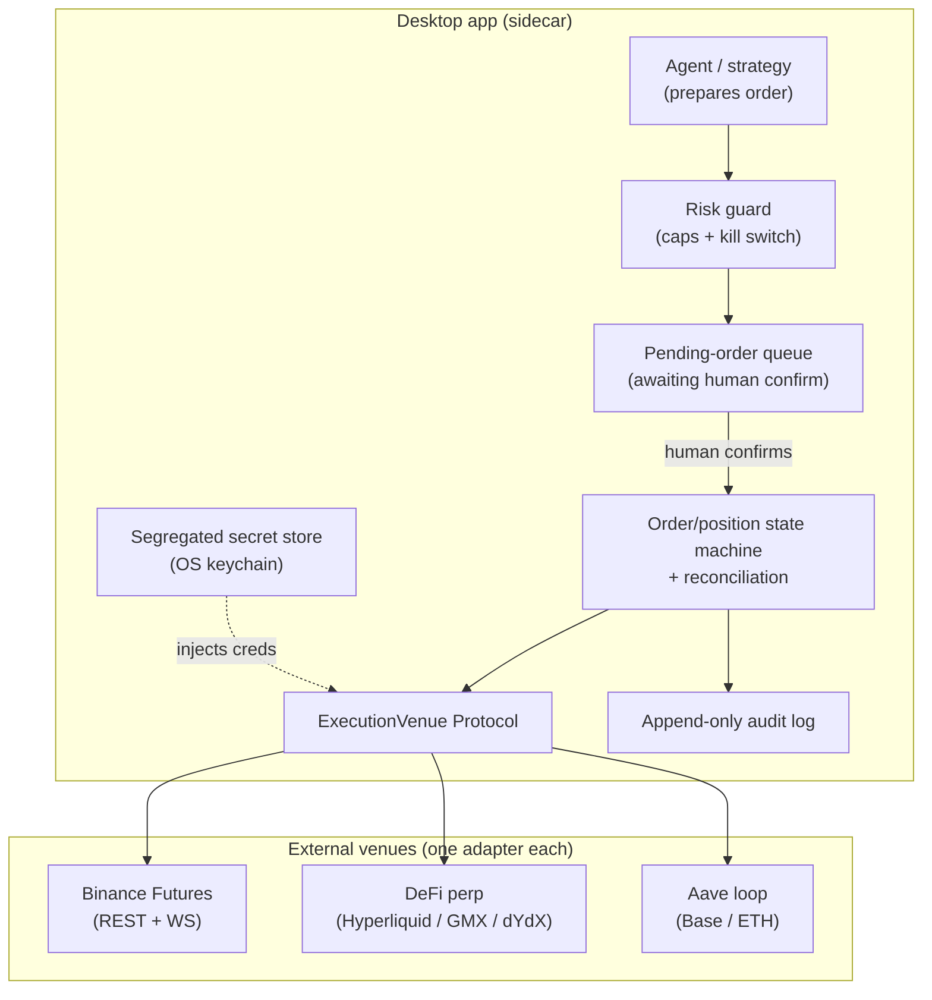

# ADR-0025 — Trade-execution feasibility: posture, guardrails, and venue comparison

> **Status:** proposed (exploratory — records a posture and a framework, not a build commitment)
> **Date:** 2026-05-25
> **Related plan(s):** none yet — a future plan + a new execution skill are prerequisites to any implementation (see Notes)

## Context

`market-analyser` is, by deliberate design, a **read-only analysis + backtest + visualization** tool. CLAUDE.md states the principle plainly: *"Conditions are facts, decisions are the user's. Analyst skills report conditions; they never recommend buy/sell/exit/rebalance."* The DeFi side (`defi-analyst`) reads positions and **never signs**. There is no order layer, no live position-state machine, and no trade-permissioned secret anywhere in the codebase. Every external adapter ([ADR-0007](0007-market-data-provider.md), [ADR-0009](0009-rewrite-data-layer-in-house.md)) is a one-directional read over HTTP, hardened by the resilience module ([ADR-0019](0019-external-http-adapter-resilience.md)).

The user asked whether the app could be used for **actual trading** — long/short on Binance or another CEX, or a DeFi solution on Ethereum/Base. This ADR is the feasibility map. It does **not** commit us to building execution; it answers three questions so a later go/no-go is informed:

1. **What lines does execution cross**, and which can be crossed safely for a single-user desktop app?
2. **What machinery is venue-independent** — i.e., what we'd build once regardless of where orders land?
3. **Which venue is the lowest-risk first integration**, given the comparison the user requested across CEX, DeFi perps, and DeFi lending leverage?

Execution crosses three lines at once, and naming them is the point of this record:

- **The principle line.** Placing orders inverts "decisions are the user's." That is an ADR-level carve-out, not a quiet plan detail.
- **The security line.** Today's only secrets are a per-launch localhost bearer ([ADR-0011](0011-bearer-secret-transport.md)) and read-only data tokens. Execution requires either a **trade-permissioned exchange API key** (CEX) or a **hot-wallet private key** (DeFi) — a categorically higher-value secret that the current architecture (Electron + localhost sidecar on a personal Windows machine) was never designed to hold.
- **The correctness line.** A wrong backtest costs nothing. A live order layer that double-submits, mis-sizes, or fails to honor a stop loses real money. That demands idempotency, reconciliation, and a kill switch — disciplines the repo does not have.

This is the user's own app, own funds, own machine. None of the above is a reason to refuse; all of it is a reason to design before building.

## Decision

**Proposed posture (not a commitment to implement):**

1. **Live execution stays out of the shipped product for now.** The analyst skills (`market-analyst`, `defi-analyst`) keep their read-only boundary unchanged. This ADR does not flip any of them to a write path.
2. **If we pursue execution, it is gated behind six non-negotiable invariants** (below). A plan that violates any of them fails review.
3. **The recommended first integration is Binance USDⓈ-M Futures _testnet_** — chosen for the quality of its sandbox and API simplicity, used to build and prove the venue-independent machinery against fake money before any real-funds or self-custody decision. This is a *prototyping* recommendation, not an endorsement of Binance as the long-term venue (see Alternatives — DeFi perps is the stronger fit for a self-custody-first user).
4. **The actual go/no-go and the real-funds decision remain open**, owned by the user, and produce a future plan + a new skill if taken.

### The six invariants any execution layer must satisfy

1. **Assisted-first.** v1 never submits without an explicit human confirmation step. The agent *prepares and sizes* an order; it lands in a pending queue; the user confirms (in the Electron viewer or via a distinct second MCP call) before submission. This is how we honor "decisions are the user's" while letting the agent do the analytical work. Autonomous mode is a separate, later decision with its own ADR.
2. **Testnet/paper-first.** Real funds are unreachable until the full intent → submit → fill → reconcile → close loop has run green on a sandbox/testnet for the chosen venue.
3. **Isolated execution domain.** A new `src/market_analyser/execution/` package and a new owner skill (`trader` / `execution`), separate from the read-only analyst skills. No analyst skill gains a write path; no execution code imports analyst-internal modules. Swappability is preserved via an `ExecutionVenue` Protocol mirroring `MarketDataProvider` ([ADR-0007](0007-market-data-provider.md)).
4. **Segregated secret store.** Trade-permissioned keys live in the OS keychain (Windows Credential Manager / DPAPI), never in `config.json`, never in the IPC bearer path, never logged or serialized into a plan/ADR/diagram. CEX keys have **withdrawals disabled + an IP allowlist**; DeFi uses a hardware signer or, at minimum, an encrypted-at-rest hot wallet with a hard spend cap.
5. **Idempotent orders + reconciliation.** Every order carries a client-generated `clientOrderId`; a retry after a dropped connection must never double-submit. On reconnect the venue's truth is reconciled against local order/position state. Order lifecycle is an explicit state machine: `intended → submitted → acknowledged → (partially_)filled → closed | canceled | rejected`, persisted in SQLite ([ADR-0006](0006-persistence-layout.md)).
6. **Risk guard + kill switch.** A guard layer sits *between* signal and venue: max position size, max leverage, max daily loss, per-symbol exposure cap, and a global kill switch that cancels-all and blocks new submissions. Plus an append-only audit log of every intent, confirmation, submission, fill, and error.

### Venue-independent architecture (the "build once" surface)

The boxes inside `desktop` are venue-independent — we design them once. Only the bottom row changes per venue, and that is exactly the swappability the Protocol exists to protect.

## Consequences

### Positive
- A clear, durable record of *why the app is read-only* and *what it would take to change that* — so the next person who asks "can it trade?" reads one file instead of re-deriving the risk surface.
- The invariants make any future execution plan reviewable against a fixed bar; "assisted-first / testnet-first / segregated secrets" are now blocker-level criteria, not opinions.
- Recommending a testnet-first prototype lets us build the hard part (state machine, reconciliation, idempotency, guard) against fake money, decoupled from the venue choice.

### Negative
- **We are explicitly leaving capability on the table.** A user who wants to act on the app's analysis still has to leave the app to place the trade. That friction is the price of the read-only posture, and this ADR makes it deliberate rather than accidental.
- **Even the recommended path is real work.** The venue-independent machinery (state machine + reconciliation + idempotency + guard + secret store + audit log + confirmation UX + a new skill) is a multi-plan effort before a single real order is placed. Anyone reading this as "we'll add a Buy button next sprint" is misreading it.
- **The principle carve-out is load-bearing.** Once assisted execution exists, the pressure to add autonomous mode ("just remove the confirm step") is real. The ADR draws the line at assisted-only for v1 precisely because that pressure is foreseeable.

### Neutral
- This ADR is `proposed` and may sit there indefinitely. Unlike plan-paired ADRs (0023/0024), it has no close ceremony that flips it to `accepted` — it accepts only if and when the user commits to an execution plan, at which point this ADR's invariants become that plan's acceptance criteria.

## Alternatives considered

The user asked to compare all three venues before picking. Each is a genuinely different integration stack; the comparison drove the Decision's recommendation.

| Dimension | **Binance USDⓈ-M Futures (CEX)** | **DeFi perps** (Hyperliquid / GMX / dYdX) | **DeFi lending leverage** (Aave loop, Base/ETH) |
|---|---|---|---|
| Long/short primitive | Native (perpetuals) | Native (perpetuals) | Synthetic — "short" = borrow the asset, sell, repay later |
| Custody | Custodial (exchange holds funds) | Self-custody | Self-custody |
| Secret class | Trade-API key (withdrawals OFF + IP allowlist) | Hot-wallet private key / hardware signer | Hot-wallet private key / hardware signer |
| Sandbox quality | **Excellent** — full-parity Futures testnet | Mixed — Hyperliquid has a usable testnet; GMX/dYdX vary | Poor for loops — testnets exist but liquidity/oracle parity is weak |
| Execution hazards | Rate limits, API-key theft, counterparty/custodial risk, **geo-restriction** | Gas, MEV/sandwiching, slippage, oracle/funding mechanics, smart-contract risk | Gas, liquidation cascades, LTV caps, smart-contract risk |
| Fit with current code | New `data/`-style adapter; clean REST/WS | New signing layer; no precedent in repo | Closest to existing `defi_analyst` position model |
| Operational simplicity (v1) | **Highest** | Medium | Low (loops are multi-tx, liquidation-sensitive) |

### Alternative A — Binance USDⓈ-M Futures as the *long-term* venue
**Recommended for prototyping, rejected as the long-term target.** The full-parity testnet and simple REST/WS API make it the lowest-friction place to build and prove the venue-independent machinery — so the Decision recommends it *for that purpose*. But as a permanent home it carries custodial counterparty risk, a trade-enabled key on a desktop is a standing theft target, and Binance is geo-restricted in many jurisdictions (the user must confirm it is usable where they are; the US has only Binance.US, which offers no futures). It earns the prototype slot, not a commitment.

### Alternative B — DeFi perps (Hyperliquid / GMX / dYdX)
**The stronger long-term fit for a self-custody-first user, rejected as the v1 starting point.** It removes custodial counterparty risk and matches the ethos of someone running their own desktop tool. But it front-loads the hardest problems — transaction signing, gas, MEV, slippage, funding-rate and oracle mechanics, smart-contract risk — on top of the (already substantial) state-machine/reconciliation work. Building those concurrently against an uneven testnet story is the high-risk path. Better to prove the machinery on a CEX testnet first, then port the `ExecutionVenue` adapter to a perp DEX as a second, deliberate phase.

### Alternative C — DeFi lending leverage (Aave loop on Base/ETH)
**Rejected as a long/short primitive.** It is the closest to the existing `defi_analyst` position model, which is its only real advantage. But it is not a clean long/short tool: "short" means borrowing the asset and selling it, leverage is capped by LTV, loops are multi-transaction and gas-heavy, and the dominant failure mode is liquidation cascades rather than a clean stop. It serves a yield/leverage use case, not the directional long/short the user described.

### Alternative D — Stay read-only (do nothing)
**Not rejected — it is the current default and remains in force.** This ADR's posture is precisely "stay read-only *unless and until* the user commits to a plan that satisfies the six invariants." Choosing to build is an active, future decision; the absence of that decision leaves us here.

## Notes

- **What committing would require, in order:** (1) user go/no-go on this ADR's posture; (2) a new skill via `skill-creator` (`trader`/`execution`) to own `src/market_analyser/execution/`; (3) likely a dedicated ADR for the `ExecutionVenue` Protocol shape and one for the secret-store mechanism; (4) a phased plan, testnet-first, with the confirmation UX as its own `ui-builder` phase. None of that happens inside this ADR.
- **Relationship to existing ADRs:** the `ExecutionVenue` Protocol mirrors [ADR-0007](0007-market-data-provider.md); order/position tables extend [ADR-0006](0006-persistence-layout.md); the segregated trade-secret store is a higher-value sibling to [ADR-0011](0011-bearer-secret-transport.md) and must not reuse the per-launch IPC bearer path; the assisted-confirmation step is the carve-out to the "decisions are the user's" principle in CLAUDE.md.
- **No secrets, ever:** this ADR deliberately names *secret classes* (trade-API key, hot-wallet key) and never a value. Any future execution code that logs or serializes a key is an immediate review blocker.
