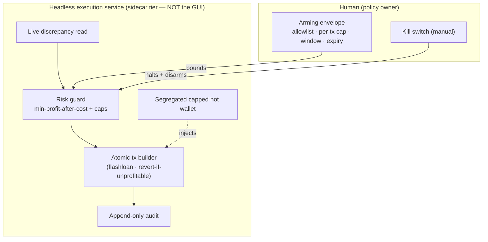

# ADR-0072 — Bounded-autonomy execution for atomic arbitrage, and Polymarket as an execution venue

> **Status:** proposed (exploratory — extends [ADR-0025](0025-trade-execution-feasibility.md); records a posture + a carve-out, not a build commitment)
> **Date:** 2026-07-11
> **Related plan(s):** none yet for execution — the read-only evidence plans ([Plan 0079](../plans/0079-cross-pool-discrepancy-scanner.md) cross-pool discrepancy scanner, [Plan 0078](../plans/0078-polymarket-convergence-screener.md) Polymarket convergence screener) are prerequisites; a future execution plan + the `trader` skill are prerequisites to any implementation (see Notes).

## Context

[ADR-0025](0025-trade-execution-feasibility.md) is the app's execution-feasibility posture: live execution stays out of the shipped product, and *if* pursued it is gated behind six non-negotiable invariants. **Invariant 1 is assisted-first** — v1 never submits without an explicit human confirmation step; the agent prepares and sizes an order, it lands in a pending queue, the user confirms before submission. ADR-0025's venue comparison covered three venues (Binance USDⓈ-M Futures CEX, DeFi perps, DeFi lending leverage) and its execution model is an order/position **state machine** ([ADR-0043](0043-execution-venue-protocol.md)): `intended → submitted → acknowledged → (partially_)filled → closed | canceled | rejected`.

On 2026-07-11 the user opened two new execution ambitions that ADR-0025 does not cover:

1. **High-speed DeFi cross-pool arbitrage** — capture price discrepancies for the same pair across DEX pools, "low volume, high speed."
2. **Polymarket end-of-market convergence** — near resolution, buy the near-certain outcome to collect the last few percent as price converges to 1.00.

Each collides with ADR-0025 differently, and naming the collision is the point of this record.

**Polymarket is a clean fit.** It is a new *venue* on the existing model: an off-chain CLOB with on-chain settlement on Polygon, USDC collateral, a self-custody wallet key. An outcome buy is a deliberate, slow-moving order — it can pass through the pending queue and the human-confirm step exactly like a Binance order. It needs a new `ExecutionVenue` adapter and a hot-wallet secret class, nothing more. The only novelty is the **resolution tail**: capital is locked until UMA's optimistic oracle resolves (potentially days, and disputable), so "filled" is not "settled" — a reconciliation nuance, not a new invariant.

**Atomic arbitrage does not fit at all.** The edge exists only *within a single block*. There is no confirmable order lifecycle to human-approve — by the time a human clicks, the discrepancy is gone, captured by an MEV searcher in the same block. Real cross-pool arb is one atomic transaction (typically flashloan-funded, revert-on-unprofitable), submitted into a block-builder auction, not a REST order that acknowledges and fills. **ADR-0025 invariant 1 (assisted-first) is structurally incompatible with it.** So there are exactly three options: refuse arb execution outright, pretend it fits (a "pre-armed click" that misrepresents the guarantee), or carve out a narrow, principled autonomy exception. The user chose the carve-out.

This ADR does **not** commit us to building either path. It answers, before any go/no-go: what does adding Polymarket-as-venue require, and on what terms — if ever — may the app submit a trade with no human in the loop?

## Decision

**Proposed posture (not a commitment to implement). Two decisions:**

### 1. Polymarket is added to the ADR-0025 venue set under the *unchanged* assisted-confirm model

A future `PolymarketExecutionVenue` implements the [ADR-0043](0043-execution-venue-protocol.md) `ExecutionVenue` Protocol and rides the existing state machine, pending queue, and human-confirm step. Its trade secret — a **Polygon self-custody hot-wallet key** — lives in the [ADR-0044](0044-trade-secret-store.md) segregated store, never in `config.json`, never the read-key store ([ADR-0038](0038-third-party-api-key-storage.md)), never logged. It targets the maintained **`Polymarket/py-sdk`** (the old `py-clob-client` is archived — the same pin [ADR-0041](0041-polymarket-odds-read-source.md)/Plan 0040 already carry). All six ADR-0025 invariants apply unchanged, plus one venue-specific rule: **the state machine models settlement distinctly from fill** — a `filled` Polymarket position stays `awaiting_resolution` (capital locked, UMA dispute window open) until the oracle resolves, and reconciliation reads the resolution, not just the fill.

### 2. A **bounded-autonomy execution class** — a tightly-scoped exception to ADR-0025 invariant 1 — for atomic, self-liquidating, capital-bounded strategies only

Autonomous submission (no per-trade human confirm) is permitted **only** for a strategy that satisfies *all* of the following. Any strategy that fails even one stays assisted-first or is refused. These are the bounded-autonomy invariants — hard gates, blocker-level in any future plan review, exactly as ADR-0025's six are:

- **BA-1 — Atomicity is mandatory.** The strategy's on-chain execution must be a single transaction that reverts on failure (e.g. a flashloan-funded arb bundle with an in-transaction min-profit-after-cost check that reverts if unmet). A non-atomic, multi-leg, or inventory-carrying strategy can **never** use the autonomous path — it forces assisted-first. Atomicity is what bounds the worst case to "gas + the revert," not principal.
- **BA-2 — Pre-authorized bounded envelope, not per-trade approval.** The human authorizes an *envelope* in advance: a strategy allowlist, max capital-at-risk per transaction, max cumulative capital per rolling window, and a **time-boxed authorization that auto-expires** (re-arming is a deliberate human act). Autonomy operates only inside the live envelope; anything outside it is refused or demoted to assisted-confirm. The human still decides the *policy*; the machine only fills in the *timing* within it.
- **BA-3 — Hard capital bound enforced on-chain.** The min-profit-after-cost threshold (gas + slippage + fees) is enforced *inside* the transaction, not just in the sizing code — an unprofitable attempt reverts and costs only gas. The risk guard ([ADR-0025](0025-trade-execution-feasibility.md) invariant 6) sets that threshold and the envelope caps; it never relaxes them at runtime.
- **BA-4 — Segregated, capped hot wallet.** A dedicated wallet funded with only the envelope's capital, a hard spend cap, isolated from every other key — a stricter sibling of [ADR-0044](0044-trade-secret-store.md). Compromise of that key is bounded to the wallet's balance.
- **BA-5 — The kill switch stays absolute and non-autonomous.** The global kill switch ([ADR-0025](0025-trade-execution-feasibility.md) invariant 6) halts all autonomous submission instantly, cancels the arming envelope, and is itself never automated. Append-only audit (invariant 6) logs every autonomous attempt — win, revert, or gas-only loss.
- **BA-6 — Headless service, not the desktop app.** Latency-critical autonomous execution runs as a **separate headless process at the sidecar tier** (candidate: Rust for the arb engine), not inside the Electron GUI. The GUI is a monitoring + kill-switch surface, not the execution host. This extends ADR-0025's headless/desktop discussion into a requirement for this class.
- **BA-7 — Evidence gate + testnet-first.** Bounded-autonomy arb execution is unlocked **only after** the read-only discrepancy scanner ([Plan 0079](../plans/0079-cross-pool-discrepancy-scanner.md)) demonstrates persistent, net-of-cost, retail-observable opportunities, *and* the full loop has run green on a testnet/sandbox ([ADR-0025](0025-trade-execution-feasibility.md) invariant 2). No scanner edge → no execution build.

Everything above the atomic-tx builder is the carve-out's discipline; the atomicity requirement (BA-1/BA-3) is what makes "no human in the loop" tolerable — the worst case is a reverted transaction, not a drained account.

## Consequences

### Positive
- Names the paradigm mismatch instead of forcing arb into an order state machine it does not fit. A future arb-execution plan is now reviewable against fixed bars (BA-1…BA-7), not opinions.
- Draws the autonomy line narrowly and principledly: **atomic + bounded + pre-authorized + expiring**. The foreseeable "just remove the confirm step" pressure ADR-0025 warned about now has a specific answer — autonomy is allowed only where atomicity bounds the loss, and only inside a human-set expiring envelope.
- Adds Polymarket as a venue cheaply, reusing the entire ADR-0043/0044 machinery — the assisted-confirm guarantee is untouched for it.

### Negative
- **This is the app's first sanctioned no-human-in-the-loop path** — a real crossing of CLAUDE.md's "decisions are the user's." Even bounded, a standing autonomous agent holding a funded key is the highest-value security surface the project has ever contemplated. The BA-1…BA-7 discipline is load-bearing: a single lapse — a non-atomic strategy sneaking onto the autonomous path (BA-1), an envelope that fails to expire (BA-2), an off-chain-only profit check (BA-3) — reintroduces principal risk. Any future plan that weakens one of these fails review.
- **Capturability is unproven and may never materialize.** Retail-latency arb competes with professional searchers colocated next to block builders; winning is a capital + orderflow + colocation problem, not a language-speed problem. This ADR deliberately gates the whole path behind Plan 0079's evidence (BA-7) precisely because the honest prior is "the edge vanishes in one block." Building the carve-out does not imply the edge exists.
- **The Polymarket resolution tail is a real hazard** the assisted model must surface: the few-percent convergence edge is compensation for a fat tail (UMA disputes, ambiguous resolution wording, multi-day capital lockup). The venue adapter's `awaiting_resolution` state and its reconciliation are how the app avoids treating an unresolved position as realized profit.

### Neutral
- Like ADR-0025, this ADR is `proposed` and may sit indefinitely. It accepts only if and when the user commits to an execution plan that satisfies these gates — at which point BA-1…BA-7 become that plan's acceptance criteria. It does not have a plan-paired close ceremony today.

## Alternatives considered

### Alternative A — Keep assisted-only; drop arb execution entirely (ADR-0025 unchanged)
**Rejected as the answer, retained as the fallback.** Refusing arb execution keeps invariant 1 absolute and the security surface minimal. But it forecloses the user's stated goal before the evidence is in. The carve-out is deliberately narrow enough that the *fallback* remains live: if Plan 0079 shows no retail-capturable edge (the likely outcome), the arb-execution plan is simply never written, and this ADR's carve-out stays dormant — exactly ADR-0025 Alternative D's "stay read-only unless a plan is committed."

### Alternative B — Pre-armed assisted-confirm ("one-click arm, then it fires")
**Rejected — assisted-in-name-only.** A pre-armed human click still cannot clear block-inclusion latency; the trade fires after the human's attention, not within the block, so the discrepancy is already captured. Worse, it *misrepresents* the guarantee — it looks like human confirmation while delivering none of its protection. Honesty demands that a path with no effective human-in-the-loop be labeled autonomous and gated as such (this ADR), not dressed as assisted.

### Alternative C — Full autonomous trading (drop invariant 1 generally)
**Rejected.** Removing human confirmation for *directional* strategies (which carry inventory and unbounded-by-atomicity loss) is a categorically larger decision with no atomicity backstop. This carve-out is scoped to atomic, self-liquidating strategies precisely so the worst case stays bounded. Directional autonomous execution, if ever wanted, needs its own separate ADR and does not ride this one.

### Alternative D — Polymarket as its own bespoke execution stack (not an `ExecutionVenue`)
**Rejected.** Polymarket's order flow fits the ADR-0043 Protocol + state machine cleanly; giving it a parallel stack would duplicate the pending-queue, confirm-UX, secret-store, and audit machinery that exists to be venue-independent. The only Polymarket-specific addition is the settlement-vs-fill distinction, which belongs *in* the state machine, not beside it.

## Notes
- **What committing would require, in order:** (1) Plan 0079's scanner ships and its live evidence (BA-7) shows a real net-of-cost edge; (2) user go/no-go on this ADR's posture; (3) the `trader`/execution skill (ADR-0025 invariant 3, via `skill-creator`); (4) likely a dedicated ADR for the atomic-tx/flashloan builder shape and the headless-service boundary; (5) a phased, testnet-first plan with the arming-envelope UX and kill-switch as their own `ui-builder` phases. None of that happens inside this ADR.
- **Relationship to existing ADRs:** extends [ADR-0025](0025-trade-execution-feasibility.md) (adds a venue + a scoped exception to its invariant 1); reuses [ADR-0043](0043-execution-venue-protocol.md) (both new venues implement the Protocol) and [ADR-0044](0044-trade-secret-store.md) (both hot-wallet secret classes; BA-4 is a stricter sibling); the Polymarket read side is [ADR-0041](0041-polymarket-odds-read-source.md)/Plan 0040; the arb read side is [Plan 0079](../plans/0079-cross-pool-discrepancy-scanner.md).
- **No secrets, ever:** this ADR names *secret classes* (Polygon hot-wallet key, segregated arb wallet key) and never a value. Any future execution code that logs or serializes a key is an immediate review blocker.
