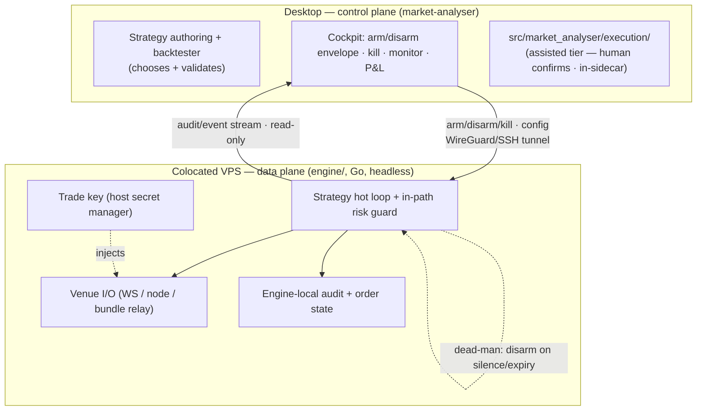

# ADR-0073 — Execution engine topology: the desktop app is the control plane, not the execution host

> **Status:** proposed (exploratory — a foundational posture that future execution plans hang off; no plan-paired close ceremony, like [ADR-0025](0025-trade-execution-feasibility.md)/[ADR-0072](0072-bounded-autonomy-and-prediction-market-execution.md))
> **Date:** 2026-07-11
> **Related ADRs:** [ADR-0025](0025-trade-execution-feasibility.md) (execution posture + six invariants), [ADR-0072](0072-bounded-autonomy-and-prediction-market-execution.md) (bounded-autonomy carve-out — BA-6 first named "headless, not the GUI"), [ADR-0043](0043-execution-venue-protocol.md) (`ExecutionVenue` Protocol + order state machine — the assisted seam), [ADR-0044](0044-trade-secret-store.md) (trade-secret store), [ADR-0016](0016-standalone-sidecar-mode.md) (standalone-process-the-GUI-attaches-to — the precedent generalized here), [ADR-0002](0002-ipc-local-http.md)/[ADR-0011](0011-bearer-secret-transport.md) (the localhost-bearer model this does **not** extend to the remote link), [ADR-0004](0004-strategy-interface.md) (strategy contract — the portability tension), [ADR-0012](0012-dependency-cooldown.md)/[ADR-0013](0013-pin-direct-dependencies.md) (dep discipline, extended to Go)
> **Related plan(s):** none yet — the read-only evidence plans ([Plan 0079](../plans/0079-cross-pool-discrepancy-scanner.md), [Plan 0078](../plans/0078-polymarket-convergence-screener.md)) precede any engine; a future engine plan is a prerequisite to implementation.

## Context

The user asked how high-frequency / low-latency trading — on CEX and DEX — should relate to `market-analyser`: incorporated into the app, or a fully standalone app? This ADR records the topology decision so that [ADR-0043](0043-execution-venue-protocol.md), [ADR-0044](0044-trade-secret-store.md), [ADR-0072](0072-bounded-autonomy-and-prediction-market-execution.md), and every future execution plan hang off one stated rule rather than re-deriving it.

Three forces shape the answer:

1. **"HFT" is a spectrum, and only part of it is reachable.** True HFT / market-making (nanoseconds–microseconds; colocation, kernel-bypass, FPGAs) is out of reach for any software-hosted-by-a-desktop-app setup — naming it keeps scope honest. What is reachable is **low-latency opportunistic execution** (ms–100s of ms: atomic DEX arb, CEX taker arb) and **mid-frequency systematic execution** (seconds–minutes: the Polymarket convergence, assisted entries). The user's actual goals sit in the latter two.

2. **The app and a latency engine have opposite design centers.** `market-analyser` is optimized for correctness, reproducibility (deterministic backtest outputs), human-in-the-loop, and offline operation; its hot path is "agent asks → answer," served through a resilient HTTP client (TTL cache + retry + backoff — [ADR-0019](0019-external-http-adapter-resilience.md)). A latency engine is optimized for uptime, minimal tick-to-trade latency, colocation, and bounded *latency* (its live outputs are inherently non-reproducible). Putting a latency hot loop inside the Electron process — or even inside the FastAPI request path — corrupts the app's design center with concerns it was never built for. The resilient client is a throughput/robustness tool and latency poison.

3. **Latency lives in different places on CEX vs DEX.** CEX latency is network RTT to the matching engine (edge = colocation in the exchange's region + a local order book + WS/FIX order entry); DEX latency is block inclusion (edge = a low-latency node, mempool watching, atomic bundle construction, builder-relay submission — not colocation). These are different enough that they are different engines, which is why [ADR-0072](0072-bounded-autonomy-and-prediction-market-execution.md) already treats atomic arb as its own paradigm.

The app already demonstrates the right pattern: [ADR-0016](0016-standalone-sidecar-mode.md) runs the sidecar as a standalone headless process the GUI *attaches to* via a lockfile and *observes* via SSE, and closing the GUI does not stop it. That is a control-plane/data-plane relationship — this ADR generalizes it to execution, and extends it across a network boundary.

## Decision

**`market-analyser` is the control plane (the cockpit), never the execution host for the latency-critical tier.** Execution splits into two tiers by whether a human is in the loop — and latency only matters when one is not:

### Two tiers

- **Assisted tier — in the control plane** (`src/market_analyser/execution/`, [Plan 0044](../plans/0044-execution-skeleton.md)). Regime 3 (seconds–minutes): the Polymarket convergence buy, assisted CEX entries. A human confirms every order, which removes the latency pressure, so this tier lives *in the sidecar* on the [ADR-0043](0043-execution-venue-protocol.md) state machine, gated by the [ADR-0025](0025-trade-execution-feasibility.md) six invariants. **The first execution the app ships is here, and it needs no separate engine.**
- **Autonomous tier — a separate top-level package** (`engine/`, new; language **Go**). Regime 2 (ms–100s ms): atomic DEX arb, CEX taker arb. No human in the loop — it fires inside the [ADR-0072](0072-bounded-autonomy-and-prediction-market-execution.md) arming envelope (BA-1…BA-7). It is a **headless, colocated process** that the control plane configures and observes but never routes orders through.

### Engine home: a separate top-level package in this monorepo

`engine/` is its own process and deploy target inside this repository (a polyglot monorepo: Python + TypeScript + Go), sharing contracts and the backtester rather than duplicating them. Chosen over a separate repo because contract changes stay **atomic in one commit** (no cross-repo version-skew), and over an in-sidecar module because the latency domain must not share the app's design center or its I/O stack. Go over Rust because at ms latency GC pauses are in the noise (they would only bite at regime 1, which is ruled out), and Go's simpler concurrency is the safer trade for a solo maintainer of a money-moving loop.

### The shared contract — three channels, one source of truth per schema

Schemas are defined once and mirrored (as the app already mirrors Python↔TS via `gen-types`; add Go `serde`/codegen as a third target):
1. **App → engine: arming envelope + strategy config** (allowlist, per-tx cap, cumulative-window cap, expiry — [ADR-0072](0072-bounded-autonomy-and-prediction-market-execution.md) BA-2). **Pushed to and persisted by the engine**, expiring on the *engine's* clock — the engine must be self-sufficient when the cockpit is closed.
2. **Engine → app: append-only audit/event stream** (every attempt, fill, revert, gas-loss) — the app subscribes read-only for monitoring, off the hot path (the SSE pattern).
3. **App → engine: command channel** (arm / disarm / **kill**).

### Strategy portability: native-now, golden-later (per tier)

- **Now (arb tier): native.** The arb engine owns its detection logic in Go; there is no portable Python strategy to divorce from — the backtester/scanner ([Plan 0079](../plans/0079-cross-pool-discrepancy-scanner.md)) validates *that an edge exists*, not a signal function. No cross-language strategy infrastructure is built.
- **Later (only if a directional systematic strategy ever goes autonomous): golden-test-pinned re-implementation.** The Go implementation is pinned against the Python [ADR-0004](0004-strategy-interface.md) strategy by a **same-bars → same-signals CI golden test** over a language-neutral bar fixture. The one piece of forward-planning owed now is that neutral fixture format. Declarative-config-only portability is rejected (it looks clean until the first non-trivial strategy).

### The control link is remote — private tunnel + fail-safe by default

The engine runs colocated on a VPS near the venue, so the app↔engine link crosses the public internet and can move money — the [ADR-0002](0002-ipc-local-http.md)/[ADR-0011](0011-bearer-secret-transport.md) localhost-bearer model does **not** extend to it. Therefore:
- **Private tunnel.** The engine binds localhost on its host; the desktop reaches it only through a **WireGuard/SSH tunnel** — the trade-control endpoint is never exposed on the public internet.
- **Dead-man's switch (fail-safe by default).** The engine **disarms itself** on loss of contact with the control plane *or* on envelope expiry — silence means stop, not continue. This is what makes "the cockpit is optional" safe: if the desktop closes, the engine winds down on its own clock rather than trading blind.
- **Fast, independent kill.** A remote kill is accepted *and* the engine enforces its own local failsafe ([ADR-0072](0072-bounded-autonomy-and-prediction-market-execution.md) BA-5) — a kill that must traverse a flaky home connection is not a kill switch.

### Engine-side state, secrets, and dependency discipline

- The engine owns its **own colocated persistence** (audit log, order/position state) — a second store beside the desktop's SQLite ([ADR-0006](0006-persistence-layout.md)); state is not round-tripped to the desktop on the hot path.
- The trade key lives in the **engine host's** secret manager ([ADR-0072](0072-bounded-autonomy-and-prediction-market-execution.md) BA-4 / [ADR-0044](0044-trade-secret-store.md)), not synced from the desktop.
- Go modules extend the dependency discipline: exact pins are native (`go.mod`/`go.sum`), but the [ADR-0012](0012-dependency-cooldown.md) **cooldown has no built-in Go equivalent → it becomes a CI check** ([ADR-0013](0013-pin-direct-dependencies.md) exact-pin rule holds natively).

### The universal gate

No `engine/` is built until [Plan 0079](../plans/0079-cross-pool-discrepancy-scanner.md)'s scanner demonstrates a real net-of-cost edge ([ADR-0072](0072-bounded-autonomy-and-prediction-market-execution.md) BA-7), and the full loop runs green on testnet first ([ADR-0025](0025-trade-execution-feasibility.md) invariant 2).

## Consequences

### Positive
- A single stated rule — **app = control plane, latency engine = separate colocated data plane** — that [ADR-0043](0043-execution-venue-protocol.md)/[ADR-0044](0044-trade-secret-store.md)/[ADR-0072](0072-bounded-autonomy-and-prediction-market-execution.md) and future plans hang off, instead of each re-deriving it.
- The two-tier split means the **first shippable execution (assisted) needs no new engine** — it's the Plan 0044 in-sidecar path; the heavy `engine/` is deferred behind an evidence gate.
- Reuses the app's real strengths (strategy authoring, backtesting-as-validation, visualization, the arming/kill UX, audit display) as the cockpit, rather than re-implementing them in a standalone tool — the reason not to go fully-standalone.
- The monorepo keeps the shared contract atomic across Python/TS/Go in one commit; the [ADR-0016](0016-standalone-sidecar-mode.md) attach/observe pattern is a proven precedent.

### Negative
- **A polyglot monorepo (Python + TS + Go) is a real maintenance tax** — a third toolchain, a third dependency ecosystem (with a bespoke cooldown CI check), and a colocated deploy target distinct from the desktop. For a solo maintainer this is nontrivial standing cost, justified only if the autonomous edge proves real (hence the gate).
- **The remote control link is the highest-value security surface the project has ever had** — a money-moving channel over the internet. The tunnel + dead-man's switch + engine-local failsafe are load-bearing; a lapse (an exposed endpoint, a dead-man's switch that fails open, an envelope that doesn't expire engine-side) is catastrophic in a way a read-only app never was.
- **Backtest↔live divergence risk is deferred, not eliminated.** "Native now" avoids it for arb, but the day a directional strategy goes autonomous, the golden-test infrastructure (and the neutral fixture format) must exist first — skipping it means the live engine can silently disagree with the backtest that justified it.
- **This is still, at best, a bet against a negative prior.** Retail-latency execution competes with professionals colocated next to the venue/builders; the topology being correct does not make the edge exist. The evidence gate is the honest guard against building all of this for nothing.

### Neutral
- Like [ADR-0025](0025-trade-execution-feasibility.md)/[ADR-0072](0072-bounded-autonomy-and-prediction-market-execution.md), this is `proposed` and may sit indefinitely. It has no plan-paired close ceremony; it becomes load-bearing only if an engine plan commits, at which point its rules become that plan's acceptance criteria.

## Alternatives considered

### Alternative A — Fully incorporated (execution hot loop inside the app/sidecar)
**Rejected for the autonomous tier, accepted for the assisted tier.** A latency hot loop in the Electron process or the FastAPI request path inherits the app's cache/retry/GUI-lifecycle assumptions — latency poison, and it couples uptime to a desktop that closes at night. The assisted tier *is* incorporated (in-sidecar) precisely because human confirmation removes the latency pressure that would make incorporation wrong.

### Alternative B — Fully standalone app (a separate trading application)
**Rejected.** A standalone execution app would re-implement backtesting, charting, the strategy contract, monitoring, and the arming/kill UX from scratch — discarding exactly what `market-analyser` is already good at. The control-plane/data-plane split keeps the cockpit here and puts only the latency-critical loop elsewhere.

### Alternative C — Separate repository for the engine
**Rejected in favor of a same-repo top-level package.** A separate repo gives the cleanest isolation of the latency domain but forces cross-repo contract versioning — the app and engine can skew, and a contract change is two coordinated PRs. In a monorepo the same change is one atomic commit; the process/deploy/language isolation we need is achieved by the package boundary, not a repo boundary.

### Alternative D — Rust for the engine
**Rejected in favor of Go.** Rust's sub-microsecond determinism only pays off at regime 1 (ruled out); at ms latency its cost (borrow-checker friction, slower iteration) buys nothing over Go, whose simpler concurrency is the safer trade for a solo maintainer of an autonomous money-moving loop. Revisit only if a future latency budget proves to need it.

### Alternative E — Public TLS endpoint (mTLS/bearer) for the control link
**Rejected in favor of a private tunnel.** A trade-controlling endpoint on the public internet is a standing target even with mTLS + IP allowlist; a WireGuard/SSH tunnel keeps it off the public internet entirely for a small ops cost, and the dead-man's switch means the tunnel dropping is safe (the engine disarms), not a lockout.

### Alternative F — Async-only, no live control link
**Rejected.** Full decoupling (engine reads config deploys, writes audit to a shared store the app polls) removes the live command channel — which makes the **kill switch slow and out-of-band**, the one thing that must never be slow. The tunnel keeps a fast kill while the dead-man's switch covers the link-loss case.

## Notes
- **What committing would require, in order:** (1) [Plan 0079](../plans/0079-cross-pool-discrepancy-scanner.md)'s live evidence shows a real net-of-cost edge (BA-7); (2) user go/no-go on this topology + [ADR-0072](0072-bounded-autonomy-and-prediction-market-execution.md)'s carve-out; (3) the `trader`/execution skill ([ADR-0025](0025-trade-execution-feasibility.md) invariant 3); (4) likely dedicated ADRs for the shared-contract schema + the tunnel/deploy mechanism + the neutral bar-fixture format; (5) a phased, testnet-first engine plan with the arming-envelope + kill UX as their own `ui-builder` phases. None of that happens inside this ADR.
- **No secrets, ever:** this ADR names secret *classes* and locations (engine-host secret manager, tunnel keys) and never a value. Any future engine code that logs or serializes a key or a tunnel credential is an immediate review blocker.
