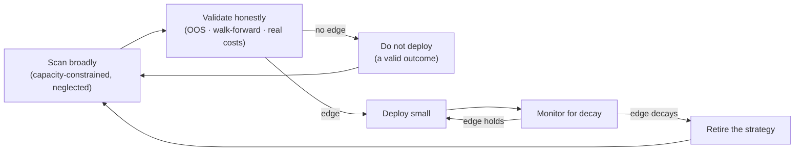

# ADR-0074 — Edge-selection criteria for execution: where we hunt, and where we refuse to

> **Status:** accepted (standalone strategic positioning; no paired plan — mirrors [ADR-0069](0069-crypto-first-asset-class-positioning.md))
> **Date:** 2026-07-11
> **Related ADRs:** [ADR-0025](0025-trade-execution-feasibility.md) (execution feasibility posture), [ADR-0072](0072-bounded-autonomy-and-prediction-market-execution.md) (bounded-autonomy carve-out), [ADR-0073](0073-execution-engine-topology-control-plane-data-plane.md) (engine topology), [ADR-0069](0069-crypto-first-asset-class-positioning.md) (crypto-first positioning — sibling strategic ADR), [ADR-0030](0030-forecasting-subsystem.md)/[ADR-0057](0057-forecast-feature-set-tiers.md) (honest-uncertainty forecasting — the validation discipline), [ADR-0018](0018-backtest-result-schema.md) (deterministic no-lookahead backtests), [ADR-0029](0029-advisory-recommendation-boundary.md) (analysis stands without execution)
> **Related plan(s):** none directly; **gates every future execution plan** ([Plan 0078](../plans/0078-polymarket-convergence-screener.md), [Plan 0079](../plans/0079-cross-pool-discrepancy-scanner.md), and any engine/execution plan under ADR-0025/0072/0073).

## Context

The feasibility ([ADR-0025](0025-trade-execution-feasibility.md)), autonomy ([ADR-0072](0072-bounded-autonomy-and-prediction-market-execution.md)), and topology ([ADR-0073](0073-execution-engine-topology-control-plane-data-plane.md)) ADRs answer *whether*, *under what guardrails*, and *where* execution runs. None of them answer the prior question the user raised: **with so many automated bots already deployed, where does a single-operator app's durable edge actually come from — and where should it refuse to compete?** Without a stated answer, the natural failure mode is to build the exciting bot (low-latency arb) that is structurally doomed for a retail operator, and to discover that only after spending capital and months.

The forces are unforgiving and worth stating plainly so a future maintainer doesn't re-learn them expensively:

- **"Many bots deployed" signals crowding, not opportunity.** Automated-trading outcomes are bimodal: a few industrial firms with infrastructure moats (colocation, orderflow, capital) capture most of the profit; a long tail of retail bots bleed costs; the middle — a retail operator doing what the pros do, slower — is where capital dies. Crowding into an efficient niche destroys the edge that drew the crowd.
- **The dominant killer is self-deception, not competition.** Most retail bots die to an overfit backtest — curve-fitting, lookahead bias, ignored costs, parameter p-hacking — that looked spectacular and bled live. Not losing to one's own overconfidence is a larger, more achievable edge for a solo operator than out-competing anyone.
- **Every edge is perishable.** An edge that works decays as others find it. Profitability is therefore a *process* (find → validate → deploy small → monitor decay → retire), not a single durable strategy.
- **A single operator has real structural advantages** the industrial firms cannot deploy: tolerance for tiny capacity, patience (no redemption/benchmark pressure), no fee drag, and willingness to do operationally annoying things at small size.

This app already embodies the antidote to the self-deception killer — deterministic no-lookahead backtests ([ADR-0018](0018-backtest-result-schema.md)), walk-forward validation, and forecasters that return honest null results rather than fabricated edges ([ADR-0030](0030-forecasting-subsystem.md)/[ADR-0057](0057-forecast-feature-set-tiers.md); Plan 0077 shipped a null verdict). This ADR turns that culture into an explicit gate for *what we build execution for*.

## Decision

**We build execution only for edges that pass the edge-selection gate below, and we refuse the latency-arms-race niches outright.** Every future execution plan must state, in its Context, which criteria its edge satisfies; a plan whose edge reduces to "be faster" fails this gate at Mode 4 review, regardless of engineering merit.

### The edge-selection gate (ES-1…ES-6)

- **ES-1 — Capacity-constrained.** The opportunity's per-instance capacity is small enough that industrial firms will not industrialize it (rough test: if a professional desk would need to deploy far more capital per opportunity than the niche can absorb, it's beneath their notice and available to us). We deliberately fish where whales cannot fit.
- **ES-2 — Analytically or structurally sourced, not latency-sourced.** The edge must survive *without winning a latency race*. If the edge disappears when a faster participant acts first, it is not ours to take.
- **ES-3 — Honestly validated before capital.** The edge is demonstrated by out-of-sample / walk-forward evidence with real costs and no lookahead (the scanner/backtest evidence gates — e.g. [Plan 0079](../plans/0079-cross-pool-discrepancy-scanner.md) BA-7). A backtest-only, in-sample, or cost-ignoring result is *not* validation. A null result is a valid, respected outcome — it means do not deploy.
- **ES-4 — Neglected niche.** The venue/asset/strategy is under-contested — new venues, long-tail assets, operationally annoying setups, prediction markets — not the efficient core where the professionals already run.
- **ES-5 — Decay-monitored with a retirement trigger.** The plan defines how edge decay is detected live and the explicit condition under which the strategy is retired. No deploy-and-forget.
- **ES-6 — Leverages the operator's structural advantage.** The edge draws on what a single operator has that firms don't — tiny-capacity tolerance, patience/lockup tolerance, no fee/benchmark drag — rather than fighting on the pros' terms.

### The hard exclusion

**We do not enter latency-arms-race niches.** Concretely: CEX high-frequency/market-making, generic same-pair DEX arbitrage on major chains and major pairs, and mainnet MEV. The edge in these is colocation + orderflow + capital, and it is owned; a retail operator loses before starting. An execution plan targeting these fails the gate — no exceptions on the basis of a clever implementation, because the implementation is not where the loss comes from.

### The process framing

Profitability is a loop, and the app is the factory for it, not a home for one golden bot:

### The honesty clause

If no edge clears the gate, the disciplined outcome is to **not deploy execution at all**. The app's analysis, forecasting, and advisory value ([ADR-0029](0029-advisory-recommendation-boundary.md)) stand entirely on their own without an execution layer. Execution is a conditional extension justified only by evidence, never a goal in itself.

## Consequences

### Positive
- A stated gate future execution plans are checked against, so the seductive-but-doomed bot (low-latency arb on the main field) is refused by policy, not re-argued each time. It composes with the ADR-0025/0072/0073 guardrails: those say *how* to execute safely; this says *what is worth executing at all*.
- Codifies the app's real competitive advantage — the honesty of its validation pipeline — into the build criteria, turning "we don't fool ourselves" from culture into a reviewable rule (ES-3).
- Reframes success as a research *process* (scan → validate → deploy → monitor → retire), which is both honest about edge perishability and a better fit for a single operator than defending one strategy forever.
- Names the operator's genuine structural advantages (ES-1, ES-6) so we hunt where they matter instead of where the marketing hype points.

### Negative
- **We deliberately forgo the glamorous, high-capacity niches.** Someone will always point at a firm making money in CEX HFT; this ADR says that field is not ours and we won't chase it. That is a real opportunity cost accepted on purpose.
- **The criteria are judgment calls, not mechanical tests.** "Capacity-constrained" and "neglected niche" require honest assessment; they can be rationalized around by a motivated builder. The gate is only as strong as the review that applies it (Mode 4).
- **The honest conclusion may be "no qualifying edge exists."** If the scanners and backtests keep returning null, this ADR's disciplined answer is to not build execution — which means the months of topology/autonomy design may never cash into a running engine. That is the correct outcome of an honest process, but it is a cost worth naming: we are gating hard enough that "we built the guardrails and never used them" is a possible, acceptable end state.

### Neutral
- Like [ADR-0069](0069-crypto-first-asset-class-positioning.md), this is a standalone positioning decision with no paired plan; it is `accepted` on statement and constrains the roadmap rather than closing with a plan. It can be superseded if the competitive landscape or the operator's advantages change materially.

## Alternatives considered

### Alternative A — Compete on latency/infrastructure (out-build the field)
**Rejected as unwinnable for a single operator.** The moat in latency niches is physical and financial (colocation, orderflow, capital), not a matter of a better implementation. Language, cleverness, and effort do not close that gap; entering is a capital-donation to the incumbents.

### Alternative B — No stated criteria; decide ad hoc per plan
**Rejected.** Without a gate, the default is to build the exciting bot and discover its doom after spending. A stated, reviewable criterion is exactly what stops a motivated builder (including a future session) from rationalizing into a saturated niche.

### Alternative C — Pure discretionary/manual trading, no systematic gate
**Rejected.** Discarding the systematic validation pipeline throws away the app's single strongest competitive advantage (ES-3 / the self-deception filter) and reintroduces the dominant retail failure mode — deploying on gut and an unvalidated backtest.

### Alternative D — Passive/index only; concede there is no active edge
**Not rejected — retained as the honest fallback.** If nothing clears the gate, "don't run active execution" is precisely this ADR's honesty clause. This is not a competing strategy so much as the default state the gate returns to when evidence is absent; the app's analysis/advisory value persists regardless.

## Notes
- **How this gates a plan in practice:** a future execution plan's Context must name which ES criteria its edge satisfies and how ES-3 (honest validation) and ES-5 (decay monitoring) are met; Mode 4 review checks the claim against the exclusion list. Applied to the current ideas: **Polymarket convergence** ([Plan 0078](../plans/0078-polymarket-convergence-screener.md)) satisfies ES-1/ES-4/ES-6 strongly (small capacity, operationally annoying, ignored by scaled firms); **DeFi cross-pool arb** ([Plan 0079](../plans/0079-cross-pool-discrepancy-scanner.md)) largely fails ES-2/ES-4 on the main field and is admissible only in the neglected-niche corner *if* its evidence gate (ES-3) returns a real net-of-cost edge — which is exactly why 0079 is a read-only scanner, not a build order.
- This ADR makes no market claim and names no strategy as profitable; it states *how we decide what is worth building execution for*, and commits to accepting a null answer.
