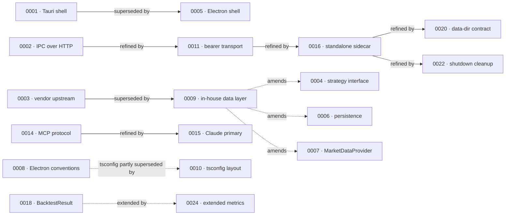

# ADRs

Architecture Decision Records for `market-analyser`. Each ADR is one file (`NNNN-<slug>.md`) capturing a decision **and the alternatives rejected**, so a future maintainer can tell whether the original reasoning still holds. ADRs are **append-only once accepted** — to change a decision, write a new ADR that supersedes the old one (the old one stays, marked `superseded by NNNN`).

This index is the one-minute entrypoint: what exists, each one's status, and how they relate. It is a *view* — the ADR files are the source of truth. If a row disagrees with a file's header, the file wins; fix the row.

## Roster

| #    | Title | Status | Lineage | Plan(s) |
|------|-------|--------|---------|---------|
| [0001](0001-tauri-vs-electron.md) | Tauri as desktop shell | superseded by 0005 | → 0005 | 0001 |
| [0002](0002-ipc-local-http.md) | UI↔sidecar IPC over localhost HTTP | accepted | refined by 0011 | 0001 |
| [0003](0003-vendoring-strategy.md) | Vendor an upstream MCP project (mirrored subtree) | superseded by 0009 | → 0009 | 0001 |
| [0004](0004-strategy-interface.md) | Strategy interface: typed fn + declarative params | accepted | amended by 0009 | 0002 |
| [0005](0005-desktop-shell-electron.md) | Desktop shell: Tauri → Electron | accepted | supersedes 0001 | 0001 |
| [0006](0006-persistence-layout.md) | Persistence: SQLite for data, JSON for config | accepted | amended by 0009; related 0020 | 0001 |
| [0007](0007-market-data-provider.md) | `MarketDataProvider` abstraction | accepted | amended by 0009 | 0001 |
| [0008](0008-electron-shell-conventions.md) | Electron shell conventions (build, IPC, CSP) | accepted | tsconfig partly superseded by 0010 | 0001 |
| [0009](0009-rewrite-data-layer-in-house.md) | Drop vendored upstream; rewrite data layer in-house | accepted | supersedes 0003; amends 0004/0006/0007 | 0003 |
| [0010](0010-tsconfig-solution-layout.md) | tsconfig solution layout (shared base) | accepted | refines 0008 (tsconfig) | — |
| [0011](0011-bearer-secret-transport.md) | Bearer-secret transport: env-var, not argv | accepted | refines 0002; refined by 0016 | 0001, 0004 |
| [0012](0012-dependency-cooldown.md) | Dependency cooldown (14 days) | accepted | paired with 0013 | 0005 |
| [0013](0013-pin-direct-dependencies.md) | Pin every direct dependency exactly | accepted | paired with 0012 | 0005 |
| [0014](0014-mcp-as-second-sidecar-protocol.md) | MCP as a second sidecar protocol | accepted | refined by 0015 | 0006 |
| [0015](0015-claude-code-primary-control-surface.md) | Claude Code (MCP) as primary control surface | accepted | refines 0014 | 0007 |
| [0016](0016-standalone-sidecar-mode.md) | Standalone sidecar + idempotent attach | accepted | refines 0011; refined by 0020, 0022 | 0007 |
| [0017](0017-live-ui-updates-via-sse.md) | Live UI updates via SSE event stream | accepted | — | 0007, 0006 |
| [0018](0018-backtest-result-schema.md) | `BacktestResult` schema | accepted | extended by 0024 | 0008, 0002 |
| [0019](0019-external-http-adapter-resilience.md) | External HTTP adapter resilience (shared module) | accepted | — | 0009–0012 |
| [0020](0020-shared-data-dir-contract.md) | Shared data-dir contract (Python ↔ Electron) | accepted | refines 0016 (+ related 0006) | 0007 |
| [0021](0021-renderer-to-agent-feedback.md) | Renderer→agent feedback (MCP resources + notifications) | proposed | — | 0014 |
| [0022](0022-sidecar-shutdown-cleanup-in-lifespan.md) | Sidecar shutdown cleanup in app lifespan | accepted | refines 0016 (shutdown contract) | none (bug fix) |
| [0023](0023-technical-analysis-surface.md) | Technical-analysis surface in `analysis/` | proposed — accepts at Plan 0018 close | — | 0018 |
| [0024](0024-extended-backtest-metrics.md) | Extended backtest metrics (definitions + degenerate convention) | proposed — accepts at Plan 0020 close | extends 0018 | 0020 |

**Standalone (no supersede/refine lineage):** 0012/0013 (a peer pair), 0017, 0019, 0021, 0023. Everything else sits in one of the chains below.

## Lineage

How decisions have replaced or evolved one another. Most ADRs are standalone and are not shown; only the ones with a supersede/refine/amend/extend edge appear.

**Reading the edges:** solid = supersede or refine (the later ADR changes which decision is in force); dashed = amend / extend / partial-supersede (the earlier ADR's body still stands, the later one adjusts its interpretation or appends to it — e.g. ADR-0009 didn't rewrite 0004/0006/0007, it reinterpreted "vendored" as "in-house" across them).

## Conventions

- **Numbering** is sequential, zero-padded to four digits, never reused. Next free ADR number is **0025** (0024 drafted 2026-05-24). The architect runs `Glob docs/architecture/adrs/*.md` before drafting to pick the next number, never trusting memory. ADR numbers and plan numbers are independent sequences.
- **Append-only after `accepted`.** Don't edit an accepted ADR's decision. Supersede it with a new ADR and mark the old one `superseded by NNNN`. The one sanctioned exception to date: the 2026-05-24 owner-authorized genericization of the upstream-project name across ADR bodies (a privacy edit that changed no decision).
- **Status vocabulary:** `proposed` → `accepted` → optionally `superseded by NNNN`. A `proposed` ADR paired with a plan flips to `accepted` at that plan's close ceremony (e.g. 0023 at Plan 0018 close, 0024 at Plan 0020 close).
- **Paired with a plan?** Most ADRs are written alongside the plan that forces the decision. The Plan(s) column links them; the plans index lives at [`../plans/README.md`](../plans/README.md).

## Index freshness

This index is refreshed by the architect on every ADR mutation it owns — same discipline as the plans index:

| Trigger | Update |
|---------|--------|
| New ADR written | Add a roster row; bump next-free-number; add a lineage edge if it supersedes/refines/amends/extends another ADR. |
| Status flip (`proposed → accepted`, or a supersede) | Update the row's Status; if a supersede, add the lineage edge and flip the superseded ADR's status. |
| Drift found (a row disagrees with the file header) | Fix the row in the same session and note it — the file header always wins. |
