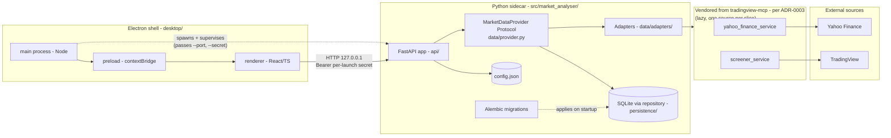
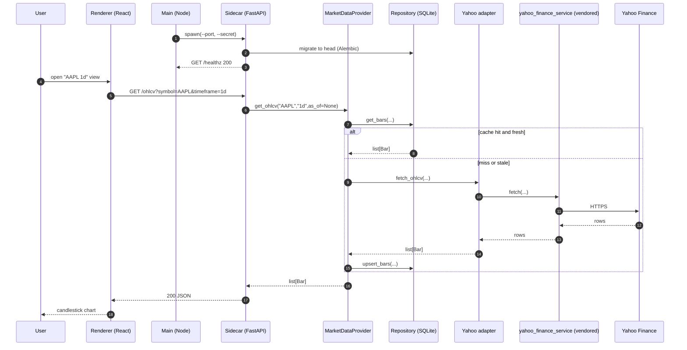
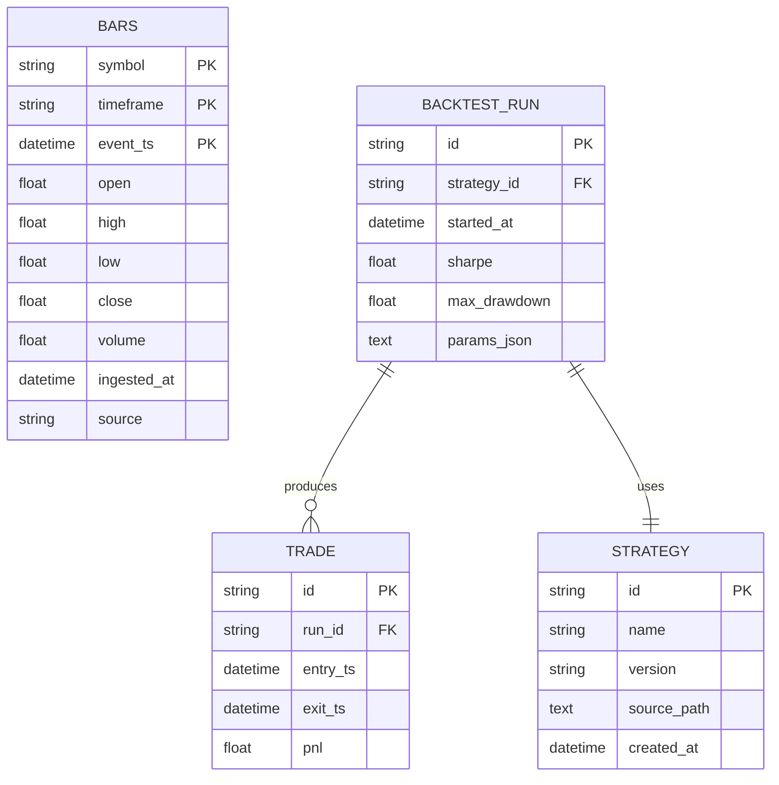

# Bootstrap component map

Source of truth for the post-bootstrap component layout under [Plan 0001](../plans/0001-bootstrap.md). Update whenever a new component crosses a process or package boundary.

## Process and package boundaries

Boundaries:

- **Shell** is the Electron app — its only domain responsibility is supervising the Python sidecar and rendering the UI. No business logic.
- **Sidecar** is the Python process. Owns the data layer, persistence, and (later) backtest and strategy execution. Single source of truth for all market-data answers.
- **Vendored** is mirrored from `../tradingview-mcp` per [ADR-0003](../adrs/0003-vendoring-strategy.md). Edited only via adapters, never in place.
- **External** is the network. Anything in here can return garbage, time out, or rate-limit; adapters validate at the seam.

The `MarketDataProvider` arrow is the only data-layer dependency `API` is allowed to take. Adapters are package-internal — callers never import them.

## Walking-skeleton sequence — OHLCV chart for one symbol

Note the cache-hit/miss branch: this is where [ADR-0006](../adrs/0006-persistence-layout.md) and [ADR-0007](../adrs/0007-market-data-provider.md) intersect. The provider is the only code that decides "fetch fresh or serve from cache" — adapters never touch persistence directly.

## Initial SQLite schema (illustrative)

Final shape is owned by Alembic migrations under `src/market_analyser/persistence/migrations/`.

The `BARS` table's `source` column records which adapter wrote the row — important for reproducibility and for debugging "why does this backtest say AAPL=$143 when Yahoo says $142".
