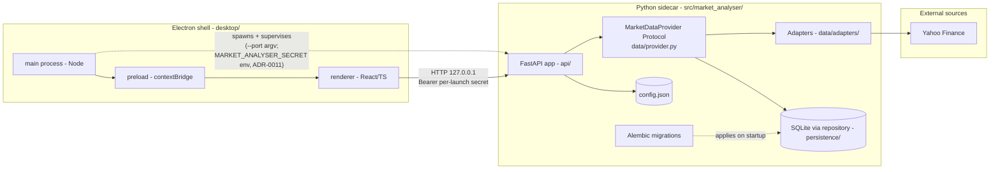
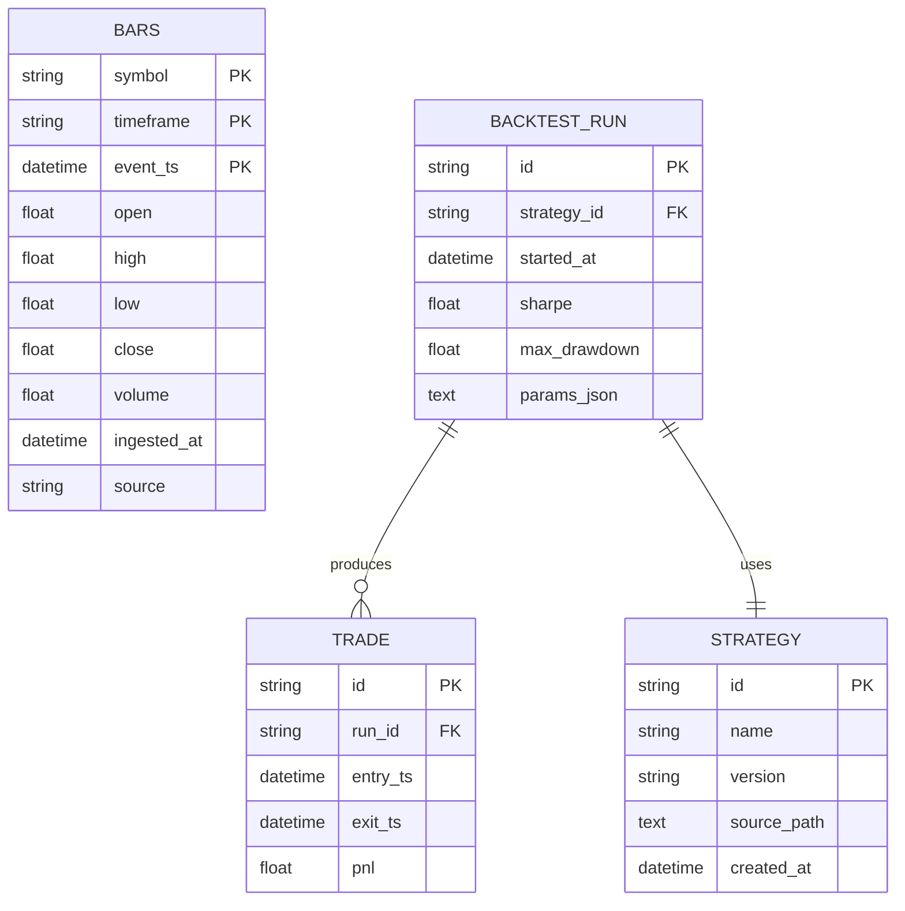

# Bootstrap component map

Source of truth for the post-bootstrap component layout under [Plan 0001](../plans/0001-bootstrap.md). Update whenever a new component crosses a process or package boundary.

## Process and package boundaries



Boundaries:

- **Shell** is the Electron app — its only domain responsibility is supervising the Python sidecar and rendering the UI. No business logic.
- **Sidecar** is the Python process. Owns the data layer, persistence, and (later) backtest and strategy execution. Single source of truth for all market-data answers.
- **External** is the network. Anything in here can return garbage, time out, or rate-limit; adapters validate at the seam. Per [ADR-0009](../adrs/0009-rewrite-data-layer-in-house.md) each external source is reached via an in-house adapter (currently only Yahoo for OHLCV); additional sources (TradingView screener, news, sentiment) ship in their own future plans.

The `MarketDataProvider` arrow is the only data-layer dependency `API` is allowed to take. Adapters are package-internal — callers never import them.

## Walking-skeleton sequence — OHLCV chart for one symbol

```mermaid
sequenceDiagram
    autonumber
    participant U as User
    participant R as Renderer (React)
    participant M as Main (Node)
    participant S as Sidecar (FastAPI)
    participant P as MarketDataProvider
    participant Repo as Repository (SQLite)
    participant YA as Yahoo adapter
    participant Yahoo as Yahoo Finance

    M->>S: spawn(--port; MARKET_ANALYSER_SECRET env)
    S->>Repo: migrate to head (Alembic)
    S-->>M: GET /healthz 200
    U->>R: open "AAPL 1d" view
    R->>S: GET /ohlcv?symbol=AAPL&timeframe=1d
    S->>P: get_ohlcv("AAPL","1d",as_of=None)
    P->>Repo: get_bars(...)
    alt cache hit and fresh
        Repo-->>P: list[Bar]
    else miss or stale
        P->>YA: fetch_ohlcv(...)
        YA->>Yahoo: HTTPS (urllib, in-house fetcher)
        Yahoo-->>YA: rows
        YA-->>P: list[Bar]
        P->>Repo: upsert_bars(...)
    end
    P-->>S: list[Bar]
    S-->>R: 200 JSON
    R-->>U: candlestick chart
```

Note the cache-hit/miss branch: this is where [ADR-0006](../adrs/0006-persistence-layout.md) and [ADR-0007](../adrs/0007-market-data-provider.md) intersect. The provider is the only code that decides "fetch fresh or serve from cache" — adapters never touch persistence directly.

## Initial SQLite schema (illustrative)

Final shape is owned by Alembic migrations under `src/market_analyser/persistence/migrations/`.



The `BARS` table's `source` column records which adapter wrote the row — important for reproducibility and for debugging "why does this backtest say AAPL=$143 when Yahoo says $142".
