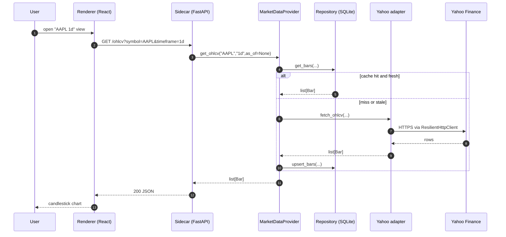
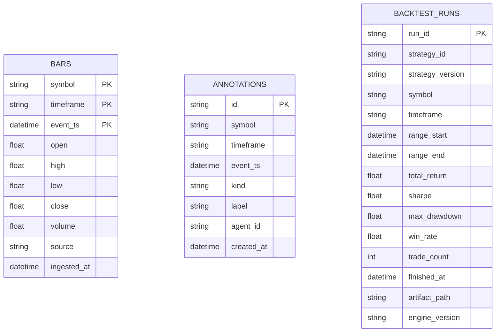

# OHLCV data flow and persistence schema

Companion to [`claude-cli-driven-architecture.md`](claude-cli-driven-architecture.md), which owns the process/component map and the sidecar lifecycle. This file covers two narrower cuts:

1. How a single OHLCV chart request resolves through the data layer (cache vs. fetch).
2. The SQLite schema as actually shipped.

Update the data-flow diagram when the provider's cache decision changes. The schema diagram is **illustrative** — Alembic migrations under `src/market_analyser/persistence/migrations/` are the source of truth for exact columns.

## Walking-skeleton data flow — OHLCV chart for one symbol

The sidecar migrates the SQLite database to head (Alembic) on startup before serving; that lifecycle step lives in the [system map's cold-start sequence](claude-cli-driven-architecture.md). From a warm sidecar, a chart request resolves like this:

The cache-hit/miss branch is where [ADR-0006](../adrs/0006-persistence-layout.md) and [ADR-0007](../adrs/0007-market-data-provider.md) intersect: the provider is the only code that decides "fetch fresh or serve from cache" — adapters never touch persistence directly. External fetches go through the shared `ResilientHttpClient` ([ADR-0019](../adrs/0019-external-http-adapter-resilience.md)), so retry/backoff/TTL behaviour is identical across every adapter. (Plan 0013 makes the miss branch's partial-result and async-backfill behaviour explicit on the agent-facing tool; the renderer path above is unchanged.)

## SQLite schema (illustrative)

Six tables today (migrations `0001`–`0005`; `0005` adds two). The three walking-skeleton tables are diagrammed below; the later three are noted in prose. There is **no `strategy` table** (strategies are file-discovered via `discover()`) and **no `trade` table** (the full trade list lives on disk in the backtest artifact — only a searchable projection is indexed in SQLite, per [ADR-0018](../adrs/0018-backtest-result-schema.md)).

- **`bars`** (migration `0001`) — one OHLCV row, composite PK `(symbol, timeframe, event_ts)`. `source` records which adapter wrote the row, so a backtest can be traced to its data provenance. `event_ts` (market time) is deliberately distinct from `ingested_at` (wall-clock) — that gap is what makes historical replay deterministic ([ADR-0006](../adrs/0006-persistence-layout.md)).
- **`annotations`** (migration `0002`, Plan 0006) — agent-written chart markers. PK is a uuid `id` so two identical `(symbol, timeframe, event_ts)` inserts don't silently dedupe; the composite index `(symbol, timeframe, event_ts)` serves the chart-marker query.
- **`backtest_runs`** (migration `0003`, Plan 0008) — the searchable projection of a `BacktestResult` ([ADR-0018](../adrs/0018-backtest-result-schema.md)). SQLite holds only the columns worth filtering/sorting by; the canonical artifact (`spec.json`, `result.json`, `equity_curve.json`, including every trade) lives on disk under `runs/<run_id>/`. `artifact_path` is relative to the sidecar's `runs_dir`; `engine_version` lets regenerated-fixture runs be filtered apart from legacy runs.
- **`metric_points`** (migration `0004`, Plan 0055) — the one generic historized-external-metric table ([ADR-0051](../adrs/0051-historized-metric-series-contract.md)): `(series_id, event_ts)` rows with an `as_of`-bounded read surface (the anti-lookahead join primitive) and upsert-once immutability. Every external series (F&G, dominance, funding rate, open interest, MVRV) lands here — no per-series tables.
- **`watches` + `alerts`** (migration `0005`, Plan 0060) — persisted watch definitions (kind, symbol/timeframe, params, `enabled`, `last_state`) and the append-style alert history the in-sidecar scheduler writes on a false→true edge ([ADR-0055](../adrs/0055-in-sidecar-watch-scheduler.md)).
