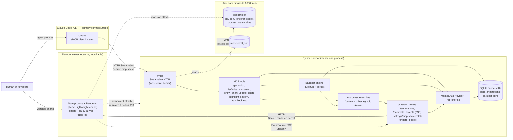
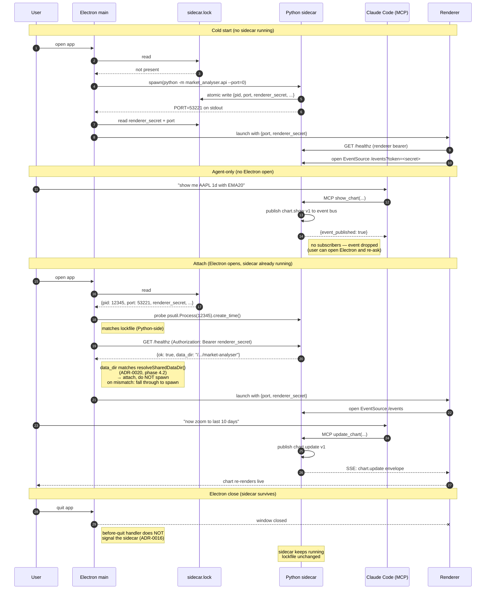
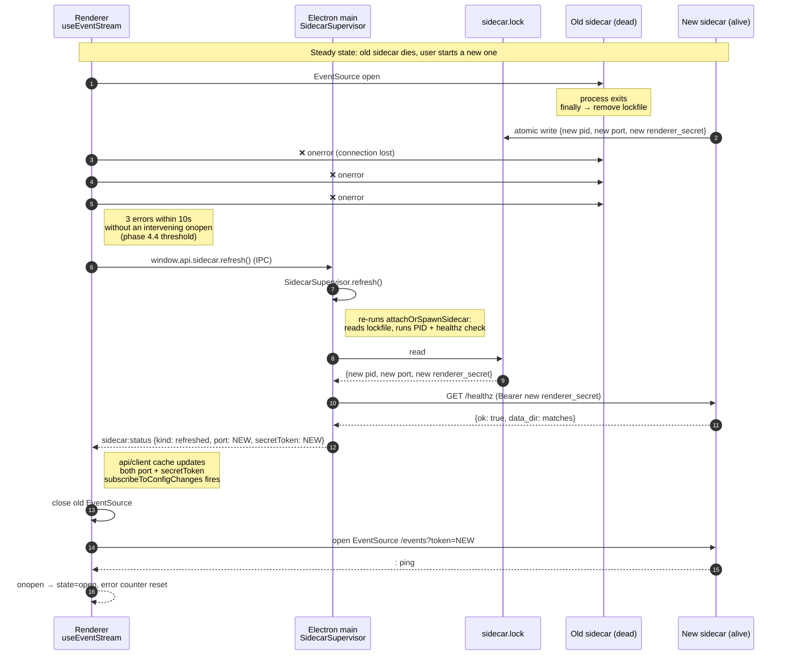

# Claude-CLI-driven architecture

Source of truth for the post-[ADR-0015](../adrs/0015-claude-code-primary-control-surface.md) layout — Claude Code as the primary control surface, Electron as the live viewer, sidecar standalone-capable. Update whenever a transport, route, or persisted secret changes shape.

## Component map

Boundaries:

- **CLI** is Claude Code with its built-in MCP client. The user's primary input device — symbols, timeframes, strategies, overlay choices, backtest parameters, render commands all originate here.
- **Sidecar** is the single Python process. It serves two transports on one loopback port: MCP at `/mcp` (Streamable HTTP, agent-facing, per [ADR-0014](../adrs/0014-mcp-as-second-sidecar-protocol.md)) and the renderer HTTP routes (viewer-facing, per [ADR-0002](../adrs/0002-ipc-local-http.md)). Both transports share the same data layer, repositories, and SQLite cache. The backtest engine (pure `run` + thin `persist`, per [ADR-0018](../adrs/0018-backtest-result-schema.md)) sits behind the `run_backtest` tool, persists to the `backtest_runs` table, and emits `run.completed v1`. The event bus is in-process — MCP tools and the engine publish; the SSE handler at `/events` is the sole subscriber-dispatch.
- **User data dir** holds the two persisted secrets, each `0600`. `mcp-secret.json` is long-lived (ADR-0014); `sidecar.lock` is per-sidecar-launch (ADR-0016).
- **Electron viewer** is optional. The sidecar runs without it; opening Electron attaches to the running sidecar via the lockfile (or spawns one if none is running). Closing Electron does not stop the sidecar.

Critical invariants:

- **Cross-tenant bearer isolation.** MCP secret authenticates only on `/mcp/*`. Renderer secret authenticates only on the renderer routes. Each middleware uses constant-time comparison; the dispatcher routes by prefix.
- **Single sidecar instance per user.** Enforced by `sidecar.lock` + PID liveness probe with `process_create_time` cross-check (ADR-0016).
- **SQLite single-writer.** Falls out of the single-instance enforcement.
- **No lookahead in agent-facing tools.** `get_ohlcv` and bar-reading tools forward `as_of=None` (live mode). The backtest-aware path is the separate `run_backtest` tool (per [ADR-0018](../adrs/0018-backtest-result-schema.md)), not an `as_of` parameter bolted onto `get_ohlcv`; the engine enforces the next-bar-open fill seam internally (see [`strategy-execution-sequence.md`](strategy-execution-sequence.md)) and re-runs deterministically (per ADR-0014 and the [CLAUDE.md non-negotiable](../../../CLAUDE.md#cross-cutting-non-negotiables)).

## Lifecycle: cold start vs. attach vs. agent-only

The "agent-only" branch is the visible payoff of [ADR-0016](../adrs/0016-standalone-sidecar-mode.md): Claude can drive workflows without the viewer being open. The "attach" branch is the payoff of the lockfile mechanism: opening the viewer is one step regardless of prior sidecar state.

## Recovery: renderer-initiated refresh on out-of-band sidecar restart

Standalone-mode sidecars (ADR-0016) don't restart from Electron's perspective — the supervisor decoupled lifecycle. But the sidecar *can* die out-of-band (user `python -m market_analyser.api stop` followed by a fresh start, or a manual kill). The renderer discovers and recovers via the sequence below.

The `refresh()` call coalesces concurrent invocations (phase 4.3) so a renderer-side error storm collapses to one attach cycle upstream. The "refresh fires at most once per `onopen`-bounded window" rule (phase 4.4) prevents an infinite refresh loop if the new sidecar also can't be reached.

## Companion diagrams

This file owns the **process/component map and the sidecar lifecycle**. Two companions cover narrower cuts:

- [`bootstrap-component-map.md`](bootstrap-component-map.md) — the OHLCV walking-skeleton **data flow** (renderer → sidecar → provider → cache/Yahoo) and the **SQLite schema**. Reach for it when the question is "how does a single chart request resolve" or "what shape is a table", not "how do the processes fit together".
- [`strategy-execution-sequence.md`](strategy-execution-sequence.md) — the **backtest runtime order** and the next-bar-open anti-lookahead seam. Independent of which client (agent vs viewer) requested the run.
