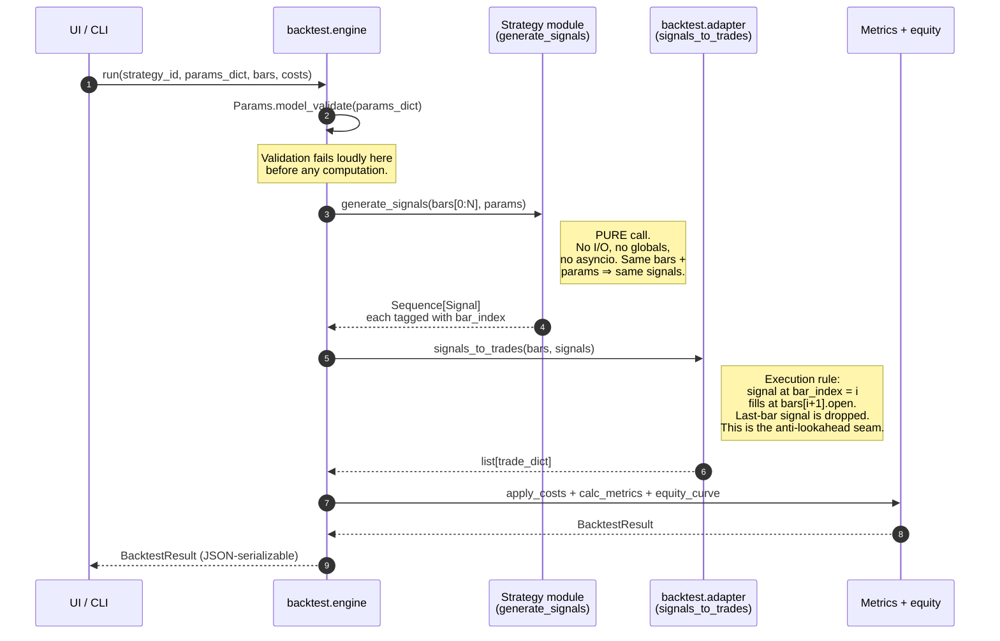

# Strategy execution sequence

Companion to [plan 0002](../plans/0002-strategy-interface.md) and [ADR-0004](../adrs/0004-strategy-interface.md).

This diagram shows the *runtime* shape of a backtest under the new strategy contract — specifically the order of operations that prevents lookahead bias. The plan's inline diagram shows the static module relationships; this one shows what happens when you press "run".

## Why the adapter, not the strategy, owns execution timing

The strategy says "at bar 42, enter long". It does **not** say "at bar 42's close, at price 100.50". The adapter is the only code that turns a signal into a fill, and it always executes at the *next* bar's open. This single rule is what prevents the most common lookahead bug in backtesting: a strategy reading `bars[i].close` to decide *and* fill at `bars[i].close`.

If we ever support intrabar fills (stop-loss triggers within a bar), they go in the adapter, not the strategy. The strategy contract stays small.

## Determinism contract enforced at each arrow

| Arrow                              | Determinism property                                                                                  |
|------------------------------------|-------------------------------------------------------------------------------------------------------|
| `UI → Eng`                         | `params_dict` is JSON; serialization is canonical (sorted keys).                                      |
| `Eng → Strat`                      | `bars` is an immutable `Sequence[Bar]` (frozen pydantic). The same object reference yields the same signals. |
| `Strat → Eng` (signals)            | Strategy is pure — no `random`, no `time.time()`, no module-level state. ADR-0004 mandates this.      |
| `Eng → Adapt`                      | Fill rule is fixed (next-bar open). Cost params are explicit.                                         |
| `Adapt → Met`                      | Floating-point reduction order is deterministic (single-threaded; same input order ⇒ same sum).      |

A re-run with the same `(strategy_id, params_dict, bars, costs)` produces a byte-identical `BacktestResult`. This is testable: hash the JSON output and assert across runs.
