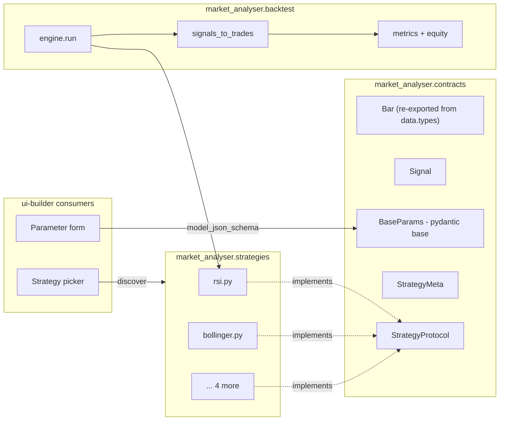

# 0002 — Strategy interface and contracts module

> **Status:** draft
> **Created:** 2026-05-17
> **Owner skill(s):** `dev` (phases 1, 2, 5), `backtester` (phase 3), `strategy-author` (phase 4)
> **Related ADRs:** [ADR-0004](../adrs/0004-strategy-interface.md), [ADR-0007](../adrs/0007-market-data-provider.md)
> **Depends on:** [Plan 0001](0001-bootstrap.md) phase 2 — `src/market_analyser/data/types.py` (which defines the canonical `Bar` model) must exist before phase 1 of this plan can land.

## TL;DR

We lock the strategy interface as **a Python module that exports `META`, `Params` (a `pydantic.BaseModel`), and `generate_signals(bars, params) -> Sequence[Signal]`**. These three names are the entire public contract; everything else (positions, capital, costs, equity, metrics) lives in the backtest engine. Strategies are pure: same `bars + params` in, same signals out, no instance state, no I/O. The first user-visible behavior is `uv run market-analyser strategies list` printing the registered strategies with their parameter schemas — proving the contract is real before any engine work.

## Context & problem

ADR-0004 captured *which* shape we chose; this plan captures *how we build it* and *who owns which phase*.

Three skills need this nailed down before they can do useful work:

- `strategy-author` cannot write a strategy until it knows what to write. Right now we'd hand it the vendored `_run_rsi(candles, **_)` shape, which has no parameter metadata, no validation, and conflates signal generation with trade creation.
- `backtester` cannot consume strategies generically until they all answer to the same protocol. The current vendored engine knows about six string keys hard-coded in `_STRATEGY_MAP`; a seventh requires editing core.
- `ui-builder` cannot render a parameter form for a strategy until parameters are introspectable. Today they are positional defaults in a Python function signature.

This plan delivers the contract module, the adapter that lets us reuse the vendored engine, the six rewritten strategies, and the CLI subcommand that proves it all works end-to-end.

## Decision

We implement ADR-0004 in five phases, smallest-valuable-thing first.

Phase 1 ships the contract module (`contracts/`) and a single trivial reference strategy (RSI) so that `strategy-author` has a concrete example to copy and `backtester` has a target to call. Phase 2 ships strategy discovery. Phase 3 ships the adapter that bridges new-shape signals to the vendored engine, so we don't have to rewrite metrics in phase 1. Phase 4 ports the remaining five vendored strategies. Phase 5 is the architect's review.

We rejected option A (class-based) and option B (declarative DSL) in ADR-0004; see that document for the rationale.

## Architecture diagram



The contracts module is the only thing all four other modules import. Strategies do not import the engine; the engine does not import any concrete strategy. The UI reaches strategies through the contract, never directly.

## Implementation phases

### Phase 1 — Contracts module + RSI reference strategy

- **Owner skill:** `dev` (writes contract definitions and the RSI module from the template defined below)
- **What:** Ship `src/market_analyser/contracts/{__init__.py,strategy.py}` with `Signal`, `SignalKind`, `BaseParams`, `StrategyMeta`, and `StrategyProtocol`. `Bar` is **imported from `market_analyser.data.types`** (created by Plan 0001 phase 2) — it is not redefined here, and there is no `contracts/market_data.py`. Ship `src/market_analyser/strategies/rsi.py` as the reference implementation that `strategy-author` will copy for the others.
- **Files touched:**
  - `src/market_analyser/contracts/__init__.py` — re-exports `Signal`, `SignalKind`, `BaseParams`, `StrategyMeta`, `StrategyProtocol`, and `Bar` (re-exported from `market_analyser.data.types`) so consumers have one import root.
  - `src/market_analyser/contracts/strategy.py` (~80 lines: `Signal`, `SignalKind`, `BaseParams`, `StrategyMeta`, `StrategyProtocol`). The base class is named **`BaseParams`** — not `Params` — so strategy modules can declare `class Params(BaseParams):` without name-shadowing.
  - `src/market_analyser/strategies/__init__.py` (empty marker — created here, not in Plan 0001).
  - `src/market_analyser/strategies/rsi.py` (~50 lines).
  - `tests/contracts/test_strategy_contract.py`.
  - `tests/strategies/test_rsi.py` (one fixture, deterministic).
- **Done when:** `uv run pytest tests/strategies/test_rsi.py` passes, and `python -c "from market_analyser.strategies import rsi; print(rsi.Params.model_json_schema())"` prints a JSON schema.

### Phase 2 — Strategy discovery

- **Owner skill:** `dev` (one-shot — small enough to keep in the contracts module)
- **What:** A `discover()` function in `contracts/strategy.py` that walks `src/market_analyser/strategies/` (using `importlib`) and returns `dict[str, StrategyModule]` keyed by `META.id`. Detect collisions on `META.id` and raise on duplicate. No decorator, no registry — drop-a-file authoring.
- **Files touched:**
  - `src/market_analyser/contracts/strategy.py` (+~30 lines for `discover` + collision check)
  - `tests/contracts/test_discover.py` (fixture: two stub strategies, one with duplicate id)
- **Done when:** `discover()` returns a dict with `rsi` present and a deterministic key order (sorted by id), and the duplicate-id test raises `DuplicateStrategyError`.

### Phase 3 — Signals-to-trades adapter

- **Owner skill:** `backtester`
- **What:** A `signals_to_trades(bars, signals)` function under `src/market_analyser/backtest/adapter.py` that consumes the new `Signal` event stream and produces the trade-dict shape the vendored `_apply_costs` / `_calc_metrics` / `_build_equity_curve` functions expect. This lets us reuse all the vendored metrics code unchanged in this phase and migrate it cleanly in a later plan.
- **Files touched:**
  - `src/market_analyser/backtest/__init__.py`
  - `src/market_analyser/backtest/adapter.py` (~60 lines)
  - `src/market_analyser/backtest/engine.py` — thin orchestrator: `run(strategy, bars, params, **costs) -> BacktestResult`. Imports the vendored metrics+costs helpers (vendored under `src/market_analyser/backtest/_vendored/` in a separate plan; for this phase, copy only `_apply_costs`, `_calc_metrics`, `_build_equity_curve`, `_buy_and_hold_return`).
  - `tests/backtest/test_engine_against_vendored.py` — golden test: run the new engine on a fixture and compare numerics with the vendored `run_backtest` on the same fixture. They must agree to 4 decimal places.
- **Done when:** the golden test passes for RSI on a deterministic 200-bar fixture (no network in tests — use a CSV under `tests/fixtures/`).

### Phase 4 — Port the five remaining strategies

- **Owner skill:** `strategy-author` (driven by the template from phase 1)
- **What:** Port `bollinger`, `macd`, `ema_cross`, `supertrend`, `donchian` from the vendored functions into one module each under `strategies/`. Each one gets a `Params` model with field-level constraints (e.g., `period: int = Field(14, ge=2, le=200)`) and a unit test that compares signals against the vendored function on the same fixture bars.
- **Files touched:**
  - `src/market_analyser/strategies/{bollinger,macd,ema_cross,supertrend,donchian}.py`
  - `tests/strategies/test_<each>.py`
- **Done when:** for each of the five strategies, the new strategy produces a trade list (after `signals_to_trades`) that matches the vendored function's trade list on the fixture bars, byte-for-byte.

### Phase 5 — CLI subcommand `strategies list`

- **Owner skill:** `dev`
- **What:** A first user-visible smoke test. `uv run market-analyser strategies list` calls `discover()`, prints `id`, `name`, `version`, `timeframes`, and the JSON schema of `Params`. Proves the whole contract is real. CLI scaffolding is plumbing — not strategy or backtest logic — so it lives with `dev` by default. If a future plan extends the CLI to run backtests, that phase can route to `backtester`; this one is pure orchestration around `discover()`.
- **Files touched:**
  - `src/market_analyser/cli.py` (skeleton — first command this project has)
  - `pyproject.toml` (entry point)
- **Done when:** running the command prints six rows with their parameter schemas, and the output is identical across runs.

## Data shapes

These are the canonical contract definitions. They are **illustrative** in this plan — the authoritative version lives in `src/market_analyser/contracts/strategy.py` after phase 1. The `Bar` model is owned by `src/market_analyser/data/types.py` (Plan 0001 phase 2) and re-exported from `market_analyser.contracts` for ergonomic imports.

```python
# contracts/strategy.py
from enum import Enum
from typing import Protocol, Sequence, runtime_checkable
from pydantic import BaseModel

from market_analyser.data.types import Bar  # canonical Bar lives here


class SignalKind(str, Enum):
    ENTER_LONG = "enter_long"
    EXIT_LONG  = "exit_long"
    # ENTER_SHORT / EXIT_SHORT reserved; not implemented in phase 1.


class Signal(BaseModel):
    """A strategy decision emitted at a specific bar.

    `bar_index` is the *closing bar's* index in the input series.
    The backtest engine simulates execution at the OPEN of bar_index + 1 to
    avoid lookahead (see best-practices.md). Strategies must not produce
    signals that depend on data beyond `bar_index`.
    """
    bar_index: int
    kind: SignalKind
    reason: str | None = None  # free-text, for trade logs / UI; not load-bearing
    model_config = {"frozen": True}


class StrategyMeta(BaseModel):
    id: str          # stable, snake_case, unique. Used as the discovery key.
    name: str        # human-readable
    description: str
    version: str     # semver; bump on parameter-shape changes
    timeframes: tuple[str, ...]  # e.g. ("1h", "1d")
    model_config = {"frozen": True}


class BaseParams(BaseModel):
    """Base class strategies subclass. No fields here — children add them.

    Named `BaseParams` (not `Params`) so each strategy module can declare
    its own `class Params(BaseParams):` without name shadowing the import.
    """
    model_config = {"frozen": True, "extra": "forbid"}


@runtime_checkable
class StrategyProtocol(Protocol):
    META: StrategyMeta
    Params: type[BaseParams]
    def generate_signals(
        self, bars: Sequence[Bar], params: BaseParams
    ) -> Sequence[Signal]: ...
```

```python
# strategies/rsi.py — the reference strategy
from collections.abc import Sequence

from pydantic import Field

from market_analyser.contracts import (
    BaseParams,
    Bar,
    Signal,
    SignalKind,
    StrategyMeta,
)

META = StrategyMeta(
    id="rsi",
    name="RSI Oversold/Overbought",
    description="Enter long when RSI dips below oversold; exit when above overbought.",
    version="1.0.0",
    timeframes=("1h", "1d"),
)


class Params(BaseParams):
    period: int       = Field(14, ge=2, le=200)
    oversold: float   = Field(40.0, ge=0, le=100)
    overbought: float = Field(60.0, ge=0, le=100)


def generate_signals(bars: Sequence[Bar], params: Params) -> Sequence[Signal]:
    # implementation is illustrative; real version computes RSI inline.
    ...
```

## Risks & open questions

- **Risk: the adapter (phase 3) hides bugs.** If `signals_to_trades` is wrong, the golden test in phase 3 will compare two wrong numbers and pass. Mitigation: in phase 3, also write a unit test for the adapter alone (signals → trade dicts) using hand-rolled signal lists, not strategy output.
- **Resolved: `Params` subclassing fragility.** Earlier drafts of this plan shadowed the base class name (`class Params(Params)`). Resolved by naming the base **`BaseParams`** in `contracts/strategy.py` and having each strategy declare `class Params(BaseParams):`. No name collision, no `noqa: F811` needed.
- **Risk: strategies that need precomputed indicators.** The contract says `generate_signals(bars, params)` — no indicators are passed in. For the six initial strategies this is fine (they each compute their own RSI/BB/etc.) but reuses computation. If profiling shows indicator recomputation dominates, we add a separate `IndicatorsCache` that the engine populates and passes alongside `bars` — non-breaking addition. Out of scope for this plan.
- **Open question: do we version strategies separately from `version` in META?** A strategy whose `Params` shape changes is incompatible with old persisted backtest results. We don't have a backtest result schema yet (open ADR #4). Defer; the `version` field is there waiting.
- **Open question: how does discovery handle a syntax error in `strategies/foo.py`?** Right now `discover()` will raise. Probably correct — a broken strategy file should fail loudly at startup, not be silently skipped. Confirm in phase 2 review.

## What this plan does NOT do

- **It does not build a backtest engine.** Phase 3 builds the *thinnest possible* engine that proves the contract end-to-end by reusing vendored metrics code. A real engine (with shorting, stops, walk-forward, parameter sweeps) is a separate plan that depends on this one.
- **It does not vendor the full `backtest_service.py` from tradingview-mcp.** Only the four helpers needed for phase 3 (`_apply_costs`, `_calc_metrics`, `_build_equity_curve`, `_buy_and_hold_return`). Full vendoring is a separate plan and a separate ADR if we choose to take it on at all.
- **It does not define a `BacktestResult` schema.** That's open ADR #4. We'll write that ADR before the engine plan.
- **It does not decide indicator architecture.** Each ported strategy computes its own indicators inline for now. If reuse is needed, it'll be its own plan.
- **It does not include short selling.** `SignalKind` reserves `ENTER_SHORT`/`EXIT_SHORT` but the phase-1 contract only ships `ENTER_LONG`/`EXIT_LONG`. Short selling is out of scope and tracked as a followup.
- **It does not address strategy persistence.** Strategies live as Python modules on disk; we are not yet storing them in SQLite or letting the UI edit them in-place.

## Assumptions made (not interviewed)

The user said "skip the questions, just draft", so the following are guesses; corrections welcome:

1. **`pydantic` v2 is acceptable as a hard dependency** for the backend. (Mentioned as "likely" in project-context; treating as "yes".)
2. **Long-only is acceptable for v1.** The vendored engine is long-only; the new contract reserves short signals but doesn't require them.
3. **No exotic order types in v1** (no stop-loss, no take-profit, no pyramiding). Add as separate signal kinds later, non-breaking.
4. **Strategies are discovered from a single directory** (`src/market_analyser/strategies/`). No user-strategies-folder support yet (we can add a second discovery root later without changing the contract).
5. **The data layer hands strategies `list[Bar]`, not pandas DataFrames.** Keeps the contract pure-Python and the dependency footprint small. We can build a pandas adapter on top if/when the UI needs frame-shaped views.
6. **No async strategies.** `generate_signals` is sync. If a strategy ever needs to fetch external data mid-bar (it shouldn't — that's lookahead), it can be revisited.

If any of these are wrong, correct in this section and re-derive affected phases.

## Followups (after this lands)

- Write a new ADR for the `BacktestResult` schema (one of the open-ADR backlog items in `references/project-context.md`).
- Write the full backtest-engine plan (shorting, stops, walk-forward).
- Write `templates/strategy_stub.py` under the `strategy-author` skill so it has a canonical starting file.
- Refresh `diagrams/strategy-execution-sequence.md` (and add a new `diagrams/system-overview.md`) once the engine plan lands.
