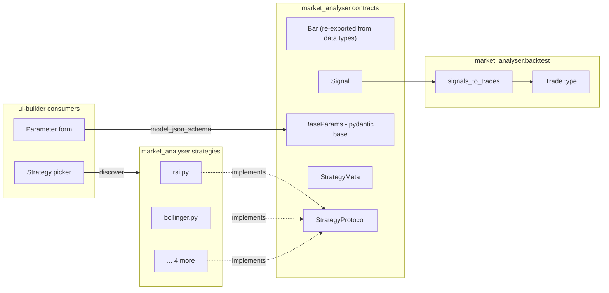

# 0002 — Strategy interface and contracts module

> **Status:** in-progress
> **Created:** 2026-05-17
> **Approved:** 2026-05-19
> **Owner skill(s):** `dev` (phases 1, 2, 5), `backtester` (phase 3), `strategy-author` (phase 4)
> **Related ADRs:** [ADR-0004](../adrs/0004-strategy-interface.md), [ADR-0007](../adrs/0007-market-data-provider.md), [ADR-0009](../adrs/0009-rewrite-data-layer-in-house.md)
> **Depends on:** [Plan 0001](0001-bootstrap.md) phase 2 — `src/market_analyser/data/types.py` (the canonical `Bar` model). Satisfied: Plan 0001 closed 2026-05-18, file exists at `src/market_analyser/data/types.py`.
>
> **Reframe note (2026-05-19, architect Mode 4):** Phase 3 originally bundled a thin backtest engine + four metric helpers + a `BacktestResult` schema with the `signals_to_trades` adapter, on the assumption that upstream metrics helpers could be reused. [ADR-0009](../adrs/0009-rewrite-data-layer-in-house.md) removed that assumption. Phase 3 has been narrowed to **adapter + `Trade` type + golden test on the trade list only**; the engine, metrics, and `BacktestResult` schema move to a dedicated follow-up plan (see "Followups"). This keeps Plan 0002 single-purpose — the strategy contract — and avoids smuggling unresolved engine design into a contract plan.

## TL;DR

We lock the strategy interface as **a Python module that exports `META`, `Params` (a `pydantic.BaseModel`), and `generate_signals(bars, params) -> Sequence[Signal]`**. These three names are the entire public contract; everything else (positions, capital, costs, equity, metrics) lives in the backtest engine. Strategies are pure: same `bars + params` in, same signals out, no instance state, no I/O. The first user-visible behavior is `uv run market-analyser strategies list` printing the registered strategies with their parameter schemas — proving the contract is real before any engine work.

## Context & problem

ADR-0004 captured *which* shape we chose; this plan captures *how we build it* and *who owns which phase*.

Three skills need this nailed down before they can do useful work:

- `strategy-author` cannot write a strategy until it knows what to write. Without a contract we'd fall back on a `_run_rsi(candles, **_)`-style shape with no parameter metadata, no validation, and signal generation conflated with trade creation.
- `backtester` cannot consume strategies generically until they all answer to the same protocol. Without one, the engine has to hard-code which strategies it knows about (a `_STRATEGY_MAP` with one string key per strategy); a seventh strategy then requires editing core.
- `ui-builder` cannot render a parameter form for a strategy until parameters are introspectable. Today they are positional defaults in a Python function signature.

This plan delivers the contract module, the signals-to-trades adapter, the six reference strategies, and the CLI subcommand that proves it all works end-to-end.

## Decision

We implement ADR-0004 in five phases, smallest-valuable-thing first.

Phase 1 ships the contract module (`contracts/`) and a single trivial reference strategy (RSI) so that `strategy-author` has a concrete example to copy and `backtester` has a target to call. Phase 2 ships strategy discovery. Phase 3 ships the `signals_to_trades` adapter and `Trade` type — the bridge a future engine will sit on top of. Phase 4 ships the remaining five reference strategies. Phase 5 ships the `strategies list` CLI subcommand.

We rejected option A (class-based) and option B (declarative DSL) in ADR-0004; see that document for the rationale.

## Architecture diagram



The contracts module is the only thing all four other modules import. Strategies do not import the adapter; the adapter does not import any concrete strategy. The UI reaches strategies through the contract, never directly. The engine, metrics, equity curve, and `BacktestResult` schema are deliberately absent from this diagram — they ship in the follow-up engine plan (see "Followups").

## Implementation phases

### Phase 1 — Contracts module + RSI reference strategy

- **Owner skill:** `dev`
- **What:** Ship `src/market_analyser/contracts/{__init__.py,strategy.py}` with `Signal`, `SignalKind`, `BaseParams`, `StrategyMeta`, and `StrategyProtocol`. `Bar` is **imported from `market_analyser.data.types`** (created by Plan 0001 phase 2) — it is not redefined here, and there is no `contracts/market_data.py`. Ship `src/market_analyser/strategies/rsi.py` as the reference implementation that `strategy-author` will copy for the others.
- **Files touched:**
  - `src/market_analyser/contracts/__init__.py` — re-exports `Signal`, `SignalKind`, `BaseParams`, `StrategyMeta`, `StrategyProtocol`, and `Bar` (re-exported from `market_analyser.data.types`) so consumers have one import root.
  - `src/market_analyser/contracts/strategy.py` (~80 lines: `Signal`, `SignalKind`, `BaseParams`, `StrategyMeta`, `StrategyProtocol`). The base class is named **`BaseParams`** — not `Params` — so strategy modules can declare `class Params(BaseParams):` without name-shadowing.
  - `src/market_analyser/strategies/__init__.py` (empty marker — created here, not in Plan 0001).
  - `src/market_analyser/strategies/rsi.py` (~50 lines).
  - `tests/contracts/test_strategy_contract.py`.
  - `tests/strategies/test_rsi.py` (one fixture, deterministic).
- **Done when:** `uv run pytest tests/strategies/test_rsi.py` passes, and `python -c "from market_analyser.strategies import rsi; print(rsi.Params.model_json_schema())"` prints a JSON schema.

### Phase 2 — Strategy discovery

- **Owner skill:** `dev`
- **What:** A `discover()` function in `contracts/strategy.py` that walks `src/market_analyser/strategies/` (using `importlib`) and returns `dict[str, StrategyModule]` keyed by `META.id`. Detect collisions on `META.id` and raise on duplicate. No decorator, no registry — drop-a-file authoring.
- **Files touched:**
  - `src/market_analyser/contracts/strategy.py` (+~30 lines for `discover` + collision check)
  - `tests/contracts/test_discover.py` (fixture: two stub strategies, one with duplicate id)
- **Done when:** `discover()` returns a dict with `rsi` present and a deterministic key order (sorted by id), and the duplicate-id test raises `DuplicateStrategyError`.

### Phase 3 — Signals-to-trades adapter

- **Owner skill:** `backtester`
- **What:** Ship `signals_to_trades(bars, signals) -> list[Trade]` and the `Trade` model. Bridges the `Signal` event stream to a trade list under realistic execution semantics: a `ENTER_LONG` at `bar_index = i` opens a trade at the OPEN of bar `i+1`; a subsequent `EXIT_LONG` closes it at the OPEN of its own `i+1`. This phase does **not** ship the engine, metrics, costs, or `BacktestResult` — those move to a follow-up plan (see "Followups" below). The value here is proving the contract end-to-end: a hand-rolled signal list must produce a hand-computed trade list, byte-for-byte.
- **Files touched:**
  - `src/market_analyser/backtest/__init__.py` (re-exports `Trade`, `signals_to_trades`).
  - `src/market_analyser/backtest/types.py` (~30 lines): `Trade` pydantic model with `entry_bar_index: int`, `exit_bar_index: int | None`, `entry_price: float`, `exit_price: float | None`, `kind: Literal["long"]` (short reserved for a future plan). Frozen, `extra="forbid"`.
  - `src/market_analyser/backtest/adapter.py` (~60 lines): pure function, no I/O, no module-level state. Execution simulated at the OPEN of `bar_index + 1` per `Signal` semantics — no lookahead.
  - `tests/backtest/test_adapter_unit.py`: hand-rolled `[Signal]` → expected `[Trade]`. Cases must cover: a clean entry→exit pair; an entry that never exits (dangling, `exit_bar_index = None`); an `EXIT_LONG` with no prior `ENTER_LONG` (ignored); back-to-back `ENTER_LONG` events with no intervening exit (second one ignored).
  - `tests/backtest/test_adapter_golden.py`: golden test running RSI on a deterministic 200-bar fixture (CSV under `tests/fixtures/`); compares the produced trade list byte-for-byte against `tests/fixtures/rsi_signals_to_trades.expected.json`.
- **Done when:** both adapter tests pass; the golden trade list matches the reference JSON byte-for-byte; no network in tests; `signals_to_trades` is referentially transparent (same inputs → same outputs, verified by running the golden test twice and diffing in-memory results).

### Phase 4 — Port the five remaining strategies

- **Owner skill:** `strategy-author`
- **What:** Implement `bollinger`, `macd`, `ema_cross`, `supertrend`, `donchian` under the new contract — one module each under `strategies/`. Each one gets a `Params` model with field-level constraints (e.g., `period: int = Field(14, ge=2, le=200)`) and a unit test that compares signals against a hand-computed reference on the same fixture bars.
- **Files touched:**
  - `src/market_analyser/strategies/{bollinger,macd,ema_cross,supertrend,donchian}.py`
  - `tests/strategies/test_<each>.py`
- **Done when:** for each of the five strategies, the new strategy produces a trade list (after `signals_to_trades`) that matches the hand-computed reference trade list on the fixture bars, byte-for-byte.

### Phase 5 — CLI subcommand `strategies list`

- **Owner skill:** `dev`
- **What:** A first user-visible smoke test. `uv run market-analyser strategies list` calls `discover()`, prints `id`, `name`, `version`, `timeframes`, and the JSON schema of `Params`. Proves the whole contract is real. CLI scaffolding is plumbing — not strategy or backtest logic — so it lives with `dev` by default. If a future plan extends the CLI to run backtests, that phase can route to `backtester`; this one is pure orchestration around `discover()`.
- **Files touched:**
  - `src/market_analyser/cli.py` (skeleton — first command this project has)
  - `pyproject.toml` (entry point)
- **Done when:** running the command prints six rows with their parameter schemas, and the output is identical across runs.

## Data shapes

These are the canonical contract definitions. They are **illustrative** in this plan — the authoritative version lives in `src/market_analyser/contracts/strategy.py` after phase 1. The `Bar` model is owned by `src/market_analyser/data/types.py` (Plan 0001 phase 2) and re-exported from `market_analyser.contracts` for ergonomic imports.

```python
# contracts/strategy.py
from enum import Enum
from typing import Protocol, Sequence, runtime_checkable
from pydantic import BaseModel

from market_analyser.data.types import Bar  # canonical Bar lives here


class SignalKind(str, Enum):
    ENTER_LONG = "enter_long"
    EXIT_LONG  = "exit_long"
    # ENTER_SHORT / EXIT_SHORT reserved; not implemented in phase 1.


class Signal(BaseModel):
    """A strategy decision emitted at a specific bar.

    `bar_index` is the *closing bar's* index in the input series.
    The backtest engine simulates execution at the OPEN of bar_index + 1 to
    avoid lookahead (see best-practices.md). Strategies must not produce
    signals that depend on data beyond `bar_index`.
    """
    bar_index: int
    kind: SignalKind
    reason: str | None = None  # free-text, for trade logs / UI; not load-bearing
    model_config = {"frozen": True}


class StrategyMeta(BaseModel):
    id: str          # stable, snake_case, unique. Used as the discovery key.
    name: str        # human-readable
    description: str
    version: str     # semver; bump on parameter-shape changes
    timeframes: tuple[str, ...]  # e.g. ("1h", "1d")
    model_config = {"frozen": True}


class BaseParams(BaseModel):
    """Base class strategies subclass. No fields here — children add them.

    Named `BaseParams` (not `Params`) so each strategy module can declare
    its own `class Params(BaseParams):` without name shadowing the import.
    """
    model_config = {"frozen": True, "extra": "forbid"}


# @runtime_checkable here exists for static-type-checker friendliness only.
# Strategies are *modules*, not classes, so isinstance(mod, StrategyProtocol)
# at runtime is unreliable for class-attribute protocols. discover() validates
# META / Params / generate_signals on each module via getattr + type checks
# rather than isinstance().
@runtime_checkable
class StrategyProtocol(Protocol):
    META: StrategyMeta
    Params: type[BaseParams]
    def generate_signals(
        self, bars: Sequence[Bar], params: BaseParams
    ) -> Sequence[Signal]: ...
```

```python
# strategies/rsi.py — the reference strategy
from collections.abc import Sequence

from pydantic import Field

from market_analyser.contracts import (
    BaseParams,
    Bar,
    Signal,
    SignalKind,
    StrategyMeta,
)

META = StrategyMeta(
    id="rsi",
    name="RSI Oversold/Overbought",
    description="Enter long when RSI dips below oversold; exit when above overbought.",
    version="1.0.0",
    timeframes=("1h", "1d"),
)


class Params(BaseParams):
    period: int       = Field(14, ge=2, le=200)
    oversold: float   = Field(40.0, ge=0, le=100)
    overbought: float = Field(60.0, ge=0, le=100)


def generate_signals(bars: Sequence[Bar], params: Params) -> Sequence[Signal]:
    # implementation is illustrative; real version computes RSI inline.
    ...
```

## Risks & open questions

- **Risk: the adapter (phase 3) hides bugs.** If `signals_to_trades` is wrong, the golden test in phase 3 will compare two wrong numbers and pass. Mitigation: in phase 3, also write a unit test for the adapter alone (signals → trade dicts) using hand-rolled signal lists, not strategy output.
- **Resolved: `Params` subclassing fragility.** Earlier drafts of this plan shadowed the base class name (`class Params(Params)`). Resolved by naming the base **`BaseParams`** in `contracts/strategy.py` and having each strategy declare `class Params(BaseParams):`. No name collision, no `noqa: F811` needed.
- **Risk: strategies that need precomputed indicators.** The contract says `generate_signals(bars, params)` — no indicators are passed in. For the six initial strategies this is fine (they each compute their own RSI/BB/etc.) but reuses computation. If profiling shows indicator recomputation dominates, we add a separate `IndicatorsCache` that the engine populates and passes alongside `bars` — non-breaking addition. Out of scope for this plan.
- **Open question: do we version strategies separately from `version` in META?** A strategy whose `Params` shape changes is incompatible with old persisted backtest results. We don't have a backtest result schema yet (open ADR #4). Defer; the `version` field is there waiting.
- **Open question: how does discovery handle a syntax error in `strategies/foo.py`?** Right now `discover()` will raise. Probably correct — a broken strategy file should fail loudly at startup, not be silently skipped. Confirm in phase 2 review.

## What this plan does NOT do

- **It does not build a backtest engine.** Phase 3 ships only `signals_to_trades` and the `Trade` type. The engine (`run(strategy, bars, params, **costs)`), the four metric helpers (`_apply_costs`, `_calc_metrics`, `_build_equity_curve`, `_buy_and_hold_return`), costs, and equity-curve construction are a dedicated follow-up plan.
- **It does not define a `BacktestResult` schema.** That moves to the follow-up engine plan, paired with its own ADR (the open `BacktestResult` ADR in `references/project-context.md`'s backlog).
- **It does not decide indicator architecture.** Each ported strategy computes its own indicators inline for now. If reuse is needed, it'll be its own plan.
- **It does not include short selling.** `SignalKind` reserves `ENTER_SHORT`/`EXIT_SHORT` but the phase-1 contract only ships `ENTER_LONG`/`EXIT_LONG`. Short selling is out of scope and tracked as a followup.
- **It does not address strategy persistence.** Strategies live as Python modules on disk; we are not yet storing them in SQLite or letting the UI edit them in-place.

## Assumptions made (not interviewed)

The user said "skip the questions, just draft", so the following are guesses; corrections welcome:

1. **`pydantic` v2 is acceptable as a hard dependency** for the backend. (Mentioned as "likely" in project-context; treating as "yes".)
2. **Long-only is acceptable for v1.** The contract reserves short signals (`ENTER_SHORT` / `EXIT_SHORT` in `SignalKind`) but the v1 engine only honours long entries / exits.
3. **No exotic order types in v1** (no stop-loss, no take-profit, no pyramiding). Add as separate signal kinds later, non-breaking.
4. **Strategies are discovered from a single directory** (`src/market_analyser/strategies/`). No user-strategies-folder support yet (we can add a second discovery root later without changing the contract).
5. **The data layer hands strategies `list[Bar]`, not pandas DataFrames.** Keeps the contract pure-Python and the dependency footprint small. We can build a pandas adapter on top if/when the UI needs frame-shaped views.
6. **No async strategies.** `generate_signals` is sync. If a strategy ever needs to fetch external data mid-bar (it shouldn't — that's lookahead), it can be revisited.

If any of these are wrong, correct in this section and re-derive affected phases.

## Followups (after this lands)

- Write the backtest engine plan. It starts thin (`BacktestResult` schema paired with its own ADR, the four metric helpers `_apply_costs` / `_calc_metrics` / `_build_equity_curve` / `_buy_and_hold_return`, and the orchestrator `run(strategy, bars, params, **costs) -> BacktestResult`) and grows over its own phases to shorting, stops, walk-forward, and parameter sweeps. This is the natural sequel to Plan 0002 and gates `ui-builder`'s results view.
- Write `templates/strategy_stub.py` under the `strategy-author` skill so it has a canonical starting file.
- Refresh `diagrams/strategy-execution-sequence.md` (and add a new `diagrams/system-overview.md`) once the engine plan lands.
