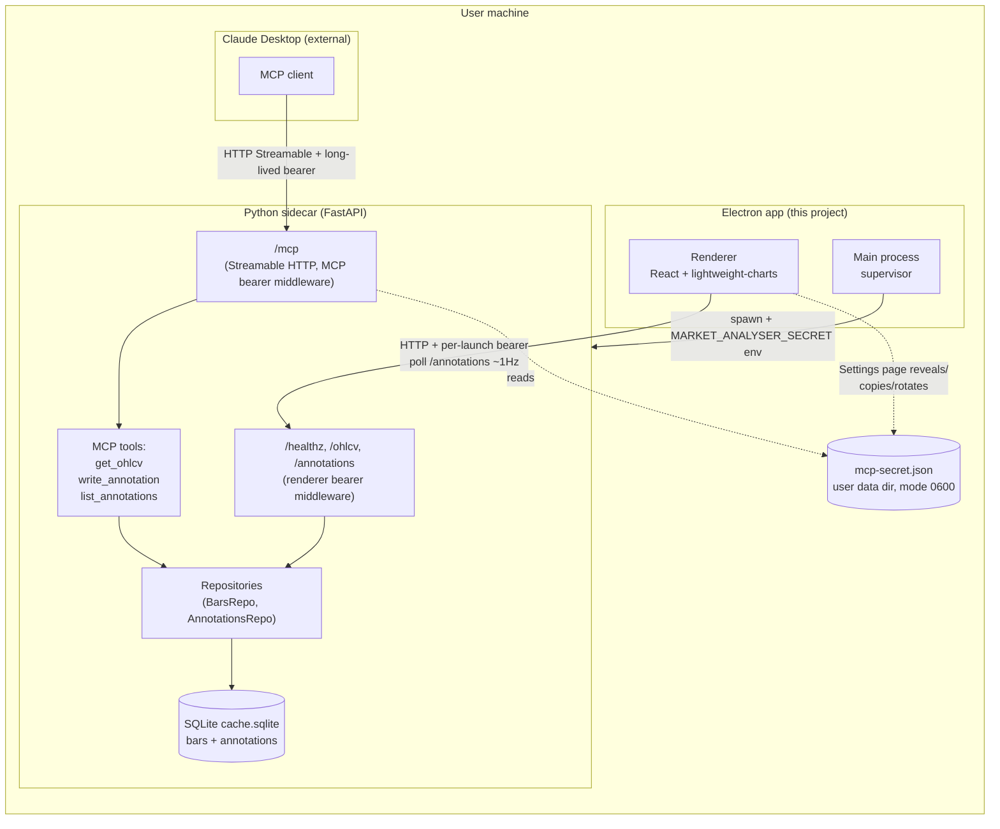

# 0006 — Annotations via MCP: thin layer + chart markers

> **Status:** approved
> **Created:** 2026-05-19
> **Approved:** 2026-05-19
> **Owner skill(s):** `dev`, `ui-builder`
> **Related ADRs:** [ADR-0014](../adrs/0014-mcp-as-second-sidecar-protocol.md) (MCP as second sidecar protocol), [ADR-0002](../adrs/0002-ipc-local-http.md) (renderer transport), [ADR-0006](../adrs/0006-persistence-layout.md) (SQLite for app data), [ADR-0011](../adrs/0011-bearer-secret-transport.md) (per-launch bearer transport)

## TL;DR

Mount an MCP server (Streamable HTTP, MCP spec rev 2025-03-26) on the existing FastAPI sidecar at `/mcp`, sharing the renderer's port but using its own long-lived secret persisted to `mcp-secret.json` in the user data dir. The MCP server exposes three tools at MVP: `get_ohlcv`, `write_annotation`, and `list_annotations`. A new `annotations` table (Alembic-migrated) stores agent-written markers keyed by `(symbol, timeframe, event_ts)`. The renderer polls `/annotations` every ~1 s for the active chart and renders markers as bullish/bearish arrows on the candle series. A new Settings page surfaces the MCP secret with copy-to-clipboard and rotate buttons. Walking-skeleton path end-to-end: Claude Desktop calls `write_annotation`, the marker appears on the user's open AAPL chart within a poll interval.

## Context & problem

The current architecture (per ADRs 0002, 0007, 0008) makes the sidecar invisible to anything except the in-process renderer. We agreed in the conversation that opened this plan to expose the sidecar to external MCP clients so that an agent (initially Claude Desktop) can query the cached data and write back analyst artifacts the user sees in the app. The interview locked the MVP scope to **annotations only** — the "C" tier of the C → B → A ordering — with strategy result rows (B) and strategy code generation (A) deferred to future plans.

The MCP transport-and-auth decision lives in [ADR-0014](../adrs/0014-mcp-as-second-sidecar-protocol.md); this plan is the execution. The visualization piece settled on signal markers as the chart surface for this plan; the indicator overlay piece is a separate parallel plan ("indicators module + chart overlay", not yet drafted) and is **out of scope** here.

The plan's success criterion is the visible loop: an agent connected via MCP calls `write_annotation(symbol="AAPL", timeframe="1d", event_ts="2026-05-15T00:00:00Z", kind="bullish_marker", label="hammer at support")`, the annotation lands in SQLite, the renderer (polling `/annotations` for the active chart's window) picks it up within the next poll tick, and the user sees an upward-pointing marker rendered on the 2026-05-15 candle with the label visible on hover. Anything beyond that loop is out of MVP scope.

## Decision

Adopt **Option 1** from the interview ("thin MCP + annotations table + poll-based refresh") with the scope above. Phases interleave `dev` (sidecar + DB + MCP transport) and `ui-builder` (Settings page + chart markers) ownership and hand off cleanly at owner boundaries per the [cross-skill handoff protocol](../../../.claude/skills/architect/references/templates/cross-skill-handoff.md). The first phase is the walking skeleton (MCP route + a single tool returning a literal) so that phase-1 failures surface the integration risks before the DB or UI work.

We rejected Option 2 (structured kinds + SSE push) because SSE adds an IPC mode the codebase doesn't have yet and the schema bets it makes are bets Plan B (strategy results) is better placed to validate. We rejected Option 3 (two smaller plans, MCP foundation first then annotations) because the visible end-to-end loop is the whole point; deferring it to Plan N+1 turns Plan N into pure plumbing and loses the walking-skeleton property.

## Architecture diagram



The MCP route and the renderer routes are co-tenants on the same port, with two independent bearer middlewares. The `mcp-secret.json` file is the only persisted secret in the app's data directory; rotation rewrites it atomically.

## Implementation phases

Each phase is one commit. Owner tags hand off between `dev` and `ui-builder`.

### Phase 1 — MCP walking skeleton: mount the route, one literal-returning tool

- **Owner skill:** `dev`
- **What:** Add the `mcp` Python package as a dependency (verify the version supports Streamable HTTP transport). Mount the MCP server as an ASGI sub-application at `/mcp` on the existing FastAPI app. Register one MCP tool `ping(message: str) -> str` that simply echoes the input — no DB, no business logic. Generate a `mcp-secret.json` file in the user data dir on first sidecar boot if one doesn't exist (32 hex bytes, mode `0600` on POSIX). Add a bearer middleware that gates `/mcp/*` on the contents of that file, using constant-time comparison per ADR-0011's discipline. The renderer's existing bearer middleware is unchanged and still gates `/healthz`, `/ohlcv`, etc.; the two middlewares dispatch by route prefix.
- **Files touched:** `pyproject.toml` (add `mcp` dep, respecting the dependency-cooldown policy from [Plan 0005](0005-dependency-cooldown.md) and ADR-0012 once that lands — if 0005 is still draft when this phase ships, `dev` raises with the user and either waits or proceeds with the cutoff bumped); new `src/market_analyser/api/mcp_app.py` (the MCP server definition and tool registration); new `src/market_analyser/api/mcp_secret.py` (load-or-generate, file-mode discipline); `src/market_analyser/api/app.py` (mount `/mcp`, wire the new middleware); new `tests/api/test_mcp_walking_skeleton.py`.
- **Done when:**
  - A test starts the FastAPI app with a temp user data dir, reads the generated `mcp-secret.json`, calls the `/mcp` endpoint with that bearer using an MCP Streamable HTTP client (from the `mcp` SDK), invokes `ping(message="hi")`, and asserts the response is `"hi"`.
  - A test confirms that `/mcp` with no bearer or a wrong bearer returns 401 (and that the response body does not leak the expected secret value).
  - A test confirms `mcp-secret.json` is created with mode `0600` on POSIX (skip on Windows where mode bits don't map cleanly).
  - A test confirms the renderer's existing bearer (`MARKET_ANALYSER_SECRET`) does NOT authenticate against `/mcp`, and the MCP bearer does NOT authenticate against `/ohlcv` — cross-tenant escalation is blocked.

### Phase 2 — Annotations table + repository

- **Owner skill:** `dev`
- **What:** Add a new SQLite table `annotations` via an Alembic migration. Columns: `id` (uuid4 text PK), `symbol` (text), `timeframe` (text), `event_ts` (utc datetime, ms precision), `kind` (text — initially the literal set `{"bullish_marker", "bearish_marker"}`, enum enforced in Pydantic not in SQL so future kinds don't need a migration), `label` (text, nullable), `agent_id` (text — opaque string the MCP client supplies, defaulted to `"unknown"` if absent), `created_at` (utc datetime). Composite index on `(symbol, timeframe, event_ts)` for the chart's per-symbol query. Add `AnnotationsRepository` under `src/market_analyser/persistence/` with `insert(annotation: Annotation) -> None` and `list_for(symbol, timeframe, start, end) -> list[Annotation]`. Pydantic model `Annotation` lives in `src/market_analyser/data/types.py` (or a new `annotations/types.py` — `dev` picks at phase start).
- **Files touched:** new `src/market_analyser/persistence/migrations/versions/<rev>_add_annotations.py`; new `src/market_analyser/persistence/annotations_repository.py`; `src/market_analyser/data/types.py` (or new module); new `tests/persistence/test_annotations_repository.py`.
- **Done when:**
  - The migration applies cleanly on a fresh DB and on a DB that already has the `bars` table (no foreign-key conflicts, no destructive ALTERs).
  - `AnnotationsRepository.insert` then `list_for` round-trips an annotation with all fields intact, including `event_ts` UTC precision and `agent_id`.
  - `list_for` filters by `(symbol, timeframe)` and the `event_ts` window correctly: an annotation outside the window is excluded; an annotation on the window boundary is included.
  - Insert with `kind="invalid_kind"` raises a Pydantic `ValidationError` (boundary validation per CLAUDE.md non-negotiables).
  - Determinism check: two inserts with identical `(symbol, timeframe, event_ts, kind, agent_id)` are allowed and distinct (different `id`); the schema does not silently dedupe.

### Phase 3 — Renderer HTTP endpoint for annotations (read path)

- **Owner skill:** `dev`
- **What:** Add `GET /annotations?symbol=&timeframe=&start=&end=` to the renderer-bearer-gated route set, returning a JSON list of `Annotation` rows in the window. Validation matches `/ohlcv`'s shape (UTC datetimes, start < end, supported timeframe set from [ADR-0007](../adrs/0007-market-data-provider.md)). The endpoint reads through `AnnotationsRepository.list_for` directly — no provider-layer abstraction yet, because annotations are app-private state, not a data-source like Yahoo. Reasoning lives in a one-line code comment at the route handler.
- **Files touched:** `src/market_analyser/api/routes/` (new `annotations.py`); `src/market_analyser/api/app.py` (register route); new `tests/api/test_annotations_route.py`.
- **Done when:**
  - A test inserts an annotation via the repository, calls `GET /annotations` with the renderer bearer over the matching window, and asserts the response contains exactly that annotation with all fields.
  - A test confirms the route returns 401 without the renderer bearer.
  - A test confirms the route returns 401 with **the MCP bearer** (cross-tenant escalation blocked at the read path too).
  - A test confirms the route returns 422 for inverted `start > end` and for an unsupported timeframe.

### Phase 4 — MCP tools: get_ohlcv, write_annotation, list_annotations

- **Owner skill:** `dev`
- **What:** Replace the `ping` stub from phase 1 with the three production tools.
  - `get_ohlcv(symbol, timeframe, start, end) -> list[Bar]` — reads through the existing `MarketDataProvider` exactly as the renderer's `/ohlcv` does. Same `as_of` discipline (per [ADR-0007](../adrs/0007-market-data-provider.md)): MCP callers do not supply `as_of` — it is fixed to `None` (live mode). When/if a backtest-aware tool variant is needed, it ships as a separate tool, not as an `as_of` parameter exposed to agents (preserves anti-lookahead at the MCP boundary).
  - `write_annotation(symbol, timeframe, event_ts, kind, label, agent_id) -> Annotation` — inserts via `AnnotationsRepository.insert`, returns the persisted row (including its `id` and `created_at`).
  - `list_annotations(symbol, timeframe, start, end) -> list[Annotation]` — reads via `AnnotationsRepository.list_for`. The MCP equivalent of the `/annotations` HTTP route so the agent can read its own (or other agents') prior annotations.
- **Files touched:** `src/market_analyser/api/mcp_app.py` (remove `ping`, add three tools); new `tests/api/test_mcp_tools.py`.
- **Done when:**
  - An MCP client connected with the MCP bearer can call `get_ohlcv("AAPL", "1d", <2024 window>)` against a DB pre-seeded with cached bars and receive at least one valid `Bar`.
  - `write_annotation` inserts a row visible to subsequent `list_annotations` and to the renderer's `GET /annotations`.
  - `write_annotation` with `kind="bogus"` returns an MCP-level error (Pydantic validation surface) rather than silently dropping or inserting garbage.
  - `list_annotations` filters by the same window semantics as the HTTP route (boundary inclusive on both ends; out-of-window excluded).
  - The `ping` tool from phase 1 is no longer registered.

### Phase 5 — Settings page: reveal, copy, rotate MCP secret

- **Owner skill:** `ui-builder`
- **What:** Add a new route in the renderer at `/settings` (or a settings panel — `ui-builder` picks the affordance) with one section titled "MCP access". Show the MCP endpoint URL (`http://127.0.0.1:<port>/mcp` — port from the sidecar's `PORT=<n>` startup line that main already parses). The secret is hidden by default behind a "Reveal" button; revealing surfaces it as plaintext with a "Copy" button. A "Rotate" button calls a new sidecar endpoint `POST /settings/mcp-secret/rotate` (renderer-bearer-gated), which generates a new secret, writes it atomically to `mcp-secret.json` (write-to-temp + `os.replace`), and returns the new value. Rotation invalidates active MCP sessions on the next request — the agent receives 401 and the user re-pastes. The page also shows a short, non-interactive snippet ready to paste into Claude Desktop's `claude_desktop_config.json` with the URL + bearer filled in.
- **Files touched:** new sidecar route in `src/market_analyser/api/routes/settings.py` + register in `app.py`; new `src/market_analyser/api/mcp_secret.py` rotation helper; new `desktop/renderer/views/SettingsView.tsx`; routing change in `desktop/renderer/App.tsx` (or the renderer's current top-level routing structure); new IPC schema entries in `desktop/shared/` if rotation is brokered through main (likely not — same as `/ohlcv`, the Settings view uses the typed fetch client directly); new `desktop/tests/SettingsView.spec.tsx` (Jest) and `desktop/tests/e2e/settings.spec.ts` (Playwright).
- **Done when:**
  - Manual smoke: opening the app shows a "Settings" affordance; clicking it shows the MCP endpoint and a hidden secret; clicking Reveal shows the plaintext; clicking Copy puts it on the clipboard; clicking Rotate displays a new secret and the previous one is no longer in the file.
  - Jest spec asserts that the secret is not in the DOM until "Reveal" is clicked (no leak through screen readers / a11y tree on initial render).
  - Playwright spec asserts the full reveal → copy → rotate → 401-on-old-bearer loop end-to-end. The spec's `expect(...)` lines defend each behavioral claim verbatim — per the `feedback_tests_are_acceptance_criteria` memory, stub bodies that "just check the panel opens" do not satisfy this done-when.
  - Sidecar test for `POST /settings/mcp-secret/rotate`: returns 200 with the new secret, the file on disk now contains the new secret, the file mode is still `0600` after rotation on POSIX, and a request to `/mcp` using the old secret returns 401.
  - Sidecar test for the rotate route under the MCP bearer: returns 401 (rotation is a renderer-only privileged operation; agents cannot rotate their own credential).

### Phase 6 — Chart marker rendering + poll loop

- **Owner skill:** `ui-builder`
- **What:** In the existing OHLCV view, add a polling loop that calls `GET /annotations?symbol=<active>&timeframe=<active>&start=<chart-window-start>&end=<chart-window-end>` every 1000 ms while the view is mounted (cleared on unmount). Convert the response into `lightweight-charts` markers on the candle series — `position: "belowBar"` and `shape: "arrowUp"` for `bullish_marker`, `position: "aboveBar"` and `shape: "arrowDown"` for `bearish_marker`. The marker's `text` field carries the annotation's `label` (truncated to ~24 chars to avoid runaway tooltips); the full label appears on hover via the chart's tooltip. Polling is suspended while the tab is hidden (`document.visibilityState !== "visible"`) to avoid burning CPU offscreen. The poll uses the existing typed fetch client (`desktop/renderer/api/client.ts`) so the renderer bearer is injected once.
- **Files touched:** `desktop/renderer/views/OhlcvView.tsx` (or wherever the chart currently lives); `desktop/renderer/api/client.ts` (add a typed `getAnnotations` method); new `desktop/renderer/hooks/useAnnotationsPoll.ts` (encapsulate the interval + visibility logic); new `desktop/tests/useAnnotationsPoll.spec.tsx` (Jest); extend `desktop/tests/e2e/ohlcv-view.spec.ts` with an annotation-rendering scenario.
- **Done when:**
  - Manual smoke: with the AAPL 1d chart open, calling `write_annotation` via MCP for an in-window date causes an arrow to appear on that candle within ~1 s; hovering the arrow shows the full label.
  - Jest spec asserts the poll hook fires on a fake-timer tick, calls the typed client with the correct args (active symbol + timeframe + window), suspends when `document.visibilityState` is "hidden", and clears the interval on unmount.
  - Playwright spec asserts the end-to-end MCP-write → chart-marker-visible loop. The spec inserts an annotation via the repository (using a test fixture, not by actually starting Claude Desktop) and asserts the marker appears on the rendered candle within the poll window.
  - Polling does not block the UI thread or flash a loading spinner — the candle chart is the source of truth for what's visible; annotations layer on top without rerendering the chart.

## Data shapes

```python
# illustrative — final shape decided in phase 2

class AnnotationKind(StrEnum):
    BULLISH_MARKER = "bullish_marker"
    BEARISH_MARKER = "bearish_marker"

class Annotation(BaseModel):
    id: str                  # uuid4 hex
    symbol: str              # uppercase, validated
    timeframe: str           # one of ADR-0007's supported set ("1d", "1h", ...)
    event_ts: datetime       # UTC, tz-aware, ms precision
    kind: AnnotationKind
    label: str | None        # nullable; tooltips degrade gracefully
    agent_id: str            # opaque client-supplied; defaults to "unknown"
    created_at: datetime     # UTC, set by the repository on insert
```

```json
// mcp-secret.json (user data dir, mode 0600)
{
  "secret": "<64 hex chars>",
  "created_at": "2026-05-19T12:34:56Z"
}
```

JSON envelope (rather than a bare string) so future fields (`last_rotated_at`, `scopes`) can land without a file-format migration.

## Risks & open questions

- **Risk: `mcp-secret.json` ends up in a packaged installer.** `pnpm package:*` bundles `src/market_analyser/` as `extraResources`; the file lives in the user data dir, not the source tree, so this should not happen — but `dev` adds a grep-style CI guard that fails if any file matching `mcp-secret*.json` appears anywhere under `src/`, `desktop/`, or `tests/`. The grep is cheap and the failure mode (a packaged installer shipping with a real secret) is catastrophic.
- **Risk: cross-tenant bearer confusion at the middleware seam.** Two middlewares, two secrets, one FastAPI app — the easy mistake is a route that's gated by neither, or a route that accepts either. Mitigation: phase 1, 3, and 5 done-when conditions all include cross-tenant assertions ("MCP bearer must not authenticate to renderer routes and vice versa"). A central `bearer_for(route_prefix)` helper plus per-route tests is the minimum, not maximum, defence.
- **Risk: poll-based UI is wasteful at scale.** 1 Hz on the active chart is fine for one user with one symbol open; if the UI later supports multiple charts or watchlist scans, the poll cadence is wrong. We accept this as MVP — when Plan B (strategy result rows) lands the poll becomes lossy and a follow-up plan introduces SSE or a long-poll channel. The current code structure (a single `useAnnotationsPoll` hook) is the seam where that change lands.
- **Risk: agent writes an annotation for an unsupported timeframe or invalid symbol.** `write_annotation` does Pydantic validation; an invalid call surfaces as an MCP error to the agent. The renderer never sees garbage. The risk that remains is "agent writes for a symbol the user has never charted" — those annotations sit in the DB invisible; the user only ever sees annotations for the symbol they're currently viewing. That is by design, not a bug.
- **Risk: rotation race.** If the user rotates the secret while an MCP write is in flight, the write either completes (started under the old secret) or 401s (started after rotation). We accept the user-visible behaviour ("Rotate" warns "any active MCP sessions will need to reconnect"); the DB write itself is not partially-applied because the repository's insert is a single SQLite transaction.
- **Risk: `mcp` Python SDK version churn.** The MCP spec is moving (rev 2025-03-26 is current as of plan write; earlier revisions used HTTP+SSE). If the SDK lands a breaking change before this plan ships, phase 1's transport choice may need revisiting. Mitigation: pin the SDK version exactly per Plan 0005's pinning policy (ADR-0013), and the phase 1 commit message includes the SDK version and the spec rev so future maintainers can grep for the upgrade event.
- **Open question: does the MCP server advertise tool descriptions in a way Claude Desktop's UI surfaces well?** MCP tools carry descriptions for the client to render; `dev` writes them in phase 4 with care, but the only way to confirm they read well is to actually paste the config into Claude Desktop and inspect. This is a manual smoke step in phase 4's done-when.
- **Open question: should `write_annotation` support batch writes?** The agent might want to write five markers in one call. We pick singular for MVP because the call is cheap (single SQLite insert) and a batch tool is easy to add without breaking the singular one. Flag for revisit if the agent's workflows surface a need.

## What this plan does NOT do

- **Strategy result rows (Plan B in the C → B → A ordering).** No backtest results, no trades table, no metrics persisted via MCP. That's a separate plan that ships after the backtest engine lands.
- **Strategy code generation (Plan A).** No agent-written Python files. No code execution sandbox. Deferred indefinitely — will require its own ADR(s) on security model and module-loading discipline.
- **Indicator overlay (RSI, MACD, EMA panel).** The interview confirmed indicators are app-computed and a separate parallel plan ("indicators module + chart overlay" — not yet drafted, eligible for queue after this plan).
- **SSE / WebSocket push for annotations.** Polling at 1 Hz is the MVP refresh mechanism. Real-time push is a follow-up if and when Plan B's higher-frequency write patterns make polling lossy.
- **Standalone sidecar mode (sidecar runs without the Electron app).** [ADR-0014](../adrs/0014-mcp-as-second-sidecar-protocol.md) explicitly defers this; the MCP server is reachable only while the app is running.
- **Per-tool authorization scopes inside the MCP secret** (e.g. "this token can call `list_annotations` but not `write_annotation`"). Today the secret is all-or-nothing. A future ADR may introduce scopes if multi-agent or untrusted-agent workflows surface.
- **Annotation editing or deletion via either MCP or the renderer.** MVP is write-once. If the agent wrote a wrong annotation, the user sees it until a delete UX is added (future plan). We accept this as part of the smallest-defensible-MVP discipline.
- **Cross-symbol annotation views.** Annotations are visible only on the chart for the symbol they reference. No "all annotations" inbox, no notifications.
- **Auto-update for the desktop app** — already deferred to a future packaging plan; not in this plan's scope.

## Followups (after this lands)

- *(empty at draft time; fill in during the close ceremony if any surface.)*
