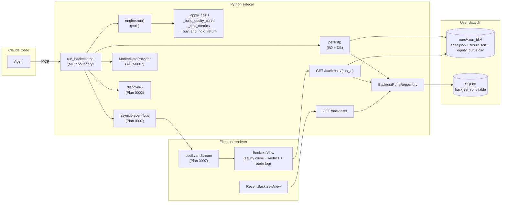

# 0008 — Backtest engine v1: pure core, MCP tool, and live results view

> **Status:** approved
> **Created:** 2026-05-20
> **Approved:** 2026-05-20
> **Owner skill(s):** `backtester` (phases 1, 2), `dev` (phases 3, 4), `ui-builder` (phase 5)
> **Related ADRs:** [ADR-0018](../adrs/0018-backtest-result-schema.md) (paired — defines `BacktestResult`), [ADR-0004](../adrs/0004-strategy-interface.md) (strategy contract — engine's input shape), [ADR-0006](../adrs/0006-persistence-layout.md) (SQLite + artifact discipline), [ADR-0007](../adrs/0007-market-data-provider.md) (bars input via `MarketDataProvider`), [ADR-0014](../adrs/0014-mcp-as-second-sidecar-protocol.md) (MCP tool transport), [ADR-0017](../adrs/0017-live-ui-updates-via-sse.md) (`run.completed v1` envelope — this plan ships its first producer)
> **Depends on:** [Plan 0002](0002-strategy-interface.md) phases 1–3 (contracts module + RSI reference strategy + `signals_to_trades` adapter + `Trade` type) — **must close before this plan's phase 1 starts.** [Plan 0007](0007-live-agent-driven-viewer.md) phases 1–4 (standalone sidecar + SSE event bus + `useEventStream` hook) — **must close before this plan's phase 4 starts.**

## TL;DR

Build the backtest engine the strategy contract has been waiting for. `run(strategy, bars, params, **costs) -> BacktestResult` is pure (no I/O); a thin `persist(result, runs_dir, session)` writes `runs/<run_id>/{spec.json,result.json,equity_curve.csv}` and indexes a SQLite `backtest_runs` row; a new `run_backtest` MCP tool composes them and emits `run.completed v1` on the SSE bus from [ADR-0017](../adrs/0017-live-ui-updates-via-sse.md); the renderer subscribes, fetches via `GET /backtests/{run_id}`, and shows an equity curve + metrics table + trade log. First user-visible behavior: open Claude Code, ask "backtest RSI on AAPL daily for the last year", see the result view appear in Electron with equity curve and Sharpe within seconds.

## Context & problem

[Plan 0002](0002-strategy-interface.md) shipped the strategy contract (`META`, `Params`, `generate_signals`), the `Trade` type, and the `signals_to_trades` adapter — but it deliberately did not ship the engine that turns trades into a result. The strategy modules sit on disk; the only way to exercise them is `uv run market-analyser strategies list`, which proves they parse, not that they run. [ADR-0004](../adrs/0004-strategy-interface.md)'s named-but-unbuilt half is the engine plus the `BacktestResult` schema.

[Plan 0007](0007-live-agent-driven-viewer.md) shipped the SSE event stream and reserved the `run.completed v1` envelope (`{kind, run_id, artifact_path}`) — but the envelope has no producer. The UI can subscribe and route on it, but nothing publishes one.

The roadmap's Tier 1 (analyst surface) names the engine explicitly as "the missing half of the strategy contract" and as the consumer that pairs with the `run.completed` wire. The architect's open-ADR backlog has carried "Backtest result schema" as the next required ADR since 2026-05-19 with the note "lands before the first backtester phase ships." This plan closes both threads in one cut.

Three skills need this plan to land:

- `backtester` cannot do its core job (compute metrics, equity curves, run backtests) without the engine — the skill descriptor today references functions that don't exist.
- `strategy-author` has shipped six strategies in Plan 0002 with no way to test them at full-backtest fidelity; the only feedback loop today is unit tests against hand-computed reference signals.
- `ui-builder` has the SSE plumbing from Plan 0007 but no payload to render — the equity curve view is the first non-`chart.*` consumer of the event bus.

## Decision

We pick **Option 1: Pure core + thin persistence layer** (from the Mode 1 interview): `run()` is pure (no I/O, no DB, no event bus); a separate `persist()` does disk + SQLite; the MCP tool composes them and publishes the envelope. The UI is a new view that subscribes to `run.completed v1`, fetches via a new `GET /backtests/{run_id}` endpoint, and renders.

We rejected Option 2 (engine-as-coordinator, single layer) because Plan 0002's followups already name parameter sweeps and walk-forward as future engine extensions — both want to call the pure core directly without disk side effects. Extracting `_run_pure()` later from a monolithic coordinator is wasted work; building the seam now costs one extra phase and is permanent.

Scope locked at Mode 1:

- **Costs:** flat bps only (`commission_bps`, `slippage_bps`); one slippage model.
- **Sizing:** fixed-fraction at 100% of equity; configurable initial capital (default $10,000); long-only single position.
- **No parameter sweeps in v1.** Single-run only; sweeps are a follow-up plan.
- **Full agent loop:** engine + MCP tool + UI view + SQLite-indexed runs.

## Architecture diagram



The seam between the pure engine and the persistence + transport layer is the `BacktestResult` object. The engine returns it; `persist()` consumes it; the MCP tool routes it; the UI re-hydrates it.

## Implementation phases

Each phase is one commit. Done-when conditions name the behavioral claim each test defends, not test file names — implementers pick paths consistent with the existing codebase. The [`feedback_tests_are_acceptance_criteria`](../../../.claude/skills/architect/references/templates/cross-skill-handoff.md) rule applies: every test body must defend the claim with a concrete `assert`/`expect`; stub specs and tautological assertions fail Mode 4 review.

### Phase 1 — `BacktestResult` schema + four pure metric helpers

- **Owner skill:** `backtester`
- **What:** Land the schema from [ADR-0018](../adrs/0018-backtest-result-schema.md) and the four pure metric helpers Plan 0002's followup named (`_apply_costs`, `_build_equity_curve`, `_calc_metrics`, `_buy_and_hold_return`). Each helper is a pure function: same inputs → byte-identical outputs, no I/O, no module-level state. The schema lives in `src/market_analyser/backtest/result.py`; the helpers in `src/market_analyser/backtest/metrics.py`. Also land the `engine_version` module constant in `src/market_analyser/backtest/__init__.py` with the documented bump discipline (bump on any output-affecting change to the four helpers or the orchestrator).
- **Files touched:**
  - New `src/market_analyser/backtest/result.py`: `EquityPoint`, `BacktestMetrics`, `BacktestResult` pydantic models per ADR-0018. All frozen, `extra="forbid"`.
  - New `src/market_analyser/backtest/metrics.py`: the four helpers, plus a `_TIMEFRAME_BARS_PER_YEAR` constant (`{"1d": 252, "1h": 252*24, "1m": 252*24*60}` — extend as needed; unknown timeframes raise).
  - New `src/market_analyser/backtest/_bars_hash.py`: canonical bar serialization + SHA256 per ADR-0018 Notes section.
  - `src/market_analyser/backtest/__init__.py`: add `ENGINE_VERSION = "0.1.0"` module constant with docstring describing bump discipline; re-export `BacktestResult`, `BacktestMetrics`, `EquityPoint`, `bars_hash`, the four helpers.
  - New `tests/backtest/test_result_schema.py`.
  - New `tests/backtest/test_metrics_apply_costs.py`.
  - New `tests/backtest/test_metrics_equity_curve.py`.
  - New `tests/backtest/test_metrics_calc_metrics.py`.
  - New `tests/backtest/test_metrics_buy_and_hold.py`.
  - New `tests/backtest/test_bars_hash.py`.
- **Done when:**
  - `BacktestResult(**valid_payload)` constructs successfully with all fields populated; constructing with an unknown field raises `ValidationError` (extra="forbid" defends the schema's append-only discipline).
  - `BacktestResult` round-trips: `BacktestResult(**original.model_dump(mode="json"))` equals `original` for a hand-built payload with non-trivial trades, equity curve, and metrics. (Defends Pydantic mode="json" / mode="python" symmetry.)
  - `_apply_costs(trades=[], costs={"commission_bps": 0, "slippage_bps": 0})` returns `[]`. Given one closed long trade with `entry_price=100.0`, `exit_price=110.0`, `commission_bps=10`, `slippage_bps=5`: adjusted `entry_price == 100.0 * (1 + 15/10_000) == 100.15` and adjusted `exit_price == 110.0 * (1 - 15/10_000) == 109.835`. Asserted to within 1e-9. A dangling trade (`exit_price=None`) has entry adjusted and exit untouched.
  - `_build_equity_curve(bars, trades=[], initial_capital=10_000)` returns a list of length `len(bars)` where every `EquityPoint.equity == 10_000.0` (flat == cash). Given one long trade entered on bar i and exited on bar j with `entry_price=100`, `exit_price=110`, `initial_capital=10_000`: bars `[0, i-1]` have `equity == 10_000`; bar `i` (entry executed at i+1's open, but equity tracked at close) — pin the convention in the test, then assert it; bar `j` shows `equity == 10_000 + (110 - 100) * (10_000 / 100) == 11_000`. Float comparison to 1e-9.
  - `_build_equity_curve` is deterministic: two calls on the same `(bars, trades, initial_capital)` produce equal lists element-by-element.
  - `_calc_metrics`: given a hand-built equity curve `[10000, 10500, 11000, 10500, 11000]` and trades=[one closed win], asserts `total_return == 0.10`, `trade_count == 1`, `win_rate == 1.0`, `max_drawdown < 0` (one drawdown peak-to-trough of 11000→10500 ≈ -0.045), and `max_drawdown_duration_bars == 1`. Sharpe asserted with a fixed annualization for `timeframe="1d"`.
  - `_calc_metrics` NaN-safe: zero trades → `win_rate == 0.0` (not NaN); flat equity curve (zero std) → `sharpe == 0.0` (not NaN). Asserted explicitly.
  - `_buy_and_hold_return(bars, initial_capital)` with bars whose first close=100, last close=110 returns `0.10` exactly. With bars whose first close=100 and last close=80 returns `-0.20`.
  - `bars_hash(bars)` returns the same string on two consecutive calls with the same bar list. `bars_hash([])` returns a stable string (the SHA256 of the empty UTF-8 buffer). Two different bar lists produce different hashes.
  - `ENGINE_VERSION` is a non-empty string matching `^\d+\.\d+\.\d+$` (semver shape); module docstring contains the literal phrase "bump on any output-affecting change".
  - `uv run pytest tests/backtest/` passes with no skips, no xfails.

### Phase 2 — `run()` orchestrator (pure)

- **Owner skill:** `backtester`
- **What:** Land `run(strategy_module, bars, params, *, commission_bps=0.0, slippage_bps=0.0, initial_capital=10_000.0) -> BacktestResult`. Pure function: no I/O, no DB, no event bus, no random state. Composes: validates strategy module shape (has `META`, `Params`, `generate_signals`) → constructs `params` via `strategy_module.Params(**raw_params)` if needed → calls `strategy_module.generate_signals(bars, params)` → calls `signals_to_trades(bars, signals)` (from Plan 0002) → calls `_apply_costs(trades, costs)` → calls `_build_equity_curve(bars, adjusted_trades, initial_capital)` → calls `_calc_metrics(adjusted_trades, equity_curve, initial_capital, timeframe)` → calls `_buy_and_hold_return(bars, initial_capital)` → assembles `BacktestResult` with `run_id = uuid4().hex`, `bars_hash = bars_hash(bars)`, `engine_version = ENGINE_VERSION`, `started_at` / `finished_at` set inside the function. The function takes `timeframe` separately because Sharpe annualization needs it and bars don't carry it on the type.
- **Files touched:**
  - New `src/market_analyser/backtest/engine.py`.
  - `src/market_analyser/backtest/__init__.py`: re-export `run`.
  - New `tests/backtest/test_engine_run.py`.
  - New `tests/backtest/test_engine_golden.py`.
  - New `tests/fixtures/backtest/aapl_1d_200bars.csv` (deterministic synthetic OR a freeze of cached Yahoo bars; bar generation method documented at the top of the file).
  - New `tests/fixtures/backtest/rsi_default_expected.json` (the golden `BacktestResult` minus `run_id`/`started_at`/`finished_at`).
- **Done when:**
  - Calling `run(rsi_module, bars=fixture_bars, params={"period": 14, "oversold": 30, "overbought": 70}, commission_bps=0, slippage_bps=0)` returns a `BacktestResult` whose `strategy_id == "rsi"`, `strategy_version == rsi_module.META.version`, `symbol == fixture_bars[0].symbol` (or however the fixture pins it), `bars_hash == bars_hash(fixture_bars)`, `engine_version == ENGINE_VERSION`, and `len(equity_curve) == len(fixture_bars)`.
  - **Golden test (the load-bearing one):** running the above twice in the same process produces two `BacktestResult` objects whose `.model_dump(mode="json", exclude={"run_id", "started_at", "finished_at"})` dicts are equal element-by-element. (Determinism.)
  - **Golden test, cross-process:** the dump above (minus run_id/timestamps) equals the contents of `tests/fixtures/backtest/rsi_default_expected.json` byte-for-byte. The fixture is committed; regenerating it requires bumping `ENGINE_VERSION`. (Re-runs on different machines produce identical results.)
  - `run()` with a strategy module missing `META` raises `TypeError` (or a named `StrategyContractError`) at boundary entry, with a message that names the missing attribute. Same for missing `Params` and missing `generate_signals`. Asserted explicitly.
  - `run()` with `params={"period": 1}` (violates RSI's `period >= 2` constraint from Plan 0002 phase 1) raises `pydantic.ValidationError` at the `strategy_module.Params(**params)` boundary — not silently after generating zero signals. (Defends boundary validation.)
  - `run()` with `bars=[]` raises a clear error before calling the strategy (e.g. `ValueError("bars must not be empty")`). Tested.
  - `run()` with `timeframe="5m"` (not in `_TIMEFRAME_BARS_PER_YEAR`) raises with a message naming the unknown timeframe. (Defends the "engine does not silently guess annualization" decision.)
  - `run()` performs no I/O: a test wraps it in a `monkeypatch` that fails any `open(...)`, `Path.write_text`, `Path.write_bytes`, or `httpx`/`requests` call and asserts `run()` completes successfully. (Defends purity directly.)
  - `uv run pytest tests/backtest/test_engine_run.py tests/backtest/test_engine_golden.py` passes with no skips, no xfails.

### Phase 3 — `persist()` + SQLite migration + `GET /backtests/*` endpoints

- **Owner skill:** `dev`
- **What:** Land the persistence layer for backtest runs. New Alembic migration adds the `backtest_runs` table (the searchable projection from ADR-0018). New `persist(result, runs_dir, session) -> Path` writes `spec.json` + `result.json` + `equity_curve.csv` under `runs/<run_id>/` and inserts the SQLite row in one transaction (rollback on either failure — no half-written runs). New `BacktestRunsRepository` provides `list(symbol=None, strategy_id=None, limit=50) -> list[BacktestRunRow]` and `get(run_id) -> BacktestRunRow | None`. Two new HTTP routes (both renderer-bearer-gated, neither MCP-bearer-accepting — the cross-tenant rule from ADR-0017 applies): `GET /backtests` returns a paginated summary list; `GET /backtests/{run_id}` reads `spec.json` + `result.json` + `equity_curve.csv` from disk, re-merges into a `BacktestResult` JSON, and returns it. The disk read is the source of truth; the SQLite row is the index only.
- **Files touched:**
  - New `src/market_analyser/persistence/migrations/versions/XXXX_create_backtest_runs.py` (Alembic).
  - New `src/market_analyser/persistence/models/backtest_runs.py` (SQLAlchemy ORM model).
  - New `src/market_analyser/persistence/repositories/backtest_runs.py` (`BacktestRunsRepository`).
  - New `src/market_analyser/backtest/persistence.py` (the `persist()` function and CSV/JSON writers).
  - New `src/market_analyser/api/routes/backtests.py` (the two GET routes).
  - `src/market_analyser/api/app.py`: register the new routes under the renderer-bearer middleware.
  - New `tests/backtest/test_persist.py`.
  - New `tests/api/test_backtests_routes.py`.
  - New `tests/persistence/test_backtest_runs_repo.py`.
- **Done when:**
  - **Migration is reversible:** `alembic upgrade head` followed by `alembic downgrade -1` followed by `alembic upgrade head` leaves the schema identical to the first upgrade. Tested via the existing migration harness.
  - **`persist()` round-trip:** `persist(result, tmpdir, session)` returns a `Path` ending in `<run_id>` that contains exactly three files: `spec.json`, `result.json`, `equity_curve.csv`. Reading them back via `GET /backtests/{run_id}` (or the equivalent disk reader) and re-constructing a `BacktestResult` yields an object whose `.model_dump()` equals `result.model_dump()` element-by-element.
  - **`spec.json` is the re-runnable record:** it contains exactly the spec fields (`strategy_id`, `strategy_version`, `symbol`, `timeframe`, `range_start`, `range_end`, `bars_hash`, `params`, `costs`, `initial_capital`, `sizing`) and nothing else. Specifically, it does NOT contain `run_id`, `started_at`, `finished_at`, `engine_version`, `trades`, `equity_curve`, or `metrics`. Asserted explicitly (`assert set(spec.keys()) == EXPECTED_SPEC_KEYS`).
  - **`equity_curve.csv` has exactly two columns** (`ts`, `equity`) and `len(bars) + 1` lines (header + one row per bar). The `ts` column round-trips to a UTC `datetime` and the `equity` column to a `float`.
  - **`persist()` is atomic:** if the SQLite insert raises (e.g. duplicate `run_id`), `persist()` rolls back and leaves no files under `runs/<run_id>/`. Tested by injecting a duplicate run_id row before calling persist().
  - **`BacktestRunsRepository.list()` filters work:** with three rows inserted (two AAPL/1d, one MSFT/1d), `repo.list(symbol="AAPL")` returns exactly two rows, ordered by `finished_at` desc. `repo.list(symbol="AAPL", strategy_id="rsi")` returns only the rsi/AAPL rows. `repo.list(limit=1)` returns exactly one row.
  - **`BacktestRunsRepository.get(run_id)` returns the row or None.** Unknown run_id returns None, not raises.
  - **`GET /backtests/{run_id}` with the renderer bearer returns 200** and a JSON payload whose `run_id == <requested>` and whose `equity_curve` is a list with one entry per bar (re-merged from the CSV).
  - **`GET /backtests/{run_id}` with the MCP bearer returns 401** (cross-tenant isolation; mirrors Plan 0007 phase 2's test).
  - **`GET /backtests/{run_id}` for an unknown run_id returns 404** with a non-empty error body.
  - **`GET /backtests` with the renderer bearer returns the summary list** sorted by `finished_at` desc, capped by `?limit=N` (default 50, max 200). Asserted with three seeded runs.
  - **The new routes do NOT leak any secret** in their access log (test inspects the captured log handler for occurrences of the renderer or MCP bearer values).
  - `uv run pytest tests/backtest/test_persist.py tests/api/test_backtests_routes.py tests/persistence/test_backtest_runs_repo.py` passes with no skips, no xfails.

### Phase 4 — `run_backtest` MCP tool + `run.completed v1` emission

- **Owner skill:** `dev` (handoff from `backtester` happens between phase 2 and 3; this phase chains cleanly off phase 3 inside the same `dev` block.)
- **What:** Add the agent-facing tool that composes engine + persistence + event bus. The tool's signature (validated at the MCP boundary via Pydantic): `run_backtest(strategy_id, symbol, timeframe, range_start, range_end, params, commission_bps=0.0, slippage_bps=0.0, initial_capital=10_000.0) -> {run_id, status, summary}`. The flow: validate inputs → resolve `strategy_module = discover()[strategy_id]` → fetch bars via the `MarketDataProvider` for `(symbol, timeframe, range_start, range_end)` → call `engine.run(strategy_module, bars, params, commission_bps=..., slippage_bps=..., initial_capital=...)` → call `persist(result, runs_dir, session)` → call `bus.publish(Envelope(type="run.completed", version=1, ts=..., payload={"kind": "backtest", "run_id": result.run_id, "artifact_path": f"<run_id>"}))` → return `{run_id, status: "complete", summary: {total_return, sharpe, max_drawdown, win_rate, trade_count}}`. The summary subset is small (~6 fields) so the agent's reply stays compact and an enterprising agent can decide whether to fetch the full result. This phase chains directly from phase 3 (no skill handoff) so both can ship in one `dev` session.
- **Files touched:**
  - `src/market_analyser/api/mcp_app.py`: register `run_backtest` next to the Plan 0006 / 0007 tools.
  - New `src/market_analyser/api/mcp_tools/run_backtest.py` (the tool function + its Pydantic input model).
  - New `tests/api/test_run_backtest_tool.py`.
- **Done when:**
  - **Happy path:** calling `run_backtest(strategy_id="rsi", symbol="AAPL", timeframe="1d", range_start=<a>, range_end=<b>, params={"period": 14, "oversold": 30, "overbought": 70})` via the MCP test fixture (the one Plan 0006 introduced and Plan 0007 phase 3 extended) returns `{"run_id": <hex>, "status": "complete", "summary": {"total_return": <float>, "sharpe": <float>, "max_drawdown": <float>, "win_rate": <float>, "trade_count": <int>}}`. The summary's `trade_count` equals `len(result.trades_filtered_to_closed)` (closed trades only; matches `BacktestMetrics.trade_count`).
  - **Bus side effect:** the same call publishes exactly one envelope on the bus with `type == "run.completed"`, `version == 1`, `payload == {"kind": "backtest", "run_id": <the returned run_id>, "artifact_path": <the returned run_id>}`. Tested via a bus subscriber registered in the test setup.
  - **Disk + SQLite side effects:** after the call, `runs/<run_id>/spec.json`, `runs/<run_id>/result.json`, and `runs/<run_id>/equity_curve.csv` all exist and are readable, and `BacktestRunsRepository.get(run_id)` returns a row matching the summary.
  - **Unknown strategy:** `run_backtest(strategy_id="not_a_strategy", ...)` raises an MCP-level error to the agent (not a 500), with a message naming the unknown id. Tested.
  - **Invalid params:** `run_backtest(strategy_id="rsi", params={"period": 1, ...})` (below RSI's `period >= 2` constraint) raises an MCP-level error at the strategy boundary, with the pydantic validation message surfaced.
  - **Unknown timeframe:** `run_backtest(strategy_id="rsi", timeframe="5m", ...)` is rejected at the MCP boundary (mirrors Plan 0007 phase 3's `SUPPORTED_TIMEFRAMES` check; this addresses the timeframe-validation followup carried from Plan 0006 for the run_backtest tool specifically).
  - **Determinism end-to-end:** two consecutive calls with identical inputs produce two `BacktestResult` records on disk whose `.model_dump(exclude={"run_id", "started_at", "finished_at"})` dicts are equal element-by-element. Tested by computing both dumps and asserting equality.
  - **No event published on failure:** when the tool raises (any of the above error cases), the bus subscriber sees zero envelopes for the failed call. Tested.
  - **Plan 0006 + 0007 regression check:** the pre-existing MCP tools (`get_ohlcv`, `write_annotation`, `list_annotations`, `show_chart`, `update_chart`, `highlight_pattern`) still pass their full suites. Verified by running their test files.
  - `uv run pytest tests/api/test_run_backtest_tool.py` passes with no skips, no xfails.

### Phase 5 — Backtest results view + Recent Backtests list

- **Owner skill:** `ui-builder`
- **What:** First non-`chart.*` consumer of the SSE event stream. New `BacktestView.tsx` subscribes to `run.completed v1` (via Plan 0007's `useEventStream`), filters for `payload.kind === "backtest"`, fetches `GET /backtests/{run_id}` via the typed fetch client (which injects the renderer bearer), and renders three panels: (1) **Metrics table** — total return, Sharpe, max drawdown, max DD duration, win rate, trade count, buy-and-hold return for comparison; (2) **Equity curve chart** — `lightweight-charts` area series with `initial_capital` as a horizontal baseline; (3) **Trade log table** — entry/exit ts, entry/exit prices, P&L $, P&L %. Header shows `<strategy_id> v<strategy_version> · <symbol> · <timeframe> · <range_start> → <range_end>` and `engine v<engine_version>` as a subtle subtitle. A second view, `RecentBacktestsView.tsx`, calls `GET /backtests` and renders a sortable table of recent runs (clicking a row opens the corresponding `BacktestView`). The renderer's existing route structure (one window, multiple views switched by state) is extended with one new route key per view. Sidebar / nav additions per the existing convention.
- **Files touched:**
  - New `desktop/renderer/views/BacktestView.tsx`.
  - New `desktop/renderer/views/RecentBacktestsView.tsx`.
  - New `desktop/renderer/hooks/useBacktestResult.ts` (composes `useEventStream` filter + `useQuery` against `GET /backtests/{run_id}`).
  - New `desktop/renderer/api/backtests.ts` (typed fetch wrappers — `getBacktest(run_id)`, `listBacktests({symbol?, strategy_id?, limit?})`).
  - `desktop/renderer/App.tsx`: route the new views, mount `useEventStream` consumer for `run.completed`.
  - Generated TS types for `BacktestResult` + `BacktestMetrics` + `EquityPoint` + the recent-runs row shape (via the same typegen path Plan 0006 / 0007 used).
  - New `desktop/tests/useBacktestResult.spec.tsx` (Jest).
  - New `desktop/tests/e2e/backtest-view.spec.ts` (Playwright) OR extension of `live-chart.spec.ts` from Plan 0007 phase 4.
- **Done when:**
  - **`useBacktestResult` hook (Jest), each assertion concrete:**
    - On mount with `enabled: true`, the hook registers a `run.completed` handler with `useEventStream` (asserted via the mock event-stream provider Plan 0007 phase 4 introduced).
    - On receiving `run.completed v1` with `payload.kind === "backtest"`, the hook calls `getBacktest(run_id)` with the payload's `run_id` exactly once.
    - On receiving `run.completed v1` with `payload.kind === "analysis"` or `"defi"`, the hook does NOT call `getBacktest` (filters correctly).
    - On `getBacktest` resolving with a `BacktestResult`, the hook's returned state transitions from `{status: "idle"}` to `{status: "loading"}` to `{status: "ready", result: <BacktestResult>}`. State transitions asserted explicitly with `result.current.status`.
    - On `getBacktest` rejecting (e.g. 404), the hook's state transitions to `{status: "error", error: <Error>}`. Error message includes the run_id.
    - On unmount, the hook unregisters its event handler (subscribe-cleanup asserted via the mock).
  - **`BacktestView` (Jest snapshot + assertion test):**
    - Given a `BacktestResult` prop with hand-built values, the metrics table renders six rows whose values are formatted per the existing number-formatting conventions in `desktop/renderer/lib/format.ts` (or wherever — `ui-builder` picks consistent with prior views).
    - The equity curve chart's series data, exposed via `window.__test_chart_state__.equityCurve` (extending the Plan 0007 test hook), contains exactly one series with `len(result.equity_curve)` points.
    - The trade log renders one row per `Trade`, with P&L $ computed as `(exit_price - entry_price) * (initial_capital / entry_price)` and P&L % computed as `(exit_price - entry_price) / entry_price`. Asserted with hand-built trade values.
    - A dangling trade (`exit_price === null`) renders with em-dashes in the exit / P&L columns and a "open" status badge. Asserted.
  - **End-to-end (Playwright), each behavioral claim concrete:**
    - With the app open and a sidecar running, calling `run_backtest` over MCP (via the test fixture from phase 4) results in the `BacktestView` becoming visible within 3 s of the MCP call, with the correct symbol + strategy in the header. The 3 s ceiling accommodates engine runtime on the fixture bars.
    - The metrics table's "Total Return" row shows the same value that `BacktestResult.metrics.total_return` holds for the seeded fixture (asserted by computing the expected value via the same hand path the phase-2 golden test uses, or by reading it from the disk artifact).
    - The equity curve is visible (assert via the `window.__test_chart_state__.equityCurve` hook from above; canvas-pixel inspection ceiling from Plan 0006 phase 6 applies).
    - `RecentBacktestsView` opens with at least one row (the just-completed run), and clicking that row swaps the view to `BacktestView` for the right `run_id`.
  - **Manual smoke (logged in the phase-5 commit message, surfaced in the handoff to architect close):**
    - Sidecar running.
    - Electron viewer open.
    - In Claude Code: ask "backtest RSI on AAPL daily for the last 90 days with default params". Within ~5 s the BacktestView appears showing the equity curve, metrics, and trade log. Confirmed visually.
    - Continue: "now do the same with oversold=25 instead of 30". A second run appears; the user can switch between them via the Recent Backtests view. Confirmed visually.
    - Continue: "what was the Sharpe of the first run?" — Claude can answer either by recall (from the prior tool return) or by calling `GET /backtests` and inspecting. Either path works; this is a documentation note, not a strict assertion.
  - `uv run pnpm -C desktop test` and `uv run pnpm -C desktop test:e2e` pass with no skips, no xfails.

## Data shapes

See [ADR-0018](../adrs/0018-backtest-result-schema.md) for the authoritative `BacktestResult`, `BacktestMetrics`, and `EquityPoint` definitions. The phase-1 implementation matches the illustrative snippet in that ADR exactly.

```python
# Illustrative — final shapes locked in phase 1 / phase 3.

class RunBacktestInput(BaseModel):
    """MCP boundary input for run_backtest. Validation happens here."""
    strategy_id: str
    symbol: str
    timeframe: Literal["1d", "1h", "1m"]  # extend with SUPPORTED_TIMEFRAMES as the data layer grows
    range_start: datetime
    range_end: datetime
    params: dict[str, Any]  # validated against strategy_module.Params inside the tool body
    commission_bps: float = Field(0.0, ge=0)
    slippage_bps: float = Field(0.0, ge=0)
    initial_capital: float = Field(10_000.0, gt=0)
    model_config = {"frozen": True, "extra": "forbid"}


class RunBacktestOutput(BaseModel):
    run_id: str
    status: Literal["complete"]  # v1 has no "running" or "failed" — synchronous, raise on failure
    summary: BacktestMetricsSummary

class BacktestMetricsSummary(BaseModel):
    total_return: float
    sharpe: float
    max_drawdown: float
    win_rate: float
    trade_count: int
```

```sql
-- migrations/versions/XXXX_create_backtest_runs.py — illustrative
CREATE TABLE backtest_runs (
    run_id TEXT PRIMARY KEY,                  -- UUID4 hex
    strategy_id TEXT NOT NULL,
    strategy_version TEXT NOT NULL,
    symbol TEXT NOT NULL,
    timeframe TEXT NOT NULL,
    range_start TIMESTAMP NOT NULL,
    range_end TIMESTAMP NOT NULL,
    total_return REAL NOT NULL,
    sharpe REAL NOT NULL,
    max_drawdown REAL NOT NULL,
    win_rate REAL NOT NULL,
    trade_count INTEGER NOT NULL,
    finished_at TIMESTAMP NOT NULL,
    artifact_path TEXT NOT NULL,              -- relative to runs/; equals run_id
    engine_version TEXT NOT NULL
);
CREATE INDEX idx_backtest_runs_finished_at ON backtest_runs (finished_at DESC);
CREATE INDEX idx_backtest_runs_symbol_tf ON backtest_runs (symbol, timeframe);
CREATE INDEX idx_backtest_runs_strategy ON backtest_runs (strategy_id);
```

## Risks & open questions

- **Risk: Sharpe annualization is timeframe-sensitive and the timeframe map is honor-system.** `_TIMEFRAME_BARS_PER_YEAR` lives in `metrics.py` as a hand-maintained dict. A new timeframe (e.g. `4h`) requires bumping it. Mitigation: phase 1's done-when asserts that unknown timeframes raise, so silent-wrong-annualization is structurally impossible — the failure mode is "engine refuses to run" not "engine produces a misleading Sharpe".
- **Risk: `engine_version` bump discipline is honor-system.** Nothing forces a contributor to bump it on an output-affecting change. The phase-2 golden test fixture is the secondary defence (changes to the four helpers that alter outputs will break the golden test and force a deliberate fixture regen + version bump). Mode 4 review attention catches the rest.
- **Risk: `bars_hash` requires canonical float serialization.** `repr(float)` is deterministic across CPython 3.10+ but not across alternate implementations (PyPy may differ). The repo is CPython-only (`uv` pins the interpreter), so this is acceptable but flagged. If a future plan ports to PyPy, `bars_hash` becomes a finding.
- **Risk: per-bar equity curves at long horizons are memory-hungry.** ADR-0018 notes the ~60 MB ceiling for a 10-year minute-bar run. v1 backtests run on fixtures and short ranges; nowhere near the limit. Plan B will be a downsampling pass before serialization.
- **Risk: `persist()` atomicity depends on the order of disk write vs SQLite insert.** The implementation must write all three files first (to a temp dir, then rename), then insert the row, then commit. If the SQLite commit fails, delete the directory. If the directory write fails partway, the row never gets inserted. Phase 3 done-when asserts the atomicity property; the implementation discipline is on the implementer.
- **Risk: SSE delivery of `run.completed` to a renderer that's mid-disconnect.** ADR-0017 documents ephemeral semantics — a renderer that's not subscribed at publish time misses the event. The artifact is still on disk and queryable via `GET /backtests`. Phase 5's `RecentBacktestsView` is the reconciliation surface; phase 5 done-when checks the round-trip but does not test the renderer-offline case (acceptable per ADR-0017).
- **Risk: long-running backtests block the MCP request.** v1's `run_backtest` is synchronous — the MCP request returns when the engine finishes. For fixture-bar backtests this is sub-second; for multi-year minute-bar runs it could be minutes, exceeding agent client timeouts. Mitigation deferred: a future plan (probably the sweeps plan) introduces a background-job model with `run.started v1` + `run.progress v1` envelopes.
- **Open question: does the agent get the full `BacktestResult` in the MCP return, or just the summary?** Decision: just the summary (5 fields). Rationale: keeps the agent's reply compact, the agent can fetch the full result via a follow-up tool if it wants (decided to NOT ship `get_backtest_result` as an MCP tool in v1 — the agent reads `runs/<run_id>/result.json` via the filesystem MCP server in its toolbelt, OR a future plan adds the tool). The renderer-bearer-gated `GET /backtests/{run_id}` is for the UI, not the agent. Revisit in close ceremony if friction surfaces.
- **Open question: what happens to `runs/` directory artifacts when SQLite rows are deleted?** Not addressed in v1. The user owns `runs/` cleanup; the directory is gitignored. A future cleanup plan can introduce a TTL or a "delete run" UI affordance.
- **Open question: does `BacktestResult` need a `params_schema` snapshot field?** A strategy's `Params` shape may change between the time a result was persisted and the time it's read back. Today's `params: dict[str, Any]` survives the change (the dict is JSON), but the schema interpretation may not. Defer: when this becomes a real problem (strategy_version bumps with breaking changes), a follow-up adds the snapshot. The `strategy_version` field already exists for this reason.

## What this plan does NOT do

- **Parameter sweeps.** No `run_sweep(strategy, bars, params_grid)`, no `sweep_id` correlation, no sweep-aware artifacts. Plan 0002's followups already name sweeps as a future engine extension; this is its own plan.
- **Walk-forward backtests.** Same reason — own plan.
- **Short selling.** Engine and `Trade` are long-only. ADR-0004's `SignalKind.ENTER_SHORT` / `EXIT_SHORT` are reserved; honoring them is a future plan that touches `signals_to_trades`, the engine's position state, and `BacktestMetrics` (margin, borrow).
- **Stop-loss / take-profit / pyramiding.** Not in v1's `SignalKind`. Future plan.
- **Multi-symbol portfolio backtests.** Engine runs one (strategy, symbol, timeframe) at a time. Portfolio is a future plan that probably introduces a `Portfolio` shape above `BacktestResult`.
- **Background-job execution model.** Synchronous `run_backtest` returns when done. No `run.started v1` or `run.progress v1` envelopes. ADR-0017 defined `run.completed v1`; the others are future plans.
- **Result caching / dedup.** Two identical specs produce two `run_id`s. The user owns cache hygiene.
- **`runs/` artifact cleanup / TTL.** Gitignored, user-managed.
- **A `get_backtest_result` MCP tool.** Agent can read `runs/<run_id>/result.json` via the filesystem MCP server (commonly part of the agent's toolbelt) if it needs the full result. If friction surfaces, a future plan adds the tool.
- **Renderer-side recomputation of metrics.** The UI displays what the persisted result holds. No "what if I used 20 bps commission instead" widget; that's a re-run, not a UI feature.

## Assumptions made (not interviewed)

The Mode 1 interview locked scope, costs, sizing, and sweep deferral. Beyond that:

1. **Engine takes `timeframe` as a separate argument** (not derived from bars). Bars don't carry timeframe on the type; the engine needs it for Sharpe annualization. The MCP tool's input already carries it.
2. **`run_id` is UUID4 hex** (32 chars, no dashes) for path-friendliness. Documented in ADR-0018.
3. **`runs_dir` is the user-data-directory-relative `runs/` folder** that the project already documents in `CLAUDE.md` as gitignored. The persistence layer takes it as an argument so tests can use `tmpdir`.
4. **The MCP tool fetches bars via the existing `MarketDataProvider`** (Plan 0001 + Plan 0003's Yahoo adapter). No new data source.
5. **No new dependencies.** `pydantic`, `sqlalchemy`, `alembic`, `mcp`, `fastapi` are already pinned. CSV writes use stdlib `csv`. SHA256 via stdlib `hashlib`. UUID via stdlib `uuid`.

If any are wrong, correct here and re-derive the affected phases.

## Followups (after this lands)

Empty at draft time. Architect populates from review findings + implementer notes during the close ceremony.
