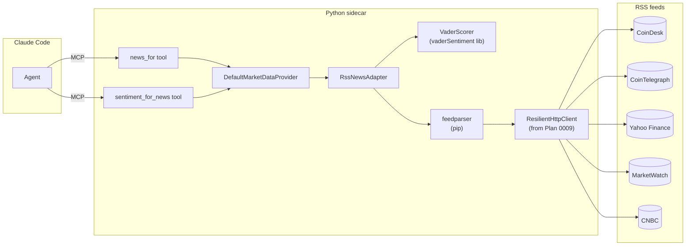

# 0010 — RSS news adapter + per-headline VADER sentiment

> **Status:** approved
> **Created:** 2026-05-20
> **Approved:** 2026-05-20
> **Owner skill(s):** `dev` (all phases)
> **Related ADRs:** [ADR-0019](../adrs/0019-external-http-adapter-resilience.md) (resilience module — inherited from Plan 0009), [ADR-0007](../adrs/0007-market-data-provider.md) (Provider Protocol — implements `get_news` and `get_sentiment` stubs), [ADR-0009](../adrs/0009-rewrite-data-layer-in-house.md) (in-house data layer), [ADR-0012](../adrs/0012-dependency-cooldown.md) + [ADR-0013](../adrs/0013-pin-direct-dependencies.md) (new direct deps: `feedparser`, `vaderSentiment`)
> **Depends on:** [Plan 0009](0009-resilience-and-tradingview-screener.md) phase 1 (`ResilientHttpClient` module).

## TL;DR

Ship an RSS-based news adapter (free feeds: CoinDesk, CoinTelegraph, Yahoo Finance, MarketWatch, CNBC) using `feedparser`, and a second output channel that runs VADER over each headline to produce a per-headline `compound` sentiment score. Two MCP tools: `news_for(symbol, window, limit)` returns the news items with optional embedded sentiment; `sentiment_for_news(symbol, window)` returns the aggregated sentiment summary. First user-visible behavior: ask Claude Code "what's the news on BTC today and what's the tone", get a list of recent headlines from multiple feeds with bullish/bearish breakdown.

## Context & problem

[ADR-0007](../adrs/0007-market-data-provider.md) declared `get_news` and `get_sentiment` as stubbed Protocol methods. After [Plan 0009](0009-resilience-and-tradingview-screener.md) lands, the agent can find candidates and check OHLCV — but it cannot read the news context around a symbol or assess editorial framing. The roadmap's Tier 2 names news and sentiment as two of the higher-priority data-breadth additions.

The merger insight noted in the planning conversation: news and per-headline sentiment can ship as one plan, sharing the same underlying RSS fetch. VADER is a lexicon-based sentiment scorer (~5 MB model, MIT-licensed, no API costs, deterministic on the same input). Running it over headlines we'd fetch anyway costs ~1ms per headline and gives a second output channel for free.

The `tradingview-mcp` upstream's RSS feed list (CoinDesk, CoinTelegraph, Yahoo Finance, MarketWatch, CNBC) is a known-good starting catalog — battle-tested against feed-availability changes, including the 2026-05-14 fix when Reuters' feeds went dark and Yahoo/CNBC required a User-Agent header. We borrow the catalog (not the code; per [ADR-0009](../adrs/0009-rewrite-data-layer-in-house.md)).

The "no Reddit" choice from the planning conversation stands: keyword-based sentiment is fragile, and VADER over editorial framing is a stronger v1 signal source.

## Decision

Three phases: (1) the RSS news adapter as a standalone, returning `NewsItem` rows without sentiment; (2) VADER integration — the same adapter now optionally returns each item with a `compound_sentiment` score; the aggregate is computed by the Provider; (3) MCP tools + provider integration. The phasing lets the news capability ship with value on its own (phase 1) before sentiment is layered on (phase 2).

We rejected at planning time: (a) "merge phases 1 and 2" — rejected because shipping news without sentiment is still useful (the agent can read headlines and reason without a numeric score) and the phase 1 done-when is a cleaner integration check; (b) "use a transformer-based sentiment model" — rejected because the dependency size (~500 MB for a basic FinBERT) and the runtime cost (~50 ms per headline) blow up the budget for a feature we want to ship and validate cheaply.

## Architecture diagram



## Implementation phases

### Phase 1 — RSS news adapter (no sentiment yet)

- **Owner skill:** `dev`
- **What:** Implement `RssNewsAdapter` in `src/market_analyser/data/adapters/rss_news.py`. The adapter ships with a curated `_FEED_CATALOG` (constant dict) mapping each feed to its URL, category (`crypto` / `equity` / `general`), and any per-feed quirks (e.g. Yahoo / CNBC require a User-Agent header). The adapter exposes `fetch(symbol=None, window="24h", limit=50) -> Sequence[NewsItem]`. When `symbol` is `None`, returns the union across feeds; otherwise filters items whose title or summary mentions the symbol (case-insensitive token match, not substring — to avoid `ETH` matching `together`). Uses `ResilientHttpClient` from Plan 0009 with a 5-minute TTL cache (news doesn't refresh as fast as screener results) and `max_concurrency=2` (we don't want to hammer five feeds in parallel). `feedparser` is the parsing layer; the adapter wraps `feedparser.parse(raw_bytes)` to keep the network IO in our client.
- **Files touched:**
  - `pyproject.toml`: add `feedparser==<latest-stable>` direct dep with exact pin + cooldown bump.
  - `uv.lock`: regenerated.
  - New `src/market_analyser/data/adapters/rss_news.py` (~120–150 lines including the feed catalog).
  - New `src/market_analyser/data/_symbol_match.py` (the token-match helper — small, reusable later by sentiment / news downstream).
  - `src/market_analyser/data/default_provider.py`: `get_news` now dispatches to the new adapter (no longer raises).
  - New `tests/data/test_rss_news_adapter.py`.
  - New `tests/data/fixtures/rss_news_coindesk.xml`, `rss_news_yahoo.xml`, `rss_news_cnbc.xml` (captured offline fixtures from each feed shape; scrubbed of tracking pixels).
  - New `tests/data/test_symbol_match.py`.
- **Done when:**
  - **Offline fixture parsing:** Given the three captured fixture XML files, `adapter.fetch(symbol=None, window="24h")` (with `ResilientHttpClient` mocked to return the fixture bytes per URL) returns a `list[NewsItem]` whose count equals the sum of items across fixtures with `published_at >= now() - 24h`. Each `NewsItem.title`, `.url`, `.published_at`, `.source` is populated; `.symbol == ""` (sentinel for "no symbol filter applied").
  - **Symbol filtering:** With `symbol="BTC"`, only items whose title or summary contains `BTC` as a token (case-insensitive, word boundaries) are returned. Specifically: an item titled "BTC reaches new high" matches; an item titled "Together they invest" does not (no false-positive on "ETH"). The `_symbol_match` helper has its own unit tests.
  - **Window filtering:** With `window="1h"` and fixture items dated 30 min, 90 min, and 5 hours ago, only the 30-min item is returned. Asserted with a frozen-time fixture (`freezegun` is a stdlib-adjacent option OR a `monkeypatch` on `datetime.now`; implementer's call).
  - **Feed-specific quirks:** The Yahoo and CNBC fixture requests have a `User-Agent: market-analyser/<version>` header asserted via the mocked client's request log. Feeds without the quirk requirement do NOT add the User-Agent (or add it harmlessly — implementer's call; asserted either way).
  - **Resilience inheritance:** With a mocked client that raises `ConnectionError` for the CoinDesk fixture URL and returns 200 for the other four: `adapter.fetch()` returns items from the four healthy feeds and does NOT raise. Failed feeds are logged at WARN with the feed name; the log capture asserts the log line exists. (One feed down does not kill the news call — graceful degradation.)
  - **Sort order:** Returned `NewsItem` list is sorted by `published_at` desc. Asserted.
  - **Provider integration:** `DefaultMarketDataProvider().get_news(symbol="BTC", window="24h")` returns the same rows as the direct adapter call.
  - **`as_of` rejection:** `provider.get_news(symbol="BTC", window="24h", as_of=<datetime>)` raises `ValueError` — news is wall-clock-sensitive in the same way screener results are.
  - `uv run pytest tests/data/test_rss_news_adapter.py tests/data/test_symbol_match.py` passes with no skips. mypy strict passes.

### Phase 2 — VADER sentiment scoring on news items

- **Owner skill:** `dev`
- **What:** Add VADER scoring. The adapter's `fetch()` gains an optional `with_sentiment: bool = False` parameter; when True, each returned `NewsItem` carries a `compound_sentiment: float | None` field populated by VADER's `compound` score over `title + (summary or "")`. The Provider's `get_sentiment(symbol, window, as_of)` now dispatches to a new helper that calls `adapter.fetch(symbol, window, with_sentiment=True)` and aggregates: mean compound, count of positive (compound > 0.05), count of negative (compound < -0.05), count of neutral (between). Returns a `SentimentSample` with `score = mean_compound`, `source = "rss-vader"`.
- **Files touched:**
  - `pyproject.toml`: add `vaderSentiment==<latest-stable>` direct dep with exact pin + cooldown bump.
  - `uv.lock`: regenerated.
  - `src/market_analyser/data/types.py`: extend `NewsItem` with `summary: str = ""` and `compound_sentiment: float | None = None` fields (additive change; existing `NewsItem` constructions still pass).
  - `src/market_analyser/data/adapters/rss_news.py`: add `with_sentiment` parameter; populate `compound_sentiment` when set.
  - New `src/market_analyser/data/_vader.py`: thin wrapper around the `vaderSentiment` library to keep the import in one place + define the project-specific scoring policy (which fields to concatenate, how to handle empty strings). About 30 lines.
  - `src/market_analyser/data/default_provider.py`: `get_sentiment` now dispatches to the news-derived sentiment for the default source. The Protocol method gains an internal default `source="rss-vader"` — no Protocol signature change (the source is fixed in v1).
  - New `tests/data/test_vader_wrapper.py`.
  - `tests/data/test_rss_news_adapter.py`: extend with a `with_sentiment=True` test.
  - New `tests/data/test_sentiment_news_aggregation.py`.
- **Done when:**
  - **VADER wrapper determinism:** Given the input `"Bitcoin surges to a new all-time high"`, `_vader.score(text)` returns a compound score within 1e-9 of a committed expected value (computed once at fixture-creation time and pinned). Re-running on the same input returns byte-identical results across two consecutive calls. Asserted.
  - **Empty / whitespace text:** `_vader.score("")` returns `0.0`; `_vader.score("   ")` returns `0.0`; `_vader.score(None)` raises `TypeError`. Asserted.
  - **News adapter with sentiment:** With `with_sentiment=True`, every `NewsItem` in the returned list has `compound_sentiment` populated as a float in `[-1.0, 1.0]`. Asserted with the fixture: a hand-picked headline known to be positive (e.g. "Bitcoin surges to a new all-time high") has `compound_sentiment > 0.3`; a hand-picked negative one (e.g. "Crypto market crashes amid regulatory fears") has `compound_sentiment < -0.3`. Threshold values asserted with explicit constants (not magic numbers in the test).
  - **Provider aggregation:** `provider.get_sentiment(symbol="BTC", window="24h")` returns a `SentimentSample` with `source == "rss-vader"`, `window == "24h"`, `score` equal to the mean of `compound_sentiment` over BTC-tagged items in the window (asserted with hand-computed value over fixtures). The model gains a `breakdown: dict[str, int]` field (additive type extension, like Phase 2's `NewsItem` extension): `{"positive": n_pos, "negative": n_neg, "neutral": n_neu}` for the agent's reply context.
  - **Zero news → defined behavior:** `provider.get_sentiment(symbol="XYZ_NEVER_IN_NEWS", window="24h")` returns a `SentimentSample` with `score == 0.0`, `breakdown == {"positive": 0, "negative": 0, "neutral": 0}`. Does NOT raise. (Documented in the docstring: "no news = zero sentiment, not unknown sentiment".)
  - **`as_of` rejection:** Same as phase 1 — `get_sentiment(..., as_of=<datetime>)` raises `ValueError`.
  - `uv run pytest tests/data/test_vader_wrapper.py tests/data/test_sentiment_news_aggregation.py` passes. mypy strict passes including the `NewsItem` / `SentimentSample` extensions.

### Phase 3 — MCP tools: `news_for` + `sentiment_for_news`

- **Owner skill:** `dev`
- **What:** Two MCP tools exposing the new capability to agents. `news_for(symbol, window, limit, with_sentiment)` returns the news items (with optional per-item sentiment scores). `sentiment_for_news(symbol, window)` returns the aggregated sentiment summary. Each tool validates inputs at the MCP boundary (Pydantic).
- **Files touched:**
  - New `src/market_analyser/api/mcp_tools/news_for.py`.
  - New `src/market_analyser/api/mcp_tools/sentiment_for_news.py`.
  - `src/market_analyser/api/mcp_app.py`: register both tools.
  - New `tests/api/test_news_for_tool.py`.
  - New `tests/api/test_sentiment_for_news_tool.py`.
- **Done when:**
  - **`news_for` happy path:** Calling `news_for(symbol="BTC", window="24h", limit=10)` via the MCP test fixture returns a JSON object with a `items: list[NewsItem]` key whose count is `min(10, total_btc_items_in_window)`. Each item has `title`, `url`, `published_at`, `source`. `compound_sentiment` is `None` (default `with_sentiment=False`).
  - **`news_for` with sentiment:** Calling with `with_sentiment=True` returns each item with `compound_sentiment` populated as a float.
  - **`news_for` boundary validation:** `limit > 100` rejected; `window` not in `{"1h", "4h", "24h", "7d"}` rejected; `symbol=""` rejected; `symbol=None` accepted (returns unfiltered headlines, capped at limit).
  - **`sentiment_for_news` happy path:** Calling `sentiment_for_news(symbol="BTC", window="24h")` returns `{score: float, window: "24h", source: "rss-vader", breakdown: {positive: int, negative: int, neutral: int}, queried_at: <utc datetime>}`. `score` is in `[-1, 1]`.
  - **`sentiment_for_news` boundary validation:** Same as `news_for` for `symbol` and `window`. `as_of` is not a parameter (omitted from the input model entirely).
  - **Plan 0009 regression:** `screener_query` and the other pre-existing MCP tools (Plan 0006 / 0007 / 0008) still pass their full test suites.
  - `uv run pytest tests/api/test_news_for_tool.py tests/api/test_sentiment_for_news_tool.py` passes.

## Data shapes

```python
# Extensions to existing types (additive — Phase 2):

class NewsItem(BaseModel):
    symbol: str = Field(min_length=1)
    title: str
    url: str
    published_at: datetime
    source: str = Field(min_length=1)
    summary: str = ""                              # NEW
    compound_sentiment: float | None = None        # NEW

class SentimentSample(BaseModel):
    symbol: str = Field(min_length=1)
    score: float
    window: str
    as_of: datetime
    source: str = Field(min_length=1)
    breakdown: dict[str, int] = Field(default_factory=dict)   # NEW: {positive, negative, neutral}
```

```python
# MCP tool inputs:

class NewsForInput(BaseModel):
    symbol: str | None = None
    window: Literal["1h", "4h", "24h", "7d"] = "24h"
    limit: int = Field(50, ge=1, le=100)
    with_sentiment: bool = False
    model_config = {"frozen": True, "extra": "forbid"}

class SentimentForNewsInput(BaseModel):
    symbol: str = Field(min_length=1)
    window: Literal["1h", "4h", "24h", "7d"] = "24h"
    model_config = {"frozen": True, "extra": "forbid"}
```

```python
# Feed catalog (illustrative; final form locked in phase 1):

_FEED_CATALOG = {
    "coindesk":      Feed(url="https://feeds.coindesk.com/feed", category="crypto", needs_ua=False),
    "cointelegraph": Feed(url="https://cointelegraph.com/rss",   category="crypto", needs_ua=False),
    "yahoo_finance": Feed(url="https://finance.yahoo.com/news/rssindex", category="equity", needs_ua=True),
    "marketwatch":   Feed(url="https://feeds.marketwatch.com/marketwatch/topstories/", category="equity", needs_ua=False),
    "cnbc":          Feed(url="https://www.cnbc.com/id/100003114/device/rss/rss.html", category="equity", needs_ua=True),
}
```

## Risks & open questions

- **Risk: feed URLs change without warning.** The `tradingview-mcp` upstream hit this on Reuters in May 2026. Mitigation: per-feed graceful degradation (failed feed → log + continue, not raise). A future plan can add a CI-checked uptime-monitor for the catalog if maintenance burden surfaces.
- **Risk: VADER is tuned for general English text, not finance.** It scores "bullish" as positive and "bearish" as negative (good) but it doesn't understand "rate cut" as bullish or "hawkish" as bearish. Acceptable for v1; if the signal proves valuable we can layer a finance-tuned lexicon on top (future plan). The fixture tests assert directional correctness on canonical headlines; not absolute calibration.
- **Risk: per-headline scoring on a 200-item fetch is ~200ms of CPU.** VADER is fast (~1ms per call) but the wall-clock cost matters at the MCP tool boundary. Mitigation: `with_sentiment` is opt-in on `news_for`; `sentiment_for_news` is the only call that always scores. Phase 3's done-when asserts that `sentiment_for_news` returns within 2 s for a 50-item fixture.
- **Risk: token-match symbol filtering false-negatives long company names.** "AAPL" matches "AAPL hits new high" but not "Apple announces earnings". Mitigation: future plan can add a symbol↔name expansion table (e.g. `AAPL → Apple`) to widen matches. v1 accepts the precision-over-recall trade.
- **Risk: false-positive token matches on short tickers.** "T" (AT&T) would match in many sentences. Mitigation: the `_symbol_match` helper rejects tickers shorter than 2 characters (returns nothing) and special-cases known-bad tickers. The test suite asserts the rejection.
- **Risk: VADER's `vaderSentiment` package quality.** It is a fork of the original NLTK module, MIT-licensed, ~1k stars, minimally maintained. We pin exactly per [ADR-0013](../adrs/0013-pin-direct-dependencies.md). If the package becomes unmaintained, swapping to a different lexicon scorer is bounded by the `_vader.py` wrapper (~30 lines).
- **Risk: news caching at the resilience layer means stale headlines.** Default TTL is 5 minutes — agreed in [ADR-0019](../adrs/0019-external-http-adapter-resilience.md) for news. Tunable per `news_for` call if the agent has reason to insist on fresh; not exposed in v1.
- **Open question: should `get_sentiment` accept a `source` parameter** (e.g., `source="rss-vader"` vs `source="stocktwits"` once Plan 0012 lands)? Yes, but deferred to Plan 0012 — that's the plan that first needs the discrimination. For now, `get_sentiment` returns the rss-vader source by default.
- **Open question: should "news" and "sentiment" share an MCP tool** with a `mode` parameter? Decision: no — keeping them as separate tools makes the agent's tool selection cleaner. The agent doesn't have to know that sentiment is news-derived; it's an implementation detail.
- **Open question: should we deduplicate near-duplicate headlines across feeds** (e.g., CoinDesk and CoinTelegraph both covering the same story)? Not in v1. Worth doing if duplicate noise becomes a finding.

## What this plan does NOT do

- **Reddit-based sentiment.** Explicitly deferred per the planning conversation.
- **StockTwits sentiment.** Plan 0012's job.
- **Fear & Greed indices.** Plan 0011's job.
- **A finance-tuned sentiment model.** VADER is the v1 lexicon; FinBERT / similar is a future plan if signal warrants the dependency.
- **Persisted news / sentiment history.** Wall-clock-only; no SQLite table for news. If a "show me sentiment for AAPL over the last week" use case surfaces, that's a future plan with its own table.
- **Per-feed reliability metrics.** Failed feeds log + degrade; no aggregate uptime tracking.
- **Duplicate-headline detection across feeds.** Future plan if noise becomes a finding.
- **A symbol↔name expansion table.** Token-match-on-ticker only; "AAPL" hits, "Apple" doesn't.
- **Filtering by category (crypto vs equity).** All feeds queried always; the agent filters semantically in its reply.
- **A `news_for_market` aggregate** (top headlines across no specific symbol). Out of scope; `news_for(symbol=None)` is the closest approximation and is sufficient.
- **An MCP tool that returns the per-feed health.** Telemetry exists in `ResilientHttpClient.stats()` but no tool surfaces it.

## Assumptions made (not interviewed)

1. **VADER's compound score is the right signal extract.** It is the default in the library and well-validated. If a future signal study shows we should be looking at positive-negative differential instead, the `_vader.py` wrapper is the seam.
2. **5-minute TTL is the right default for news caching.** Feeds publish every few minutes at most; 5 minutes is the sweet spot between freshness and politeness. Adjustable in `_FEED_CATALOG` if needed.
3. **The five-feed catalog is the right start.** `tradingview-mcp`'s catalog is well-tested. Adding feeds is a one-row change; the plan doesn't gate this.
4. **No `as_of` for news / sentiment.** Wall-clock-only; backtest replay deferred.

## Followups (after this lands)

Empty at draft time. Architect populates from review findings + implementer notes during the close ceremony.
