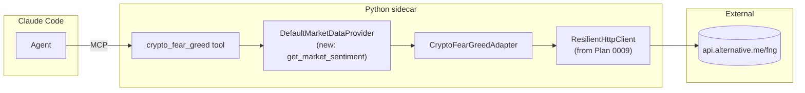

# 0011 — Crypto Fear & Greed index (Alternative.me)

> **Status:** in-progress
> **Created:** 2026-05-20
> **Approved:** 2026-05-20
> **Owner skill(s):** `dev` (single phase)
> **Related ADRs:** [ADR-0019](../adrs/0019-external-http-adapter-resilience.md) (resilience module — inherited), [ADR-0007](../adrs/0007-market-data-provider.md) (Provider Protocol), [ADR-0009](../adrs/0009-rewrite-data-layer-in-house.md) (in-house data layer)
> **Depends on:** [Plan 0009](0009-resilience-and-tradingview-screener.md) phase 1 (`ResilientHttpClient`).

## TL;DR

The smallest Tier 2 plan. One HTTP call to `https://api.alternative.me/fng/?limit=1` returns the crypto Fear & Greed Index value (0–100) and a label (Extreme Fear / Fear / Neutral / Greed / Extreme Greed). One adapter, one MCP tool, ~80 lines total. Gives the agent a one-call macro context check it can inject into any crypto-related reply. First user-visible behavior: ask Claude Code "what's the crypto market mood right now", get a single-number answer with the label and the published-at timestamp.

## Context & problem

Earlier research into the upstream project flagged the BTC macro-context call (CoinGecko global stats + dominance) as a small, free, high-leverage addition the current data layer lacks. Crypto F&G — Alternative.me's free unauthenticated index — is a closely-related single-number macro signal that's even smaller in surface area: one endpoint, four fields. Both are good candidates; F&G is the smaller of the two and the better first proof that `ResilientHttpClient` works against an upstream with different shape (a plain JSON endpoint, not a library-mediated screener).

The planning conversation queued F&G as Plan 0011 specifically because it is the smallest possible exercise of the resilience module. If `ResilientHttpClient` has a bug that the screener test suite didn't catch, F&G's tiny surface will surface it cleanly. Plan 0011 also adds the first "no symbol, market-wide" sentiment surface — a shape the existing `get_sentiment(symbol, window)` Protocol method doesn't quite fit, which forces us to make a small Protocol-level decision (covered below).

CNN's Equity F&G is in scope conceptually but requires scraping (no JSON endpoint); it is deferred to a follow-up if and when the crypto signal proves valuable.

## Decision

One phase. New `CryptoFearGreedAdapter` calls `GET https://api.alternative.me/fng/?limit=1` via `ResilientHttpClient` (5-minute TTL — the index updates once per day, so the TTL is generous). One new MCP tool `crypto_fear_greed()` (no arguments) returns the current reading. The Provider gains a new method `get_market_sentiment(market, window="current", as_of=None) -> MarketSentimentSample`, with `market` constrained to `Literal["crypto"]` for v1 (extends additively when CNN equity F&G lands). This is a small additive Protocol change — distinct from `get_sentiment(symbol, ...)` because F&G is market-wide, not per-symbol, and pretending it's a special "symbol" would be a category error.

We rejected at planning time: (a) "shoehorn F&G into `get_sentiment(symbol="__MARKET_CRYPTO__")`" — rejected because it leaks a synthetic sentinel into the public Protocol; new Protocol method is cleaner; (b) "skip F&G, do CoinGecko BTC macro first" — rejected because CoinGecko adds three endpoints + a risk-classification heuristic + a multi-field response; F&G is smaller, lands first, validates the pattern, and CoinGecko gets its own future plan.

## Architecture diagram



## Implementation phases

### Phase 1 — Adapter + Provider method + MCP tool (single commit)

- **Owner skill:** `dev`
- **What:** Three small pieces in one commit because the surface is tiny: the adapter (~30 lines), the Provider method (~10 lines including the type extension), the MCP tool (~30 lines). No new direct dependencies — `ResilientHttpClient` + stdlib JSON does everything needed. The plan ships in one phase deliberately; splitting into smaller phases would be ceremony.
- **Files touched:**
  - `src/market_analyser/data/types.py`: add `MarketSentimentSample` model (new pydantic class, frozen, `extra="forbid"`).
  - `src/market_analyser/data/provider.py`: add `get_market_sentiment(market, window, as_of) -> MarketSentimentSample` method to the Protocol. Existing methods unchanged.
  - `src/market_analyser/data/default_provider.py`: implement `get_market_sentiment` dispatching to the new adapter.
  - New `src/market_analyser/data/adapters/crypto_fear_greed.py` (~30 lines).
  - New `src/market_analyser/api/mcp_tools/crypto_fear_greed.py`.
  - `src/market_analyser/api/mcp_app.py`: register the new tool.
  - New `tests/data/test_crypto_fear_greed_adapter.py`.
  - New `tests/api/test_crypto_fear_greed_tool.py`.
  - New `tests/data/fixtures/alternative_me_fng_response.json` (captured response — small, ~10 lines of JSON).
- **Done when:**
  - **Adapter offline correctness:** Given the fixture JSON `{"data": [{"value": "55", "value_classification": "Greed", "timestamp": "1715212800", "time_until_update": "60000"}]}`, `adapter.fetch_current()` returns a `MarketSentimentSample` with `value == 55` (int), `classification == "Greed"`, `published_at` matching the timestamp converted to UTC, `source == "alternative.me-fng"`, `market == "crypto"`. Each field asserted explicitly.
  - **Value range validation:** A malformed fixture with `value="105"` (out of `[0, 100]`) raises a validation error at parse time (not silently truncated). Asserted.
  - **Classification mapping:** The five canonical labels (`"Extreme Fear"`, `"Fear"`, `"Neutral"`, `"Greed"`, `"Extreme Greed"`) all parse correctly. An unknown label (e.g. `"Confusion"`) raises `ValidationError` — the adapter's `MarketSentimentSample.classification` field is a `Literal` over the five known values.
  - **Provider integration:** `DefaultMarketDataProvider().get_market_sentiment(market="crypto")` returns the same `MarketSentimentSample` as the adapter call. `market="equity"` raises `NotImplementedError` ("equity F&G not implemented; see Plan 0011 followups"). `as_of=<datetime>` raises `ValueError`.
  - **Cache behavior:** Two adapter calls within the TTL window result in `client.stats().requests == 1` and `client.stats().cache_hits == 1`. Asserted.
  - **MCP tool happy path:** Calling `crypto_fear_greed()` (no arguments) via the MCP test fixture returns `{"value": 55, "classification": "Greed", "published_at": "<iso datetime>", "queried_at": "<iso datetime>", "source": "alternative.me-fng"}`. The shape is asserted key-by-key.
  - **MCP tool input model:** Calling `crypto_fear_greed(value=10)` (passing any argument) is rejected by the input model (which is an empty pydantic model with `extra="forbid"`). Asserted.
  - **Live smoke (`@pytest.mark.network`, local-only):** A single live call returns a valid `MarketSentimentSample` with `value` in `[0, 100]` and `classification` matching the value (rough sanity check: `value < 25` → `Extreme Fear`, `value > 75` → `Extreme Greed`, etc., with a 5-point fuzz tolerance).
  - **Plan 0009 + 0010 regression:** `screener_query`, `news_for`, `sentiment_for_news`, and other MCP tools still pass their full test suites. Asserted by running the existing suites and importing all tool modules.
  - `uv run pytest tests/data/test_crypto_fear_greed_adapter.py tests/api/test_crypto_fear_greed_tool.py` passes with no skips other than `@pytest.mark.network`. mypy strict passes.

## Data shapes

```python
# src/market_analyser/data/types.py — new model:

class MarketSentimentSample(BaseModel):
    """Market-wide sentiment (e.g. crypto Fear & Greed) — distinct from per-symbol sentiment."""
    model_config = ConfigDict(frozen=True, extra="forbid")

    market: Literal["crypto"]                                                       # extends to "equity" later
    value: int = Field(ge=0, le=100)
    classification: Literal["Extreme Fear", "Fear", "Neutral", "Greed", "Extreme Greed"]
    published_at: datetime                                                           # from upstream timestamp
    source: str = Field(min_length=1)                                                # "alternative.me-fng"
    window: str = "current"                                                          # always "current" in v1


# src/market_analyser/data/provider.py — additive Protocol method:

class MarketDataProvider(Protocol):
    # ... existing methods unchanged ...

    def get_market_sentiment(
        self,
        market: Literal["crypto"],
        window: str = "current",
        as_of: datetime | None = None,
    ) -> MarketSentimentSample: ...
```

```python
# MCP tool input — empty model (no parameters in v1):

class CryptoFearGreedInput(BaseModel):
    model_config = {"frozen": True, "extra": "forbid"}
```

## Risks & open questions

- **Risk: Alternative.me goes down or rate-limits.** Mitigation: 5-minute TTL absorbs the typical "agent asks twice in a minute" pattern. `ResilientHttpClient` retries on transient. If the endpoint goes down for a day, the MCP tool returns the cached value until TTL expiry, then raises `ResilientHttpError`. The agent's reply path surfaces this cleanly (the error message says "F&G index temporarily unavailable").
- **Risk: upstream shape changes.** Alternative.me's API has been stable for years but is not contractually guaranteed. The adapter's parsing is pinned to the v1 shape; a breaking upstream change requires an adapter update. Acceptable for a free unauthenticated endpoint; the offline fixture test catches local breakage but not upstream breakage.
- **Risk: F&G is a single number — agents may misuse it.** The MCP tool docstring explicitly notes the data is wall-clock-current (not historical), market-wide (not per-symbol), and that the index is one-day-cadence (asking twice in an hour returns the same value). Future plans may add a historical series tool if backtesting against F&G becomes a use case.
- **Risk: equity F&G (CNN) requires scraping.** Out of v1 scope. The Protocol's `market: Literal["crypto"]` is narrow on purpose — when CNN equity F&G lands as a follow-up plan, the literal extends to `Literal["crypto", "equity"]` (additive, non-breaking).
- **Open question: do we add a historical F&G series tool?** Alternative.me's `/fng/?limit=N` supports up to ~1000 historical readings. Not in v1; a follow-up if "show me F&G over the last 90 days as an overlay" becomes a need.
- **Open question: should F&G feed into a future composite sentiment score** (e.g., weighted blend of news-VADER + F&G + StockTwits)? Possibly — but that's a Tier 3 (predictive surface) concern, not Tier 2 (data breadth). Not in scope here.

## What this plan does NOT do

- **CNN Equity Fear & Greed.** Requires scraping; deferred to a follow-up plan.
- **Historical F&G series.** Single current reading only.
- **Composite sentiment** (blending F&G + news-VADER + StockTwits).
- **A UI element that shows F&G.** The MCP tool is agent-only in this plan. A future `ui-builder` phase could render the value as a chip in the sidebar; not in scope.
- **`as_of`-replay for F&G.** Wall-clock-only.

## Assumptions made (not interviewed)

1. **5-minute TTL is generous enough** given F&G updates daily. If a contributor argues for longer (e.g., 1 hour), bumping is one-line; the v1 default is conservative.
2. **The five-label classification is upstream-fixed.** Alternative.me has not changed these in years; the `Literal` is safe to pin. A new label upstream surfaces as a test failure.
3. **The Protocol's `Literal["crypto"]` is the right initial vocabulary.** When CNN equity lands, the literal grows additively; no breaking change.

## Followups (after this lands)

Empty at draft time. Architect populates from review findings + implementer notes during the close ceremony.
