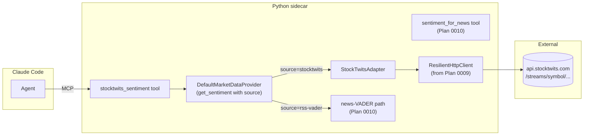

# 0012 — StockTwits per-symbol sentiment

> **Status:** approved
> **Created:** 2026-05-20
> **Approved:** 2026-05-20
> **Owner skill(s):** `dev` (all phases)
> **Related ADRs:** [ADR-0019](../adrs/0019-external-http-adapter-resilience.md) (resilience module — inherited), [ADR-0007](../adrs/0007-market-data-provider.md) (Provider Protocol — `get_sentiment` already implemented by news-VADER in Plan 0010; this plan adds source discrimination), [ADR-0009](../adrs/0009-rewrite-data-layer-in-house.md) (in-house data layer)
> **Depends on:** [Plan 0009](0009-resilience-and-tradingview-screener.md) phase 1 (`ResilientHttpClient`). [Plan 0010](0010-news-and-vader-sentiment.md) (`get_sentiment` already returns rss-vader source by default; this plan generalizes the dispatch).

## TL;DR

Add StockTwits as a second per-symbol sentiment source. The signal is cleaner than VADER-over-news because users explicitly label each post `Bullish` or `Bearish` — no NLP model needed; we count the labels in the window. Adds a `source` parameter to `get_sentiment` so callers (and the agent) can pick news-VADER, StockTwits, or a future aggregator. New MCP tool `stocktwits_sentiment(symbol, window)` returns the breakdown. First user-visible behavior: ask Claude Code "what's the StockTwits crowd saying about TSLA in the last hour", get a labeled count back with the underlying post sample size.

## Context & problem

After Plan 0010 lands, the agent has one per-symbol sentiment source: news-VADER. It is editorial framing — useful but biased toward what journalists publish, not toward what traders feel. StockTwits is finance-native and ships explicit user-applied sentiment labels (`Bullish` / `Bearish` / `None`) on each post. The data shape is purpose-built for what we want; no NLP model, no lexicon tuning, no FinBERT.

StockTwits also covers both stocks and crypto with the same endpoint shape (`/streams/symbol/{ticker}.json` for stocks; `/streams/symbol/{ticker}.X` convention or similar for crypto — adapter pins the exact format at phase 1). Free tier is rate-limited; the resilience module handles that.

The Provider Protocol's `get_sentiment(symbol, window, as_of)` was implemented by Plan 0010 as news-VADER-only. This plan adds a `source: Literal["rss-vader", "stocktwits"] = "rss-vader"` parameter (additive — default preserved for existing callers) so callers can pick. That's a small Protocol change that earns its keep when the second source lands.

## Decision

Three phases: (1) StockTwits adapter standalone with offline tests; (2) Protocol extension + Provider dispatch (small, mostly types); (3) MCP tool + integration tests. Phasing lets the adapter ship and get tested in isolation before the cross-cutting Protocol change.

We rejected at planning time: (a) "merge all three phases" — rejected because the Protocol change touches multiple callers (existing Plan 0010 tests, the existing `get_sentiment` MCP tool) and bundling it with adapter work makes the failure mode hard to isolate; (b) "make StockTwits the default sentiment source" — rejected because news-VADER works on more symbols (StockTwits' coverage is patchy on small-caps and non-US-listed names); keeping news-VADER as the default and StockTwits as an explicit opt-in is the more conservative call.

## Architecture diagram



## Implementation phases

### Phase 1 — `StockTwitsAdapter` standalone

- **Owner skill:** `dev`
- **What:** Implement the adapter against StockTwits' free API. The endpoint shape is `GET https://api.stocktwits.com/api/2/streams/symbol/{ticker}.json` returning a `messages: [{id, body, created_at, entities: {sentiment: {basic: "Bullish" | "Bearish" | null}}, ...}]` array. The adapter fetches recent messages, filters to the requested window, counts `Bullish` / `Bearish` / `None` labels, returns a `SentimentSample` whose `score` is `(bullish_count - bearish_count) / max(1, total_labeled_count)` — a value in `[-1, 1]`. Labeled-post-count is exposed in the `breakdown` field (the additive field Plan 0010 added).
- **Files touched:**
  - New `src/market_analyser/data/adapters/stocktwits.py` (~100 lines).
  - New `tests/data/test_stocktwits_adapter.py`.
  - New `tests/data/fixtures/stocktwits_AAPL_response.json` (captured offline fixture, scrubbed of user IDs and PII).
- **Done when:**
  - **Adapter offline correctness:** Given the fixture with N messages of which K1 are `Bullish`, K2 are `Bearish`, K3 are unlabeled, the adapter's `fetch_sentiment(symbol="AAPL", window="24h")` returns a `SentimentSample` with `source == "stocktwits"`, `window == "24h"`, `score == (K1 - K2) / max(1, K1 + K2)`, `breakdown == {"positive": K1, "negative": K2, "neutral": K3}`. Asserted field-by-field.
  - **Window filtering:** With fixture posts at 10 min, 90 min, 5 h, 3 d old and `window="1h"`, only the 10-min post is included in counts. Frozen-time fixture as in Plan 0010 phase 1.
  - **Symbol normalization:** StockTwits uses uppercase tickers; the adapter accepts lowercase (`adapter.fetch_sentiment(symbol="aapl", ...)`) and normalizes internally. Asserted: lowercase and uppercase input produce identical results.
  - **No-labels case:** A symbol with 50 posts all unlabeled returns `score == 0.0`, `breakdown == {"positive": 0, "negative": 0, "neutral": 50}`. Does NOT raise. (Documented in docstring: "no labels = neutral, not unknown".)
  - **Zero-posts case:** A symbol with no posts at all (StockTwits returns an empty `messages` array) returns `score == 0.0`, `breakdown == {"positive": 0, "negative": 0, "neutral": 0}`. Documented: "no data = neutral, not unknown".
  - **Symbol not in StockTwits:** A 404 from upstream (the symbol isn't tracked at all) raises `SymbolNotCoveredError` (a named exception extending the project's existing data-layer errors). NOT a `ResilientHttpError` (404 is permanent, not retriable). Asserted.
  - **Rate limit handling — classifier extension:** StockTwits' free tier responds with HTTP 403 (not 429) when over the rate limit. The adapter overrides `ResilientHttpClient.classify` to map 403 with a specific response body shape (`{"error": "...rate limit..."}`) to `ErrorKind.RATELIMIT`. Asserted: a mocked 403-with-rate-limit body retries with the rate-limit backoff; a 403 without the rate-limit body raises immediately (permanent).
  - **Cache:** Same as other adapters — TTL 5 minutes default (sentiment is wall-clock-current but doesn't move every second). Two adapter calls within TTL produce one upstream request.
  - **Live smoke (`@pytest.mark.network`, local-only):** A single live call against `AAPL` returns a `SentimentSample` with `score` in `[-1, 1]` and `breakdown` summing to a non-negative integer.
  - `uv run pytest tests/data/test_stocktwits_adapter.py` passes with no skips other than `@pytest.mark.network`. mypy strict passes.

### Phase 2 — Protocol extension: `source` parameter on `get_sentiment`

- **Owner skill:** `dev`
- **What:** Extend the Protocol method `get_sentiment(symbol, window, as_of)` to `get_sentiment(symbol, window, source, as_of)` where `source: Literal["rss-vader", "stocktwits"] = "rss-vader"`. The default preserves Plan 0010's behavior, so existing callers don't break. `DefaultMarketDataProvider.get_sentiment` dispatches: `"rss-vader"` → news-VADER path (Plan 0010); `"stocktwits"` → `StockTwitsAdapter`.
- **Files touched:**
  - `src/market_analyser/data/provider.py`: extend method signature.
  - `src/market_analyser/data/default_provider.py`: implement dispatch.
  - `tests/data/test_default_provider.py` (or wherever the provider tests live): add tests for both source values and the dispatch.
- **Done when:**
  - **Default preserved:** `provider.get_sentiment(symbol="BTC", window="24h")` (no `source`) returns the same result as `provider.get_sentiment(symbol="BTC", window="24h", source="rss-vader")`. Byte-identical. Asserted.
  - **Dispatch correctness:** `provider.get_sentiment(symbol="AAPL", window="24h", source="stocktwits")` returns a `SentimentSample` with `source == "stocktwits"` and shape matching the adapter call. Mock the news-VADER path; assert it is NOT called when `source="stocktwits"`. Mock the StockTwits adapter; assert it IS called.
  - **Unknown source:** `source="not_a_source"` rejected by the `Literal` at runtime (Pydantic / type-checker at sites; runtime check inside the dispatch raises `ValueError`).
  - **`as_of` rejection unchanged:** Both source values reject `as_of=<datetime>`.
  - **Plan 0010 regression:** All Plan 0010 tests still pass without modification.
  - mypy strict passes including the signature extension.

### Phase 3 — `stocktwits_sentiment` MCP tool

- **Owner skill:** `dev`
- **What:** Dedicated MCP tool for StockTwits sentiment. Separate from `sentiment_for_news` (Plan 0010) — agents pick a source explicitly. Validates inputs at the MCP boundary.
- **Files touched:**
  - New `src/market_analyser/api/mcp_tools/stocktwits_sentiment.py`.
  - `src/market_analyser/api/mcp_app.py`: register the new tool.
  - New `tests/api/test_stocktwits_sentiment_tool.py`.
- **Done when:**
  - **Happy path:** Calling `stocktwits_sentiment(symbol="AAPL", window="24h")` via the MCP test fixture returns `{symbol, score, window, source: "stocktwits", breakdown, queried_at}`. Shape asserted key-by-key.
  - **Symbol validation:** `symbol=""` rejected; `symbol="AAPL$"` (invalid characters) rejected. A valid lowercase symbol normalized internally and returned in uppercase form (echo'd in response). Asserted.
  - **`window` validation:** Same allowed set as Plan 0010 (`"1h"`, `"4h"`, `"24h"`, `"7d"`).
  - **Symbol not covered:** `symbol="MADE_UP_TICKER"` (returning 404 upstream, mocked) returns an MCP-level error with a clear message ("symbol not tracked by StockTwits"). NOT a 500.
  - **Plan 0010 regression:** `sentiment_for_news` and `news_for` still pass.
  - `uv run pytest tests/api/test_stocktwits_sentiment_tool.py` passes.

## Data shapes

```python
# src/market_analyser/data/provider.py — signature extension:

class MarketDataProvider(Protocol):
    # ... existing methods unchanged ...

    def get_sentiment(
        self,
        symbol: str,
        window: str,
        source: Literal["rss-vader", "stocktwits"] = "rss-vader",        # NEW: default preserves Plan 0010 callers
        as_of: datetime | None = None,
    ) -> SentimentSample: ...

# MCP tool input:

class StockTwitsSentimentInput(BaseModel):
    symbol: str = Field(min_length=1, max_length=10)
    window: Literal["1h", "4h", "24h", "7d"] = "24h"
    model_config = {"frozen": True, "extra": "forbid"}
```

## Risks & open questions

- **Risk: StockTwits coverage is patchy.** Large-cap US stocks and major crypto have strong coverage; small-caps and non-US-listed names may have few or zero posts. Mitigation: the adapter returns `SentimentSample(score=0.0, breakdown={"positive":0,"negative":0,"neutral":0})` for zero-coverage and lets the agent decide what to say. The tool's docstring notes the coverage limitation explicitly.
- **Risk: StockTwits rate-limits are stricter than expected.** Free tier is ~200 requests/hour per IP last we checked, but they don't publish exact numbers and the limit drifts. Mitigation: resilience module's 5-minute TTL absorbs repeats; `max_concurrency=2` (lower than Plan 0009's default of 4 — StockTwits is less generous than TradingView) ensures we don't fan out aggressively. Documented in the adapter's constructor.
- **Risk: 403-as-rate-limit classifier extension is fragile.** If StockTwits changes the rate-limit response shape (a different status code or body), our retry behavior silently degrades. Mitigation: the adapter test asserts the 403-body classification path; if upstream changes, the test catches it locally (network mark required). A future plan can add a CI-checked upstream-contract probe.
- **Risk: Bullish-minus-Bearish ratio is naive.** It doesn't weight by post quality, author reputation, or follower count (StockTwits exposes follower counts but our adapter ignores them in v1). Acceptable for the first cut; if the signal proves valuable, follower-weighted aggregation is a follow-up. Documented in the adapter's docstring.
- **Risk: post body content is unread by our adapter.** We use only the label. Users sometimes label `Bullish` but write something that contradicts; we don't catch that. Trade-off: cheap, deterministic, no NLP. Acceptable for v1.
- **Open question: should the MCP tool surface raw post samples** (e.g., top 5 most-liked Bullish posts) so the agent can quote them? Possibly useful; deferred to a follow-up if the agent's replies need more substance than the numeric score.
- **Open question: should we combine StockTwits + news-VADER into a single weighted sentiment score?** That's a Tier 3 composite-sentiment concern; not in scope here.
- **Open question: should `source` in `get_sentiment` accept `"any"` for caller-doesn't-care aggregation?** Not in v1. Agents pick the source they want; aggregation is a future concern.

## What this plan does NOT do

- **Follower-weighted aggregation.** Equal-weight per labeled post in v1.
- **Top-post sampling in the MCP response.** The agent gets the numeric breakdown only.
- **Composite sentiment** combining StockTwits + news-VADER + F&G.
- **A `source="any"` aggregator on `get_sentiment`.**
- **Historical sentiment series.** Current-window only.
- **Persisted sentiment in SQLite.** Wall-clock-only; no `sentiment_samples` table.
- **A UI element showing StockTwits sentiment.** MCP-only.
- **`as_of`-replay.**

## Assumptions made (not interviewed)

1. **StockTwits' free API tier is sufficient for personal use.** If rate-limit pain shows up frequently in real use, we add a `STOCKTWITS_BEARER` env-var path (would gate on the Secrets-schema ADR from the open backlog).
2. **The Bullish-minus-Bearish ratio is a useful first-cut score.** A follower-weighted alternative is a follow-up if the v1 signal is too noisy.
3. **`Literal["rss-vader", "stocktwits"]` is the right enum.** When a third source lands (e.g. Twitter via a paid API, or a finance-tuned model), the literal extends additively.

## Followups (after this lands)

Empty at draft time. Architect populates from review findings + implementer notes during the close ceremony.
