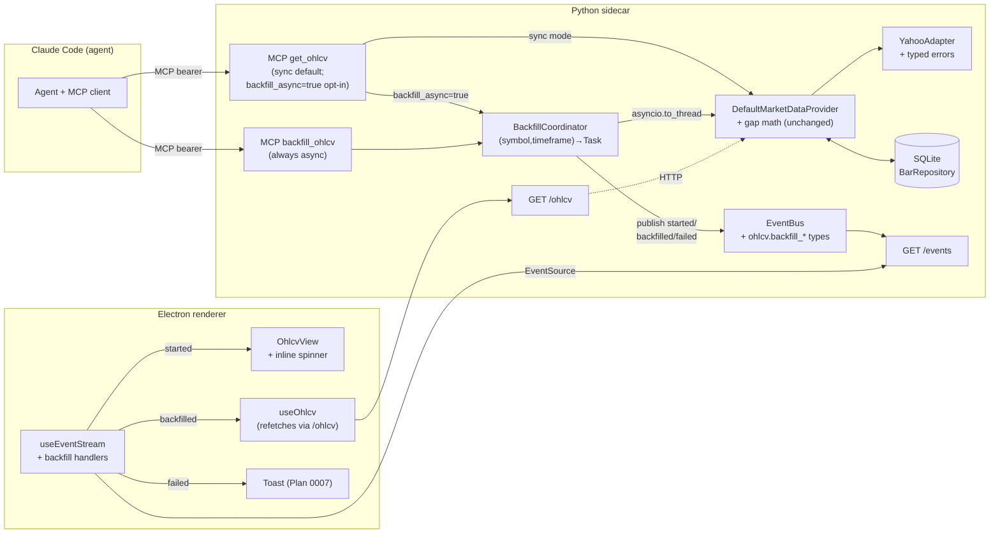

# 0013 — Auto-backfill on cache miss: contract honesty, `backfill_ohlcv` tool, async + events

> **Status:** approved
> **Created:** 2026-05-22
> **Approved:** 2026-05-22
> **Owner skill(s):** `dev`, `ui-builder`
> **Related ADRs:** [ADR-0007](../adrs/0007-market-data-provider.md) (MarketDataProvider Protocol — `as_of` anti-lookahead seam), [ADR-0014](../adrs/0014-mcp-as-second-sidecar-protocol.md) (MCP tool surface), [ADR-0017](../adrs/0017-live-ui-updates-via-sse.md) (SSE event vocabulary), [ADR-0015](../adrs/0015-claude-code-primary-control-surface.md) (Claude Code is the primary control surface; tool docstrings are agent UX)

## TL;DR

Plan 0007 phase 5 smoke caught the agent declining to backfill missing bars and asking the user to invoke a separate `/dev` skill — even though `DefaultMarketDataProvider.get_ohlcv` (`src/market_analyser/data/default_provider.py:76-89`) already fetches Yahoo on cache miss. The bug is in the agent's *contract*, not the runtime: `get_ohlcv`'s MCP tool docstring says "Read OHLCV bars from the local cache" (`mcp_app.py:108-111`), so the agent reads it as cache-only and never tries it. This plan fixes the contract, adds a dedicated `backfill_ohlcv` MCP tool so the operation is verb-discoverable, gives `get_ohlcv` an opt-in `backfill_async=true` mode that returns cached bars immediately and finishes the fetch in the background, defines three new SSE event types (`ohlcv.backfill_started v1`, `ohlcv.backfilled v1`, `ohlcv.backfill_failed v1`), introduces a typed adapter-error hierarchy (`RateLimitedError`, `UpstreamUnavailableError`, `UnknownSymbolError`) so the agent gets actionable reasons instead of stringly-typed `ValueError`s, and wires the renderer to show a small inline backfill loader + auto-refetch on completion + toast on failure. The first user-visible behaviour after the plan lands: open a fresh sidecar with an empty cache, ask Claude Code "show me MSFT daily for the last 60 days", see the chart appear with an inline "backfilling…" spinner that disappears once Yahoo returns and the bars render.

## Context & problem

The Plan 0007 close ceremony (2026-05-22) recorded the symptom in its Followups section under "Auto-backfill on cache miss":

> Today `get_ohlcv` reads from SQLite only; cache miss returns empty bars and the agent has to invoke a separate `/dev` path to populate.

That observation is half-right and half a misread of the code. The runtime *does* gap-fetch from Yahoo when `DefaultMarketDataProvider` has a `BarRepository` wired (`default_provider.py:76-89`), and the MCP `get_ohlcv` tool calls the same provider (`mcp_app.py:120`). What the agent saw was the tool's docstring (`mcp_app.py:108-111`) describing it as a cache-only read:

```
"Read OHLCV bars from the local cache for a single symbol over a
[start, end] window. Reads are live-mode only (no historical
replay); supported timeframes match the data layer (currently
'1d', '1h')."
```

Agents take docstrings at face value. The literal phrase "from the local cache" is the entire reason the agent didn't think `get_ohlcv` could populate bars. It looked for a "fetch" or "backfill" verb, didn't find one, and escalated to the human (asking to switch to `/dev`).

Three secondary problems compound it:

1. **No agent-observable progress.** Yahoo fetches take 1–5 seconds for a single symbol. The current synchronous path returns when complete, but in a slow-network scenario the user sees nothing happen in the viewer until the whole call finishes. There's no event that says "I'm fetching now"; there's no progress for a multi-gap span.
2. **No typed failure modes.** When Yahoo rate-limits, drops the connection, or doesn't recognise the symbol, the adapter raises a generic `ValueError` with a free-form message. The agent has no way to decide between "wait 60s and retry" (rate-limited), "tell the user this symbol doesn't exist", or "Yahoo is down right now" — they all look the same.
3. **Partial-success is silent.** If the requested span has multiple gaps and one of them fails mid-call, the current code propagates the exception and discards the gaps that succeeded. Better to surface "I got the head and tail, the middle gap failed because X" so the agent (and the renderer) can show what was retrieved.

The user-visible bug is the agent's behaviour ("ask the human to run a `/dev` command"). The fix is contract-level: make the tool surface honest about what it does, give the operation a discoverable verb-named tool of its own (`backfill_ohlcv`), and add observability so progress and failures are visible to both the agent and the viewer.

## Decision

Five-piece plan, four phases, two skills:

1. **Backfill-aware events + typed adapter errors** (phase 1, `dev`). Three new SSE event types (`ohlcv.backfill_started v1`, `ohlcv.backfilled v1`, `ohlcv.backfill_failed v1`) registered with the existing `EventBus` (`src/market_analyser/api/events/__init__.py`). New error hierarchy in `src/market_analyser/data/errors.py`: `BackfillError(Exception)` → `RateLimitedError`, `UpstreamUnavailableError`, `UnknownSymbolError`. The Yahoo adapter classifies its failures into these (HTTP 429 → rate-limited, connection-refused/5xx → upstream-unavailable, empty response on a known-good interval/period combination → unknown-symbol). Existing `ValueError`s for invalid input (bad timeframe, non-UTC datetime, etc.) are preserved as-is.
2. **`get_ohlcv` contract honesty + `backfill_ohlcv` MCP tool** (phase 2, `dev`). Rewrite the `get_ohlcv` MCP tool docstring so it accurately describes "reads cache; fetches on miss; set `backfill_async=true` to return cached bars immediately and have the renderer pick up the rest via SSE". Change the response shape from bare `list[Bar]` to `{bars: list[Bar], partial_reason: str | None, message: str | None}` so partial failures are surfaceable without raising. Add a new `backfill_ohlcv(symbol, timeframe, start, end)` MCP tool that's always async (returns `{started: bool, gaps: list[GapWindow], message: str}` immediately and runs the fetch in the background), so an agent that wants to pre-warm the cache without showing anything has a verb-named option.
3. **`BackfillCoordinator` + concurrent dedup** (phase 3, `dev`). New `src/market_analyser/data/backfill.py` module: a coordinator holding an in-flight `asyncio.Task` registry keyed by `(symbol, timeframe)`. Calls schedule a background task that runs `provider.get_ohlcv(...)` inside `asyncio.to_thread(...)` (the existing fetch path is sync); concurrent calls for the same `(symbol, timeframe)` coalesce onto the running task and receive the same result. The coordinator publishes `started` before the task begins and `backfilled` (or `backfill_failed`) when it ends. Both `get_ohlcv(..., backfill_async=true)` and `backfill_ohlcv(...)` route through the coordinator.
4. **Renderer: loader, auto-refetch, failure toast** (phase 4, `ui-builder`). `useOhlcv` (or a new sibling hook) subscribes to `ohlcv.backfilled` and `ohlcv.backfill_failed` envelopes via the existing `useEventStream`. When `started` matches the loaded `(symbol, timeframe)`, the chart container shows a small unobtrusive spinner pinned to a chart-header slot (e.g. top-right, next to the symbol label). When `backfilled` matches, the hook calls its existing `refetch()` and clears the spinner. When `backfill_failed` matches, the spinner clears and a toast surfaces with the reason+message; the toast component reused from Plan 0007 phase 4.

Two alternatives were rejected at interview: (a) "make `show_chart` server-side fetch bars before publishing the event" — rejected because it couples the MCP control-surface to the data layer and confuses the boundary; the renderer already fetches via `/ohlcv` after a `chart.show` lands, so the right place to add UX affordance is in the renderer, not in the tool. (b) "always-sync, always-blocking on a single fetch path" — rejected because the user explicitly wants an agent-visible progress signal for slow fetches, and the renderer needs a loader; both require an event stream regardless of whether the agent itself blocks or not.

The plan does NOT change the gap-computation algorithm (`_coverage_gaps` in `default_provider.py:139-195`) — partial-cache windows are filled exactly as today (per-gap fetch with `_MIN_FETCH_SPAN` widening + merge). It does not change the anti-lookahead `as_of` mode either: when `as_of` is set, the provider still refuses to fetch and raises if coverage is incomplete (ADR-0007).

## Architecture diagram



The coordinator is the new seam — the only new module on the sidecar side. Everything else extends an existing module (events, adapter errors, MCP tool surface). The renderer side adds two small handlers to the existing event-stream plumbing.

## Implementation phases

Each phase is one commit, conventional-commit style. Cross-skill handoff at the phase 3 → 4 boundary per the [cross-skill handoff protocol](../../../.claude/skills/architect/references/templates/cross-skill-handoff.md). Done-when conditions name the behavioural claim each test defends, not the file paths.

### Phase 1 — Backfill event types + typed adapter errors

- **Owner skill:** `dev`
- **What:** Register three new SSE event types in `src/market_analyser/api/events/__init__.py` and add a typed error hierarchy in a new `src/market_analyser/data/errors.py`. The `YahooAdapter` is updated to raise the typed errors on the relevant failure modes (the existing input-validation `ValueError`s in `yahoo.py:57-67` are unchanged). No tool surface changes yet — this phase is foundation only. The renderer is unaware of the new types until phase 4 wires it.
- **Files touched:** `src/market_analyser/api/events/__init__.py` (three new payload models + `TYPE_REGISTRY` entries); new `src/market_analyser/data/errors.py`; `src/market_analyser/data/adapters/yahoo.py` (classify upstream failures); possibly `src/market_analyser/data/adapters/_yahoo_fetch.py` if the lower-level fetcher needs to expose the HTTP status code to the adapter; `src/market_analyser/data/__init__.py` (re-export the error types); new `tests/api/test_events_backfill.py`; new `tests/data/test_yahoo_typed_errors.py`.
- **Done when:**
  - `tests/api/test_events_backfill.py` asserts:
    - `EventBus.publish("ohlcv.backfill_started", payload)` with a valid `OhlcvBackfillStartedPayloadV1` (fields `symbol`, `timeframe`, `gaps: list[GapWindow]` where `GapWindow = {start: datetime, end: datetime}`) returns an envelope with `version == 1`, `type == "ohlcv.backfill_started"`. A subscribed `EventBus.subscribe()` receives exactly this envelope.
    - Same shape for `OhlcvBackfilledPayloadV1` (fields `symbol`, `timeframe`, `range_start: datetime`, `range_end: datetime`, `bars_added: int`) and `OhlcvBackfillFailedPayloadV1` (fields `symbol`, `timeframe`, `reason: Literal["rate_limited", "upstream_unavailable", "unknown_symbol"]`, `message: str`).
    - `publish("ohlcv.backfilled", payload)` with `bars_added` of type `str` raises `pydantic.ValidationError` at publish time (boundary validation).
    - `publish("ohlcv.backfill_failed", payload)` with `reason="something_else"` raises `pydantic.ValidationError` (the literal set is closed).
    - Every published envelope has `payload` JSON-serialisable with `datetime` fields rendered as ISO-8601 strings (`json.dumps(envelope.payload)` succeeds; the captured string contains the expected ISO timestamp).
  - `tests/data/test_yahoo_typed_errors.py` asserts:
    - With a `fetcher` test-double that raises HTTP 429 (the lower-level fetcher surfaces the status code somehow — implementer chooses the seam; could be a custom exception in `_yahoo_fetch.py` that the adapter translates), `YahooAdapter.fetch_ohlcv(...)` raises `RateLimitedError` (a subclass of `BackfillError`) carrying the HTTP status and the upstream's `Retry-After` header value if present.
    - With a `fetcher` test-double that raises a connection-refused / 5xx / timeout, `fetch_ohlcv` raises `UpstreamUnavailableError` carrying a short reason string.
    - With a `fetcher` test-double that returns an empty list AND the symbol is structurally valid (non-empty, matches the existing input checks) AND the requested period is one Yahoo would normally return data for (e.g. `1mo` on a 1d timeframe), `fetch_ohlcv` raises `UnknownSymbolError` carrying the symbol. The existing legitimate-empty case (e.g. weekend gap with no bars) is distinguished from unknown-symbol by the period: a multi-day period returning zero bars on a known-good interval is treated as unknown-symbol; the existing per-gap empty handling in `default_provider.py:83` (`if not fetched: continue`) is preserved for the gap-too-small case.
    - The existing input-validation `ValueError`s in `yahoo.py:57-67` (empty symbol, invalid timeframe, non-UTC tz, start>=end, span too large) still raise `ValueError` — not the new typed errors. These are caller bugs, not upstream failures.
    - The errors are exported from `market_analyser.data` so downstream modules `from market_analyser.data import BackfillError, RateLimitedError, ...` works.
  - `tests/data/test_default_provider.py` (extending the existing spec) asserts the existing happy-path tests continue to pass — phase 1 must not change runtime behaviour for valid input. Specifically: a cache miss with a working fake-fetcher returns the expected bars exactly as before.

### Phase 2 — `get_ohlcv` contract honesty + new `backfill_ohlcv` MCP tool

- **Owner skill:** `dev`
- **What:** Rewrite the `get_ohlcv` MCP tool's docstring so the agent understands what it actually does. Change its return shape from bare `list[Bar]` to a structured `{bars: list[Bar], partial_reason: str | None, message: str | None}` so partial failures are observable. Add the `backfill_async: bool = False` parameter — when `False` (default), the tool behaves as today (sync fetch on miss, full bars returned). When `True`, the tool returns cached bars immediately with `partial_reason="backfill_async_pending"` if a backfill was scheduled, OR `partial_reason=None` if the cache was already complete. Add a new `backfill_ohlcv(symbol, timeframe, start, end)` MCP tool that's always async — returns `{started: bool, gaps: list[GapWindow], message: str}` immediately and schedules the fetch via the coordinator (which phase 3 implements; phase 2 ships with a placeholder coordinator that runs the fetch directly inline via `asyncio.create_task` without dedup — phase 3 swaps in the real one). Update the existing Plan 0006 + Plan 0007 tool tests for `get_ohlcv` to assert the new response shape (the bare `list[Bar]` return is a breaking change for any MCP-client code; we accept the break because the project is early and no external consumers exist yet).
- **Files touched:** `src/market_analyser/api/mcp_app.py` (rewrite `get_ohlcv` docstring, add `backfill_async` param, change return shape; add `backfill_ohlcv` tool); new `src/market_analyser/api/backfill_response.py` (or inline `pydantic` models for the two new response shapes; implementer picks); `tests/api/test_mcp_tools.py` (or wherever `get_ohlcv` is already tested) updated for the new shape; new `tests/api/test_backfill_ohlcv_tool.py`.
- **Done when:**
  - `tests/api/test_mcp_tools.py` asserts (replacing the legacy assertion that `get_ohlcv` returns a bare list):
    - Calling `get_ohlcv(symbol="AAPL", timeframe="1d", start=..., end=...)` against a provider with bars cached returns `{bars: [Bar, ...], partial_reason: None, message: None}`. `bars` matches the cached set; `partial_reason` is `None`.
    - Calling `get_ohlcv(...)` against a provider with a cache miss and a working Yahoo fake returns `{bars: [Bar, ...], partial_reason: None, message: None}` with the merged result — the synchronous fetch path is preserved.
    - Calling `get_ohlcv(..., backfill_async=True)` with a cache miss returns `{bars: [], partial_reason: "backfill_async_pending", message: <non-empty>}` synchronously (does NOT block on the fetch). A subscribed event-bus listener receives an `ohlcv.backfill_started v1` envelope within 1 s, and an `ohlcv.backfilled v1` envelope when the fake fetcher completes.
    - Calling `get_ohlcv(..., backfill_async=True)` with a cache hit (no gaps) returns `{bars: [Bar, ...], partial_reason: None, message: None}` immediately and does NOT publish any `ohlcv.backfill_*` event (no work to do).
    - Calling `get_ohlcv(..., backfill_async=False)` against a Yahoo fake that raises `RateLimitedError` returns... not yet asserted at phase 2; this is phase 3's coordinator's responsibility. Phase 2 just preserves today's behaviour for sync mode: the exception propagates as a `ValueError` (or wrapped MCP error). Phase 3 extends this to surface `partial_reason="rate_limited"` for partial successes.
    - The tool's docstring (read via `server.tool_metadata("get_ohlcv").description` or whatever FastMCP exposes; if the SDK doesn't expose it, the implementer adds a small `inspect.getdoc()`-based read) does NOT contain the phrase "from the local cache" verbatim and DOES contain the words "fetch" (or "fetches") and "miss" — the contract claim that this tool can populate the cache must be readable in the tool description.
  - `tests/api/test_backfill_ohlcv_tool.py` asserts:
    - Calling `backfill_ohlcv(symbol="MSFT", timeframe="1d", start=..., end=...)` against a fresh cache returns `{started: True, gaps: [{start: ..., end: ...}], message: <non-empty>}` synchronously. The MCP call itself completes within 100 ms (the actual fetch is async).
    - A subscribed event-bus listener receives `ohlcv.backfill_started v1` immediately after the call returns and `ohlcv.backfilled v1` once the fake fetcher resolves.
    - Calling `backfill_ohlcv(...)` against a cache that already covers the requested span returns `{started: False, gaps: [], message: <non-empty saying "already complete">}`. No event is published.
    - Invalid input (bad timeframe, `end < start`, empty symbol) raises an MCP error at the boundary (mirrors the validation in `mcp_app.py:62-78`).
    - The tool's docstring contains the words "fetch", "background", and "ohlcv.backfilled" so the agent understands what events to expect.
  - Plan 0006's existing `test_mcp_tools.py` assertions for `write_annotation` and `list_annotations` continue to pass unchanged (regression check). Plan 0007's `test_show_tools.py` assertions for `show_chart`/`update_chart`/`highlight_pattern` also continue to pass unchanged.

### Phase 3 — `BackfillCoordinator` + (symbol, timeframe) dedup + partial-failure surfacing

- **Owner skill:** `dev`
- **What:** Replace phase 2's placeholder coordinator with the real `BackfillCoordinator` in `src/market_analyser/data/backfill.py`. The coordinator owns an `asyncio.Task` registry keyed by `(symbol, timeframe)`. `schedule(symbol, timeframe, start, end) -> asyncio.Task[BackfillResult]` returns the existing task if one is in-flight for the same `(symbol, timeframe)`, otherwise creates one. The task runs `provider.get_ohlcv(symbol=..., timeframe=..., start=..., end=...)` inside `asyncio.to_thread(...)` (the existing provider call is sync), catches `BackfillError` subclasses, and publishes the appropriate event. Cleanup: when a task finishes (success or failure), the registry entry is removed; concurrent callers that joined the in-flight task receive the same result. Partial-failure surfacing: when the sync path of `get_ohlcv` fails on a SUBSET of gaps (some gaps fetched bars, one or more raised `BackfillError`), the tool returns `{bars: <merged so far>, partial_reason: <one of rate_limited|upstream_unavailable|unknown_symbol>, message: <upstream message>}` rather than raising. When ALL gaps fail, the tool raises the typed error (which the MCP boundary surfaces as an error to the agent). The `_coverage_gaps` algorithm is unchanged; the provider's gap-loop is extended to collect per-gap failures and synthesise the partial result.
- **Files touched:** new `src/market_analyser/data/backfill.py` (the coordinator); `src/market_analyser/data/default_provider.py` (extend the gap loop to collect per-gap failures and return a structured result; the existing `get_ohlcv(...) -> Sequence[Bar]` signature is preserved for non-MCP callers — the partial-reason data is exposed via a sibling method or a `BackfillResult` dataclass returned by a new method, implementer picks); `src/market_analyser/api/mcp_app.py` (route both `get_ohlcv(backfill_async=true)` and `backfill_ohlcv(...)` through the real coordinator; replace the phase-2 placeholder); `src/market_analyser/api/app.py` (instantiate the coordinator at `create_app` time, bind it to `app.state.backfill_coordinator`, pass into `create_mcp_components`); new `tests/data/test_backfill_coordinator.py`; `tests/api/test_mcp_tools.py` extended for partial-failure cases; `tests/data/test_default_provider.py` extended for partial-failure cases.
- **Done when:**
  - `tests/data/test_backfill_coordinator.py` asserts:
    - `BackfillCoordinator.schedule("AAPL", "1d", t1, t2)` followed immediately by `BackfillCoordinator.schedule("AAPL", "1d", t1, t2)` returns the SAME `asyncio.Task` instance (assert via `assert task_a is task_b`). One Yahoo fetch is observed (the fake fetcher's call count is 1).
    - Same-symbol-different-range coalescing: `schedule("AAPL", "1d", t1, t2)` then `schedule("AAPL", "1d", t3, t4)` (disjoint range) — second call returns the SAME in-flight task as the first; the first task's range is used (the second range is dropped). The decision is logged at WARN level so an operator can spot it. (The user's intent: bursty same-symbol calls should not multiply Yahoo load; if the second range matters, the agent should wait for the first to finish.)
    - Different `(symbol, timeframe)` does not coalesce: `schedule("AAPL", "1d", ...)` and `schedule("MSFT", "1d", ...)` produce two distinct tasks; both run in parallel; the fake fetcher's call count is 2.
    - On task completion, the registry entry for `(symbol, timeframe)` is removed (a subsequent `schedule(...)` for the same key creates a NEW task, not the now-completed one). Assert via `len(coordinator._in_flight) == 0` after `await task`.
    - On task failure (fake raises `RateLimitedError`), the coordinator publishes one `ohlcv.backfill_failed v1` envelope with `reason="rate_limited"` and the message from the exception. The task's result is the typed exception (`await task` raises `RateLimitedError`). The registry entry is removed regardless of success/failure.
    - On task success, the coordinator publishes `ohlcv.backfill_started v1` BEFORE invoking the fetch, and `ohlcv.backfilled v1` AFTER (assert via a list of received envelopes — exactly 2 of the expected types, in the expected order).
    - Coordinator construction takes the `EventBus` and `MarketDataProvider` as constructor args (dependency injection; no module-level singletons).
  - `tests/data/test_default_provider.py` adds partial-failure cases:
    - With 3 gaps and a fake fetcher that returns bars for gaps 1 and 3 but raises `RateLimitedError` for gap 2: the new structured method (e.g. `get_ohlcv_with_status(...)`) returns `bars=[...gap1+gap3 merged with cached...], partial_reason="rate_limited", message=<from the exception>`. The existing `get_ohlcv(...) -> Sequence[Bar]` method behaves identically — it raises the typed error in this scenario, so existing callers (`/ohlcv` HTTP route) continue to fail-loud on any gap failure (acceptable: the renderer's UX is via SSE events; the HTTP route is for backtests and tests where loud failure is preferred).
    - With all 3 gaps failing: `get_ohlcv_with_status(...)` raises the typed error (or returns a result with all gaps marked failed; implementer picks one; the MCP boundary surfaces it as an error either way).
    - With 0 gaps (full cache hit), `get_ohlcv_with_status(...)` returns `bars=<cached>, partial_reason=None, message=None`.
  - `tests/api/test_mcp_tools.py` extended for partial-failure cases:
    - `get_ohlcv(backfill_async=False)` against a provider with a partial-failure scenario returns `{bars: <merged>, partial_reason: "rate_limited", message: <non-empty>}` synchronously.
    - `get_ohlcv(backfill_async=True)` against a provider with a partial-failure: the IMMEDIATE return is `{bars: <cached>, partial_reason: "backfill_async_pending", message: <non-empty>}`; the eventual `ohlcv.backfill_failed v1` envelope carries `reason="rate_limited"` (assert by subscribing to the bus).
    - The two new tool docstrings (`get_ohlcv`, `backfill_ohlcv`) name the `partial_reason` values and the event types in their text so the agent's mental model is correct without trial-and-error.
  - Concurrency smoke (in the phase commit message): run a small script that fires 10 concurrent `backfill_ohlcv("AAPL", "1d", ...)` calls and observes ONE Yahoo fetch in the adapter trace + 10 immediate MCP responses + ONE `ohlcv.backfill_started v1` + ONE `ohlcv.backfilled v1` envelope on the bus.

### Phase 4 — Renderer: backfill spinner + auto-refetch on `backfilled` + failure toast

- **Owner skill:** `ui-builder`
- **What:** Wire the renderer side. The `useEventStream` hook (from Plan 0007 phase 4) gains handlers for the three new envelope types. New visual state in `OhlcvView`: a small inline spinner pinned to the chart header (top-right corner, next to the symbol label; not a full-chart overlay) shown when an `ohlcv.backfill_started v1` envelope matching the current `(symbol, timeframe)` lands, and cleared when either `ohlcv.backfilled v1` or `ohlcv.backfill_failed v1` for the same key lands. On `ohlcv.backfilled v1`: the spinner clears and `useOhlcv.refetch()` is invoked so the chart re-reads the freshly-cached bars via `GET /ohlcv`. On `ohlcv.backfill_failed v1`: the spinner clears and a toast surfaces with the reason and message. The toast component from Plan 0007 phase 4 (which surfaces `run.completed v1` events) is reused; if it doesn't exist yet (was an "if not, ui-builder adds a minimal one" deferral), `ui-builder` adds it now.
- **Files touched:** `desktop/renderer/hooks/useEventStream.ts` (register the new event-type handlers); new TS types for the three envelope shapes (mirror the Pydantic models; placement follows the Plan 0007 phase 4 convention for `chart.*` payload types); `desktop/renderer/hooks/useOhlcv.ts` (or a new sibling hook `useBackfillState.ts` that exposes `{isBackfilling: bool, error: BackfillError | null}` and is subscribed to in the view); `desktop/renderer/views/OhlcvView.tsx` (render the spinner conditionally; pass through the toast); `desktop/renderer/components/Toast.tsx` (new file if not already present from Plan 0007); new `desktop/tests/useBackfillState.spec.tsx` (or extension of `useEventStream.spec.tsx`); extend `desktop/tests/live-chart.spec.ts` (Playwright) with the spinner-and-refetch case.
- **Done when:**
  - `desktop/tests/useBackfillState.spec.tsx` (Jest) asserts:
    - When the hook is mounted with `(symbol="AAPL", timeframe="1d")` and an `ohlcv.backfill_started v1` envelope with the same `(symbol, timeframe)` is delivered through the mocked event source, the hook's exposed `isBackfilling` flips to `true`.
    - When a subsequent `ohlcv.backfilled v1` envelope for the same `(symbol, timeframe)` lands, `isBackfilling` flips to `false` AND the `refetch()` callback passed in (or the `useOhlcv` dependency) is invoked exactly once.
    - When an `ohlcv.backfill_failed v1` envelope for the same `(symbol, timeframe)` lands, `isBackfilling` flips to `false`, `refetch()` is NOT invoked, and the hook's exposed `error` field becomes `{reason: "rate_limited", message: ...}`.
    - Cross-symbol isolation: an envelope for `(MSFT, 1d)` while the hook is mounted for `(AAPL, 1d)` is ignored — `isBackfilling` does NOT flip.
    - Out-of-order safety: if `ohlcv.backfilled v1` arrives before `ohlcv.backfill_started v1` (e.g. a fast backfill completes before the started event reaches the renderer), the hook still calls `refetch()` (the `backfilled` handler is unconditional on the started flag). `isBackfilling` ends up `false` in either case.
  - `desktop/tests/live-chart.spec.ts` (Playwright) gains a new case:
    - With the app open on AAPL 1d and the cache empty, calling `backfill_ohlcv("AAPL", "1d", ...)` via the test fixture's MCP-call seam results in the chart header showing a spinner within 1 s (assert via a stable `data-testid="ohlcv-backfill-spinner"`) and the spinner clearing within the fake-fetcher's resolution time + 1 s tolerance (assert the testid disappears). After clearing, `__test_chart_render__.seriesCount >= 1` — bars are now drawn.
    - The toast case: when the fake fetcher is set to raise `RateLimitedError`, the chart header spinner clears and a toast appears within 1 s containing the text "rate" (case-insensitive substring match; the toast's full text is the structured `reason: message` from the envelope).
  - Visual smoke (in the phase commit message): with `pnpm dev` running and a fresh sidecar (empty cache), via Claude Code ask the agent "show me NVDA daily for the last 30 days". Observe: the chart-header spinner appears within ~1 s of `show_chart` landing, the bars render once Yahoo responds (typically 1–3 s later), and the spinner disappears. Manually verifies the end-to-end loop the user reported was broken.

## Data shapes

```python
# Phase 1 — new in src/market_analyser/api/events/__init__.py

class GapWindow(BaseModel):
    model_config = ConfigDict(frozen=True, extra="forbid")
    start: datetime
    end: datetime


class OhlcvBackfillStartedPayloadV1(BaseModel):
    VERSION: ClassVar[int] = 1
    model_config = ConfigDict(frozen=True, extra="forbid")
    symbol: str
    timeframe: str
    gaps: list[GapWindow]


class OhlcvBackfilledPayloadV1(BaseModel):
    VERSION: ClassVar[int] = 1
    model_config = ConfigDict(frozen=True, extra="forbid")
    symbol: str
    timeframe: str
    range_start: datetime
    range_end: datetime
    bars_added: int


class OhlcvBackfillFailedPayloadV1(BaseModel):
    VERSION: ClassVar[int] = 1
    model_config = ConfigDict(frozen=True, extra="forbid")
    symbol: str
    timeframe: str
    reason: Literal["rate_limited", "upstream_unavailable", "unknown_symbol"]
    message: str


# TYPE_REGISTRY additions:
TYPE_REGISTRY["ohlcv.backfill_started"] = OhlcvBackfillStartedPayloadV1
TYPE_REGISTRY["ohlcv.backfilled"] = OhlcvBackfilledPayloadV1
TYPE_REGISTRY["ohlcv.backfill_failed"] = OhlcvBackfillFailedPayloadV1
```

```python
# Phase 1 — new in src/market_analyser/data/errors.py

class BackfillError(Exception):
    """Base for upstream-driven failures during a backfill. Caller bugs
    (bad timeframe, malformed datetime) keep raising ValueError."""


class RateLimitedError(BackfillError):
    """Upstream returned HTTP 429 or equivalent throttle signal."""

    def __init__(self, message: str, *, retry_after_seconds: int | None = None) -> None:
        super().__init__(message)
        self.retry_after_seconds = retry_after_seconds


class UpstreamUnavailableError(BackfillError):
    """Upstream connection refused, timed out, or returned 5xx."""


class UnknownSymbolError(BackfillError):
    """Upstream accepted the request but returned no rows for a span
    where rows would normally be expected (structurally valid symbol,
    multi-day period). Distinguished from the legitimate-empty case
    (e.g. weekend gap on a 1d timeframe) by the period size."""

    def __init__(self, message: str, *, symbol: str) -> None:
        super().__init__(message)
        self.symbol = symbol
```

```python
# Phase 2 — new in src/market_analyser/api/mcp_app.py
# get_ohlcv tool response shape (change from bare list[Bar])

class GetOhlcvResponse(BaseModel):
    model_config = ConfigDict(frozen=True, extra="forbid")
    bars: list[Bar]
    partial_reason: Literal["rate_limited", "upstream_unavailable",
                            "unknown_symbol", "backfill_async_pending"] | None = None
    message: str | None = None


# backfill_ohlcv tool response shape
class BackfillOhlcvResponse(BaseModel):
    model_config = ConfigDict(frozen=True, extra="forbid")
    started: bool
    gaps: list[GapWindow]
    message: str
```

```python
# Phase 3 — new in src/market_analyser/data/backfill.py (sketch only)

class BackfillResult(BaseModel):
    bars: list[Bar]
    partial_reason: str | None
    message: str | None


class BackfillCoordinator:
    def __init__(self, *, provider: MarketDataProvider, event_bus: EventBus) -> None: ...

    def schedule(
        self, symbol: str, timeframe: str, start: datetime, end: datetime,
    ) -> asyncio.Task[BackfillResult]:
        """Coalesce on (symbol, timeframe). Returns the in-flight task if one
        is already running for the key, otherwise creates and registers a new
        one. The task publishes ohlcv.backfill_started before invoking the
        provider and ohlcv.backfilled / ohlcv.backfill_failed after."""
```

The TS types on the renderer side mirror the payload models field-for-field; placement follows the Plan 0007 phase 4 convention (`desktop/renderer/types/sidecar/<filename>.ts` or whatever was settled there — `ui-builder` checks at phase start).

## Risks & open questions

- **Risk: the in-flight registry leaks across sidecar lifetimes.** If a backfill task is in-flight when the sidecar exits (Ctrl+C / SIGTERM), the partially-fetched bars may or may not be committed to SQLite depending on where the exit lands. Mitigation: the registry is purely in-memory and resets on sidecar boot. The `BarRepository.upsert_bars` call inside the gap loop commits each gap's bars as they arrive (existing behaviour) — so a partial fetch survives the restart even though the in-flight task does not. Worst case: the next agent call to `backfill_ohlcv` finds the gaps it didn't get and re-runs them.
- **Risk: `asyncio.to_thread(provider.get_ohlcv, ...)` blocks a thread-pool slot for the duration of the Yahoo fetch.** Python's default thread pool is small (`max_workers = min(32, os.cpu_count() + 4)`). With dedup-by-symbol, a single user pointing at AAPL produces at most one fetch task; with 10 different symbols backfilling in parallel, we'd consume up to 10 thread-pool slots. Acceptable for the desktop scale (single user). If this becomes a bottleneck, the coordinator can be given a dedicated `concurrent.futures.ThreadPoolExecutor(max_workers=N)` — out of scope for this plan.
- **Risk: `UnknownSymbolError` heuristic is fragile.** Distinguishing "empty result on a multi-day period for a known-good interval" from "legitimate empty (weekend, holiday, delisted-mid-period)" relies on inspecting the period size. The heuristic chosen in phase 1: if `period_days >= 30` (i.e. anything `>=1mo`) AND the response is empty, treat as unknown-symbol. A 30-day window of empty trading on a known stock is statistically implausible for live, listed names. Risk: a freshly-IPO'd symbol with a 30-day requested window predating the IPO might be misclassified as unknown. Acceptable; the agent can clarify with the user. If false positives become annoying, a second probe (request the very latest bar; if Yahoo returns something the symbol exists) is a future-plan refinement.
- **Risk: agent ignores `partial_reason`.** Agent-side, the response shape change is non-breaking only if the agent unpacks `response.bars` rather than assuming `response` is a list. Mitigation: the new docstring spells out the shape, the tool's name is unchanged so existing prompts still find it, and the project has no external MCP consumers yet — we accept the break.
- **Risk: a `backfill_ohlcv` call against a partial-cache scenario where the agent expected full coverage produces a misleading "already complete" response.** The coordinator's gap-computation reuses `_coverage_gaps` which excludes sub-`_MIN_FETCH_SPAN` gaps. If the cache is missing exactly one weekend's worth of bars in the middle of a month, the coordinator returns `started: False, gaps: []` and the agent might conclude the cache is good. This matches today's `default_provider.py` behaviour and is correct (those gaps are real upstream silence, not cache holes) — but the docstring of `backfill_ohlcv` should be clear about it.
- **Risk: the `ohlcv.backfilled` event arrives before the cache write is durable.** SQLAlchemy commits before the publish call in the gap loop, so by the time the renderer's `useOhlcv.refetch()` hits `GET /ohlcv` the cache should be hot. Verified by phase 4's Playwright case (the spinner clears, the chart shows new bars). If a flaky test surfaces, the fix is to add an explicit `session.commit()` + `session.flush()` before the publish.
- **Open question: should `get_ohlcv(backfill_async=True)` also accept a partial cache and only schedule the missing gaps, vs always schedule the full requested window?** Default: only schedule the missing gaps (the coordinator's `schedule(...)` already takes a window and the provider's gap math handles it). Documented in the docstring; phase-3 test asserts the cache-hit-no-gaps case returns `partial_reason=None` without scheduling.
- **Open question: dedup-by-symbol drops the second caller's range.** When the second call's range is wider than the first's, the second caller's eventual `await task` returns bars that don't cover what they asked for. Mitigation: the coordinator's WARN log surfaces this; the second caller can retry after the first completes. A future plan could merge the second range into the first task's gap list before the first fetch starts, but the bookkeeping is non-trivial and the user explicitly accepted "second range is queued behind".

## What this plan does NOT do

- **Touch the `_coverage_gaps` algorithm.** Partial-cache math (head/tail/mid gaps, `_MIN_FETCH_SPAN` widening, gap merging) is unchanged. Only the per-gap failure surfacing and the event-publish layer are new.
- **Change `as_of` (backtest-mode) semantics.** ADR-0007's anti-lookahead seam is untouched: when `as_of` is set, a cache gap is a hard error, never a silent remote fetch. Backfill events do not fire in `as_of` mode. Asserted in phase 3 by extending the existing `as_of` tests.
- **Add a CLI `market-analyser backfill ...` command.** The MCP tool is sufficient surface for agent-driven workflows. A CLI wrapper is a one-line follow-up if anyone wants it.
- **Add retry-after handling.** `RateLimitedError` carries `retry_after_seconds` if the upstream sends it, but the coordinator does not automatically schedule a retry. Surfacing the value to the agent in `partial_reason="rate_limited"` + `message=<contains retry-after>` is enough for the agent to wait and re-call.
- **Add a "fetch progress" event with per-gap granularity.** A single `ohlcv.backfilled` envelope on completion is enough for MVP. Per-gap progress (3 gaps → 3 progress events) is over-engineering for the multi-second fetches we're dealing with. Future plan if Yahoo gets noticeably slower or if multi-symbol parallel fetches need progress bars.
- **Migrate the `GET /ohlcv` HTTP route's response shape.** The renderer fetches bars via the existing HTTP route (`/ohlcv` returns `list[Bar]`); the route is unchanged. Backfill UX flows via the SSE stream + the MCP tool surface. Splitting "MCP tool returns structured response" from "HTTP route returns bare list" is intentional: HTTP callers (renderer, backtests) want raw data; MCP callers (agents) want context.
- **Toast-component refactor across the renderer.** Plan 0007 phase 4 left toast component existence as conditional ("`ui-builder` adds a minimal one if not present"). Phase 4 of this plan adds it if still missing; refactoring an existing toast component is out of scope.
- **Visual styling beyond a minimum-viable spinner.** The spinner is functional (small, pinned to the chart header, hides on clear). Polish (animation curves, theming) is a follow-up.

## Followups (after this lands)

Empty at draft time. Architect appends close-ceremony findings here once the plan ships.
