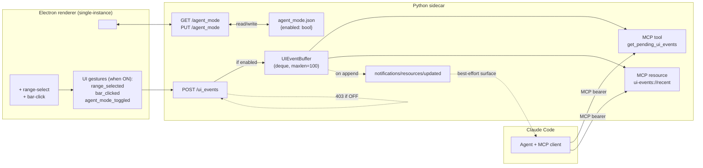

# 0014 — Interactive chart + agent-mode toggle: bidirectional MCP via resources + notifications

> **Status:** in-progress
> **Created:** 2026-05-22
> **Approved:** 2026-05-22
> **Owner skill(s):** `dev`, `ui-builder`, `human`
> **Related ADRs:** [ADR-0021](../adrs/0021-renderer-to-agent-feedback.md) (this plan's gating decision), [ADR-0017](../adrs/0017-live-ui-updates-via-sse.md) (sidecar→renderer SSE; explicitly leaves renderer→agent out of scope), [ADR-0014](../adrs/0014-mcp-as-second-sidecar-protocol.md) (MCP transport + dual-bearer middleware), [ADR-0015](../adrs/0015-claude-code-primary-control-surface.md) (the agent is the primary control surface — this plan closes the feedback loop), [ADR-0020](../adrs/0020-shared-data-dir-contract.md) (the new `agent_mode.json` lives in the canonical data dir), [ADR-0011](../adrs/0011-bearer-secret-transport.md) (renderer bearer gates the new POST route)

## TL;DR

Close the renderer→agent feedback loop Plan 0007 deliberately left open. The user gets a chart-header toggle button labelled "Agent mode" (default OFF); when ON, three gestures send typed events to the sidecar's MCP buffer: drag-to-select a date range, click a candle, flip the toggle itself. The agent reads those events two ways — by calling a new MCP tool `get_pending_ui_events(since=None, drain=True)` (reliable), or by being notified via `notifications/resources/updated` on the new MCP resource `ui-events://recent` (best-effort, faster if the client surfaces it). All three UI-event types are versioned envelopes mirroring ADR-0017's shape. Server-side enforcement: `POST /ui_events` is 403 when the toggle is OFF. Single-instance Electron is enforced now (`app.requestSingleInstanceLock()`); two viewers would create ambiguous agent-mode state. First user-visible behaviour: flip the toggle ON, drag-select a range on AAPL daily, ask Claude "what happened in this range?" — Claude calls `get_pending_ui_events`, sees the range, answers from cached bars without you naming the dates.

## Context & problem

Plan 0007's close-ceremony Followups (2026-05-22) recorded:

> Interactive chart with agent-mode toggle (architectural, needs its own plan). User wants pan/zoom plus drag-to-select-range with notification back to the agent, gated by a user-toggleable agent mode. Bidirectional protocol (renderer → sidecar → agent) was explicitly out of scope per "What this plan does NOT do" — needs a new ADR (WebSocket vs reverse-HTTP vs polling) and a plan covering interactive mode + mode toggle + the new event flow. Queued as Plan 0014.

[ADR-0017](../adrs/0017-live-ui-updates-via-sse.md) explicitly punted the reverse direction: "No mechanism to push to the agent. Events flow sidecar→renderer only. … We accept this — the agent-side control of the conversation is the design intent; renderer→agent feedback is a future WebSocket plan if needed."

The user's concrete asks:

1. **Drag-to-select.** The user circles a region on the chart; the agent picks up the date range and can answer "what happened in this range?", "find patterns here", "backtest the strategy starting here", etc., without the user having to retype the date range in chat.
2. **Bar-click.** Click a single candle to ask the agent "what's special about this bar?". One-shot question, one-click ergonomics.
3. **User consent.** The user does NOT want pan/zoom and clicks silently forwarded to the agent — there's a privacy/expectation cost to "every gesture goes to Claude". The toggle is the consent surface; default OFF.

[ADR-0021](../adrs/0021-renderer-to-agent-feedback.md) (proposed alongside this plan) is the gating architectural decision: use MCP resources + `notifications/resources/updated` for the sidecar→agent leg (best-effort push), with an MCP tool as the reliable polling alternative; reuse the existing renderer→sidecar HTTP transport with a new POST endpoint; gate the whole flow on a sidecar-resident agent-mode boolean.

This plan implements ADR-0021 and lands the renderer's interactive affordances. It also enforces single-instance Electron — agent-mode is sidecar-resident state, and two viewers writing to the same toggle would create UX confusion; the architect's reading is that the cost of closing Plan 0007's "two viewers OK" allowance is lower than the cost of making agent-mode per-viewer.

## Decision

Four phases, three skills.

1. **Backbone — UI event vocabulary, agent-mode state, `POST /ui_events`** (phase 1, `dev`). Three new typed envelope payloads (`ui.range_selected v1`, `ui.bar_clicked v1`, `ui.agent_mode_toggled v1`); a new bounded ring-buffer (`collections.deque(maxlen=100)`) holding them; a new `agent_mode.json` file at `<data-dir>/agent_mode.json` with `{enabled: bool}` (default `False`); three new routes — `GET /agent_mode`, `PUT /agent_mode` (renderer-bearer-gated, persisting the new state and emitting a `ui.agent_mode_toggled` event into the buffer), `POST /ui_events` (renderer-bearer-gated; rejects with 403 when mode is OFF; otherwise appends to the buffer). No MCP surface yet — the buffer is internal.

2. **Agent surface — MCP tool + MCP resource + resource-update notification** (phase 2, `dev`). New MCP tool `get_pending_ui_events(since: datetime | None = None, drain: bool = True)` returning the buffered events as a JSON list; new MCP resource at URI `ui-events://recent` whose `resources/read` returns the same list as the tool (without draining); on every buffer append, fire `notifications/resources/updated` for the resource URI via the FastMCP server's session manager. The tool path is the contract; the notification path is best-effort.

3. **Renderer — toggle button, range-select gesture, bar-click, single-instance** (phase 3, `ui-builder`). New `<AgentModeToggle>` component pinned to the chart header (top-right corner, beside Plan 0013's backfill spinner); wires to `GET /agent_mode` on mount and `PUT /agent_mode` on click. Range-select gesture: drag the mouse with shift held (or a dedicated "select-range" cursor mode toggled by a small adjacent button) and on mouse-up POST the resulting `[start, end]` to `/ui_events`. Bar-click gesture: subscribe to `lightweight-charts`'s click events; on click, identify the bar at the click position and POST. All three POSTs are conditional on the toggle being ON — defence in depth pairs renderer-side gating with the server-side 403. Single-instance enforcement: `app.requestSingleInstanceLock()` in `desktop/electron/main.ts`; second-instance launch focuses the existing window.

4. **End-to-end smoke** (phase 4, `human`). With Claude Code, the user verifies: drag-select on AAPL daily, ask "what happened in this range?" — Claude calls `get_pending_ui_events`, sees the range, summarises from the cached bars. Click a candle, ask "anything notable about this bar?" — same loop. Flip the toggle OFF, drag again — the agent sees nothing (and a follow-up call to `get_pending_ui_events` returns an empty list because no events were buffered).

Two alternatives were rejected at interview: (a) "blocking `wait_for_ui_event(timeout)` tool" — rejected as the primary mechanism because it pins an MCP session slot per outstanding wait; documented in ADR-0021 as a follow-up option. (b) "WebSocket bidirectional channel" — rejected because the renderer→sidecar leg doesn't need full duplex and the sidecar→agent leg should not invent a new transport; both rejected in ADR-0021. The "two viewers OK" assumption from Plan 0007 is reversed — single-instance is mandatory in this plan because agent-mode is sidecar-resident state and two viewers would create write contention on a single toggle.

## Architecture diagram



The buffer is the only new in-memory data structure. Everything else is either a route, a tool, or a UI affordance. The dotted arrow from `McpNotify` to `Agent` is the "best-effort" part of ADR-0021 — surfacing depends on the client's behaviour.

## Implementation phases

Each phase is one commit. Cross-skill handoff at the phase 2 → 3 boundary and at the phase 3 → 4 boundary per the [cross-skill handoff protocol](../../../.claude/skills/architect/references/templates/cross-skill-handoff.md). Done-when conditions name the behavioural claim each test defends, not the file paths.

### Phase 1 — UI event vocabulary + agent-mode state + `POST /ui_events`

- **Owner skill:** `dev`
- **What:** Land the typed UI-event payload models, the persisted agent-mode boolean, the buffer, and the three new HTTP routes. No MCP surface yet — the buffer is in-process state. The route handlers and the buffer are wired through `app.state` (mirroring the `event_bus` and `provider` pattern from Plan 0007).
- **Files touched:** new `src/market_analyser/api/ui_events/__init__.py` (payload models, `UI_EVENT_TYPE_REGISTRY`, the envelope shape); new `src/market_analyser/api/ui_events/buffer.py` (`UIEventBuffer` class); new `src/market_analyser/api/ui_events/agent_mode.py` (read/write to `agent_mode.json`, atomic write + 0600 mode on POSIX); new `src/market_analyser/api/routes/agent_mode.py` (`GET` + `PUT`); new `src/market_analyser/api/routes/ui_events.py` (`POST`); `src/market_analyser/api/app.py` (instantiate buffer + agent-mode store at `create_app`, bind to `app.state`, register routes); new `tests/api/test_ui_events_routes.py`; new `tests/api/test_ui_event_buffer.py`; new `tests/api/test_agent_mode_persistence.py`.
- **Done when:**
  - `tests/api/test_ui_event_buffer.py` asserts:
    - `UIEventBuffer(maxlen=3)` accepts three valid envelopes and `snapshot()` returns them in append order with the same `event_id`s, `ts` values, and payloads. Each envelope has a unique `event_id` (UUID v4 string).
    - A fourth `append(...)` drops the first envelope (drop-oldest); `snapshot()` returns the last three.
    - `drain(since=None)` returns all envelopes AND empties the buffer in one call. A subsequent `snapshot()` returns `[]`.
    - `drain(since=<ts of envelope 2>)` returns envelopes 3 and 4 (strict-greater-than `since`); envelopes 1 and 2 remain in the buffer.
    - `peek(since=None)` returns the same data as `drain()` but does NOT empty the buffer.
    - Two consecutive `append(...)` calls fire any registered `on_append` callback exactly twice with the appended envelope as the argument. (This is the seam phase 2 uses to publish the MCP resource-update notification.)
    - Concurrent appends from two `asyncio.Task`s do not interleave envelopes (the buffer's writes are serialised — use an `asyncio.Lock` or rely on Python's GIL + `deque`'s atomic append; implementer picks; the test asserts the result is one of the two legal orderings, no envelopes lost).
  - `tests/api/test_agent_mode_persistence.py` asserts:
    - Fresh sidecar with no `agent_mode.json` reads as `{enabled: false}`.
    - `set_enabled(true)` writes `agent_mode.json` with `{enabled: true}`; file mode is `0o600` on POSIX (skip on Windows with the same skip reason used elsewhere — "Windows file modes don't map per Plan 0006 phase 1"). A new sidecar reading the file sees `{enabled: true}`.
    - `set_enabled(false)` rewrites the file. `agent_mode.json.tmp` is atomically renamed (assert the temp file does not exist after the write).
    - Reading `agent_mode.json` with a malformed body (e.g. `{}` missing the `enabled` key, or invalid JSON) returns the default `{enabled: false}` and logs a WARN — never crashes the sidecar boot.
  - `tests/api/test_ui_events_routes.py` asserts:
    - `GET /agent_mode` with the renderer bearer returns `{enabled: false}` on a fresh sidecar.
    - `GET /agent_mode` with no bearer returns 401. With the MCP bearer returns 401 (cross-tenant).
    - `PUT /agent_mode` with body `{"enabled": true}` and the renderer bearer returns 200 with the new state; a subsequent `GET /agent_mode` returns `{enabled: true}`; the buffer's `snapshot()` now contains exactly one `ui.agent_mode_toggled v1` envelope with `payload.enabled = true`.
    - `PUT /agent_mode` with body `{"enabled": "yes"}` (wrong type) returns 422 (Pydantic validation).
    - `POST /ui_events` with a valid `ui.range_selected v1` envelope while mode is OFF returns 403 with body `{"detail": "agent mode is off"}`. The buffer is unchanged.
    - `POST /ui_events` with the same envelope while mode is ON returns 202 (accepted) with body `{event_id: "<uuid>"}`; the buffer's `snapshot()` contains exactly that envelope.
    - `POST /ui_events` with `type="ui.something_unknown"` returns 422 (rejected at the boundary — closed type set).
    - `POST /ui_events` with `payload` failing the per-type Pydantic model (e.g. `range_selected` with `range_end < range_start`) returns 422.
    - `POST /ui_events` with no bearer returns 401; with the MCP bearer returns 401 (cross-tenant).
    - The `POST /ui_events` envelope includes a server-generated `event_id` (UUID v4) and `ts` (UTC `datetime.now()`); the renderer does not supply these.
  - The buffer + agent-mode store are constructed by `create_app(...)` (or by a small factory called by it) and bound to `app.state.ui_event_buffer` + `app.state.agent_mode_store`. Existing tests for `create_app` continue to pass.

### Phase 2 — MCP tool `get_pending_ui_events` + MCP resource `ui-events://recent` + resource-update notification

- **Owner skill:** `dev`
- **What:** Add the agent-facing MCP surface. The tool `get_pending_ui_events(since: datetime | None = None, drain: bool = True)` returns the buffered envelopes as a JSON list, optionally draining. The resource `ui-events://recent` (registered via FastMCP's `@server.resource(...)`) returns the same list on `resources/read`. On every buffer append, the FastMCP server fires `notifications/resources/updated` for the `ui-events://recent` URI; the buffer's `on_append` callback is the seam (registered in `create_mcp_components` at app construction). The tool docstring tells the agent: (a) this returns recent UI events; (b) you can also `resources/read` `ui-events://recent` and subscribe to its updates; (c) events fire only when agent mode is ON; (d) consecutive draining reads return disjoint sets.
- **Files touched:** `src/market_analyser/api/mcp_app.py` (register the tool + the resource + wire the `on_append` notification publisher); possibly a small adapter in `src/market_analyser/api/ui_events/__init__.py` to translate buffer envelopes to the MCP wire shape; new `tests/api/test_ui_events_mcp.py`.
- **Done when:**
  - `tests/api/test_ui_events_mcp.py` asserts:
    - Calling `get_pending_ui_events()` (no args; defaults `since=None`, `drain=True`) on an empty buffer returns `[]`. The buffer remains empty.
    - With three envelopes in the buffer, `get_pending_ui_events()` returns all three in append order with their `type`, `version`, `ts`, `payload`, and `event_id` fields. The buffer is empty afterwards (drained).
    - `get_pending_ui_events(drain=False)` returns the same three envelopes; the buffer still has all three.
    - `get_pending_ui_events(since=<ts of envelope 2>)` returns envelopes 3 only (strict-greater-than). With `drain=True`, envelopes 1 and 2 remain in the buffer; envelope 3 is consumed.
    - The tool's docstring (read via the same mechanism Plan 0013 phase 2 uses) contains the words "agent mode" and "draining" and the URI `ui-events://recent` — the agent's mental model is set without trial-and-error.
    - The MCP resource `ui-events://recent` is listed in `resources/list` with a non-empty `description`.
    - `resources/read` for `ui-events://recent` returns the buffer's `peek()` (does NOT drain). Two consecutive reads return the same data.
    - On every `buffer.append(...)`, the FastMCP session manager's `send_resource_updated(...)` (or whatever the SDK names it; implementer pins the exact API at phase start and documents in the commit) is called with the `ui-events://recent` URI. Assert via a spy on the session manager. The notification fires once per append; multiple appends produce multiple notifications.
    - The notification publisher tolerates "no MCP session connected" gracefully — appending to the buffer with no MCP client subscribed does NOT raise (it may log at DEBUG).
    - The pre-existing MCP tools (`get_ohlcv`, `write_annotation`, `list_annotations`, `show_chart`, `update_chart`, `highlight_pattern`) still pass their Plan 0006 + Plan 0007 + Plan 0013 tests (regression check).
  - The MCP tool path works whether or not the resource-update notification is surfaced by the client. The phase commit message explicitly notes whether Claude Code's MCP client surfaces `notifications/resources/updated` to the model in the SDK version pinned at the time of the commit — this is the open question ADR-0021 flagged.

### Phase 3 — Renderer: toggle button + range-select gesture + bar-click + single-instance

- **Owner skill:** `ui-builder`
- **What:** Land the renderer-side interactive affordances and the single-instance lock. New `<AgentModeToggle>` component pinned to the chart header (top-right). On mount: GET `/agent_mode` via the existing typed client; render the toggle reflecting the response. On click: PUT `/agent_mode` with the inverted state; update local state on success. Range-select gesture in `<CandlestickChart>`: a small adjacent button toggles a "select-range" cursor mode (escape exits; clicking again exits). In select-range mode, mouse-down + drag + mouse-up POSTs the resulting `[start_ts, end_ts]` to `/ui_events` only if agent mode is ON. Bar-click gesture: subscribe to `lightweight-charts`'s click events; on click while agent mode is ON, identify the bar at the click coordinate and POST `ui.bar_clicked v1`. Single-instance enforcement: `app.requestSingleInstanceLock()` in `desktop/electron/main.ts` near the app bootstrap; on lock failure, quit. Register a `second-instance` handler that focuses the existing main window.
- **Files touched:** new `desktop/renderer/components/AgentModeToggle.tsx`; new TS types mirroring the three payload shapes (placement follows existing `desktop/renderer/types/sidecar/` convention); new `desktop/renderer/hooks/useAgentMode.ts` (encapsulates GET on mount + PUT on toggle + exposes `{enabled, setEnabled}`); `desktop/renderer/components/CandlestickChart.tsx` (range-select mode + bar-click); new `desktop/renderer/api/uiEvents.ts` (thin wrapper around the typed fetch client for `POST /ui_events`); `desktop/renderer/views/OhlcvView.tsx` (mount the toggle in the chart header); `desktop/electron/main.ts` (single-instance lock + `second-instance` handler); new `desktop/tests/AgentModeToggle.spec.tsx`; new `desktop/tests/useAgentMode.spec.tsx`; extend `desktop/tests/CandlestickChart.overlays.test.tsx` (or a sibling) for the gestures; extend `desktop/tests/main/sidecar-supervisor.spec.ts` (or wherever Electron-main behaviour is currently tested) for the single-instance lock; extend `desktop/tests/e2e/live-chart.spec.ts` for the end-to-end gesture-to-event-POST loop.
- **Done when:**
  - `desktop/tests/useAgentMode.spec.tsx` asserts:
    - On mount, the hook calls `GET /agent_mode` exactly once (assert via a mocked fetch client). The returned `enabled` state matches the server's response.
    - Calling the returned `setEnabled(true)` invokes `PUT /agent_mode` with body `{enabled: true}` exactly once. On 200 response, the hook's `enabled` flips. On 4xx/5xx, the hook does NOT flip and the error is exposed.
    - The hook does NOT call `PUT` on mount; only `GET`. (The toggle persists; we don't reset on mount.)
  - `desktop/tests/AgentModeToggle.spec.tsx` asserts:
    - The component renders a button with `data-testid="agent-mode-toggle"` and an accessible label (`aria-label="Toggle agent mode"` or equivalent — checked via testing-library's `getByRole('switch', ...)`).
    - When `enabled === false`, the button's `aria-checked` is `"false"` and its visible text/icon indicates OFF.
    - Clicking the button calls the hook's `setEnabled` with the inverted value.
    - The toggle is positioned via `data-region="chart-header-right"` (or the existing region naming convention) — the layout test confirms it lives in the chart header, not in the sidebar.
  - `desktop/tests/CandlestickChart.overlays.test.tsx` (or sibling) asserts:
    - With agent mode OFF, dragging a range on the chart does NOT call the `POST /ui_events` fetch (assert call count 0).
    - With agent mode ON and select-range cursor mode active, a simulated drag from bar A's x-coordinate to bar B's x-coordinate followed by mouse-up calls `POST /ui_events` exactly once with body matching `{type: "ui.range_selected", version: 1, payload: {range_start: <A.ts>, range_end: <B.ts>}}`.
    - With agent mode ON and select-range cursor mode INACTIVE (default), a drag does NOT POST (the drag is for pan/zoom as today).
    - With agent mode ON, a single click on a bar calls `POST /ui_events` with `{type: "ui.bar_clicked", payload: {event_ts: <bar.ts>, open, high, low, close}}`.
    - With agent mode OFF, a click does NOT POST.
    - Releasing Escape during a range-select cancels the in-progress selection (no POST).
  - `desktop/tests/main/sidecar-supervisor.spec.ts` (or a new `desktop/tests/main/single-instance.spec.ts`) asserts:
    - On `app` boot, `requestSingleInstanceLock()` is called exactly once.
    - When the lock is acquired (return `true` from the mock), the app proceeds to create a window.
    - When the lock is NOT acquired (return `false`), the app calls `app.quit()` and does NOT create a window.
    - When a `second-instance` event fires, the existing main window's `focus()` is called (assert via a spy on the window).
  - `desktop/tests/e2e/live-chart.spec.ts` gains a new case:
    - With the app open and agent mode ON, simulate a drag on the chart (Playwright mouse API). Then via the test's MCP-client seam call `get_pending_ui_events()`. The result includes exactly one envelope of type `ui.range_selected v1` whose payload's `range_start`/`range_end` align with the dragged bars (tolerance: ±1 bar — chart coordinate-to-bar resolution is bar-width precision).
    - With agent mode OFF, the same drag produces zero buffered events (assert `get_pending_ui_events()` returns `[]`).
  - Manual verification (in the phase commit message): open the app, flip the toggle ON, drag-select a range on AAPL daily, observe the chart's visual highlight for the selected range; then via the dev console (`window.api`-exposed seam, NOT a new IPC channel) confirm a recent `POST /ui_events` 202 lined up with the drag-end timestamp.

### Phase 4 — End-to-end smoke

- **Owner skill:** `human`
- **What:** With Claude Code connected to the running sidecar, verify the full loop in conversation.
- **Files touched:** Append to `docs/onboarding/claude-code-setup.md` (created in Plan 0007 phase 5) a new section "Agent mode and UI gestures" describing the toggle's location, the three gesture types, and one example agent prompt the user can paste to test it.
- **Done when:**
  - Sidecar running, Electron viewer open, agent mode toggle visible in the chart header (flip it ON).
  - User drag-selects a range on AAPL daily covering ~14 days. The chart visually highlights the selection.
  - User to Claude Code: "what happened in the range I just selected?" — Claude calls `get_pending_ui_events`, sees one `ui.range_selected v1` envelope, and answers from the cached bars (high/low/open/close summary; not a buy/sell recommendation). Confirmed by visual inspection of Claude's tool-call trace + the reply content.
  - User clicks a single bar near a visible swing. To Claude: "anything notable about this bar?" — Claude calls `get_pending_ui_events`, sees one `ui.bar_clicked v1` envelope, and answers from the bar's OHLC.
  - User flips the toggle OFF. User drags another range. To Claude: "what about that range?" — Claude calls `get_pending_ui_events`, gets `[]`, and tells the user it sees no recent UI events (or asks the user to flip agent mode on and try again — agent UX is up to the agent's general instructions, not this plan).
  - Two-Electron test: try to launch a second `pnpm dev` (or equivalent dev-mode Electron start) while one is running. The second exits non-zero; the first window comes to the foreground.
  - Resource-update surfacing check (informational, NOT pass/fail): with agent mode ON, drag-select a range and observe whether Claude Code shows any indication of a server-pushed notification (e.g. a "resource updated" trace line, an automatic tool call without the user asking). Record the result in the smoke log so we know whether the best-effort push path actually does anything end-to-end in the current Claude Code build. If yes, future plans can lean on it; if no, the polling tool is the only mechanism.
  - At the boundary, `human` stops and hands back to the user for the architect close ceremony (no auto-handoff for `human` phases).

## Data shapes

```python
# Phase 1 — src/market_analyser/api/ui_events/__init__.py

class RangeSelectedPayloadV1(BaseModel):
    VERSION: ClassVar[int] = 1
    model_config = ConfigDict(frozen=True, extra="forbid")
    symbol: str
    timeframe: str
    range_start: datetime
    range_end: datetime


class BarClickedPayloadV1(BaseModel):
    VERSION: ClassVar[int] = 1
    model_config = ConfigDict(frozen=True, extra="forbid")
    symbol: str
    timeframe: str
    event_ts: datetime
    open: float
    high: float
    low: float
    close: float


class AgentModeToggledPayloadV1(BaseModel):
    VERSION: ClassVar[int] = 1
    model_config = ConfigDict(frozen=True, extra="forbid")
    enabled: bool


UI_EVENT_TYPE_REGISTRY: dict[str, type[BaseModel]] = {
    "ui.range_selected": RangeSelectedPayloadV1,
    "ui.bar_clicked": BarClickedPayloadV1,
    "ui.agent_mode_toggled": AgentModeToggledPayloadV1,
}


class UIEventEnvelope(BaseModel):
    """Buffered envelope. Mirrors ADR-0017's shape, adds event_id for dedup."""
    model_config = ConfigDict(frozen=True)
    event_id: str            # server-generated UUID v4
    type: str
    version: int
    ts: datetime             # server-generated at POST time
    payload: dict[str, Any]


# Phase 1 — src/market_analyser/api/ui_events/buffer.py

class UIEventBuffer:
    def __init__(self, *, maxlen: int = 100) -> None: ...
    def append(self, envelope: UIEventEnvelope) -> None: ...
    def snapshot(self) -> list[UIEventEnvelope]: ...
    def drain(self, since: datetime | None = None) -> list[UIEventEnvelope]: ...
    def peek(self, since: datetime | None = None) -> list[UIEventEnvelope]: ...
    def on_append(self, callback: Callable[[UIEventEnvelope], None]) -> None: ...
```

```json
// agent_mode.json (data dir, mode 0600)
{
  "enabled": false
}
```

```python
# Phase 2 — MCP tool surface (illustrative)

@server.tool(description="Read recent UI events from the renderer. Returns events buffered while agent mode is ON. ...")
def get_pending_ui_events(since: datetime | None = None, drain: bool = True) -> list[UIEventEnvelope]:
    if drain:
        return buffer.drain(since=since)
    return buffer.peek(since=since)


@server.resource("ui-events://recent", description="Most recent UI events from the renderer (non-draining). ...")
def read_recent_ui_events() -> str:
    # FastMCP serialises the return; the exact shape depends on the SDK version.
    return json.dumps([env.model_dump(mode="json") for env in buffer.peek()])
```

The MCP-tool wire types mirror the buffer envelope. The MCP-resource wire type is whatever FastMCP's resource API expects — implementer pins this at phase 2 start and documents in the commit.

## Risks & open questions

- **Risk: MCP client (Claude Code) does not surface `notifications/resources/updated` to the model.** This is ADR-0021's main open question. Mitigation: the MCP tool is the reliable path; the resource + notification is best-effort. Phase 4 smoke records observed behaviour so a future plan can decide whether to invest more (e.g. blocking `wait_for_ui_event` tool) or accept the polling-only UX.
- **Risk: FastMCP SDK's notification API changes between pinned versions.** The exact call shape for "publish a resource-update notification outside a tool call" depends on the SDK. Phase 2 implementer pins the API and documents in the commit. If the SDK requires a dep bump to expose the API, the bump goes through the cooldown policy (ADR-0012) in a single commit alongside phase 2.
- **Risk: range-select gesture conflicts with `lightweight-charts`'s built-in pan/zoom.** The chart consumes mouse drag for panning. The select-range mode toggles a different cursor and intercepts drag before the chart sees it (or the chart's interaction can be disabled in select-range mode). Implementer picks one approach; phase 3 done-when's pan/zoom regression assertion catches a mistake (pan must still work when select-range is off).
- **Risk: bar-click ambiguity when the user clicks on an overlay (EMA line) rather than a bar.** `lightweight-charts`'s click event provides `hoveredSeries`; the renderer should resolve to the candlestick series's bar regardless of which series was hovered. Documented; phase 3 test asserts a click on an overlay still emits `ui.bar_clicked v1` for the underlying bar.
- **Risk: rapid clicks flood the buffer.** With `maxlen=100`, a user clicking 200 bars in rapid succession loses the first 100. Acceptable for MVP; the cap is configurable.
- **Risk: the renderer POSTs `/ui_events` while agent mode is racing OFF.** Sequence: user clicks toggle (PUT flying), drags a range (POST flying). The POST might arrive at the sidecar after the PUT has set `enabled=false`, causing a 403. Renderer-side handling: a 403 from POST `/ui_events` is logged at DEBUG (not error — it's expected during a toggle race) and the gesture is discarded.
- **Risk: single-instance lock conflicts with developer ergonomics.** Developers run multiple `pnpm dev` sessions in parallel for different branches. Mitigation: the lock keys on `app.getName()` (which Plan 0007's amendment set to `market-analyser`); a developer can override via `app.setName('market-analyser-dev2')` in a local env-gated branch, but that's not shipped. In practice, "one viewer per machine" is what we want; if a dev wants a second viewer for testing, they can run the packaged build in addition to the dev one (different `getName()`).
- **Risk: agent-mode state has no audit trail.** A future user wondering "did I have agent mode on at 14:32?" can't tell. Acceptable; if needed, the `ui.agent_mode_toggled v1` events in the buffer carry the timestamps but evaporate on sidecar restart. A persistent audit log is a future-plan refinement.
- **Open question: drain semantics for the resource read vs the tool.** The tool defaults to `drain=True` (consume); the resource read is `peek` (non-consuming). If both are read, the agent might see an event twice (resource read returns it; tool read drains it). The `event_id` field is the dedupe key; the docstring tells the agent to dedupe on it.
- **Open question: should the gesture's `symbol` and `timeframe` come from the renderer or the server?** Renderer knows them (it's the one rendering the chart); we send them in the payload so the agent doesn't need to ask "which chart was this for?". If the renderer can render multiple charts in the future, the symbol+timeframe disambiguates. Phase 1's payload models include them.

## What this plan does NOT do

- **WebSocket transport.** ADR-0021 rejects it; this plan implements ADR-0021. If the polling+notification design proves inadequate, a future plan can promote to WebSocket; the buffer + envelope shape transfers as-is.
- **Persistent UI-event history (SQLite-backed).** The buffer is in-memory only. Sidecar restart clears it. Future use cases (recorded user-study sessions, support diagnostics) can layer persistence on top without changing this plan's seams.
- **Multi-viewer agent-mode (per-viewer toggles).** Single-instance enforcement closes this; agent-mode is one sidecar-resident boolean. A future plan can re-open multi-viewer if the cost-benefit shifts.
- **A blocking `wait_for_ui_event(timeout)` tool.** ADR-0021 documents it as a follow-up if polling+notification proves insufficient. Not in this plan's scope.
- **Pan/zoom event emission.** `ui.range_changed v1` (throttled visible-range emission) was considered at interview and explicitly cut. Pan/zoom is local UX; the agent doesn't need a stream of pan events. The user can drag-select if they want to pull the agent's attention to a specific range.
- **Cross-symbol or cross-timeframe gestures.** The payload carries `symbol` + `timeframe`, but the renderer today only displays one chart at a time. If multi-chart layouts ship later, the payloads already disambiguate; the renderer code is the only place to extend.
- **Visual indication that the agent received the event.** No "agent saw your click" toast or chart-side acknowledgement. The agent's response in chat is the acknowledgement. A future UX refinement can add it.
- **Renaming or restructuring `EventBus`.** The existing sidecar→renderer event bus (Plan 0007) and the new UI-event buffer are intentionally separate: different direction, different lifetime, different consumers. A future architectural refactor could unify them, but the cost-benefit doesn't justify it now.
- **Documentation refresh for ADR-0017's "we may add WebSocket later" line.** ADR-0017 stays as-is; ADR-0021 supersedes the relevant note about renderer→agent feedback. No edit to ADR-0017 is required.

## Followups (after this lands)

Empty at draft time. Architect appends close-ceremony findings here once the plan ships.
