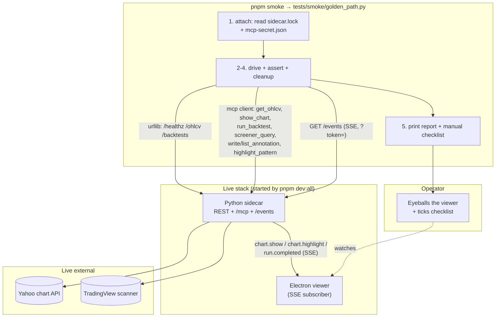

# 0016 — Golden-path smoke for shipped functionality

> **Status:** in-progress
> **Created:** 2026-05-24
> **Approved:** 2026-05-24
> **Owner skill(s):** `dev` (phases 1–2), `human` (phase 3)
> **Related ADRs:** [ADR-0016](../adrs/0016-standalone-sidecar-mode.md) (lockfile attach — the smoke reads the live sidecar's port + bearer), [ADR-0017](../adrs/0017-live-ui-updates-via-sse.md) (`/events` SSE — the smoke subscribes and the SSE-publishing tools feed the live viewer), [ADR-0020](../adrs/0020-shared-data-dir-contract.md) (data-dir contract — where the lockfile + secrets live), [ADR-0014](../adrs/0014-mcp-as-second-sidecar-protocol.md) (MCP transport — the tools the smoke drives), [ADR-0018](../adrs/0018-backtest-result-schema.md) (BacktestResult shape the backtest step asserts), [ADR-0019](../adrs/0019-external-http-adapter-resilience.md) (typed upstream errors the driver uses to distinguish "upstream down" from "our integration broke")
> **Related plans:** [Plan 0015](done/0015-pnpm-dev-all.md) (`pnpm dev:all` — the smoke attaches to the sidecar it starts; this plan adds a sibling `pnpm smoke`). No paired ADR — like Plan 0015, this is dev tooling, not a durable architectural tradeoff.

## TL;DR

Add one repeatable command — `pnpm smoke` — that attaches to a running `pnpm dev:all` sidecar and drives a single end-to-end golden path through every shipped layer **against live upstreams**: `/healthz` → `get_ohlcv` (live Yahoo) → `show_chart` → `run_backtest` → `screener_query` (live TradingView) → `write_annotation`/`highlight_pattern` → `/events` SSE liveness, plus the `strategies list` CLI. The automated half asserts the wire-level responses and exits non-zero on the first integration failure; the SSE-publishing tools make the live viewer update so a human can tick a short visual checklist (candles render, equity curve draws, marker lands on the chart). First user-visible payoff: after any change, one command tells you in ~2 minutes whether the spine is still wired together — catching the live-stack and reverse-engineered-upstream breakage that the offline-fixture unit suites structurally cannot.

## Context & problem

The test suites are deep but deliberately hermetic. Plan 0003 and Plan 0009 both call this out explicitly: the Yahoo and TradingView adapters are tested against captured fixtures, and "a CI green against the offline fixture does not mean the live upstream works" ([Plan 0009](done/0009-resilience-and-tradingview-screener.md) risk section). The same gap exists across the stack:

- The **standalone-sidecar attach** path (lockfile read → port + bearer discovery → `/healthz` identity check, [ADR-0016](../adrs/0016-standalone-sidecar-mode.md) / Plan 0007 phase 4.2) is covered by unit tests, but nothing exercises the *whole* discovery sequence against a real running process.
- The **SSE bus → Electron renderer** path (`chart.show` / `chart.highlight` / `run.completed`, [ADR-0017](../adrs/0017-live-ui-updates-via-sse.md)) has renderer-side specs and a Playwright e2e, but no single check confirms an agent-issued tool call lights up the live viewer.
- The **reverse-engineered upstreams** (Yahoo chart API, TradingView scanner) can change shape without notice; the offline fixtures are blind to that by construction.
- The **MCP tool surface** (8 tools across Plans 0006/0007/0008/0009) is each unit-tested in isolation, but no check drives them in sequence the way the agent actually does.

There is a Playwright e2e suite and `pytest -m network` markers, but no one-command "is the shipped product still standing" check a human runs after a change or before tagging a build. This plan adds exactly that — narrow (one golden path), live (real upstreams + real viewer), and hybrid (scripted asserts + a human eyeball for the visual surface).

## Decision

Build a **runnable Python smoke driver** at `tests/smoke/golden_path.py` (not pytest-collected — no `test_` prefix — so the default `pytest tests/` run never hits the network) that:

1. **Attaches** to the live sidecar by reading `<data-dir>/sidecar.lock` (port + renderer bearer, [ADR-0016](../adrs/0016-standalone-sidecar-mode.md)) and `<data-dir>/mcp-secret.json` (MCP bearer, [ADR-0014](../adrs/0014-mcp-as-second-sidecar-protocol.md)) via the existing `market_analyser` data-dir helpers. If no live sidecar is found, it exits with a clear "run `pnpm dev:all` first" message (the hybrid flow needs the viewer up for the visual half).
2. **Drives** the golden path: REST routes via stdlib `urllib` (matching the codebase's no-`httpx`-in-our-code convention — `__main__.py`'s `stop` already does this), and MCP tools via the `mcp` package's Streamable-HTTP client against `/mcp` with the MCP bearer.
3. **Asserts** each step's wire response, printing one `PASS`/`FAIL`/`UPSTREAM-DOWN` line per step. It distinguishes *our integration broke* (assertion failure → exit 1) from *the upstream is unavailable* (typed `ResilientHttpError` / 5xx → flagged `UPSTREAM-DOWN`, non-fatal but reported) using [ADR-0019](../adrs/0019-external-http-adapter-resilience.md)'s error surface.
4. **Cleans up** the annotation(s) it writes (precedent: commit `3a87b06`, "purge e2e annotations on Playwright teardown") so repeat runs don't accumulate state.
5. **Prints a manual checklist** at the end for the visual items the script can't assert.

`pnpm smoke` (new root `package.json` script) shells `uv run python tests/smoke/golden_path.py`, giving the one-command UX without adding a Node MCP-client dependency.

**Rejected at planning time:** (a) *Automated-harness-only via Playwright + `pytest -m network`* — rejected because it can't confirm visual correctness ("the chart looks right"), which is half of what a desktop smoke needs; the user chose the hybrid form. (b) *Manual runbook only* — rejected as not repeatable and not exit-code-able; the wire-level breakage should be caught by a script, not a human reading JSON. (c) *Per-capability matrix* — rejected as out of scope for v1; a golden path proves the spine at a fraction of the maintenance cost. (d) *A Node `smoke.mjs` driving MCP* — rejected because it needs a new `@modelcontextprotocol/sdk` Node dependency (cooldown + pinning friction, [ADR-0012](../adrs/0012-dependency-cooldown.md)/[ADR-0013](../adrs/0013-pin-direct-dependencies.md)); the `mcp` Python client is already in the dep tree.

## Architecture diagram

The smoke is a **client of the running stack**, not a new component inside it. It speaks the same two protocols the real clients use: REST (the renderer's surface) and MCP (the agent's surface). Because `show_chart` / `highlight_pattern` / `run_backtest` publish to the SSE bus, the live viewer updates while the script runs — so the human watches real frames land, not a mock.

## Implementation phases

Each phase is one commit. The [`feedback_tests_are_acceptance_criteria`](../../../.claude/skills/architect/references/templates/cross-skill-handoff.md) rule applies: every done-when is a behavioral claim defended by a concrete assertion or a reproducible command.

### Phase 1 — Smoke driver + step assertions

- **Owner skill:** `dev`
- **What:** Build `tests/smoke/golden_path.py` as a runnable module (`if __name__ == "__main__"`). It attaches to the live sidecar, runs the ordered golden-path steps below, prints a one-line `PASS`/`FAIL`/`UPSTREAM-DOWN` result per step, cleans up the annotations it created, and exits non-zero if any step is `FAIL`. Pure helpers (lockfile/secret parsing, the report formatter, the upstream-vs-assertion error classifier) live in small functions so they're unit-testable without network. Confirm at phase start that `mcp.client.streamable_http.streamablehttp_client` (or the installed `mcp` version's equivalent) is importable; if the client API differs, fall back to raw JSON-RPC POSTs over `urllib` against `/mcp` and note the choice in the commit message.
- **Golden-path steps (each layer once, ordered so the cache is warm before it's read):**
  1. **Attach + health.** Read `<data-dir>/sidecar.lock` + `<data-dir>/mcp-secret.json`; `GET /healthz` → `200` and the returned `data_dir` matches the lockfile's data-dir (ADR-0016/0020 identity check). `FAIL` if no lockfile, non-200, or data-dir mismatch.
  2. **OHLCV (live Yahoo).** MCP `get_ohlcv(symbol="AAPL", timeframe="1d", start, end)` over a fixed recent window → ≥ 1 bar; each bar's OHLC are finite positive floats, `volume ≥ 0`, `event_ts` in window. Live upstream = Yahoo. Populates the SQLite cache for step 4.
  3. **Chart render → viewer.** MCP `show_chart("AAPL", "1d", range_start, range_end)` → `{event_published: true, type: "chart.show"}`. (Visual confirmation is a manual-checklist item.)
  4. **Backtest (deterministic window).** MCP `run_backtest` with a reference strategy (`rsi`) on `AAPL`/`1d` over a **fixed historical window** (e.g. `2026-01-01`→`2026-03-01`, both past, so the cached bars are stable) → a `BacktestResult` whose metrics are present and finite (no `NaN`/`inf` in sharpe/max_drawdown), `equity_curve` non-empty, `trades` count ≥ 0 ([ADR-0018](../adrs/0018-backtest-result-schema.md) shape). **Determinism sub-assert:** call it twice with the identical window and assert the two `result.json` payloads are byte-identical (the Plan 0008 determinism guarantee, smoked without depending on live values). Publishes `run.completed` to SSE.
  5. **Screener (live TradingView).** MCP `screener_query(filters={"RSI": {"lt": 35}}, market="america", exchange="NASDAQ", limit=5)` → 1–5 rows, each with a non-empty `symbol`, and a `queried_at` timestamp present. Live upstream = TradingView.
  6. **Annotation roundtrip + highlight.** MCP `write_annotation("AAPL", "1d", event_ts, kind="bullish", label="smoke", agent_id="smoke")` → persisted record with an id; `list_annotations("AAPL","1d",start,end)` contains it; `highlight_pattern(...)` → `{event_published: true, type: "chart.highlight"}` (publishes to SSE → marker on the live chart). Record the created id(s) for cleanup.
  7. **SSE liveness.** Open `GET /events?token=<renderer-bearer>` *before* steps 3–6 (background reader thread); after they run, assert the reader observed at least the `chart.show`, `run.completed`, and `chart.highlight` frames within a generous timeout. Proves the bus is live end-to-end (ADR-0017).
  8. **CLI.** Shell `uv run market-analyser strategies list --json` → parses to ≥ 6 strategy rows with sorted, unique ids ([Plan 0002](done/0002-strategy-interface.md)). (This is the one step that does not need the running sidecar.)
  9. **Cleanup.** Delete the annotation id(s) created in step 6 (via the repository or a `DELETE`/stop path) so a re-run starts clean. `FAIL` loudly if cleanup leaves residue.
- **Files touched:**
  - New `tests/smoke/golden_path.py` (the driver + steps + report).
  - New `tests/smoke/__init__.py`.
  - New `tests/smoke/test_golden_path_helpers.py` (offline unit coverage of the pure helpers — no network, IS pytest-collected).
- **Done when:**
  - `tests/smoke/golden_path.py` is importable and `python -c "import tests.smoke.golden_path"` (or equivalent) does not require network at import time (all I/O is inside `main()`).
  - `test_golden_path_helpers.py` asserts: the lockfile/secret parser returns the right `(port, renderer_bearer, mcp_bearer, data_dir)` from a fixture lockfile + secret file and raises a clear error when the lockfile is absent; the report formatter renders `PASS`/`FAIL`/`UPSTREAM-DOWN` lines and the final exit code is `1` iff any step is `FAIL` (a step that is only `UPSTREAM-DOWN` exits `0` with a warning); the error classifier maps a `ResilientHttpError`/5xx to `UPSTREAM-DOWN` and an assertion mismatch to `FAIL`. These run under the normal `uv run pytest` with no network.
  - The step functions each take the connected clients as arguments (no module-level global state) so the helper test can exercise the report path with stubbed step results.
  - `uv run pytest tests/smoke/test_golden_path_helpers.py` passes; mypy `--strict` clean on the new files.
  - The driver is **not** collected by `uv run pytest tests/` (verify: the default collection count is unchanged from before this phase).

### Phase 2 — `pnpm smoke` wiring + manual checklist

- **Owner skill:** `dev`
- **What:** Wire the one-command entrypoint and document the human half. Add a `"smoke": "uv run python tests/smoke/golden_path.py"` script to the root `package.json` (next to `dev:all`). Have the driver print, after its automated report, a condensed manual checklist; and add a fuller **"Smoke check"** section to `docs/onboarding/claude-code-setup.md` (the canonical Claude-Code workflow doc) covering the run sequence and the visual items.
- **Files touched:**
  - `package.json` (root): add the `smoke` script.
  - `tests/smoke/golden_path.py`: append the printed manual-checklist tail (the list below).
  - `docs/onboarding/claude-code-setup.md`: new "Smoke check" section.
- **Done when:**
  - `pnpm smoke` (with no sidecar running) exits non-zero and prints the "run `pnpm dev:all` first" message — i.e. the script is reachable through pnpm and fails closed. (Full green requires the live stack; that's phase 3.)
  - The driver's printed tail and the doc section both list the manual visual checklist with at least these four items: (1) the viewer shows AAPL daily candles after step 3; (2) a bullish marker appears on the AAPL chart after step 6; (3) the BacktestView shows a non-empty equity curve + metrics after step 4; (4) the screener reply surfaces an "as of HH:MM" wall-clock (the `queried_at` from step 5).
  - The doc section states the run sequence (`pnpm dev:all` in one terminal, `pnpm smoke` in another), that it hits **live** Yahoo + TradingView and is therefore local-only (never a CI gate), and how to read `UPSTREAM-DOWN` vs `FAIL`.

### Phase 3 — Live end-to-end run (human acceptance)

- **Owner skill:** `human`
- **What:** Run the smoke against the real stack once and confirm it works end-to-end — the only step that can validate live upstreams + the real Electron viewer together. (Mirrors the `human` smoke phases that closed Plans 0007 and 0014.)
- **Done when:**
  - With `pnpm dev:all` running, `pnpm smoke` reports every automated step `PASS` (or a clearly-labelled `UPSTREAM-DOWN` if Yahoo/TradingView is genuinely down at run time — re-run later to get a clean pass), and exits `0`.
  - All four manual checklist items visually confirmed in the viewer.
  - The run is reproducible: a second `pnpm smoke` immediately after is also green (proves the cleanup step left no residue and the determinism sub-assert holds).

## Risks & open questions

- **Risk: live upstreams flaky → false red.** Yahoo or TradingView being down fails the smoke for reasons unrelated to our code. Mitigation: the driver classifies typed `ResilientHttpError` / upstream 5xx as `UPSTREAM-DOWN` (reported, non-fatal, exit 0 with a warning) vs. an assertion mismatch as `FAIL` (exit 1). The operator can tell "their problem" from "our problem" at a glance.
- **Risk: annotation residue across runs.** The smoke writes real annotations into the live SQLite. Mitigation: step 9 deletes exactly the ids it created; the helper test covers the "exit 1 if residue remains" path. (Open question: is there a delete path on the repository, or does cleanup need a small `DELETE /annotations/{id}` route? If the latter, that is a one-line `dev` addition — flagged for phase-1 start; prefer the repository method if it exists to avoid widening the HTTP surface.)
- **Risk: `mcp` client API drift.** The installed `mcp` package's client entrypoint may differ from `streamablehttp_client`. Mitigation: phase-1-start check; fall back to raw JSON-RPC over `urllib` (the protocol is stable even if the SDK helper isn't). Recorded in the commit message either way.
- **Risk: backtest determinism sub-assert depends on a stable cached window.** If the fixed historical window is partially uncached on a fresh machine, the first `run_backtest` fetches live and the two calls could differ if a fetch lands between them. Mitigation: step 2 (or an explicit pre-fetch) warms the exact backtest window into the cache before the paired runs, so both reads are cache-only.
- **Risk: smoke drifts as new tools ship.** A golden path that isn't maintained rots. Mitigation: it's small (one file, ~one screen of steps); each Tier-2 plan (0010–0012) that adds an agent-facing tool should add one line to the golden path at its own close. Noted in this plan's Followups so the close ceremonies pick it up.
- **Open question: headless / auto-only mode for a future scheduled run.** Out of scope here (the hybrid form needs a human + viewer). A later plan could add a `--headless` flag that skips the SSE-into-viewer expectations and runs purely as an exit-code check, suitable for a nightly local job. Not v1.
- **Open question: should `pnpm smoke` optionally boot its own headless sidecar when none is running?** v1 requires an already-running `pnpm dev:all` (the visual half needs the viewer anyway). The attach-or-boot variant pairs with the headless mode above — same future plan.

## What this plan does NOT do

- **No CI gate.** Live upstreams + a real viewer mean this is local-only and human-run; it never blocks a push or tag.
- **No per-capability matrix.** Golden path only — one flow, each layer once. `update_chart`, the `/backtests` list view, the Settings reveal/rotate flow, and every error/edge path stay with the unit + e2e suites.
- **No headless / auto-only mode**, no self-booting sidecar — both deferred to a possible future scheduled-smoke plan.
- **No new viewer UI.** No "smoke mode" banner or instrumentation in `desktop/`; the smoke is a pure client of the shipped viewer.
- **No visual regression / screenshot diffing.** The visual half is a human eyeball against a checklist, not pixel comparison.
- **No DeFi, news, or sentiment coverage.** Those tools aren't shipped yet (Plans 0010–0012 are pending); they join the golden path as they land.
- **No replacement of existing suites.** The hermetic unit tests and Playwright e2e stay exactly as they are; this is an additive end-to-end check, not a substitute.

## Assumptions made (not interviewed)

The interview locked the three load-bearing forks: **hybrid** (scripted asserts + manual checklist), **golden-path** scope (one flow), and **live** upstreams. Beyond that:

1. **A Python driver invoked via `pnpm smoke` is acceptable** (vs. a Node script), trading a small "two languages in the smoke" wrinkle for zero new dependencies. Reversible — the script boundary is `package.json`.
2. **The smoke attaches to a `pnpm dev:all` sidecar** rather than booting its own. The visual half needs the viewer, so requiring `dev:all` is natural; the "boot-if-absent" variant is deferred with the headless mode.
3. **`AAPL` / `1d` and `rsi` are fine fixtures** for the golden path — liquid symbol, always-present reference strategy. If `rsi` is renamed or AAPL data gets thin, the driver names them in one place for an easy swap.
4. **A fixed past window makes the backtest determinism sub-assert meaningful.** If the data layer can't serve that window offline on a fresh checkout, step 2 warms it first.

## Followups (after this lands)

Empty at draft time. Architect populates from review findings + implementer notes during the close ceremony. (Pre-seed: each Tier-2 plan that adds an agent-facing MCP tool should add one golden-path line at its close — see Risks.)
