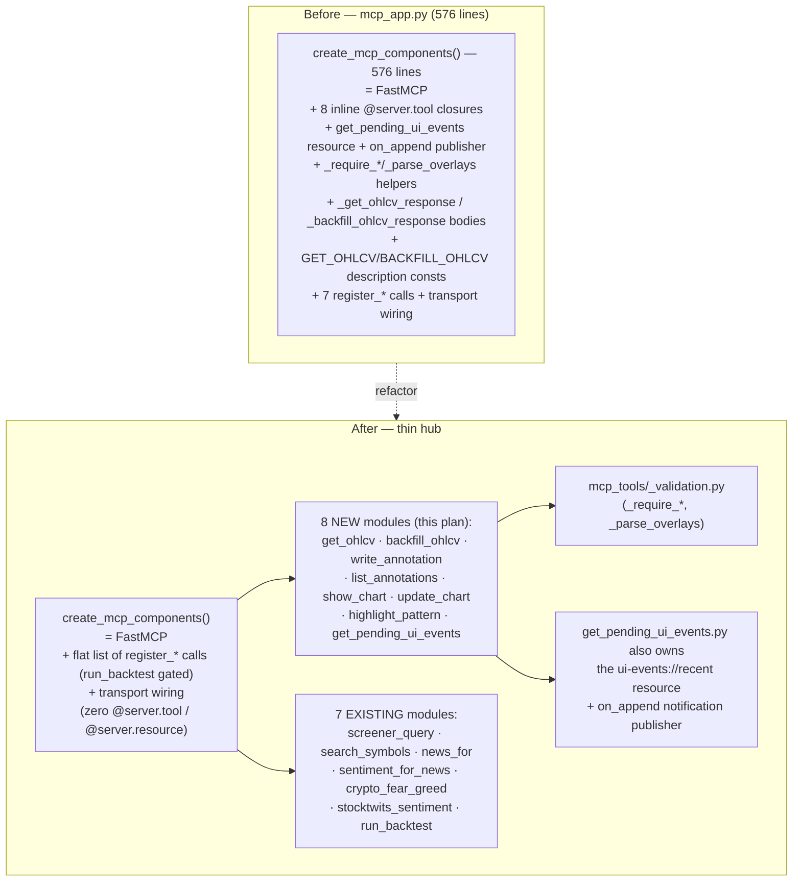

# 0017 — Consolidate MCP tool registration

> **Status:** in-progress
> **Created:** 2026-05-24
> **Amended:** 2026-05-29 (refreshed to current `mcp_app.py` state; added `backfill_ohlcv` (Plan 0013) and `get_pending_ui_events` (Plan 0014) to scope; corrected tool inventory + baselines)
> **Owner skill(s):** `dev` (all phases)
> **Depends on:** [Plan 0014](done/0014-interactive-chart-and-agent-mode.md) — **closed 2026-05-30; this dependency is satisfied.** Plan 0014 added the inline `get_pending_ui_events` tool + `ui-events://recent` resource this plan sweeps into the `register_*` pattern (commits `b5cc6d2` / `7845ecd`), so the extraction target exists in `mcp_app.py` and is stable. The sequencing gate that held this plan (don't interleave two open plans) is now cleared — **0017 is unblocked and pickup-ready.**
> **Related ADRs:** [ADR-0014](../adrs/0014-mcp-as-second-sidecar-protocol.md) (MCP transport — the tools registered here), [ADR-0007](../adrs/0007-market-data-provider.md) (`get_ohlcv` reaches the provider via the Protocol; the boundary is preserved), [ADR-0021](../adrs/0021-renderer-to-agent-feedback.md) (the `get_pending_ui_events` tool + `ui-events://recent` resource being relocated). No new ADR — this implements the *existing* `register_*` pattern established by [Plan 0008](done/0008-backtest-engine-v1.md) (`run_backtest`) and [Plan 0009](done/0009-resilience-and-tradingview-screener.md) (`screener_query`); it does not introduce a new decision.

## TL;DR

Eight MCP tools are still defined as inline `@server.tool` closures inside the 576-line `create_mcp_components` factory in `src/market_analyser/api/mcp_app.py`: `get_ohlcv`, `backfill_ohlcv`, `write_annotation`, `list_annotations`, `show_chart`, `update_chart`, `highlight_pattern`, and `get_pending_ui_events` (landed in [Plan 0014](done/0014-interactive-chart-and-agent-mode.md) phases 1–2), the last paired with an inline `ui-events://recent` `@server.resource`. Every tool added since `run_backtest` instead lives in its own `mcp_tools/<tool>.py` module with a `register_<tool>(server, *, deps)` function — there are already seven of those (`screener_query`, `search_symbols`, `news_for`, `sentiment_for_news`, `crypto_fear_greed`, `stocktwits_sentiment`, `run_backtest`). This plan migrates the eight inline tools to that pattern so registration is uniform: `create_mcp_components` shrinks to a thin hub that contains only `FastMCP(...)` construction, a flat list of `register_*` calls (fifteen as of this writing — fourteen always-on plus `run_backtest` gated on its backtest deps), and the transport wiring. Each tool gets a single locatable home (one reason to change); the shared `_require_*` / `_parse_overlays` validation helpers move to a package-internal `mcp_tools/_validation.py`; the factored-out bodies and description constants the inline `get_ohlcv`/`backfill_ohlcv` tools carry (`_get_ohlcv_response`, `_backfill_ohlcv_response`, `GET_OHLCV_DESCRIPTION`, `BACKFILL_OHLCV_DESCRIPTION`) move into their tool modules. Pure behavior-preserving refactor — no new tools, no schema changes, no new MCP surface; the existing integration suites are the regression net.

## Context & problem

The codebase health audit (2026-05-24) flagged `mcp_app.py` as carrying two coexisting registration patterns. As of the 2026-05-29 amendment the file is **576 lines** (Plan 0013's auto-backfill machinery and Plan 0014's UI-event surface both grew it) and the two patterns still coexist:

- **Inline closures (8 tools).** `get_ohlcv`, `backfill_ohlcv`, `write_annotation`, `list_annotations`, `show_chart`, `update_chart`, `highlight_pattern` are `@server.tool`-decorated functions defined *inside* `create_mcp_components`, capturing `provider` / `backfill_coordinator` / `annotations_repository` / `event_bus` by closure (Plans 0006, 0007, 0013). [Plan 0014](done/0014-interactive-chart-and-agent-mode.md) phases 1–2 (committed) added an eighth — `get_pending_ui_events` — plus the `ui-events://recent` resource and an `on_append` notification publisher, all inline in the same factory. The `get_ohlcv`/`backfill_ohlcv` pair additionally pulled their bodies out to module-level helpers (`_get_ohlcv_response`, `_backfill_ohlcv_response`) and two long description constants (`GET_OHLCV_DESCRIPTION`, `BACKFILL_OHLCV_DESCRIPTION`) that sit beside the factory.
- **Extracted `register_*` modules (7 tools).** Every tool added since `run_backtest` already lives in `src/market_analyser/api/mcp_tools/<tool>.py` exposing `register_<tool>(server, *, deps)`: `run_backtest` ([Plan 0008](done/0008-backtest-engine-v1.md)), `screener_query` ([Plan 0009](done/0009-resilience-and-tradingview-screener.md)), `news_for` + `sentiment_for_news` ([Plan 0010](done/0010-news-and-vader-sentiment.md)), `crypto_fear_greed` ([Plan 0011](done/0011-fear-and-greed-indices.md)), `stocktwits_sentiment` ([Plan 0012](done/0012-stocktwits-sentiment.md)), and `search_symbols` ([Plan 0024](done/0024-symbol-search-and-autocomplete.md)).

The newer pattern is strictly better: `create_mcp_components` stays a thin assembly point, each tool is independently locatable and unit-testable, and adding a tool is "new module + one `register_*` call" rather than "grow the factory." The original framing of this plan — *consolidate before Plans 0010–0012 add tools* — is now moot: those plans closed with their tools already extracted. But the split persisted anyway through `backfill_ohlcv` (0013) and just widened again with `get_pending_ui_events` (0014), which proves the point the other way: as long as the six original tools (plus `backfill_ohlcv`) stay inline, *some* new tools keep landing inline next to them because there's no single obvious pattern in the file. Consolidating dissolves that ambiguity.

This is not a layering or correctness problem (the closures use clean dependency injection; the audit found zero coupling violations). It is a single-responsibility / maintainability cleanup: `create_mcp_components` currently has eight reasons to change beyond assembly, and it is one of the repo's largest Python production files.

## Decision

Extract the eight inline tools into `src/market_analyser/api/mcp_tools/<tool>.py`, each exposing `register_<tool>(server, *, <deps>)` matching the existing `register_*` signature style. Move the shared validation helpers (`_require_supported_timeframe`, `_require_non_empty_symbol`, `_require_ordered_range`, `_parse_overlays`) into a package-internal `src/market_analyser/api/mcp_tools/_validation.py` so both the extracted tools and any future caller import them from one place. The `get_ohlcv`/`backfill_ohlcv` bodies (`_get_ohlcv_response`, `_backfill_ohlcv_response`) and their description constants (`GET_OHLCV_DESCRIPTION`, `BACKFILL_OHLCV_DESCRIPTION`) move into the new `get_ohlcv.py` / `backfill_ohlcv.py` modules verbatim. The `get_pending_ui_events` extraction is the one non-uniform case: its `register_get_pending_ui_events(server, *, ui_event_buffer)` also registers the `ui-events://recent` resource and wires the `on_append` resource-update notification publisher — all three responsibilities move together into `mcp_tools/get_pending_ui_events.py`, since they share the buffer dep and were always one logical unit.

After the refactor, `create_mcp_components` contains only: the `FastMCP(...)` construction, a flat list of `register_*` calls (gated exactly as today — `run_backtest` still requires both `backtest_runs_repository` and `runs_dir`), and the transport wiring (`streamable_http_app()` side-effect → `StreamableHTTPASGIApp`). No `@server.tool` or `@server.resource` definitions remain in the factory. The transport/mount logic and the gating semantics are unchanged.

We rejected: (a) *leave it as-is* — rejected because the split keeps re-widening (`backfill_ohlcv` from 0013, `get_pending_ui_events` from 0014 both landed/land inline); the cost of consolidation only grows. (b) *Move all tool bodies into one new `mcp_tools/_all.py`* — rejected; that just relocates the god-function instead of dissolving it. One module per tool is the pattern the existing seven extracted tools already validate. (c) *Also add per-tool test modules for the eight* — deliberately scoped out (see "What this plan does NOT do"); the existing integration suites already cover behavior, and bundling new tests inflates a mechanical refactor.

## Architecture diagram

The diagram is deliberately count-agnostic — it shows the structural shape, not the (ever-growing) per-tool enumeration. As of this writing the factory drives fifteen `register_*` calls; eight of those modules are new (this plan), seven already exist.

## Implementation phases

Each phase is one commit and must leave the suite green — behavior is preserved, so the regression net is the existing integration tests, which drive the tools via `server.call_tool(...)` and import `create_mcp_components`, not the inline closures — so they should pass **unchanged**. The relevant suites span Plans 0006/0007 (`tests/api/test_mcp_tools.py`, `test_show_tools.py`, `test_annotations_route.py`, `test_mcp_walking_skeleton.py`), Plan 0013 (the `get_ohlcv`/`backfill_ohlcv` shape + backfill-event tests), and Plan 0014 (`tests/api/test_ui_events_mcp.py`). Any assertion edit beyond an import path is a signal that behavior moved — treat it as a bug, not a test update.

### Phase 1 — Extract the data read/write tools + shared validation module

- **Owner skill:** `dev`
- **What:** Create `src/market_analyser/api/mcp_tools/_validation.py` and move `_require_supported_timeframe`, `_require_non_empty_symbol`, `_require_ordered_range`, `_parse_overlays` into it (verbatim — no logic change). Extract `get_ohlcv`, `backfill_ohlcv`, `write_annotation`, and `list_annotations` into their own `mcp_tools/<tool>.py` modules, each exposing `register_<tool>(server, *, deps)`:
  - `register_get_ohlcv(server, *, provider, backfill_coordinator)` — the `_get_ohlcv_response` body and the `GET_OHLCV_DESCRIPTION` constant move into this module verbatim.
  - `register_backfill_ohlcv(server, *, backfill_coordinator)` — the `_backfill_ohlcv_response` body and the `BACKFILL_OHLCV_DESCRIPTION` constant move into this module verbatim. (`get_ohlcv` and `backfill_ohlcv` are extracted together because they share the coordinator dep and their bodies/constants are intertwined; splitting them across phases would churn the same code twice.)
  - `register_write_annotation(server, *, annotations_repository)`
  - `register_list_annotations(server, *, annotations_repository)` — use the shared `_require_supported_timeframe` from `_validation.py` (this also resolves the current inline-vs-helper inconsistency where `list_annotations` hand-rolls its own timeframe check at `mcp_app.py:322`).
  - `create_mcp_components` calls the four new `register_*` and imports the moved helpers from `_validation.py` for the still-inline phase-2 tools.
- **Files touched:**
  - New `src/market_analyser/api/mcp_tools/_validation.py`.
  - New `src/market_analyser/api/mcp_tools/get_ohlcv.py`, `backfill_ohlcv.py`, `write_annotation.py`, `list_annotations.py`.
  - `src/market_analyser/api/mcp_app.py` (remove the four inline closures + the two moved bodies + the two moved description constants + the moved helper defs; add four `register_*` calls + the `_validation` import).
- **Done when:**
  - `create_mcp_components` no longer defines `get_ohlcv`, `backfill_ohlcv`, `write_annotation`, or `list_annotations` inline; they are registered via `register_*` imports. The `_get_ohlcv_response` / `_backfill_ohlcv_response` bodies and the `GET_OHLCV_DESCRIPTION` / `BACKFILL_OHLCV_DESCRIPTION` constants no longer live in `mcp_app.py`.
  - The MCP tool behavior is identical: the Plan 0006/0007/0013 suites covering these four tools (`tests/api/test_mcp_tools.py`, `tests/api/test_annotations_route.py`, `tests/api/test_mcp_walking_skeleton.py`, plus the `get_ohlcv`/`backfill_ohlcv` shape + backfill-event tests) pass **without assertion changes** (only an import-path edit if a test imported a moved helper/body/constant from `mcp_app`).
  - The full `uv run pytest tests/api/` passes with no new skips/xfails; mypy `--strict` clean on the new modules and `mcp_app.py`.
  - `list_annotations` uses `_validation._require_supported_timeframe` (no remaining inline timeframe check in the extracted module).

### Phase 2 — Extract the chart-event tools

- **Owner skill:** `dev`
- **What:** Extract `show_chart`, `update_chart`, `highlight_pattern` into `mcp_tools/show_chart.py`, `mcp_tools/update_chart.py`, `mcp_tools/highlight_pattern.py`, each exposing a `register_*(server, *, deps)`:
  - `register_show_chart(server, *, event_bus)`
  - `register_update_chart(server, *, event_bus)`
  - `register_highlight_pattern(server, *, annotations_repository, event_bus)` — preserves the persist-then-publish order exactly (annotation insert before `event_bus.publish`, as today).
  - Each imports `_require_*` / `_parse_overlays` from `_validation.py` and the payload types (`ChartShowPayloadV1`, `ChartUpdatePayloadV1`, `ChartHighlightPayloadV1`, `Marker`, `OverlaySpec`) from `api.events`.
- **Files touched:**
  - New `src/market_analyser/api/mcp_tools/show_chart.py`, `update_chart.py`, `highlight_pattern.py`.
  - `src/market_analyser/api/mcp_app.py` (remove the three inline chart closures; add three `register_*` calls).
- **Done when:**
  - `create_mcp_components` no longer defines `show_chart`, `update_chart`, or `highlight_pattern` inline — only `get_pending_ui_events` remains inline, pending phase 3.
  - `tests/api/test_show_tools.py` passes **without assertion changes** — the three chart tools publish the identical SSE payloads (`chart.show` / `chart.update` / `chart.highlight` v1) and `highlight_pattern` still persists before publishing.
  - `uv run pytest tests/api/ tests/data/` passes with no new skips/xfails; mypy `--strict` clean.

### Phase 3 — Extract `get_pending_ui_events` (tool + resource + notification publisher) and finish the thin hub

- **Owner skill:** `dev`
- **What:** Extract the Plan 0014 agent-feedback surface into `mcp_tools/get_pending_ui_events.py`, exposing `register_get_pending_ui_events(server, *, ui_event_buffer)`. This registration is non-uniform by design — it owns three responsibilities that were always one logical unit and share the buffer dep:
  - the `@server.tool` `get_pending_ui_events(since=None, drain=True)`;
  - the `@server.resource("ui-events://recent")` read (non-draining `peek`);
  - the `on_append` callback registration that fires `notifications/resources/updated` for `ui-events://recent` on every buffer append.
  All three move verbatim — the persist/notify ordering, the "no MCP session connected" tolerance, and the docstring wording (which the agent reads) are preserved. With this phase, `create_mcp_components` becomes the thin hub. Also fix the stale module docstring at `mcp_app.py:1–3` ("Three production tools exposed to MCP clients") — either list the current toolset or, preferably, stop enumerating and describe the factory's role, so it can't drift again.
- **Files touched:**
  - New `src/market_analyser/api/mcp_tools/get_pending_ui_events.py`.
  - `src/market_analyser/api/mcp_app.py` (remove the last inline tool + resource + on_append wiring; add one `register_*` call; refresh the module docstring; the file drops to roughly the imports + the thin factory).
- **Done when:**
  - `create_mcp_components` contains **zero** `@server.tool` and **zero** `@server.resource` definitions — only `FastMCP(...)`, the flat list of `register_*` calls (`run_backtest` gating unchanged), and the `StreamableHTTPASGIApp` wiring.
  - `tests/api/test_ui_events_mcp.py` (Plan 0014) passes **without assertion changes** — the tool drains/peeks identically, the resource read is non-draining, and `notifications/resources/updated` fires once per append (including the "no session connected does not raise" case).
  - `uv run pytest tests/api/ tests/data/` passes with no new skips/xfails; mypy `--strict` clean.
  - The `mcp_app.py` module docstring no longer claims a fixed tool count that contradicts the registered set.
  - `mcp_app.py` line count is materially reduced (target: well under half the pre-refactor 576 lines — the docstring, imports, and the thin factory).

## Risks & open questions

- **Risk: a behavior drift slips in during the mechanical move** (a closure captured `event_bus` but an extracted function takes it as a param and the wiring diverges). Mitigation: the existing integration tests drive every tool through `call_tool` and assert the exact return/SSE payloads; they are the regression net and must pass unchanged. Any assertion edit beyond an import path is a signal that behavior moved — treat it as a bug, not a test update.
- **Risk: the `run_backtest` gating semantics regress.** Today `register_run_backtest` is called only when both `backtest_runs_repository` and `runs_dir` are present. Mitigation: that conditional moves verbatim; `test_mcp_walking_skeleton.py` (legacy toolset without backtest deps) pins that nothing silently degrades.
- **Risk: the `get_pending_ui_events` extraction drops the resource or the notification publisher.** Unlike the other seven tools, this one bundles a `@server.resource` and an `on_append` callback alongside the `@server.tool`. Mitigation: all three move into the one module together and `tests/api/test_ui_events_mcp.py` asserts the resource is listed, the read is non-draining, and `notifications/resources/updated` fires once per append — an extraction that silently drops the resource or notification fails that suite. If the `on_append` wiring depended on a `create_mcp_components`-local closure variable, the register function takes the buffer (and whatever the notification seam needs) as explicit params, mirroring how the closures captured them.
- **Dependency satisfied: [Plan 0014](done/0014-interactive-chart-and-agent-mode.md) closed 2026-05-30.** Plan 0014 added the inline `get_pending_ui_events` tool + resource and the `ui_event_buffer` param on `create_mcp_components` (commits `b5cc6d2`/`7845ecd`), so the extraction target exists and is stable. The "don't interleave two open plans" gate is cleared — this plan is unblocked.
- **Open question: where do the payload types live long-term?** They stay in `api/events` (chart tools) and `api/ui_events` (the UI-event envelope) — unchanged. The extracted tools import them. Not moved; out of scope.
- **Open question: should each extracted tool get its own focused test module** (mirroring `test_screener_query_tool.py`)? Not in this plan — behavior is already covered by the integration suites, and adding eight test modules would balloon a mechanical refactor. Captured as a followup; pick it up opportunistically if a tool later grows logic worth isolating.

## What this plan does NOT do

- **No behavior change.** Identical tool signatures, identical return shapes, identical SSE payloads, identical validation errors. If anything observable changes, it's a bug.
- **No new tools and no new MCP surface.** The registered tool/resource set is exactly the set that exists when this plan runs (post-Plan-0014). No additions, no removals.
- **No transport/mount changes.** The `streamable_http_app()` side-effect → `StreamableHTTPASGIApp` wiring and the no-trailing-slash `/mcp` mount stay in `create_mcp_components`.
- **No new test modules.** Existing suites must stay green; per-tool test files are an optional followup, not a deliverable here.
- **No renderer changes.** `desktop/` is untouched — the tool wire contract is unchanged, so the typed client and SSE consumers don't move.
- **No schema or `gen-types` impact.** Tool input/output models are unchanged, so the renderer's generated types don't drift.

## Followups (after this lands)

Empty at draft time. Architect populates from review findings during the close ceremony. (Pre-seed: optional per-tool test modules for the eight extracted tools, mirroring `test_screener_query_tool.py` — low priority, opportunistic.)
