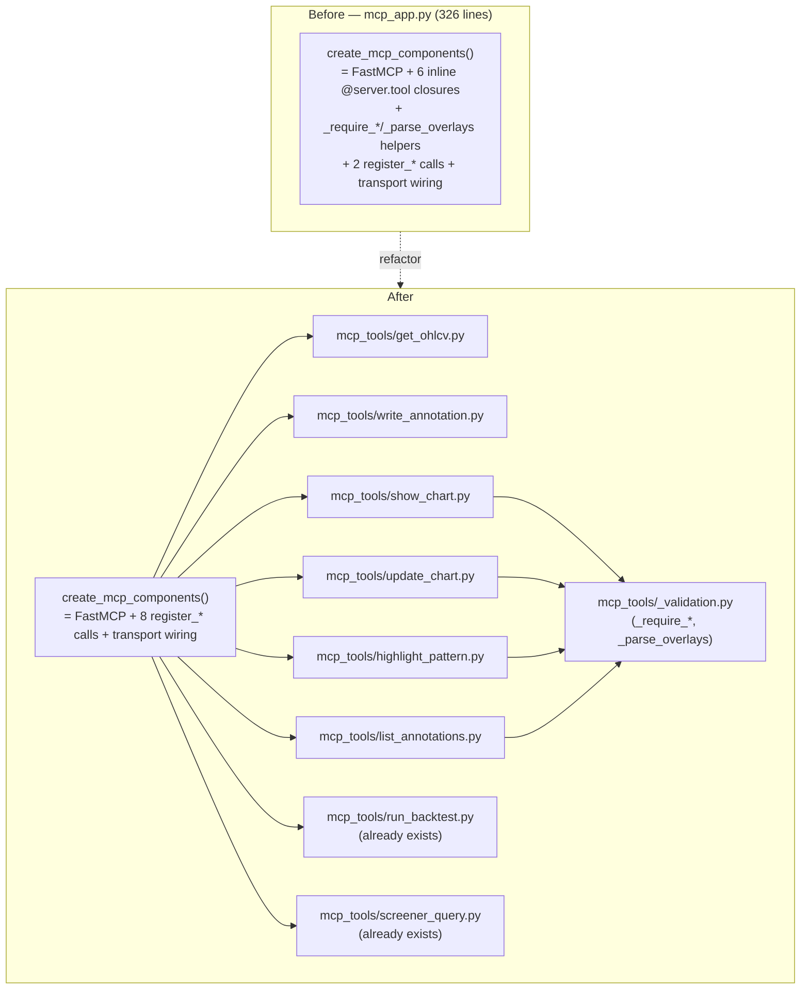

# 0017 — Consolidate MCP tool registration

> **Status:** draft
> **Created:** 2026-05-24
> **Owner skill(s):** `dev` (all phases)
> **Related ADRs:** [ADR-0014](../adrs/0014-mcp-as-second-sidecar-protocol.md) (MCP transport — the tools registered here), [ADR-0007](../adrs/0007-market-data-provider.md) (`get_ohlcv` reaches the provider via the Protocol; the boundary is preserved). No new ADR — this implements the *existing* `register_*` pattern established by [Plan 0008](done/0008-backtest-engine-v1.md) (`run_backtest`) and [Plan 0009](done/0009-resilience-and-tradingview-screener.md) (`screener_query`); it does not introduce a new decision.

## TL;DR

The six original MCP tools (`get_ohlcv`, `write_annotation`, `list_annotations`, `show_chart`, `update_chart`, `highlight_pattern`) are defined as inline `@server.tool` closures inside the 200-plus-line `create_mcp_components` factory in `src/market_analyser/api/mcp_app.py`. The two newest tools (`run_backtest`, `screener_query`) instead each live in their own `mcp_tools/<tool>.py` module with a `register_<tool>(server, *, deps)` function. This plan migrates the six inline tools to that newer pattern so registration is uniform: `create_mcp_components` shrinks to a thin hub that calls eight `register_*` functions, each tool gets a single locatable home (one reason to change), and the shared `_require_*` / `_parse_overlays` validation helpers move to a package-internal `mcp_tools/_validation.py`. Pure behavior-preserving refactor — no new tools, no schema changes, no new MCP surface; the existing integration suites are the regression net.

## Context & problem

The codebase health audit (2026-05-24) flagged `mcp_app.py` (326 lines) as carrying two coexisting registration patterns:

- **Inline closures (6 tools).** `get_ohlcv`, `write_annotation`, `list_annotations`, `show_chart`, `update_chart`, `highlight_pattern` are `@server.tool`-decorated functions defined *inside* `create_mcp_components`, capturing `provider` / `annotations_repository` / `event_bus` by closure. Plans 0006 and 0007 shipped them this way.
- **Extracted `register_*` modules (2 tools).** `run_backtest` ([Plan 0008](done/0008-backtest-engine-v1.md)) and `screener_query` ([Plan 0009](done/0009-resilience-and-tradingview-screener.md)) each live in `src/market_analyser/api/mcp_tools/<tool>.py` exposing `register_<tool>(server, *, deps)`, with their own focused test module (`tests/api/test_screener_query_tool.py`, `test_run_backtest_tool.py`).

The newer pattern is strictly better: `create_mcp_components` stays a thin assembly point, each tool is independently locatable and unit-testable, and adding a tool is "new module + one `register_*` call" rather than "grow the factory." The two patterns coexisting is mild tech debt with a concrete cost ahead: **Plans 0010–0012 each add one more agent-facing MCP tool** and will have to pick a side. Consolidating now — before that — means they inherit one obvious pattern instead of perpetuating the split.

This is not a layering or correctness problem (the closures use clean dependency injection; the audit found zero coupling violations). It is a single-responsibility / maintainability cleanup: `create_mcp_components` currently has six reasons to change beyond assembly, and it is the repo's second-largest Python production file.

## Decision

Extract the six inline tools into `src/market_analyser/api/mcp_tools/<tool>.py`, each exposing `register_<tool>(server, *, <deps>)` matching the `run_backtest` / `screener_query` signature style. Move the shared validation helpers (`_require_supported_timeframe`, `_require_non_empty_symbol`, `_require_ordered_range`, `_parse_overlays`) into a package-internal `src/market_analyser/api/mcp_tools/_validation.py` so both the extracted chart tools and the factory import them from one place. After the refactor, `create_mcp_components` contains only: the `FastMCP(...)` construction, eight `register_*` calls (gated exactly as today — `run_backtest` still requires both `backtest_runs_repository` and `runs_dir`), and the transport wiring (`streamable_http_app()` side-effect → `StreamableHTTPASGIApp`). The transport/mount logic and the gating semantics are unchanged.

We rejected: (a) *leave it as-is* — rejected because Plans 0010–0012 will add three more tools and entrench the split; the cost of consolidation only grows. (b) *Move all tool bodies into one new `mcp_tools/_all.py`* — rejected; that just relocates the god-function instead of dissolving it. One module per tool is the pattern the two newest tools already validate. (c) *Also add per-tool test modules for the six* — deliberately scoped out (see "What this plan does NOT do"); the existing integration suites already cover behavior, and bundling new tests inflates a mechanical refactor.

## Architecture diagram

## Implementation phases

Each phase is one commit and must leave the suite green — behavior is preserved, so the regression net is the existing integration tests (`tests/api/test_mcp_tools.py`, `test_show_tools.py`, `test_annotations_route.py`, `test_mcp_walking_skeleton.py`), which drive the tools via `server.call_tool(...)` and import `create_mcp_components`, not the inline closures — so they should pass **unchanged**.

### Phase 1 — Extract the data read/write tools + shared validation module

- **Owner skill:** `dev`
- **What:** Create `src/market_analyser/api/mcp_tools/_validation.py` and move `_require_supported_timeframe`, `_require_non_empty_symbol`, `_require_ordered_range`, `_parse_overlays` into it (verbatim — no logic change). Extract `get_ohlcv`, `write_annotation`, and `list_annotations` into `mcp_tools/get_ohlcv.py`, `mcp_tools/write_annotation.py`, `mcp_tools/list_annotations.py`, each exposing `register_<tool>(server, *, deps)`:
  - `register_get_ohlcv(server, *, provider)`
  - `register_write_annotation(server, *, annotations_repository)`
  - `register_list_annotations(server, *, annotations_repository)` — use the shared `_require_supported_timeframe` from `_validation.py` (this also resolves the current inline-vs-helper inconsistency where `list_annotations` hand-rolls its own timeframe check).
  - `create_mcp_components` calls the three new `register_*` and imports the moved helpers from `_validation.py` for the still-inline phase-2 tools.
- **Files touched:**
  - New `src/market_analyser/api/mcp_tools/_validation.py`.
  - New `src/market_analyser/api/mcp_tools/get_ohlcv.py`, `write_annotation.py`, `list_annotations.py`.
  - `src/market_analyser/api/mcp_app.py` (remove the three inline closures + the moved helper defs; add three `register_*` calls + the `_validation` import).
- **Done when:**
  - `create_mcp_components` no longer defines `get_ohlcv`, `write_annotation`, or `list_annotations` inline; they are registered via `register_*` imports.
  - The MCP tool behavior is identical: `tests/api/test_mcp_tools.py`, `tests/api/test_annotations_route.py`, and `tests/api/test_mcp_walking_skeleton.py` pass **without assertion changes** (only an import-path edit if a test imported a moved helper from `mcp_app`).
  - The full `uv run pytest tests/api/` passes with no new skips/xfails; mypy `--strict` clean on the new modules and `mcp_app.py`.
  - `list_annotations` uses `_validation._require_supported_timeframe` (no remaining inline timeframe check in the extracted module).

### Phase 2 — Extract the chart-event tools

- **Owner skill:** `dev`
- **What:** Extract `show_chart`, `update_chart`, `highlight_pattern` into `mcp_tools/show_chart.py`, `mcp_tools/update_chart.py`, `mcp_tools/highlight_pattern.py`, each exposing a `register_*(server, *, deps)`:
  - `register_show_chart(server, *, event_bus)`
  - `register_update_chart(server, *, event_bus)`
  - `register_highlight_pattern(server, *, annotations_repository, event_bus)` — preserves the persist-then-publish order exactly (annotation insert before `event_bus.publish`, as today).
  - Each imports `_require_*` / `_parse_overlays` from `_validation.py` and the payload types (`ChartShowPayloadV1`, `ChartUpdatePayloadV1`, `ChartHighlightPayloadV1`, `Marker`, `OverlaySpec`) from `api.events`.
  - `create_mcp_components` is now a thin hub: `FastMCP(...)` + eight `register_*` calls (gating for `run_backtest` unchanged) + transport wiring. No `@server.tool` closures remain.
- **Files touched:**
  - New `src/market_analyser/api/mcp_tools/show_chart.py`, `update_chart.py`, `highlight_pattern.py`.
  - `src/market_analyser/api/mcp_app.py` (remove the last three inline closures; add three `register_*` calls; the file drops to roughly the imports + the thin factory).
- **Done when:**
  - `create_mcp_components` contains **zero** `@server.tool` definitions — only `FastMCP(...)`, eight `register_*` calls, and the `StreamableHTTPASGIApp` wiring.
  - `tests/api/test_show_tools.py` passes **without assertion changes** — the three chart tools publish the identical SSE payloads (`chart.show` / `chart.update` / `chart.highlight` v1) and `highlight_pattern` still persists before publishing.
  - `uv run pytest tests/api/ tests/data/` passes with no new skips/xfails; mypy `--strict` clean.
  - `mcp_app.py` line count is materially reduced (target: under ~120 lines — the docstring, imports, and the thin factory).

## Risks & open questions

- **Risk: a behavior drift slips in during the mechanical move** (a closure captured `event_bus` but an extracted function takes it as a param and the wiring diverges). Mitigation: the existing integration tests drive every tool through `call_tool` and assert the exact return/SSE payloads; they are the regression net and must pass unchanged. Any assertion edit beyond an import path is a signal that behavior moved — treat it as a bug, not a test update.
- **Risk: the `run_backtest` gating semantics regress.** Today `register_run_backtest` is called only when both `backtest_runs_repository` and `runs_dir` are present. Mitigation: that conditional moves verbatim; `test_mcp_walking_skeleton.py` (legacy toolset without backtest deps) pins that nothing silently degrades.
- **Open question: where do the payload types live long-term?** They stay in `api/events` (unchanged) — the chart tools import them. Not moved; out of scope.
- **Open question: should each extracted tool get its own focused test module** (mirroring `test_screener_query_tool.py`)? Not in this plan — behavior is already covered by the integration suites, and adding eight test modules would balloon a mechanical refactor. Captured as a followup; pick it up opportunistically if a tool later grows logic worth isolating.

## What this plan does NOT do

- **No behavior change.** Identical tool signatures, identical return shapes, identical SSE payloads, identical validation errors. If anything observable changes, it's a bug.
- **No new tools and no new MCP surface.** The eight-tool set is exactly today's set.
- **No transport/mount changes.** The `streamable_http_app()` side-effect → `StreamableHTTPASGIApp` wiring and the no-trailing-slash `/mcp` mount stay in `create_mcp_components`.
- **No new test modules.** Existing suites must stay green; per-tool test files are an optional followup, not a deliverable here.
- **No renderer changes.** `desktop/` is untouched — the tool wire contract is unchanged, so the typed client and SSE consumers don't move.
- **No schema or `gen-types` impact.** Tool input/output models are unchanged, so the renderer's generated types don't drift.

## Followups (after this lands)

Empty at draft time. Architect populates from review findings during the close ceremony. (Pre-seed: optional per-tool test modules for the six extracted tools, mirroring `test_screener_query_tool.py` — low priority, opportunistic.)
