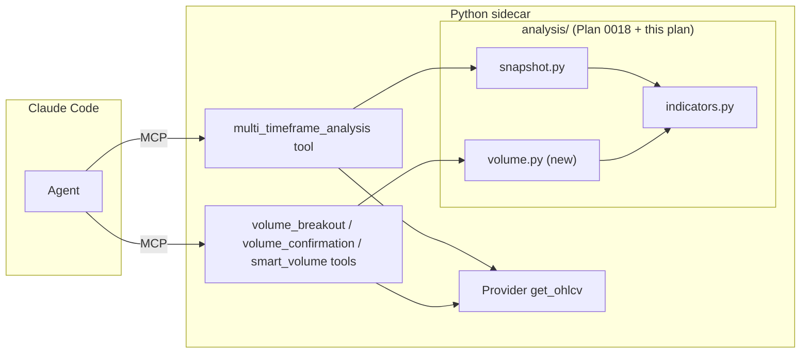

# 0021 — Multi-timeframe alignment + volume scanners

> **Status:** approved
> **Created:** 2026-05-24
> **Approved:** 2026-05-24
> **Owner skill(s):** `dev` (all phases)
> **Related ADRs:** [ADR-0023](../adrs/0023-technical-analysis-surface.md) (the analysis surface this builds on), [ADR-0007](../adrs/0007-market-data-provider.md) (bars via Provider), [ADR-0009](../adrs/0009-rewrite-data-layer-in-house.md) (in-house)
> **Depends on:** [Plan 0018](0018-technical-analysis-surface.md) (the `analysis/` surface — indicators, snapshot). Hard dependency: these are consumers of that layer.
> **Blocked on:** [Plan 0025](0025-timeframe-expansion.md) (timeframe expansion — data-layer support for `4h` / `15m` / `weekly` bars, with in-house 4h resampling). The data layer today supports only `{1d, 1h}`, so this plan's default multi-timeframe ladder cannot run until 0025 lands — see the Blocker note under "Risks". (Decision 2026-05-29: expand the data layer in its own plan rather than narrowing 0021's ladder to `{1d, 1h}`.)

## TL;DR

Layer three condition-reporting capabilities on top of the Plan 0018 analysis surface: (1) multi-timeframe alignment — run the condition snapshot across weekly → daily → 4h → 1h → 15m and report whether the trend agrees across timeframes; (2) volume condition functions in `analysis/volume.py`; (3) three volume-scanner MCP tools — `volume_breakout` (price + volume breakout), `volume_confirmation` (does volume back the move on one symbol), `smart_volume` (volume + RSI condition across a supplied symbol list). First user-visible behavior: ask Claude Code "is AAPL's uptrend aligned across timeframes" or "which of these names are breaking out on volume" and get a factual condition report.

## Context & problem

Multi-timeframe alignment and volume scanners are condition-reporting capabilities we lack. All of them are condition reports (which timeframes agree; which symbols show a volume/price breakout) — squarely inside the `market-analyst` charter and not contradicting the "conditions are facts, decisions are the user's" non-negotiable. They cannot be built until [Plan 0018](0018-technical-analysis-surface.md) lands the indicator/snapshot surface; this plan is its first downstream consumer.

A scope choice: a whole-exchange universe sweep means heavy bar fan-out and a bundled symbol-list catalog we don't ship. v1 scanners therefore operate on an **explicit symbol list** the caller supplies (a watchlist). Universe-from-screener composition (feed `screener_query` results into a scanner) is a natural follow-up but out of scope here.

## Decision

Three phases, all `dev` (analysis-surface consumers + MCP tools live in `src/` owned by `dev`; `analysis/` is the `market-analyst` skill's dependency but is authored by `dev` per `CLAUDE.md`). Phase 1 ships multi-timeframe (one symbol, several timeframes). Phase 2 adds the pure volume condition functions to `analysis/volume.py`. Phase 3 surfaces the volume conditions as scanner tools over a supplied symbol list. All reads go through the Provider's `get_ohlcv` (cached bars, `as_of`-aware → anti-lookahead for free).

We rejected at planning time: (a) whole-exchange universe sweeps in v1 (no coin-list files; heavy fan-out; explicit lists are sufficient and cheaper); (b) bundling volume functions into Plan 0018 (they are a distinct consumer concern and Plan 0018 is already the foundational build).

## Architecture diagram



## Implementation phases

### Phase 1 — Multi-timeframe alignment + `multi_timeframe_analysis` tool

- **Owner skill:** `dev`
- **What:** `analysis/multi_timeframe.py` runs `condition_snapshot` (Plan 0018) for one symbol across a configurable timeframe ladder (default weekly/daily/4h/1h/15m — **gated on the timeframe-expansion plan; see Blocked-on in the header**. Until that lands, the only runnable ladder is `{1d, 1h}`), then computes an alignment summary: per-timeframe trend, an agreement score, and the dominant trend. The `multi_timeframe_analysis(symbol, timeframes=…, as_of=None)` MCP tool fetches bars per timeframe via the Provider and returns the summary.
- **Files touched:**
  - New `src/market_analyser/analysis/multi_timeframe.py` (~100–140 lines).
  - New `src/market_analyser/api/mcp_tools/multi_timeframe_analysis.py`.
  - `src/market_analyser/api/mcp_app.py`: register the tool.
  - New `tests/analysis/test_multi_timeframe.py`, `tests/api/test_multi_timeframe_tool.py`.
- **Done when:**
  - **Alignment computation:** Given seeded bars for the same symbol across three timeframes all trending up, the summary reports `dominant_trend == UP` and `agreement == 1.0`; with one timeframe down, agreement drops and the disagreeing timeframe is named. Asserted with explicit fixtures.
  - **Per-timeframe snapshots:** the summary embeds each timeframe's `ConditionSnapshot.trend`/`momentum`; values match a direct `condition_snapshot` call per timeframe. Asserted.
  - **`as_of` replay:** with `as_of` set, every per-timeframe snapshot is computed on bars truncated at `as_of` — no future leak. Asserted.
  - **Tool boundary:** unsupported timeframe rejected; empty timeframe list rejected; missing-bars timeframe surfaces an honest per-timeframe `null` (not a crash). Asserted.
  - `uv run pytest tests/analysis/test_multi_timeframe.py tests/api/test_multi_timeframe_tool.py` passes; mypy strict clean.

### Phase 2 — Volume condition functions (`analysis/volume.py`)

- **Owner skill:** `dev`
- **What:** Pure, trailing functions: `volume_breakout(bars, vol_multiple, price_lookback)` → whether the latest bar's volume exceeds `vol_multiple ×` its trailing average AND price broke its trailing range; `volume_confirmation(bars, lookback)` → whether recent volume backs the recent price move (e.g. up-moves on rising volume) as a 0..1 score; `smart_volume(bars, rsi_low, rsi_high, vol_multiple)` → combined volume-surge-with-RSI-in-band condition. All read only `bars[0..=last]` (trailing).
- **Files touched:**
  - New `src/market_analyser/analysis/volume.py` (~120–160 lines).
  - New `tests/analysis/test_volume.py`, with hand-built fixtures (a clear breakout bar; a fake-out; a no-volume drift).
- **Done when:**
  - **Breakout positive/negative:** the breakout fixture returns a positive `volume_breakout` result with the multiple and broken level reported; the drift fixture returns negative. Asserted.
  - **Confirmation score:** up-move-on-rising-volume fixture scores high; up-move-on-falling-volume scores low. Threshold constants explicit. Asserted.
  - **Smart-volume band:** a volume surge with RSI inside the band qualifies; the same surge with RSI outside the band does not. Asserted.
  - **Anti-lookahead:** all three are unaffected by appending future bars (truncation test). Asserted.
  - **Determinism:** each function returns equal results across two calls. Asserted.
  - `uv run pytest tests/analysis/test_volume.py` passes; mypy strict clean.

### Phase 3 — Volume-scanner MCP tools

- **Owner skill:** `dev`
- **What:** Three tools that apply phase-2 conditions across a supplied symbol list: `volume_breakout(symbols, timeframe, …)`, `volume_confirmation(symbol, timeframe, …)` (single symbol detail), `smart_volume(symbols, timeframe, rsi_low, rsi_high, …)`. Each fetches bars per symbol via the Provider (capped list length), computes the condition, and returns the matches with their condition fields plus `scanned_at`. Boundary-validated; `asyncio.to_thread` offload; failed-symbol fetch degrades gracefully (logged + skipped, not fatal).
- **Files touched:**
  - New `src/market_analyser/api/mcp_tools/volume_breakout.py`, `volume_confirmation.py`, `smart_volume.py`.
  - `src/market_analyser/api/mcp_app.py`: register all three.
  - New `tests/api/test_volume_scanner_tools.py`.
- **Done when:**
  - **Breakout scan:** `volume_breakout(symbols=["A","B","C"], timeframe="1d")` over seeded caches (A and C breaking out, B not) returns rows for A and C only, each with the multiple and broken level; results sorted deterministically (e.g. by multiple desc, then symbol). Asserted.
  - **Confirmation detail:** `volume_confirmation(symbol="A", timeframe="1d")` returns the score and the supporting figures. Asserted.
  - **Smart-volume scan:** returns only symbols meeting both the volume and RSI-band conditions. Asserted.
  - **List cap + graceful degradation:** a symbol list over the cap is rejected at the boundary; one symbol with no cached bars is skipped (logged), the rest still scan. Asserted.
  - **Regression:** pre-existing tools still pass.
  - `uv run pytest tests/api/test_volume_scanner_tools.py` passes; mypy strict clean.

## Data shapes

```python
# analysis/multi_timeframe.py (illustrative)

class TimeframeView(BaseModel):                    # frozen, extra="forbid"
    timeframe: str
    snapshot: ConditionSnapshot | None             # null when bars unavailable

class MultiTimeframeAlignment(BaseModel):          # frozen, extra="forbid"
    symbol: str
    timeframes: list[TimeframeView]
    dominant_trend: Trend
    agreement: float                                # 0..1 fraction of timeframes agreeing

# analysis/volume.py results are small frozen models or typed dicts:
#   VolumeBreakout(symbol, volume_multiple, broken_level, direction)
#   VolumeConfirmation(symbol, score, ...)
#   SmartVolumeHit(symbol, volume_multiple, rsi, ...)
```

## Risks & open questions

- **Risk: bar fan-out latency** on multi-symbol scans (one `get_ohlcv` per symbol). Mitigation: explicit list cap (e.g. ≤ 25 symbols), cached-bar reads (no live fetch in the scan path), `asyncio.to_thread`. A scan over uncached symbols returns partial results with a documented `partial_reason`, not a slow live backfill.
- **Blocker (not merely a risk): timeframe support.** The default ladder names weekly / 4h / 1h / daily / 15m, but the data layer supports only `{1d, 1h}` — `SUPPORTED_TIMEFRAMES` (`annotations/types.py`), the Yahoo adapter's `_VALID_TIMEFRAMES` (`adapters/yahoo.py`), and the MCP boundary validator all reject anything else. So 4h / 15m / weekly cannot be *fetched at all*, not merely left uncached — `get_ohlcv` rejects them upstream of any cache. Resolved by the separate **timeframe-expansion plan** (see Blocked-on in the header), which must land before phase 1 can deliver its stated default. Once timeframes are supported, the original cache-layer mitigation still applies: a per-timeframe `null` in the alignment summary when bars for a *supported* timeframe aren't cached, rather than failing the whole call.
- **Open question: universe-from-screener composition.** Feeding `screener_query` output into a volume scanner is the obvious next step but is deliberately out of scope (keeps this plan's fan-out bounded). Recorded as a likely follow-up.
- **Open question: should multi-timeframe resample from a single base timeframe** (e.g. derive 4h from 1h) rather than fetch each? v1 fetches each timeframe independently via the Provider (simpler, no resampling correctness risk). Resampling is a future optimization.

## What this plan does NOT do

- **Whole-exchange universe sweeps** — explicit symbol lists only.
- **Screener → scanner composition** — follow-up.
- **Bollinger-squeeze / BB-rating scans** — separate future plan on the same surface.
- **Live backfill inside a scan** — scans read cached bars; missing bars are surfaced, not fetched.
- **Any buy/sell output** — conditions only.

## Followups (after this lands)

Empty at draft time.
