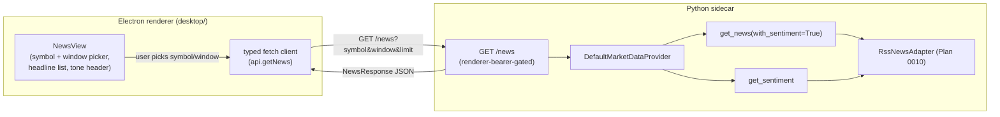

# 0023 — News view in the app interface

> **Status:** approved
> **Created:** 2026-05-24
> **Approved:** 2026-05-24
> **Owner skill(s):** `dev` (phase 1), `ui-builder` (phase 2)
> **Related ADRs:** [ADR-0002](../adrs/0002-ipc-local-http.md) (IPC over localhost HTTP + bearer — the route inherits this), [ADR-0007](../adrs/0007-market-data-provider.md) (provider Protocol — the route reads `get_news`/`get_sentiment`), [ADR-0008](../adrs/0008-electron-shell-conventions.md) (renderer goes through the typed fetch client; CSP; no Node in renderer), [ADR-0015](../adrs/0015-claude-code-primary-control-surface.md) (Claude Code primary, Electron a viewer — this is a read-only viewer surface, consistent with how every existing view reads data). **No new ADR** — see "Why no ADR" below.
> **Depends on:** [Plan 0010](done/0010-news-and-vader-sentiment.md) (closed 2026-05-24) — `get_news` + `get_sentiment` are implemented on `DefaultMarketDataProvider`; this plan surfaces them in the renderer.

## TL;DR

Add a standalone **News** view to the Electron renderer — a new top-level tab alongside Chart and Backtests — that lets the user pick a symbol and window and see recent headlines with a per-headline sentiment badge plus an aggregate tone summary. It is backed by a new user-driven `GET /news` REST route on the sidecar, fetched through the existing typed fetch client (renderer-bearer-gated, same pattern as `/ohlcv` and `/backtests`). First user-visible behavior: open the app, click **News**, type `BTC`, and see a list of recent headlines from the five RSS feeds Plan 0010 wired, each tagged bullish/bearish/neutral, with a `tone: +0.40 (2 pos / 1 neg / 0 neu)` header. Live-only: no new table, no history, no agent involvement required.

## Context & problem

Plan 0010 shipped the news + per-headline VADER sentiment data layer and two MCP tools (`news_for`, `sentiment_for_news`). Today the only way to read news is to ask Claude Code, which calls those tools — there is no surface in the Electron app itself. The roadmap's Tier 5 ("News and market investigation") envisions a richer timeline/digest, but that is large, aspirational, and persistence-dependent. This plan delivers the immediately useful slice: a user can open the app and read the news + tone for a symbol without invoking an agent, reusing the data layer that already exists.

The user chose, at interview: a **standalone view** (not a chart-coupled panel or timeline), **user-driven** fetch (not agent-pushed via SSE), **live-only** (no persisted history), and a **minimal** v1 (headlines + tone, no filters/timeline).

## Decision

Add `GET /news` as a renderer read route returning a small `NewsResponse` envelope (`items` + optional `sentiment` aggregate + `queried_at`), and a `NewsView` React component reached from a new nav tab. The route calls `provider.get_news(symbol, window, limit, with_sentiment=True)` for the headlines and, when a symbol is supplied, `provider.get_sentiment(symbol, window)` for the aggregate tone — the positive/negative/neutral bucketing stays server-side (the ±0.05 thresholds live in `default_provider.py`; the renderer must not re-implement them). The renderer fetches through the typed client and renders headlines as **text** with sanitized `http(s)` links.

We rejected, at interview: a chart-coupled side panel and timeline-markers-on-chart (both entangle the chart layout and overshoot a minimal v1); agent-driven SSE push (a `show_news` tool + `news.show` event — the user wants to browse news without an agent in the loop, and every existing view already reads data user-first); and persisted news history (reverses Plan 0010's explicit non-goal and pulls in a table + migration — deferred to the Tier 5 timeline plan).

### Why no ADR

A user-initiated read route consumed by the renderer is not a new architectural decision: `GET /ohlcv`, `GET /annotations`, and `GET /backtests` are all renderer-driven reads through the typed client today. ADR-0015's agent-primary inversion governs *control commands* (`show_chart`, `run_backtest`), not read-only data display — the viewer has always read data directly. ADR-0002 (bearer-gated localhost HTTP) and ADR-0008 (typed fetch client, CSP) already cover the mechanism. Nothing here warrants a durable decision record.

## Architecture diagram



## Implementation phases

### Phase 1 — `GET /news` REST route + generated types

- **Owner skill:** `dev`
- **What:** A renderer read route returning `NewsResponse`, plus emitting the TypeScript types the renderer will consume.
- **Files touched:**
  - New `src/market_analyser/api/routes/news.py` — an `APIRouter` with `GET /news`. Reads `request.app.state.provider` (the `MarketDataProvider`). Query params validated at the boundary: `symbol: str | None = None`, `window: Literal["1h","4h","24h","7d"] = "24h"`, `limit: int = Query(50, ge=1, le=100)`. Calls `provider.get_news(symbol=symbol, window=window, limit=limit, with_sentiment=True)`; when `symbol` is non-empty, also `provider.get_sentiment(symbol=symbol, window=window)` for the aggregate (the second call hits the resilience layer's 5-minute TTL cache — same feeds — so it costs no extra network round-trip). Returns `NewsResponse`. **No `as_of` parameter** — news is wall-clock-sensitive (Plan 0010); the route exposes no replay surface by construction.
  - `src/market_analyser/api/app.py` — `app.include_router(news_router)` unconditionally (the provider is always on `app.state`, like `ohlcv_router`; no conditional-include needed unlike backtests).
  - New `src/market_analyser/api/routes/_news_models.py` (or inline in `news.py`) — the `NewsResponse` Pydantic model (see Data shapes). Defined with the route's `response_model=NewsResponse` so it appears in the OpenAPI schema gen-types reads.
  - `desktop/scripts/gen-types.mjs` — add `"NewsItem"`, `"SentimentSample"`, `"NewsResponse"` to the `EMIT` allowlist.
  - Generated: `desktop/renderer/types/sidecar/news-item.ts`, `sentiment-sample.ts`, `news-response.ts` (via `pnpm gen-types`).
  - New `tests/api/test_news_route.py`.
- **Done when:**
  - **Happy path with symbol:** `GET /news?symbol=BTC&window=24h` (renderer bearer) returns `200` with a body whose `items` equals `provider.get_news(symbol="BTC", window="24h", with_sentiment=True)` (serialized) and whose `sentiment` equals `provider.get_sentiment(symbol="BTC", window="24h")` (serialized). Asserted against a fake provider injected on `app.state.provider` returning known `NewsItem`/`SentimentSample` rows — the test reads the actual `items`/`sentiment`/`queried_at` keys, not just status 200.
  - **No-symbol browse:** `GET /news?window=24h` (no `symbol`) returns `200` with `items` populated and `sentiment` equal to `null` (no per-symbol aggregate without a symbol). Asserted.
  - **Boundary validation:** `window=12h` → `422`; `limit=0` → `422`; `limit=101` → `422`. Asserted (FastAPI `Query`/`Literal` validation).
  - **Cross-tenant isolation:** the same request carrying the **MCP** bearer returns `401`, and a request with **no** bearer returns `401` — mirrors `tests/api/test_annotations_route.py`'s cross-tenant assertion. Renderer bearer returns `200`. Asserted.
  - **Feed outage degrades, not 500s:** with a fake provider whose `get_news` returns `[]` (all feeds down/empty — the graceful-degradation contract Plan 0010 tested), `GET /news?symbol=XYZ` returns `200` with `items == []` and an all-zero-breakdown `sentiment` (score `0.0`), never a `500`. Asserted.
  - **Types emit with no drift:** `pnpm gen-types` writes `news-item.ts`, `sentiment-sample.ts`, `news-response.ts`; `node scripts/gen-types.mjs --check` (the pre-commit/CI guard) reports no drift. `uv run mypy --strict src tests` is clean.
  - `uv run pytest tests/api/test_news_route.py` passes with no skips.

### Phase 2 — News view, typed client call, nav entry

- **Owner skill:** `ui-builder`
- **What:** The `NewsView` React component, its typed client function, and a nav tab to reach it.
- **Files touched:**
  - `desktop/renderer/api/client.ts` — add `getNews({ symbol, window, limit }): Promise<NewsResponse>` calling `callJson<NewsResponse>('/news?' + new URLSearchParams(...))`, typed against the generated `NewsResponse`.
  - `desktop/renderer/App.tsx` — add `'news'` to the `View` union, a nav `<button>` switching to it, and `{view === 'news' && <NewsView />}`.
  - New `desktop/renderer/views/NewsView.tsx` — symbol text input + window `<select>` (1h/4h/24h/7d); fetches via `api.getNews` on submit/change; renders the headline list (title as an external link, source, `published_at`, and a sentiment badge derived from `compound_sentiment`) and a tone header from `sentiment` (score + pos/neg/neu counts); explicit loading, empty, and error states.
  - New `desktop/renderer/views/NewsView.test.tsx` (RTL/Jest).
  - CSS/styling consistent with the existing views.
- **Done when:**
  - **Renders a response:** given a mocked `api.getNews` resolving to a `NewsResponse` with three items and a `sentiment`, the view renders three headline rows — each showing the title text, source, time, and a badge whose variant matches the item's `compound_sentiment` sign — plus a tone header showing `sentiment.score` and the three breakdown counts. Asserted on rendered text/roles, not implementation details.
  - **Empty state:** when `getNews` resolves to `{ items: [], sentiment: null, ... }`, the view shows an explicit "no headlines in this window" affordance, not a blank panel. Asserted.
  - **Error state:** when `getNews` rejects (sidecar/network error), the view shows an error message and does not crash/blank. Asserted.
  - **Controls drive the fetch:** changing the symbol input and window select issues a `getNews` call with the matching `{ symbol, window }`. Asserted on the mock's call args.
  - **External content is safe (security):** headline title/summary are rendered as **text** (no `dangerouslySetInnerHTML`), and an item whose `url` is a `javascript:`/non-`http(s)` scheme is **not** rendered as a clickable link (href sanitized to `http`/`https` only). Asserted with a malicious-URL fixture row. (External feed content is untrusted input crossing into the renderer.)
  - **Nav:** the **News** tab is present and selecting it mounts `NewsView`. Asserted (component-level or e2e).
  - **Typed end-to-end + suites green:** `pnpm --filter desktop typecheck` (tsc across all projects) passes against the generated `NewsResponse`; the renderer Jest suite (including `NewsView.test.tsx`) passes with no new skips/xfails.

## Data shapes

```python
# src/market_analyser/api/routes/_news_models.py — the GET /news envelope.
# NewsItem and SentimentSample already exist in data/types.py (Plan 0010); this
# plan only adds the response wrapper and emits all three to TypeScript.

class NewsResponse(BaseModel):
    model_config = ConfigDict(frozen=True)

    items: list[NewsItem]              # newest-first, each with compound_sentiment
    sentiment: SentimentSample | None  # per-symbol aggregate; None when no symbol
    queried_at: datetime               # wall-clock of the fetch
```

```
GET /news?symbol=BTC&window=24h&limit=50   ->  200
{
  "items": [
    {"symbol":"BTC","title":"Bitcoin surges to a new all-time high",
     "url":"https://...","published_at":"2026-05-20T11:30:00Z",
     "source":"coindesk","summary":"...","compound_sentiment":0.9274},
    ...
  ],
  "sentiment": {"symbol":"BTC","score":0.3997,"window":"24h",
                "as_of":"2026-05-20T12:00:00Z","source":"rss-vader",
                "breakdown":{"positive":1,"negative":1,"neutral":0}},
  "queried_at":"2026-05-20T12:00:00Z"
}
```

## Risks & open questions

- **Risk: double-fetch cost.** The route calls `get_news` and `get_sentiment` for a symbol; `get_sentiment` internally re-fetches the same feeds. Mitigation: Plan 0010's resilience layer caches feed bodies for 5 minutes, so the second call is served from cache — one effective network round-trip. If profiling ever shows otherwise, fold the aggregate into a single provider call (a `get_news_with_sentiment_summary` helper) as a follow-up.
- **Risk: untrusted feed content in the renderer.** Titles/summaries/URLs come from external RSS feeds. Mitigation is a phase-2 done-when: render as text (React's default escaping; no `dangerouslySetInnerHTML`) and sanitize hrefs to `http(s)` only. The double-CSP (ADR-0008) is the backstop.
- **Risk: empty results look like a bug.** Quiet symbols or a narrow window legitimately return zero items. Mitigation: explicit empty-state affordance (phase-2 done-when), distinct from the error state.
- **Open question: relative vs absolute timestamps** in the list ("2h ago" vs `12:30 UTC`). Implementer's call in phase 2; not plan-gating.
- **Open question: show `summary`?** `NewsItem.summary` is available. v1 may show it as a secondary line or omit it for density — implementer's call; the data is there either way.
- **Open question: a `/news` golden-path smoke step.** The Plan 0016 followup only mandates a step for new *agent-facing MCP tools*; `GET /news` is a renderer route, not an MCP tool, so no step is owed. A REST liveness step could still be added opportunistically (see Followups) but does not gate this plan.

## What this plan does NOT do

- **Persisted news/sentiment history.** No new table; live-only. The Tier 5 timeline/digest plan owns persistence (and would reverse Plan 0010's non-goal then, with its own ADR note).
- **The Tier 5 timeline view** (news + sentiment + price chronologically aligned to the chart). Separate, larger plan.
- **A chart-coupled panel or on-chart news markers.** Rejected at interview; the standalone view is v1.
- **Agent-driven push** (`show_news` MCP tool + `news.show` SSE event). The agent already has `news_for`/`sentiment_for_news`; renderer push is a future plan if a "agent surfaces a headline into the viewer" workflow emerges.
- **Filters, feed/category selection, cross-symbol browse UI.** Deferred (interview chose minimal v1); `GET /news` already supports `symbol=None` if a later UI wants an all-feeds mode.
- **StockTwits / Fear & Greed surfaces.** Those are Plans 0012 / 0011's data; a unified sentiment surface is a later UI concern.
- **Dedup of near-duplicate headlines across feeds.** Inherited Plan 0010 non-goal.

## Followups (after this lands)

Empty at draft time. Architect populates from review findings + implementer notes at the close ceremony. Candidate already identified: an optional `GET /news` REST liveness step in `tests/smoke/golden_path.py` (not owed by the Plan 0016 followup, which is MCP-tool-scoped).
