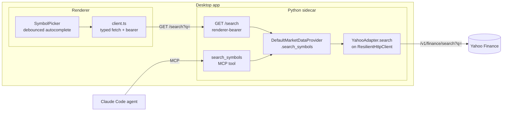

# 0024 — Symbol search and autocomplete

> **Status:** in-progress
> **Created:** 2026-05-26
> **Owner skill(s):** dev, ui-builder
> **Related ADRs:** [0026-symbol-search-bound-to-ohlcv-provider](../adrs/0026-symbol-search-bound-to-ohlcv-provider.md), [0007-market-data-provider](../adrs/0007-market-data-provider.md), [0013/UpstreamDataError taxonomy](0013-auto-backfill-on-cache-miss.md)

## TL;DR

Implement the long-stubbed `MarketDataProvider.search_symbols` against Yahoo's keyless `/v1/finance/search` endpoint, expose it as both a renderer route (`GET /search`) and a `search_symbols` MCP tool, and turn the renderer's bare `SymbolPicker` text box into a debounced TradingView-style autocomplete dropdown. First user-visible behavior: typing `BTC` shows a dropdown — `BTC-USD · Bitcoin USD · Cryptocurrency`, `BTC=F · Bitcoin Futures · CME`, … — and picking a row charts it immediately, instead of the current "Yahoo returns nothing" failure. Because suggestions come from the same provider as OHLCV, every pick is chartable ([ADR-0026](../adrs/0026-symbol-search-bound-to-ohlcv-provider.md)).

## Context & problem

Searching `BTC` or `ETH` in the app fails: the user enters a bare ticker, the app calls `get_ohlcv("BTC")`, and Yahoo has no such symbol — it wants `BTC-USD`. The renderer's `SymbolPicker.tsx` is a plain controlled `<input>` with no lookup, so the user has no way to discover the correct ticker and just hits an error. The agent (Claude Code) hits the same wall when it calls `get_ohlcv` for a symbol the user named loosely.

The data layer already anticipated this: the `MarketDataProvider` Protocol declares `search_symbols(query, as_of) -> Sequence[SymbolInfo]` and the `SymbolInfo(symbol, name, exchange)` model exists — both stubbed since Plan 0001 (`DefaultMarketDataProvider.search_symbols` raises `NotImplementedError`). This plan fills that seam. The problem is symbol *discovery* with the market each symbol trades on, surfaced both in the UI and to the agent.

## Decision

Implement `search_symbols` via Yahoo's `/v1/finance/search` endpoint on the existing `ResilientHttpClient` (per [ADR-0026](../adrs/0026-symbol-search-bound-to-ohlcv-provider.md): search is sourced from the same provider as OHLCV, so every suggestion is directly fetchable by `get_ohlcv` — no symbol-resolution layer). Extend `SymbolInfo` additively with a `quote_type` field so the dropdown can show asset class. Surface the method as a renderer-bearer-gated `GET /search` route and a `search_symbols` MCP tool (shared Protocol method, two thin wrappers). The renderer becomes a debounced autocomplete dropdown over the route.

We rejected TradingView symbol search (its `EXCHANGE:TICKER` namespace isn't fetchable by the Yahoo OHLCV path — it would reintroduce the unchartable-pick failure behind a fragile resolver) and a static curated list (stale, no long-tail coverage). Both are recorded in [ADR-0026](../adrs/0026-symbol-search-bound-to-ohlcv-provider.md).

## Architecture diagram



## Implementation phases

### Phase 1 — Yahoo symbol-search adapter + provider method
- **Owner skill:** `dev`
- **What:** Implement `search_symbols` end to end in the data layer: a Yahoo search fetch/parse helper, a `YahooAdapter.search` method on the shared `ResilientHttpClient`, the `DefaultMarketDataProvider.search_symbols` body, and the additive `SymbolInfo.quote_type` field.
- **Files touched:** `src/market_analyser/data/adapters/_yahoo_search.py` (new — HTTP call to `/v1/finance/search` + parse), `src/market_analyser/data/adapters/yahoo.py` (add `search(query) -> list[SymbolInfo]`), `src/market_analyser/data/default_provider.py` (implement `search_symbols`, reject `as_of`), `src/market_analyser/data/types.py` (add `quote_type: str = ""` to `SymbolInfo`), `tests/`.
- **Done when:**
  - Against a recorded Yahoo-search fixture for `q=BTC`, `provider.search_symbols("BTC")` returns a non-empty `list[SymbolInfo]` whose first/included entry is `symbol="BTC-USD"` with a non-empty `name` and `quote_type` indicating crypto — i.e. the returned symbol is the canonical Yahoo pair that `get_ohlcv` can fetch, not a bare `BTC`.
  - Each result maps Yahoo fields: `symbol`←`symbol`, `name`←`longname`/`shortname`/`symbol` (first present), `exchange`←`exchDisp`/`exchange`, `quote_type`←`typeDisp`/`quoteType`. A quote missing a name does not crash (falls back to the symbol).
  - A fixture with an empty `quotes` array returns `[]` (a zero-match search is not an error — distinct from `UnknownSymbolError`).
  - Calling `search_symbols("BTC", as_of=<a datetime>)` raises `ValueError` (search is wall-clock/live; mirrors the screener/quote/sentiment `as_of` rejection already in `default_provider.py`).
  - Result order preserves Yahoo's upstream relevance order (no `set` iteration / no re-sorting) so repeated calls on the same fixture are byte-identical.
  - `mypy --strict` clean; no new dependency added (uses the existing `ResilientHttpClient` + stdlib JSON).

### Phase 2 — `GET /search` route + `search_symbols` MCP tool + gen-types
- **Owner skill:** `dev`
- **What:** Expose the Protocol method on both surfaces and generate the renderer TypeScript type for `SymbolInfo`.
- **Files touched:** `src/market_analyser/api/routes/search.py` (new — mirrors `routes/ohlcv.py`), `src/market_analyser/api/app.py` (mount the router), `src/market_analyser/api/mcp_tools/search_symbols.py` (new — mirrors `mcp_tools/screener_query.py`'s `register_*` + `extra="forbid"` input + `asyncio.to_thread` pattern), `src/market_analyser/api/mcp_app.py` (register the tool in the `register_*` block), `desktop/` gen-types output for `SymbolInfo`, `tests/`.
- **Done when:**
  - `GET /search?q=BTC` with a valid renderer bearer returns HTTP 200 and a JSON list whose entries match `SymbolInfo` and include `BTC-USD`. `GET /search?q=` (empty/whitespace) returns 200 with `[]`.
  - The route is renderer-bearer-gated: a request bearing the **MCP** secret (cross-tenant) is rejected with 401 (matches the cross-tenant guard asserted for `/ohlcv` and other renderer routes).
  - An upstream failure surfaces as HTTP 502 (typed `UpstreamDataError`/`ResilientHttpError` → 502, mirroring `routes/ohlcv.py`); a bad-input `ValueError` surfaces as 422.
  - The `search_symbols` MCP tool, invoked with `{"query": "BTC"}`, returns a dict containing the same result list (each as `SymbolInfo.model_dump()`); its description tells the agent to call it to resolve a loose name to a fetchable symbol — explicitly as the recovery path for `get_ohlcv`'s `UnknownSymbolError` ([Plan 0013](0013-auto-backfill-on-cache-miss.md)).
  - The MCP regression suite still passes; the renderer type-generation produces a `SymbolInfo` TS type (with `quote_type`) under `desktop/renderer/types/sidecar/`.

### Phase 3 — Autocomplete dropdown in the renderer
- **Owner skill:** `ui-builder`
- **What:** Turn `SymbolPicker` into a debounced autocomplete: as the user types, query `GET /search` through the typed client and render a dropdown of `symbol · name · exchange · type`; arrow-key + Enter (and click) select a row, committing the picked symbol via the existing `onSymbolChange`.
- **Files touched:** `desktop/renderer/components/SymbolPicker.tsx`, `desktop/renderer/api/client.ts` (add `searchSymbols(query)` — bearer injected by the client, no new fetch path), a new `desktop/renderer/hooks/useSymbolSearch.ts` (debounce + stale-response guard), component CSS, and a renderer spec.
- **Done when:**
  - Typing a query (≥ 1 non-whitespace char, debounced) renders a dropdown listing results, each showing symbol + name + exchange + asset type; the dropdown is dismissable (Escape / blur / outside-click).
  - Keyboard navigation works: ArrowUp/ArrowDown move the highlighted row, Enter selects it; mouse click selects a row. Selecting a row calls `onSymbolChange` with the picked `symbol`, after which the existing OHLCV fetch loads that symbol's chart.
  - Debounce is real: a spec types a multi-character query and asserts the number of `/search` requests is strictly fewer than the number of keystrokes (e.g. ≤ 2 requests for "BTCUSD" typed character-by-character within the debounce window).
  - Out-of-order responses don't clobber a newer query: a spec resolves an earlier request after a later one and asserts the dropdown shows the later query's results (stale-response guard).
  - The renderer reaches the network only through `client.ts` (no direct `fetch`/Node import); existing renderer test suites stay green with no new skips/xfails.

## Data shapes

`SymbolInfo` gains one additive field (frozen model; default keeps existing constructors valid):

```python
class SymbolInfo(BaseModel):
    model_config = ConfigDict(frozen=True)
    symbol: str = Field(min_length=1)   # Yahoo native namespace, fetchable by get_ohlcv — e.g. "BTC-USD"
    name: str                           # longname / shortname / symbol fallback
    exchange: str = ""                  # Yahoo exchDisp / exchange — display string, e.g. "CCC", "NASDAQ", "CME"
    quote_type: str = ""                # NEW — Yahoo typeDisp / quoteType, e.g. "Cryptocurrency", "Equity", "ETF", "Future"
```

Yahoo `/v1/finance/search?q=<query>` response (relevant subset; the `news` array is ignored):

```json
{ "quotes": [
  { "symbol": "BTC-USD", "shortname": "Bitcoin USD", "longname": "Bitcoin USD",
    "exchange": "CCC", "exchDisp": "CCC", "quoteType": "CRYPTOCURRENCY", "typeDisp": "Cryptocurrency" },
  { "symbol": "BTC=F", "shortname": "Bitcoin Futures", "exchange": "CME",
    "exchDisp": "CME", "quoteType": "FUTURE", "typeDisp": "Futures" }
] }
```

`GET /search` returns `list[SymbolInfo]`. The `search_symbols` MCP tool returns `{"results": [SymbolInfo, ...], "queried_at": "<iso8601>"}` (mirrors `screener_query`'s envelope).

## Risks & open questions

- Risk: Yahoo's search endpoint is undocumented/reverse-engineered and may change shape or rate-limit. Mitigation: it rides the shared `ResilientHttpClient` (retry/backoff/TTL cache), parsing is defensive (missing `name`/`exchDisp` fall back), and failures surface as a clean 502 — same posture as the screener (`tradingview_screener`) which is also reverse-engineered.
- Risk: a search hit may still be a thin/illiquid symbol whose OHLCV fetch returns few or no bars even though the symbol is valid. This is out of scope — ADR-0026's invariant is that the symbol is *in the fetchable namespace*, not that it has rich history; the existing `UnknownSymbolError`/empty-bar handling ([Plan 0013](0013-auto-backfill-on-cache-miss.md)) covers the downstream case.
- Risk: debounce + stale-response handling is the usual autocomplete footgun. Mitigation: the phase-3 done-when pins both behaviors with explicit specs.
- Open question: minimum query length and dropdown result cap. Default assumption — renderer requires ≥ 1 non-whitespace char before querying; the route/tool accept an optional `limit` (default ~10, capped) like `screener_query`. The implementer may tune the debounce interval; no architectural commitment needed.

## What this plan does NOT do

- No TradingView or multi-exchange symbol search, and no TV→Yahoo symbol resolver — explicitly rejected in [ADR-0026](../adrs/0026-symbol-search-bound-to-ohlcv-provider.md).
- No persisted symbols table or cached symbol registry — search rides the `ResilientHttpClient` TTL cache; no new SQLite table or migration.
- No offline symbol search — search is inherently a live lookup (the whole-app offline-mode policy remains the open ADR-backlog item it was).
- No `get_quote` implementation — that is [Plan 0019](0019-live-quote.md). This plan only fills `search_symbols`.
- No fuzzy "did you mean" recovery on a *failed direct fetch* — proactive autocomplete is the chosen interaction; the failure path stays as Plan 0013 left it (the dropdown prevents most bad picks upstream of it).

## Followups (after this lands)

- Close ceremony (architect): add a `step_search` to the golden-path smoke (`tests/smoke/golden_path.py`) per the recurring Tier-2 discipline — each plan shipping an agent-facing MCP tool gains a smoke step at close.
- Consider whether the agent's `UnknownSymbolError` message (Plan 0013) should name `search_symbols` as the suggested recovery tool. Small docstring/message tweak; pick up if it doesn't grow.
