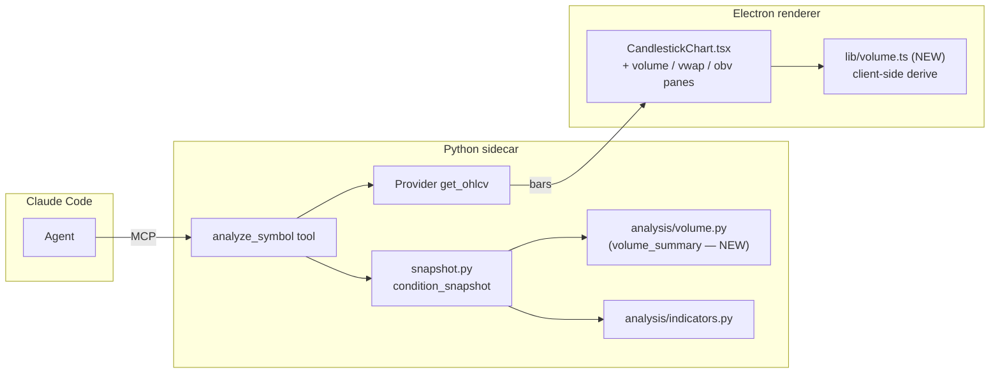

# 0027 — Volume bars in the chart + volume-aware analysis

> **Status:** approved
> **Created:** 2026-05-30
> **Approved:** 2026-05-30
> **Owner skill(s):** `dev` (phases 1–2), `ui-builder` (phase 3)
> **Related ADRs:** [ADR-0023](../adrs/0023-technical-analysis-surface.md) (the `analysis/` surface this extends — volume is an explicitly-listed downstream consumer), [ADR-0008](../adrs/0008-electron-shell-conventions.md) (renderer/chart conventions), [ADR-0015](../adrs/0015-claude-code-primary-control-surface.md) (renderer renders; presentation-derived series computed client-side), [ADR-0007](../adrs/0007-market-data-provider.md) (bars via Provider)
> **Re-bases:** [Plan 0021](0021-multi-timeframe-and-volume-scanners.md) — this plan creates `analysis/volume.py` (the measure layer); 0021's phase 2 changes from "build `volume.py` from scratch" to "add scanner-condition functions on top of it" (see the Plan 0021 amendment note in the README and that plan's header).

## TL;DR

Make volume a first-class citizen in two places. (1) **Analysis:** create `src/market_analyser/analysis/volume.py` with pure/trailing volume measures (volume MA, relative volume + trailing percentile, OBV + OBV slope, rolling VWAP) and fold a `volume_summary` into `condition_snapshot`, so the per-symbol read the agent gets from `analyze_symbol` accounts for volume (a `volume_stance` headline + the numeric measures in the existing `indicators` dict). (2) **UI:** render a TradingView-style volume histogram pane beneath the candlesticks (always shown, green/red by candle direction) with a volume-MA line, plus a VWAP line on the price pane and an OBV line in its own pane — all computed client-side from the `bars` the renderer already holds, mirroring the existing EMA/SMA overlay pattern. First user-visible behavior: open the viewer and see volume bars under the chart; ask Claude Code "what's the condition on AAPL" and the snapshot now includes whether volume is heavy/light and whether OBV is accumulating.

## Context & problem

The app already carries volume on every bar (`Bar.volume`, OHLCV) but uses it nowhere:

- **The chart ignores it.** `desktop/renderer/components/CandlestickChart.tsx` draws candlesticks, EMA/SMA overlay lines, and annotation markers — no volume pane. Every other charting tool shows volume; ours doesn't.
- **`condition_snapshot` ignores it.** `src/market_analyser/analysis/snapshot.py` composes RSI/MACD/Bollinger/ATR/ADX/Supertrend + patterns + swing S/R, but never reads `Bar.volume`. The analyst's headline read is volume-blind — it can't say "this breakout is on heavy volume" or "this rally is on fading volume."

Volume measures are condition reports (how heavy is volume vs its trailing average; is OBV accumulating). They sit squarely inside the "conditions are facts, decisions are the user's" non-negotiable — no buy/sell output.

There is existing volume work in flight: **Plan 0021** (approved, blocked on [Plan 0025](0025-timeframe-expansion.md) for its multi-timeframe ladder) plans `analysis/volume.py` + three volume-scanner MCP tools + multi-timeframe alignment. Two problems with leaving volume entirely to 0021: (a) the foundational volume *measures* (relative volume, OBV, VWAP) would be trapped behind 0025's timeframe expansion even though they only need today's `{1d, 1h}`; (b) the snapshot integration and the chart pane aren't in 0021's scope at all. So this plan owns the **measure layer** and the **snapshot + chart integration**; Plan 0021 keeps the **scanner-condition layer** (`volume_breakout`/`volume_confirmation`/`smart_volume`) + scanner tools + multi-timeframe, now consuming this plan's `volume.py` instead of defining its own.

## Decision

Three phases. **Phase 1** (`dev`) creates `analysis/volume.py` as the canonical home for pure, trailing, deterministic volume math — volume MA, relative volume (+ trailing percentile), OBV + OBV slope, rolling VWAP — plus a composed `volume_summary(bars)` returning a frozen model with a coarse `VolumeStance`. **Phase 2** (`dev`) folds that summary into `condition_snapshot`: the numeric measures join the existing `indicators` dict (additive, no schema break — the same route `rsi_pct90` took), and one new top-level `volume_stance` field is added (additive; the field-set pinning test is updated). **Phase 3** (`ui-builder`) renders the volume histogram pane (always shown, bars tinted green/red by candle direction, own price scale at the bottom), a volume-MA line on that pane, a VWAP line on the price pane, and an OBV line in its own pane — all derived client-side in a new `desktop/renderer/lib/volume.ts`, mirroring the existing `lib/indicators.ts` overlay-compute pattern, with the `__test_chart_render__` hook extended so a dropped series fails a test.

No new ADR: the analysis side is squarely within [ADR-0023](../adrs/0023-technical-analysis-surface.md) (which already lists volume scanners as a downstream consumer of `analysis/`), and the UI side is ordinary `ui-builder` work within [ADR-0008](../adrs/0008-electron-shell-conventions.md). The one methodology choice worth pinning — VWAP anchoring — is settled in this plan body (rolling trailing N-period, not session-anchored) rather than escalated, because it's a tunable with a documented caveat, not a structural fork.

We rejected: (a) leaving all volume to Plan 0021 (blocks the measures behind 0025 and never covers snapshot/chart); (b) computing the chart's VWAP/OBV server-side via a new route (the renderer already derives EMA/SMA client-side from `bars` — a new route would break that established, fetch-free presentation pattern for no benefit); (c) session-anchored VWAP (our bars are predominantly daily and we don't carry intraday session boundaries — a rolling trailing window is deterministic and well-defined on any timeframe).

## Architecture diagram



## Implementation phases

### Phase 1 — `analysis/volume.py` measure layer

- **Owner skill:** `dev`
- **What:** Pure, trailing volume functions over `bars[0..=last]` and a composed `volume_summary`. No pandas/numpy (consistent with ADR-0023). Functions: `volume_sma(bars, period)` → trailing-MA series (`None`-prefixed, length-aligned, same convention as `indicators.py`); `relative_volume(bars, period)` → latest volume ÷ its trailing MA, plus a trailing percentile rank; `obv(bars)` → cumulative on-balance-volume series; `obv_slope(bars, lookback)` → signed slope over the trailing window (basis for accumulation/distribution); `vwap(bars, period)` → rolling trailing volume-weighted average of the typical price `(h+l+c)/3`. `volume_summary(bars)` composes the latest values into a frozen `VolumeSummary` with a coarse `VolumeStance` (heavy / normal / light from relative-volume thresholds). Conditions only — no buy/sell field.
- **Files touched:**
  - New `src/market_analyser/analysis/volume.py` (~140–180 lines).
  - `src/market_analyser/analysis/types.py`: add `VolumeStance` (StrEnum) + `VolumeSummary` (frozen, `extra="forbid"`).
  - New `tests/analysis/test_volume.py` with hand-built fixtures (heavy-volume bar; quiet drift; clear accumulation; clear distribution).
- **Done when:**
  - **Measures match worked fixtures:** on a hand-built fixture, `volume_sma`, `relative_volume` (multiple + percentile), `obv`, `obv_slope`, and `vwap` each equal independently hand-computed values (asserted with explicit expected numbers, not self-referential recomputation).
  - **`VolumeStance` thresholds:** a bar with volume ≥ the heavy threshold × its MA yields `HEAVY`; a quiet-drift bar yields `LIGHT`; an in-band bar yields `NORMAL`. Thresholds are named module constants. Asserted.
  - **OBV direction:** the accumulation fixture yields a positive `obv_slope`; the distribution fixture a negative one. Asserted.
  - **Anti-lookahead:** appending future bars does not change any measure's value at an earlier index (truncation-invariance test, mirroring `tests/analysis` for indicators). Asserted.
  - **Determinism:** every function returns equal results across two calls on the same input. Asserted.
  - **Undefined-leading convention:** series are `None`-prefixed and length-aligned to the input; `volume_summary` on too-few bars returns `None`-valued measures rather than raising. Asserted.
  - `uv run pytest tests/analysis/test_volume.py` passes; `mypy --strict` clean.

### Phase 2 — Fold volume into `condition_snapshot`

- **Owner skill:** `dev`
- **What:** `condition_snapshot` calls `volume_summary(bars)` and merges its numeric measures into the existing `indicators` dict under stable keys (`volume`, `vol_sma20`, `rel_volume`, `vol_pct90`, `obv`, `obv_slope`, `vwap`), and `ConditionSnapshot` gains one new top-level field `volume_stance: VolumeStance` (additive, parallel to `trend`/`momentum`). The `analyze_symbol` tool surfaces the new field/keys automatically (it returns the model). No buy/sell field is introduced.
- **Files touched:**
  - `src/market_analyser/analysis/snapshot.py`: compute + merge the volume summary.
  - `src/market_analyser/analysis/types.py`: add `volume_stance` to `ConditionSnapshot`.
  - `tests/analysis/test_snapshot.py` (or equivalent): extend.
  - The `ConditionSnapshot` field-set pinning test: update the expected field set to include `volume_stance` (and assert there is still **no** action/buy/sell field — the analyst non-negotiable stays pinned).
  - `tests/api/` `analyze_symbol` tool test: assert the volume keys + `volume_stance` appear in the tool's output.
- **Done when:**
  - **Snapshot carries volume:** `condition_snapshot` over a heavy-volume fixture reports `volume_stance == HEAVY` and the `indicators` dict carries non-`None` `rel_volume`/`obv`/`vwap`; over an empty/too-short series the volume measures are `None` and the call does not crash. Asserted.
  - **Field-set pin holds the non-negotiable:** the pinning test asserts the exact top-level field set is the prior set **plus** `volume_stance` and nothing else — in particular no `action`/`signal`/`recommendation` field. Asserted (this is the load-bearing analyst-charter guard, not a count).
  - **Anti-lookahead replay:** with `as_of` set (bars truncated upstream), the snapshot's volume measures match a direct `volume_summary` on the truncated series — no future leak. Asserted (mirrors the Plan 0018 `as_of` replay test, which must assert the truncated value *differs* from the full-series value where the fixture makes them differ).
  - **`analyze_symbol` surfaces it:** the tool's response includes `volume_stance` and the volume `indicators` keys. Asserted.
  - **Regression:** the existing snapshot + `analyze_symbol` tests still pass unchanged except for the field-set expectation.
  - `uv run pytest tests/analysis tests/api` passes; `mypy --strict` clean.

### Phase 3 — Volume pane + VWAP/OBV in the chart

- **Owner skill:** `ui-builder`
- **What:** Extend `CandlestickChart.tsx` to render, from the `bars` it already receives (no new fetch): (a) a **volume histogram pane** at the bottom on its own price scale, always shown, each bar tinted bullish/bearish by candle direction (`close >= open`); (b) a **volume-MA line** over that histogram; (c) a **VWAP line** on the price pane; (d) an **OBV line** in its own pane. The derived series are computed in a new `desktop/renderer/lib/volume.ts` (pure functions returning `lightweight-charts` data, mirroring `lib/indicators.ts`, with the same no-lookahead discipline noted in that file). The `__test_chart_render__` hook is extended to include the new series so a render regression that loses one fails a test.
- **Files touched:**
  - New `desktop/renderer/lib/volume.ts` (`computeVolumeBars`, `computeVolumeMa`, `computeVwap`, `computeObv`) + `desktop/renderer/lib/volume.test.ts`.
  - `desktop/renderer/components/CandlestickChart.tsx`: add the histogram series + the three derived line series, extend `syncTestRenderHook` + the `__test_chart_render__` shape, dispose them on unmount.
  - `desktop/renderer/components/CandlestickChart.module.css` if pane sizing needs it.
  - Extend the relevant unit spec (`CandlestickChart.*.test.tsx`) and the Playwright `live-chart.spec.ts`.
- **Done when:**
  - **Volume pane drawn:** after mount, `window.__test_chart_render__.seriesKinds` includes a `volume` (histogram) entry in addition to the candlestick; the volume pane occupies a bottom band on its own scale (does not overlap the price scale). Asserted via the render hook + a Playwright check that the series is present.
  - **Green/red by candle:** `computeVolumeBars` assigns the bullish color when `close >= open` and the bearish color otherwise, per bar. Asserted in `volume.test.ts` against a fixture mixing up and down bars.
  - **Volume MA, VWAP, OBV computed correctly + trailing:** each of `computeVolumeMa`, `computeVwap`, `computeObv` matches hand-computed expected values on a fixture, and every value at index `i` depends only on `bars[0..=i]` (truncation-invariance test, as in `lib/indicators.ts`). Asserted.
  - **All four series rendered:** the render hook reflects the candlestick + volume histogram + volume-MA line + VWAP line + OBV line; unmount disposes them (no leaked series; the existing dispose-on-unmount discipline holds). Asserted.
  - **Empty bars:** with `bars = []` the chart renders without throwing and the derived series are empty (no `NaN`/`Infinity` pushed into lightweight-charts). Asserted.
  - `pnpm --filter desktop test` (Jest) + the Playwright spec pass; renderer typecheck clean.

## Data shapes

```python
# analysis/types.py additions (illustrative)

class VolumeStance(StrEnum):
    HEAVY = "heavy"      # latest volume >= HEAVY_MULT * trailing MA
    NORMAL = "normal"
    LIGHT = "light"      # latest volume <= LIGHT_MULT * trailing MA

class VolumeSummary(BaseModel):           # frozen, extra="forbid"
    latest_volume: float | None
    volume_sma: float | None
    relative_volume: float | None         # latest ÷ trailing MA
    volume_percentile: float | None       # 0..100 trailing rank
    obv: float | None
    obv_slope: float | None               # signed; >0 accumulation, <0 distribution
    vwap: float | None                    # rolling trailing N-period
    stance: VolumeStance
```

`ConditionSnapshot` gains exactly one new top-level field, `volume_stance: VolumeStance`; the numeric measures ride in the existing `indicators: dict[str, float | None]` under the keys listed in phase 2. No other top-level field changes.

```typescript
// desktop/renderer/lib/volume.ts (illustrative — mirrors lib/indicators.ts)
export function computeVolumeBars(bars: ReadonlyArray<Bar>): HistogramData[]   // green/red by close>=open
export function computeVolumeMa(bars: ReadonlyArray<Bar>, period: number): LineData[]
export function computeVwap(bars: ReadonlyArray<Bar>, period: number): LineData[]
export function computeObv(bars: ReadonlyArray<Bar>): LineData[]
```

## Risks & open questions

- **Risk — duplicated volume math (renderer vs Python).** `lib/volume.ts` re-implements VWAP/OBV/volume-MA that `analysis/volume.py` also computes, just as `lib/indicators.ts` already duplicates EMA/SMA. Accepted for presentation series (same precedent); the **authoritative** analysis values come from `analyze_symbol`/the snapshot. The renderer math is presentation-only. If the two ever need to agree to the cent, that's a separate "single source for chart series" plan, not this one.
- **Decision (not open) — VWAP anchoring.** Classic VWAP is session-anchored (resets each trading session); our bars are predominantly daily and we don't carry intraday session boundaries, so a session reset is ill-defined here. We use a **rolling trailing N-period VWAP** — deterministic, well-defined on any timeframe, trailing (no lookahead). The plan documents this as an approximation in both `volume.py` and `volume.ts` docstrings so a reader doesn't mistake it for session VWAP.
- **Risk — `lightweight-charts` multi-pane mechanism.** Rendering OBV in its own pane (and volume on a squeezed bottom scale) depends on the installed `lightweight-charts` version's pane/price-scale API. `ui-builder` picks the concrete mechanism (separate price scale with `scaleMargins` vs the panes API) at implementation; the done-when is phrased on *what's drawn* (via the render hook), not the API used, so the spec survives either choice. If true multi-pane isn't available in the pinned version, OBV falls back to its own overlay scale rather than a separate pane — still its own band, still asserted by the hook.
- **Open question — a standalone `volume_summary` MCP tool.** This plan surfaces volume only through `analyze_symbol`/the snapshot. A dedicated agent-facing `volume_summary(symbol, timeframe)` tool is a plausible follow-up but is out of scope (the snapshot already carries it; Plan 0021's scanners cover multi-symbol volume reads).
- **Risk — bad/zero volume from the feed.** Real feeds emit `0` or missing volume on some bars. The measures must not divide-by-zero (relative volume when the MA is `0` → `None`, not `inf`) and the chart must not push `NaN`/`Infinity` into lightweight-charts. Covered by the empty/degenerate-fixture done-whens in phases 1 and 3.

## What this plan does NOT do

- **Volume scanners / multi-timeframe** — `volume_breakout`/`volume_confirmation`/`smart_volume` + the multi-timeframe ladder stay in [Plan 0021](0021-multi-timeframe-and-volume-scanners.md), now consuming this plan's `analysis/volume.py`.
- **A standalone volume MCP tool** — possible follow-up; the snapshot is the surface here.
- **Session-anchored / intraday VWAP** — rolling trailing VWAP only (see Risks).
- **Server-side chart series** — the chart derives volume/VWAP/OBV client-side from `bars`, like the existing EMA/SMA overlays.
- **Reconciling the renderer's duplicated math with the Python layer** — separate concern (same as today's EMA/SMA duplication).
- **Any buy/sell output** — conditions only, enforced by the field-set pinning test in phase 2.

## Followups (after this lands)

- Re-base check at Plan 0021 pickup: confirm 0021's scanner-condition functions import this plan's `analysis/volume.py` primitives rather than re-deriving relative volume / OBV.
- Consider a standalone `volume_summary` MCP tool if the agent wants volume without the full snapshot.
