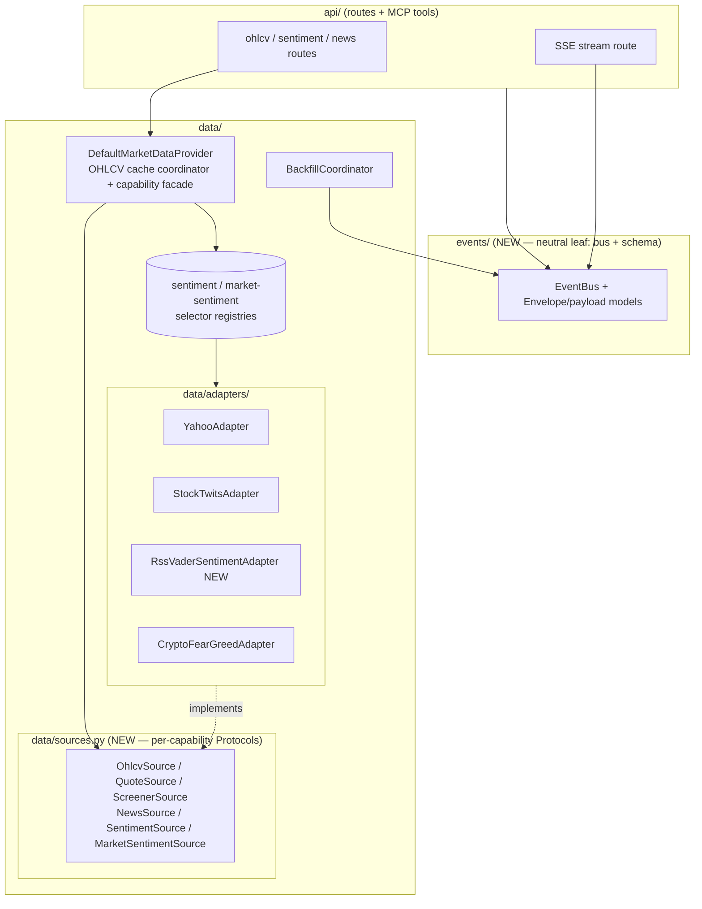

# 0028 — Data-layer boundary & extensibility hardening

> **Status:** in-progress
> **Created:** 2026-05-31
> **Owner skill(s):** dev
> **Related ADRs:** [0031-data-source-adapter-contract](../adrs/0031-data-source-adapter-contract.md), [0032-data-layer-no-api-dependency](../adrs/0032-data-layer-no-api-dependency.md)

## TL;DR

Two data-layer cleanups surfaced by the 2026-05-31 architecture audit, landed together because they share an owner (`dev`), a subsystem (`data/`), and a theme (boundary hygiene). First: give data sources a producer-side contract — per-capability Protocols plus a selector registry — so adding a source stops meaning "edit 4-5 files with no shape to conform to" ([ADR-0031](../adrs/0031-data-source-adapter-contract.md)). Second: remove the lone `data→api` import by relocating the `EventBus` + event schema to a neutral `events/` core ([ADR-0032](../adrs/0032-data-layer-no-api-dependency.md)). Both are behavior-preserving refactors — no new agent-visible capability, no API shape change.

## Context & problem

The audit found the data layer's *consumer* seam (the `MarketDataProvider` Protocol, ADR-0007) clean, but two *producer/boundary* problems:

1. **No producer contract for adapters.** Each adapter invents its own method name; every source is hand-threaded through `DefaultMarketDataProvider` (`default_provider.py:91-108`), and two dispatch bodies have grown source-selector `if/elif` ladders (`get_sentiment` `:341-347`, `get_market_sentiment` `:402-405`) with the RSS-VADER aggregation inlined into the provider (`:349-367`). Adding a source touches 4-5 files with nothing checking conformance. Contrast strategies, which are a one-file drop behind `discover()`. See [ADR-0031](../adrs/0031-data-source-adapter-contract.md) for the full framing.

2. **One `data→api` import.** `data/backfill.py:32` imports `EventBus` + payloads from `market_analyser.api.events`. Not a runtime cycle (`api/events` is a stdlib+pydantic leaf), but it makes `data/` non-isolable and stands as precedent — the audit re-flagged the same reach the plans-README follow-up already noted. See [ADR-0032](../adrs/0032-data-layer-no-api-dependency.md).

## Decision

Land both as one `dev` session in three commits. Phases 1-2 implement ADR-0031 (capability Protocols, then the selector registry + provider slimming); phase 3 implements ADR-0032 (relocate the event abstraction to `events/`). Order is deliberate: the contract work (1-2) is self-contained in `data/`; the event relocation (3) is broad-but-shallow and touches `api/` import sites, so it goes last to avoid rebasing the contract work over it.

We rejected a standalone plan for the `data→api` fix (it would contradict the README's "promote only if it recurs" convention and duplicate session overhead) and rejected an auto-discovery adapter seam (ADR-0031 Alternative A — adapters are stateful, unlike pure strategy modules).

## Architecture diagram



## Implementation phases

### Phase 1 — Per-capability source Protocols
- **Owner skill:** dev
- **What:** Add `data/sources.py` with the seven narrow capability Protocols (`OhlcvSource`, `SymbolSearchSource`, `QuoteSource`, `ScreenerSource`, `NewsSource`, `SentimentSource`, `MarketSentimentSource`), each `@runtime_checkable`. Annotate every existing adapter as implementing its capability; normalize any method name that doesn't already match a Protocol (keep names that do). No provider changes yet.
- **Files touched:** `src/market_analyser/data/sources.py` (new), `data/adapters/yahoo.py`, `yahoo_quote.py`, `tradingview_screener.py`, `rss_news.py`, `stocktwits.py`, `crypto_fear_greed.py`, plus any adapter tests that pin the renamed method.
- **Done when:** A `tests/data/test_source_contracts.py` asserts each concrete adapter satisfies its capability Protocol (`isinstance(adapter, OhlcvSource)` etc. via `@runtime_checkable`, or a structural `getattr` check matching the `discover()`-style validation), and `uv run pytest -m "not network"` is green with no behavior change. The test fails if an adapter drops a contract method.

### Phase 2 — Selector registries + provider slimming
- **Owner skill:** dev
- **What:** Extract the inlined RSS-VADER aggregation (`_news_vader_sentiment`) into a `RssVaderSentimentAdapter` (composing the news source + VADER) that satisfies `SentimentSource`. Replace `get_sentiment`'s `if source ==` ladder with a `dict[str, SentimentSource]` registry and `get_market_sentiment`'s `if market !=` ladder with a `dict[str, MarketSentimentSource]` registry, both built once in `__init__` from the constructor-injected adapters. Provider methods become a registry lookup + delegate. `get_ohlcv`/`coverage`/`get_ohlcv_with_status` are untouched (they own the cache orchestration, per ADR-0031).
- **Files touched:** `data/default_provider.py`, `data/adapters/rss_vader_sentiment.py` (new), `tests/data/test_default_provider_*.py`, `tests/data/test_sentiment_source_dispatch.py`.
- **Done when:** `get_sentiment(source="rss-vader")` and `get_sentiment(source="stocktwits")` return the same `SentimentSample` values as before (existing tests pass unchanged), an unknown source/market still raises `ValueError`/`NotImplementedError`, the registries are plain dicts (no set iteration — determinism), and `_news_vader_sentiment` no longer exists on the provider. A test adds a fake `SentimentSource` to the registry and asserts it dispatches — proving the seam is a one-entry add, not a dispatch-body edit.

### Phase 3 — Relocate the event bus to a neutral `events/` core
- **Owner skill:** dev
- **What:** Move `EventBus` + the envelope/payload models from `api/events/` to a new top-level `market_analyser/events/` package (stdlib + pydantic only, stays a leaf). Update `api/` to import/re-export from the new location, and switch `data/backfill.py:32` to `from market_analyser.events import …`. The SSE *route* stays in `api/`. No model field/version changes.
- **Files touched:** `src/market_analyser/events/` (new, content moved from `api/events/`), `api/events/__init__.py` (becomes a re-export shim or is removed with call-sites updated), `data/backfill.py`, `api/app.py` + route/MCP-tool import sites, `tests/api/test_events_*.py`, any test importing the models by path.
- **Done when:** `python -c "import market_analyser.data.backfill"` does not import `market_analyser.api`, no `from market_analyser.api.events` remains under `src/market_analyser/data/` (grep is clean), the SSE event-schema parity guard `desktop/renderer/types/events.test.ts` still passes (schemas byte-identical), and `uv run pytest -m "not network"` is green.

## Data shapes

No persisted or API-visible shapes change. The new internal contracts (illustrative):

```python
# data/sources.py — one narrow Protocol per capability (illustrative)
@runtime_checkable
class SentimentSource(Protocol):
    def fetch_sentiment(self, symbol: str, window: str) -> SentimentSample: ...

@runtime_checkable
class MarketSentimentSource(Protocol):
    def fetch_current(self) -> MarketSentimentSample: ...

# default_provider.py — selector ladders become registries (illustrative)
self._sentiment_sources: dict[str, SentimentSource] = {
    "rss-vader": RssVaderSentimentAdapter(self._news),
    "stocktwits": self._stocktwits,
}
```

## Risks & open questions

- Risk: phase 3's import-site sweep misses a call-site or breaks the renderer event-schema parity guard. Mitigation: the done-when greps for residual `api.events` imports and runs `events.test.ts`; treat the parity guard as the acceptance gate, not just pytest.
- Risk: a `@runtime_checkable` `isinstance` check gives false confidence (it only checks method *presence*, not signature). Mitigation: phase 1's contract test pairs the isinstance check with a call that exercises the real signature, the same way `discover()` validates strategies beyond `getattr`.
- Open question: should `events/` also absorb the bus *config* (queue cap constant) or leave it at the route layer? Default: move the constant with the bus (it's bus state, not transport). Revisit only if the route needs to override it.

## What this plan does NOT do

- Does **not** add auto-discovery for adapters (ADR-0031 Alternative A, rejected — adapters are stateful). Registration stays explicit in the composition root.
- Does **not** add a new data source, capability, or agent-visible tool — pure refactor.
- Does **not** touch the OHLCV cache/gap/`as_of` orchestration in the provider — that logic stays where it is.
- Does **not** address the audit's data-layer *robustness* minors (Yahoo error-envelope guard, `Bar` zero-price tightening) — those are README follow-ups, picked up separately.

## Followups (after this lands)

- Once the capability Protocols exist, the `data/_http.py` resilience concerns (cache vs stats counters) could be split behind them — but only if a second HTTP client needs the split. Not now.
