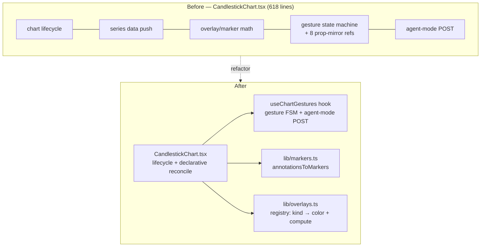

# 0029 — CandlestickChart decomposition

> **Status:** approved
> **Created:** 2026-05-31
> **Owner skill(s):** ui-builder
> **Related ADRs:** [0008-electron-shell-conventions](../adrs/0008-electron-shell-conventions.md) (applies its component conventions; no new decision)

## TL;DR

`desktop/renderer/components/CandlestickChart.tsx` is a 618-line god component conflating five jobs: chart lifecycle, multi-series data push, indicator/marker business logic, an ~80-line pointer-gesture state machine, and agent-mode POST orchestration. Extract the gesture state machine into a `useChartGestures` hook and move the marker/overlay computation into `lib/`, leaving the component as chart-lifecycle + declarative series reconciliation. Behavior-preserving — the `window.__test_chart_render__` reflection and every existing unit/Playwright spec stay green. A side benefit: adding a new overlay kind becomes a single registry entry instead of four scattered edits.

## Context & problem

The 2026-05-31 architecture audit flagged `CandlestickChart.tsx` as the one major maintainability issue in the desktop app. Concrete findings:

- **Five responsibilities in one component.** Chart lifecycle (`:222-296`), data push for five derived series (`:445-496`), business logic — `computeOverlayData` (`:570-578`), `annotationsToMarkers` (`:591-614`), volume/VWAP/OBV wiring — a full pointer-gesture state machine (pointerdown/move/up → range-select, click-vs-drag suppression, pointer capture, Escape: `:333-409`), and agent-mode POST orchestration (`:317-322`, `:391-396`).
- **Symptom: eight `useRef`s mirroring props** (`:191-204`) so the mount-once effect can read live prop values inside gesture handlers. This is the tell that live-prop handlers are jammed into a mount-once effect.
- **Leaky overlay seam.** Adding a new overlay kind means edits in four scattered spots: the `SUPPORTED_OVERLAY_KINDS` set (`:54`), a color in `overlayColorFor` (`:149-153`), a branch in `computeOverlayData` (`:570-578`), and the test render-hook in `syncTestRenderHook` (`:206-220`).

No ADR is needed — this applies the existing component conventions in [ADR-0008](../adrs/0008-electron-shell-conventions.md) (dispose-on-unmount, business logic out of components); there is no cross-cutting decision with rejected alternatives, only a refactor.

## Decision

Decompose in two `ui-builder` commits, each behavior-preserving and gated by the existing render-reflection harness. Phase 1 lifts the gesture state machine into `useChartGestures`, which removes the prop-mirroring refs. Phase 2 moves marker/overlay math into `lib/` and collapses the four-spot overlay seam into one registry. We rejected a full rewrite (the component's chart-lifecycle/dispose logic is correct and load-bearing — ADR-0008 calls dispose-on-unmount non-negotiable) and rejected splitting into sub-components (the chart is one canvas; sub-components would fight lightweight-charts' imperative API).

## Architecture diagram



## Implementation phases

### Phase 1 — Extract `useChartGestures`
- **Owner skill:** ui-builder
- **What:** Move the pointer-gesture state machine (drag→range-select, click-vs-drag suppression, pointer capture, Escape-to-cancel) and its agent-mode POST calls (`postBarClicked`/`postRangeSelected`) into a `useChartGestures(containerRef, { agentMode, symbol, timeframe, bars })` hook returning `{ selection, rangeLabel, clickedBarTs }`. The hook reads live props directly, eliminating the eight prop-mirroring `useRef`s (`:191-204`). The component consumes the hook's return for selection-rectangle rendering.
- **Files touched:** `desktop/renderer/hooks/useChartGestures.ts` (new), `desktop/renderer/hooks/useChartGestures.test.tsx` (new), `desktop/renderer/components/CandlestickChart.tsx`, `CandlestickChart.gestures.test.tsx`.
- **Done when:** The existing gesture specs (`CandlestickChart.gestures.test.tsx`) pass against the refactored component, a new `useChartGestures.test.tsx` asserts the FSM directly (a drag emits one `postRangeSelected` with the correct `[from,to]`; a click without drag emits `postBarClicked`; Escape cancels with no POST; agent-mode off emits nothing), the eight prop-mirror refs are gone, and `pnpm test` + the `live-chart.spec.ts` Playwright range-select flow are green.

### Phase 2 — Move marker/overlay math to `lib/` and make the overlay seam a registry
- **Owner skill:** ui-builder
- **What:** Move `annotationsToMarkers` to `lib/markers.ts` and `computeOverlayData` to `lib/overlays.ts`. Replace the four scattered overlay-kind sites with one registry: `OVERLAY_REGISTRY: Record<OverlaySpec['kind'], { color: string; compute(bars, period): LineData[] }>`, with the supported set derived from its keys (so `SUPPORTED_OVERLAY_KINDS`, `overlayColorFor`, and the `computeOverlayData` branch collapse to one table). The reconcile loop stays in the component but reads the registry. The render-hook reflection (`syncTestRenderHook`) reads supported kinds from the registry too.
- **Files touched:** `desktop/renderer/lib/markers.ts` (new), `desktop/renderer/lib/overlays.ts` (new) + their `.test.ts`, `desktop/renderer/components/CandlestickChart.tsx`, `CandlestickChart.overlays.test.tsx`.
- **Done when:** `annotationsToMarkers` and `computeOverlayData` have direct `lib/` unit tests (table-driven, hand-computed expected marker/line values), adding a hypothetical overlay kind in a test requires only a registry entry (asserted by a test that registers a fake kind and sees it reconciled), the overlay/marker Playwright + unit specs (`CandlestickChart.overlays.test.tsx`, `live-chart.spec.ts`) pass, and `window.__test_chart_render__` reflects the same series set as before for the `ema`/`sma` cases.

## Data shapes

No persisted or wire shapes change. New internal types (illustrative):

```ts
// lib/overlays.ts
type OverlayKind = OverlaySpec['kind']
export const OVERLAY_REGISTRY: Partial<Record<OverlayKind, {
  color: string
  compute(bars: Bar[], period: number): LineData[]
}>> = {
  ema: { color: '#2563eb', compute: (bars, p) => computeEma(bars, p) },
  sma: { color: '#f97316', compute: (bars, p) => computeSma(bars, p) },
}
export const SUPPORTED_OVERLAY_KINDS = new Set(Object.keys(OVERLAY_REGISTRY))
```

## Risks & open questions

- Risk: the refactor silently drops a drawn series and the render-reflection harness doesn't catch it. Mitigation: `window.__test_chart_render__` asserts one entry per *drawn* series (candlestick + volume + MA + VWAP + OBV + overlays); the done-when pins the series set equality, and `live-chart.spec.ts` asserts against the reflection, not the reducer list.
- Risk: extracting gesture handlers changes pointer-capture timing and makes range-select flaky. Mitigation: phase 1's hook test exercises the click-vs-drag threshold directly; keep the same capture/release calls, just relocated.
- Open question: should agent-mode POST orchestration live in `useChartGestures` or its own `useAgentModeChart` hook? Default: keep it in `useChartGestures` (the POSTs are gesture outcomes); split only if a non-gesture agent action appears.

## What this plan does NOT do

- Does **not** add new overlay kinds (`rsi`/`macd`/`bbands` stay schema-permitted-but-skipped MVP) — it only makes adding one a single registry entry.
- Does **not** change the chart-lifecycle/dispose logic (correct per ADR-0008) or any agent-visible behavior.
- Does **not** address the audit's other desktop minors (SSE payload Zod validation, `sidecar:status` parse, `format.test.ts`, IPC-handler unit tests) — those are README follow-ups.

## Followups (after this lands)

- With the overlay registry in place, wiring `rsi`/`macd`/`bbands` (math + a separate price scale) becomes additive — a candidate for a future UI plan, not this one.
