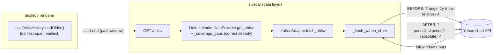

# 0031 — Yahoo absolute-range fetch (`period1`/`period2`)

> **Status:** in-progress
> **Created:** 2026-06-02
> **Owner skill(s):** `dev`
> **Related ADRs:** [ADR-0007](../adrs/0007-market-data-provider.md) (the `MarketDataProvider`/adapter contract this lives under — no new decision; the fetch *mechanism* is an adapter implementation detail ADR-0007 never specified)
> **Unblocks:** [Plan 0030](0030-lazy-historical-loading.md) — its backward-paging feature is `implementation complete — pending 0031`; the renderer is built and correct but cannot work until the data layer can return bars for a window that ends in the past.

## TL;DR

The Yahoo OHLCV fetcher requests data with Yahoo's now-relative `range=` parameter (`?interval=1d&range=1y`), so it can only ever return the *most recent* N days. `yahoo.py::fetch_ohlcv` maps the requested `[start, end]` span to a `range` string, fetches that now-anchored window, then filters the rows to `[start, end]`. For a window that **ends in the past** — exactly what Plan 0030's scroll-left backward paging requests — the now-anchored fetch barely overlaps the requested window and almost no bars survive the filter. This plan switches the fetcher to Yahoo's **absolute** `period1`/`period2` (Unix-second) parameters so a window is fetched verbatim regardless of where it sits relative to now, and lifts the artificial 732-day span cap (an artifact of the longest `range` string) for timeframes Yahoo serves without a horizon. Per-timeframe intraday horizons (`max_history` in `data/timeframes.py`) are unchanged — they are real Yahoo limits, already enforced before the adapter is reached.

## Context & problem

Discovered 2026-06-02 in manual testing of [Plan 0030](0030-lazy-historical-loading.md) (handed off from a `ui-builder` session; recorded as project memory `project_yahoo_adapter_relative_range_only.md`). Scrolling the chart left fires the renderer's `loadOlder` correctly and requests the right older window (e.g. `[2024-06-03, 2025-06-03]`, a full year), but `GET /ohlcv` returns ~11 bars (then 1), all clustered at the recent end. The renderer's buffer stops growing, `reachedStart` latches, and paging silently halts. The initial window — which ends at *now* — returns ~251 bars fine.

Root cause, confirmed by code read:

- `src/market_analyser/data/adapters/_yahoo_fetch.py:46` builds the request as `?interval={interval}&range={period}`. Yahoo's `range=` is **always relative to now**; there is no absolute window in this code path.
- `src/market_analyser/data/adapters/yahoo.py:112-167` (`fetch_ohlcv`) computes `span_days`, maps it to the smallest sufficient `range` string via `_smallest_period_for` (`_PERIOD_DAYS` tops out at `2y`/732d → `_MAX_PERIOD_DAYS`), fetches that now-anchored window, and filters rows to `[start_utc, end_utc]`.
- `src/market_analyser/data/default_provider.py:154-167` (`get_ohlcv`) computes the correct gap for the older window and calls the adapter — but the adapter physically cannot reach bars older than `now − range`.

So [Plan 0030](0030-lazy-historical-loading.md)'s premise ("older bars are fetchable today via `GET /ohlcv`'s synchronous gap-fetch") is true **only for windows ending at/near now**. Backward paging is the first feature to request past-ending windows, so the limitation was latent: initial chart loads, backfills (Plan 0013), and analysis snapshots all end ~now. It also caps any future deep-history feature (e.g. a multi-year backtest starting from cached-but-incomplete coverage) at the same wall.

Yahoo's chart endpoint accepts `?period1=<epoch_seconds>&period2=<epoch_seconds>&interval=<i>` as a direct alternative to `range=`, returning the exact `[period1, period2]` window (subject to the same per-interval history horizon Yahoo enforces for intraday). This is the fix.

## Decision

Switch the Yahoo chart fetcher from now-relative `range=` to absolute `period1`/`period2`, and pass the real `[start, end]` window through from the adapter instead of collapsing it to a range string.

- `_yahoo_fetch.py` builds `?period1={int(start.timestamp())}&period2={int(end.timestamp())}&interval={interval}`. The fetcher's signature changes from `(symbol, period: str, interval)` to an absolute window (`start`/`end` datetimes, or epoch ints) — rippling to the `_FetchOhlcvFn` Protocol and the test fakes that inject a fetcher.
- `yahoo.py::fetch_ohlcv` passes `start_utc`/`end_utc` straight through. The row filter to `[start_utc, end_utc]` and the empty-response→`UnknownSymbolError` heuristic stay (re-justified against the window rather than a `period` string). The artificial `_MAX_PERIOD_DAYS = 732` span cap (a `range`-list artifact) is removed for timeframes with no `max_history` horizon (`1d`, `1w`); intraday horizons remain enforced by `default_provider._exceeds_history_cap` *before* the adapter is called, so the adapter needs no per-interval cap of its own.
- Fold in the adjacent, already-tracked hardening: guard `_parse_chart_payload` against a 2xx Yahoo *error* envelope / missing `timestamp` key (the 2026-05-31 audit follow-up at `_yahoo_fetch.py:53-55`). Historical windows make thin/empty/edge responses more likely, so this is on the critical path now rather than opportunistic.

**No new ADR.** ADR-0007 fixes the *Provider/adapter contract* (one Protocol, source-hiding, `as_of` seam, pydantic returns) and is unchanged — the Protocol signature, return types, and caching chokepoint all stay. `range=` vs `period1`/`period2` is an adapter *implementation* detail ADR-0007 never specified; correcting it reverses no recorded decision and is locally reversible. The rejected alternative (below) is tactical, not architectural.

Rejected alternatives:
- **Keep `range=`, widen the period list, post-filter harder.** Cannot work in principle: `range=` is always now-anchored, so no range string reaches a past-ending window. This is the bug, not a tuning knob.
- **Hybrid — `range=` for now-ending windows, `period1`/`period2` only for past-ending ones.** Adds a branch and two code paths for no benefit; `period1`/`period2` subsumes the now-ending case (`period2 = now`) and is strictly more capable. Use it unconditionally.
- **Renderer-side shim** (clamp/synthesize older bars in `useOhlcvHistory`): violates the no-fabrication rule and hides a real data gap. Explicitly out — the `ui-builder` session correctly refused this.

## Architecture diagram

## Implementation phases

### Phase 1 — Absolute `period1`/`period2` fetch + cap reconciliation + envelope guard

- **Owner skill:** `dev`
- **What:**
  - `_yahoo_fetch.py`: change `_fetch_yahoo_ohlcv` to take the absolute window (recommended: `start: datetime, end: datetime`, keeping `interval`, `client`) and build `?period1={int(start.timestamp())}&period2={int(end.timestamp())}&interval={interval}`. Update the `_FetchOhlcvFn` Protocol in `yahoo.py:42-43` to match. Guard `_parse_chart_payload` so a Yahoo error envelope / missing `timestamp` raises a typed `UpstreamUnavailableError` (or `UnknownSymbolError` for a clearly-empty result) instead of a raw `KeyError`/`TypeError` that escapes as a 500 (absorbs the 2026-05-31 audit follow-up).
  - `yahoo.py::fetch_ohlcv`: drop the `_PERIOD_DAYS`/`_smallest_period_for`/`_MAX_PERIOD_DAYS` span→range machinery; pass `start_utc`/`end_utc` to the fetcher. Keep the `[start_utc, end_utc]` row filter and the empty-response→`UnknownSymbolError` heuristic (re-phrased against the window). Remove the 732-day `ValueError` cap for timeframes with no `max_history` horizon; rely on `default_provider._exceeds_history_cap` (`default_provider.py:63-68,132-133`) for intraday horizons (unchanged).
  - Update the fetcher-injection test fakes and any unit test asserting the old `?range=` URL or the period-string mapping.
- **Files touched:** `src/market_analyser/data/adapters/_yahoo_fetch.py`, `src/market_analyser/data/adapters/yahoo.py`, the Yahoo adapter/fetcher tests under `tests/` (whichever assert URL shape, period mapping, or the 732-day cap), the audit follow-up's parse-guard test, and a route-level integration test under `tests/api/` (`TestClient` + injected fetcher, past-window fetch).
- **Done when:**
  - A unit test (fetcher mocked / recorded payload) asserts the request URL carries `period1`/`period2` (not `range=`) for a given `[start, end]`, and that the returned bars cover the full requested window — including a window whose `end` is well in the past (the regression that motivated this plan).
  - A unit test asserts a now-ending window still returns the same bars it did before (no regression for the initial-load / backfill path).
  - A unit test asserts a Yahoo error/empty envelope raises the typed taxonomy (no raw `KeyError`/500).
  - For an uncapped timeframe (`1d`), a multi-year span no longer raises the 732-day `ValueError`; for an intraday timeframe past its horizon, `_exceeds_history_cap` still raises `HistoryExceededError` (behavior preserved).
  - **Route-level integration test (deterministic, no network) — the e2e gate for this fix:** build the FastAPI app via `create_app` wired with a `DefaultMarketDataProvider` whose adapter has an injected fake/recorded fetcher (the `_FetchOhlcvFn` seam), then hit `GET /ohlcv` through a `TestClient` for a **past-ending** window. Assert (a) the response carries the full window's bars (not the ~11-bar now-anchored remnant the bug produced), and (b) the fetcher was invoked with the absolute `[start, end]` window — proving the chain route → `get_ohlcv` → `_coverage_gaps` → `YahooAdapter.fetch_ohlcv` → fetcher threads the real window end-to-end, not just the adapter in isolation. A past-ending window backed by an empty cache must drive a gap-fetch and return the fetched bars. (An Electron e2e is deliberately NOT used: it would either bypass Yahoo via cache — proving nothing about this fix — or require live network; the `TestClient` integration test is the right deterministic level.)
  - `uv run pytest` green; no change to the `MarketDataProvider` Protocol surface or return types (ADR-0007 intact).
  - **Live smoke (best-effort, in the commit message):** `GET /ohlcv` for `AAPL 1d` over a window ending ~1 year ago returns ~250 bars (not ~11) against real Yahoo — the real-world confirmation the deterministic test can't give (it stubs the fetcher), mirroring the existing live-test caveat style.

## Cross-plan follow-up (not a phase here)

After phase 1 lands, [Plan 0030](0030-lazy-historical-loading.md) becomes end-to-end functional with no renderer change. Two things gate Plan 0030's close, and they are independent:

- **This plan (0031)** unblocks the *live* path — once it ships, the real Yahoo fetch returns past windows, so Plan 0030's manual scroll smoke and its (now non-gating) live e2e case work for real.
- **Plan 0030's own deterministic seeded-cache e2e** (`ui-builder`, the added close-blocking item in its Phase 2 done-when) does **not** depend on 0031 — seeding the cache bypasses Yahoo — so it can be written and pass *now*, proving the renderer wiring independently.

When both have landed: `ui-builder`/architect re-runs the manual scroll smoke (older bars stream in; viewport anchored; paging stops cleanly at data start / intraday horizon) and takes Plan 0030 through its close ceremony (`implementation complete — pending …` → `done`).

## Data shapes

No persisted or wire shapes change. `GET /ohlcv` still returns `Bar[]`; the `MarketDataProvider.get_ohlcv` signature and pydantic return types are untouched. Only the internal Yahoo request URL and the fetcher's Python signature change.

## Risks & open questions

- **Renderer interaction (no change needed).** Plan 0030's `useOhlcvHistory` clamps each older chunk to ≤700 days and halve-retries on a 422. Lifting the 732-day cap for `1d`/`1w` means oversized daily spans now *succeed* instead of 422-ing, so the renderer's 422-backoff becomes vestigial-but-harmless and the 700-day clamp is just a conservative chunk size. No `ui-builder` edit is required; noted so the dead-ish 422 path isn't mistaken for a regression.
- **Intraday horizons unchanged.** `period1`/`period2` does **not** extend intraday history beyond Yahoo's horizon (`15m`→60d, `1h`/`4h`→730d in `data/timeframes.py`). A scroll-left page on `15m` still stops at the horizon — correctly surfaced as an empty fetch → Plan 0030's `reachedStart`. This is intended, not a gap.
- **Cache coverage math is already correct.** `_coverage_gaps` computes the right head gap for an older window today; only the adapter's fetch was broken. Low risk that the gap logic needs touching — but the phase-1 tests should confirm a past-window gap-fetch upserts and returns the fetched bars.
- **Open question — epoch boundary inclusivity.** Yahoo's `period2` is treated as exclusive-ish at the bar boundary in some intervals; the existing `start_utc <= ts <= end_utc` filter already normalizes this, so keep it. Confirm the join bar at `period2` isn't dropped (it's deduped on the renderer side regardless).

## What this plan does NOT do

- **Does not change the `MarketDataProvider` Protocol, `get_ohlcv` signature, return types, or the `as_of` seam** (ADR-0007 intact). Pure adapter-internal fix.
- **Does not touch the renderer.** Plan 0030's hooks/components are correct and unchanged; this unblocks them.
- **Does not extend intraday history beyond Yahoo's horizon** — that is a hard upstream limit, not addressable here.
- **Does not add right-edge/forward paging or any new feature** — it restores the historical-fetch capability the data layer was assumed to already have.
- **Does not migrate other adapters.** Only the Yahoo OHLCV path uses `range=`; sentiment/news/screener adapters are out of scope.
