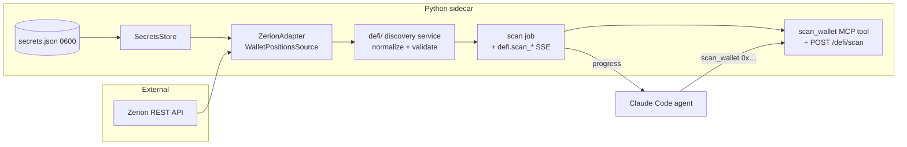

# 0032 — DeFi wallet discovery (paste an address → see positions)

> **Status:** approved
> **Created:** 2026-06-03
> **Owner skill(s):** dev
> **Related ADRs:** [0034](../adrs/0034-defi-portfolio-aggregator.md) (Zerion aggregator), [0035](../adrs/0035-defi-domain-placement.md) (`defi/` domain placement), [0038](../adrs/0038-third-party-api-key-storage.md) (secrets store — phase 1 implements it), [0031](../adrs/0031-data-source-adapter-contract.md) (source Protocol seam), [0019](../adrs/0019-external-http-adapter-resilience.md) (resilience client), [0017](../adrs/0017-live-ui-updates-via-sse.md) (SSE progress), [0015](../adrs/0015-claude-code-primary-control-surface.md) (agent-driven loop)

## TL;DR

First slice of the DeFi wallet-analysis program: a public EVM address goes in, a list of decoded DeFi positions across Ethereum / Base / Arbitrum / Optimism comes out. We add a `SecretsStore` (so the app can hold a Zerion API key), a `ZerionAdapter` behind a new `WalletPositionsSource` Protocol, a `defi/` discovery service that normalizes and validates positions, and a scan job that streams progress over SSE and exposes a `scan_wallet` MCP tool plus an HTTP route. The first user-visible behavior is **agent-driven**: the user tells the agent "analyze `0x…`," the agent calls `scan_wallet`, and gets back structured positions. No P&L, no risk, no paste-box UI yet — those are later plans in the series.

## Context & problem

The app has no DeFi code, no on-chain data source, and no way to store an authenticated API key (every TradFi source is keyless). The user wants to paste a wallet and "fully analyze all positions." That full vision is a five-plan program; this plan builds its foundation — **discovery** — and de-risks the two hardest integration unknowns up front: standing up the first authenticated external source, and proving Zerion actually returns interpreted Aave/Uni-v3/Aerodrome positions across the four chains before we build the heavier P&L and risk engines on top.

Discovery is the right walking skeleton because it is independently useful ("what do I hold across chains, in one place") and everything downstream consumes its position model. Per [ADR-0015](../adrs/0015-claude-code-primary-control-surface.md), the loop is agent-driven first; the paste-box UI is a visualization surface that lands in the UI plan (0036), not here.

## Decision

Build discovery as four `dev` phases, backend-only, all under the seams the DeFi ADRs already fixed. Phase 1 stands up the `SecretsStore` ([ADR-0038](../adrs/0038-third-party-api-key-storage.md)) so a Zerion key can be held safely. Phase 2 adds the `WalletPositionsSource` Protocol + `ZerionAdapter` ([ADR-0034](../adrs/0034-defi-portfolio-aggregator.md)/[ADR-0031](../adrs/0031-data-source-adapter-contract.md)) and the normalized position model in `src/market_analyser/defi/` ([ADR-0035](../adrs/0035-defi-domain-placement.md)). Phase 3 adds the discovery service (normalize + boundary-validate) and runs it as an async scan job streaming `defi.scan_*` progress over the existing SSE bus ([ADR-0017](../adrs/0017-live-ui-updates-via-sse.md)). Phase 4 exposes the `scan_wallet` MCP tool + an HTTP route and proves the loop with a live smoke against a real wallet.

We rejected fronting this with a UI paste-box (that is plan 0036 — keeps this plan backend-only and agent-drivable), and rejected persisting discovered positions (they are live/volatile per [ADR-0035](../adrs/0035-defi-domain-placement.md); the durable cache that matters — decoded tx history — belongs to the P&L plan).

## Architecture diagram



## Implementation phases

### Phase 1 — Secrets store
- **Owner skill:** `dev`
- **What:** Implement [ADR-0038](../adrs/0038-third-party-api-key-storage.md): a `SecretsStore` over a `0600` `secrets.json` in the user-data dir, with per-key env-var override, redaction discipline, and a write-only set/status endpoint.
- **Files touched:** `src/market_analyser/persistence/secrets.py` (or `config/secrets.py`), `src/market_analyser/api/routes/settings.py` (set-key + status), `src/market_analyser/config.py` (data-dir resolution reuse), tests under `tests/`.
- **Done when:** Setting a key via the endpoint writes it to `<data>/secrets.json` at `0600` (POSIX) and it persists across a sidecar restart; the status endpoint reports `{"zerion_api_key": "set"}` **without ever returning the value**; an env-var override (`MARKET_ANALYSER_ZERION_API_KEY`) takes precedence over the file; a test asserts the value never appears in log output or any response body. (Windows `0600` caveat is documented, not asserted — per ADR-0038.)

### Phase 2 — `WalletPositionsSource` Protocol + Zerion adapter + position model
- **Owner skill:** `dev`
- **What:** Add the `WalletPositionsSource` Protocol to `data/sources.py`, implement `ZerionAdapter` on `ResilientHttpClient` reading its key from the `SecretsStore`, and define the normalized `DefiPosition` model in `src/market_analyser/defi/`.
- **Files touched:** `src/market_analyser/data/sources.py` (new Protocol), `src/market_analyser/data/adapters/zerion.py`, `src/market_analyser/defi/models.py`, composition-root wiring (registry entry), `tests/` with a recorded/fixture Zerion response.
- **Done when:** Against a **fixture** Zerion payload (offline, deterministic), the adapter yields a typed `list[DefiPosition]` spanning the four chains with at least an Aave v3 supply/borrow, a Uniswap v3 LP (with tick range), and an Aerodrome LP correctly classified into the position model; the adapter raises a typed error (not a bare exception) on a 401/empty-key and on a malformed payload.

### Phase 3 — Discovery service + scan job + SSE progress
- **Owner skill:** `dev`
- **What:** A `defi/` discovery service that calls the source, normalizes per-chain results into one position set, validates at the boundary (reject/flag `None`/`NaN`/negative/implausible amounts — never silently zero), run as an async scan job that emits `defi.scan_started` / `defi.scan_progress` / `defi.scan_completed` (and `…_failed`) envelopes on the neutral `events/` bus.
- **Files touched:** `src/market_analyser/defi/discovery.py`, `src/market_analyser/defi/scan_job.py`, `src/market_analyser/events/` (new typed `defi.scan_* v1` payloads — defined in the neutral core, **not** `api/`, per [ADR-0032](../adrs/0032-data-layer-no-api-dependency.md)), `tests/`.
- **Done when:** Driving the service with a mocked multi-chain source returns a normalized position set and emits, in order, `scan_started` → ≥1 `scan_progress` → `scan_completed` with the position count; a malformed position field fails the scan loud (flagged in the result / `scan_failed`), and is never coerced to zero; the new event payloads pass the existing SSE schema-parity guard.

### Phase 4 — `scan_wallet` MCP tool + HTTP route + live smoke
- **Owner skill:** `dev`
- **What:** Register the `scan_wallet` MCP tool and a `POST /defi/scan` (renderer-bearer-gated) route over the scan job; validate the address input; document the tool for the agent.
- **Files touched:** `src/market_analyser/api/mcp_tools/scan_wallet.py`, `src/market_analyser/api/routes/defi.py`, the MCP-tool registration test, `tests/`.
- **Done when:** With a real Zerion key set (phase 1), calling `scan_wallet` for a known non-empty wallet returns ≥1 decoded position and the run emits `scan_started`/`scan_completed` over `/events`; an invalid address is rejected with a typed 4xx (not a 500); the full-toolset registration test includes `scan_wallet`. Live smoke result (wallet address masked to `0x1234…abcd`, position count) recorded in the close handoff.

## Data shapes

```python
# illustrative — not the final interface

# secrets.json (0600, user-data dir) — ADR-0038
{
  "zerion_api_key": "zk_…",        # phase 1 consumer
  "graph_api_key": "…",            # later plans
  "eth_rpc_url": "https://…",      # later plans
}

class DefiPosition(BaseModel):       # src/market_analyser/defi/models.py
    position_id: str                 # stable id (protocol + chain + pool/nft)
    chain: Literal["ethereum", "base", "arbitrum", "optimism"]
    protocol: str                    # "aave-v3" | "uniswap-v3" | "aerodrome" | …
    kind: Literal["lp", "lending_supply", "lending_borrow", "staking"]
    tokens: list[PositionToken]      # symbol, address, amount (validated > 0 where required)
    usd_value: float                 # current value; boundary-validated (no NaN/inf/neg)
    # LP-only:
    pool: str | None
    tick_lower: int | None
    tick_upper: int | None
    in_range: bool | None
    # raw provider blob retained for later phases (P&L/risk), not surfaced to the agent

# defi.scan_completed v1 (events/ payload)
class DefiScanCompletedPayloadV1(BaseModel):
    wallet: str                      # masked in any logged/surfaced form
    chains: list[str]
    position_count: int
```

## Risks & open questions

- **Zerion interpretation quality is unproven against a real wallet.** The whole hybrid rests on Zerion correctly decoding Aave/Uni-v3/Aerodrome. Mitigation: phase 4's live smoke is the proof; if interpretation is poor, the [ADR-0031](../adrs/0031-data-source-adapter-contract.md) seam lets us swap to DeBank without touching phases 1/3.
- **Unverified Zerion free-tier limits & ToS** ([ADR-0034](../adrs/0034-defi-portfolio-aggregator.md) flagged this — WebFetch was blocked during research). Mitigation: re-verify the live pricing/ToS pages **before** phase 2; a chatty scan cadence could blow the free cap, so the scan job is request-triggered, never auto-polling.
- **Windows `0600` weakness** ([ADR-0038](../adrs/0038-third-party-api-key-storage.md)). Accepted, consistent with `mcp-secret.json`; documented, not engineered around.
- **Scan latency across four chains.** A single Zerion `/positions` call may cover all chains, or may need per-chain calls. If the latter, the scan job's progress events matter more; confirm Zerion's chain-fan-out shape in phase 2 and size the job accordingly.
- **Address validation.** Must reject non-addresses and (open question) decide ENS handling — out of scope for v1 (raw `0x…` only); note it as a followup.

## What this plan does NOT do

- **No P&L / cost basis.** Reconstruction from tx history is plan 0033/0034 ([ADR-0036](../adrs/0036-defi-pnl-reconstruction.md)).
- **No deep on-chain state.** Precise Aave health factor, Uni-v3 uncollected fees, live tick-range status via RPC/subgraph is the deep-adapter plan ([ADR-0034](../adrs/0034-defi-portfolio-aggregator.md) depth half). This plan surfaces Zerion's interpreted values only.
- **No risk / forecast.** Scenario + probabilistic risk is a later plan ([ADR-0037](../adrs/0037-defi-position-risk-forecast.md)).
- **No paste-box UI.** The DeFi dashboard / wallet view is the UI plan (0036); this plan is agent-driven.
- **No position persistence.** Positions are returned live; the durable cache (decoded tx history) is the P&L plan's concern.
- **No non-EVM chains, no ENS.** EVM majors, raw addresses only.

## Followups (after this lands)

- Settings-UI panel to enter the Zerion key (currently set via endpoint/file) — folds into the UI plan (0036) or a small `ui-builder` followup.
- ENS-name → address resolution (deferred from address validation).
- Reconcile the `defi-analyst` skill's `src/defi_analyser/` frontmatter reference to `src/market_analyser/defi/` ([ADR-0035](../adrs/0035-defi-domain-placement.md)) once the package exists.
