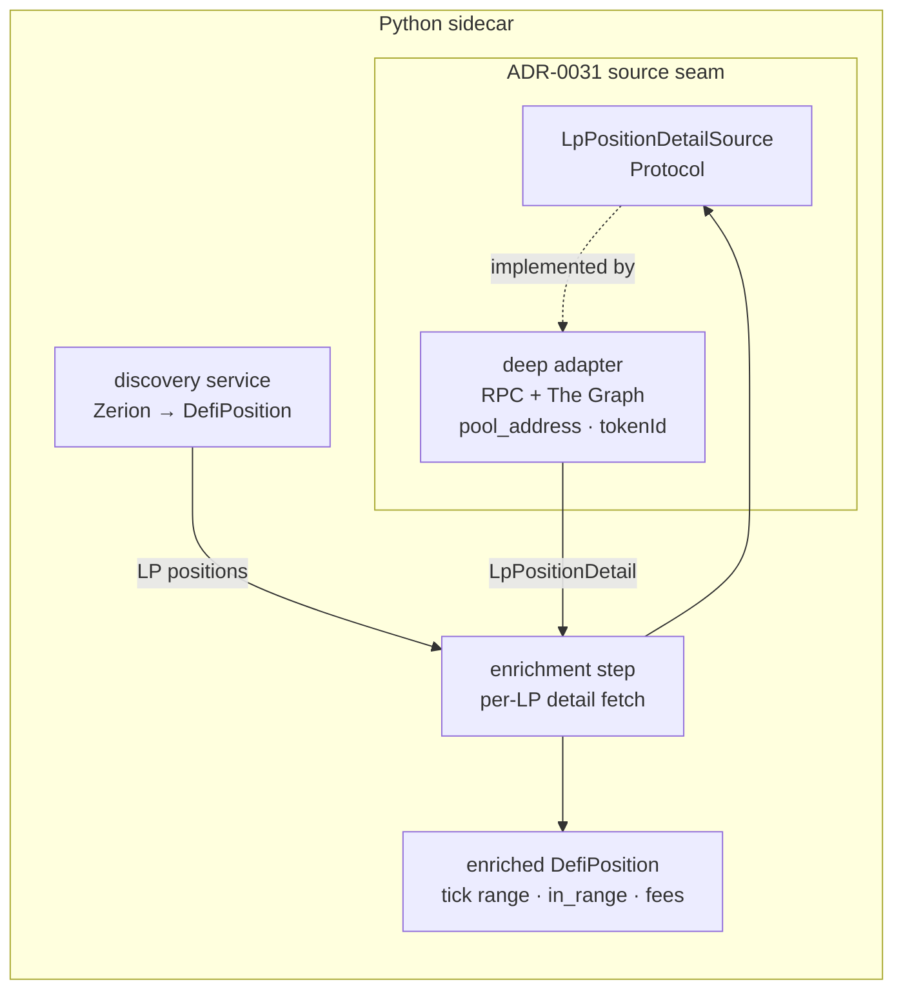

# 0034 — DeFi deep adapters: LP tick/fee detail (Uniswap-v3 / Aerodrome)

> **Status:** approved (2026-06-05) — source resolved by the [Zerion-API capability survey](../references/zerion-api-capabilities.md): deep LP state comes from **our own RPC + The Graph keyed on `pool_address`** (present on 28/28 complex positions), confirming ADR-0034's assumption — no Zerion-native deep call, **no new ADR needed**. **Scope (user-approved):** build *both* the Aerodrome (`pool_address` one-hop) and Uniswap-v3 (NFT-`tokenId` two-hop) deep paths up front — five `dev` phases. Uni-v3 ships fixture-tested; **live** Uni-v3 verification waits for a wallet that holds one (the F3 gap). Implementers may pick up.
> **Created:** 2026-06-05
> **Owner skill(s):** dev
> **Related ADRs:** [0034](../adrs/0034-defi-portfolio-aggregator.md) (the hybrid — this is its *depth* half; **implements** ADR-0034's "deep state comes from our own RPC + The Graph" stance, confirmed by the survey — no new ADR), [0035](../adrs/0035-defi-domain-placement.md) (`defi/` placement; on-chain fetch routed through ADR-0031 sources), [0031](../adrs/0031-data-source-adapter-contract.md) (the per-capability Protocol seam this adds to), [0032](../adrs/0032-data-layer-no-api-dependency.md) (no `data→api`), [0019](../adrs/0019-external-http-adapter-resilience.md) (resilience client a keyed adapter inherits), [0038](../adrs/0038-third-party-api-key-storage.md) (`graph_api_key` / `eth_rpc_url` / `base_rpc_url` already in the secrets schema), [0036](../adrs/0036-defi-pnl-reconstruction.md) / [0037](../adrs/0037-defi-position-risk-forecast.md) (downstream consumers — explicitly out of scope here)

## TL;DR

Plan 0032 discovery surfaces Zerion's *interpreted* positions but deliberately leaves concentrated-LP detail blank — `tick_lower`/`tick_upper`/`in_range` stay `None` and there are no uncollected-fee figures. This plan adds the **depth half for LP positions only**: the precise on-chain state of each Uniswap-v3 / Aerodrome (Slipstream) LP — tick range, current tick / in-range status, and uncollected fees — used to *enrich* the positions discovery already returns. Phase 1 fixes the **F1** live-smoke finding (gauge-staked LPs misclassified as `staking`). Phase 2 adds the source-agnostic deep-state Protocol + the model fields. Phases 3–4 implement the concrete deep adapters — **Aerodrome** (`pool_address`-keyed) and **Uniswap-v3** (NFT-`tokenId`-keyed) — both over our own RPC + The Graph, the source the [Zerion-API survey](../references/zerion-api-capabilities.md) confirmed. Phase 5 wires enrichment into the scan flow and runs a live smoke. Aave health/liquidation is a separate later plan. No P&L, no risk/forecast.

## Context & problem

The DeFi program's discovery slice (Plan 0032, ADR-0034) is closed and ADR-0034 is accepted: Zerion gives us breadth — *which* positions a wallet holds, decoded and correctly valued. By design it does **not** give the risk-grade depth: ADR-0034 split deep on-chain state (exact tick range, in-range status, uncollected fees, and — later — Aave health factor) onto "our own RPC + The Graph adapters." `DefiPosition` already reserves `tick_lower`/`tick_upper`/`in_range` as `| None` so a future source can fill them without a schema change (`defi/models.py`).

Two concrete prompts make this the right next plan:

- The **2026-06-05 live smoke** (`0xae5b…9790`) confirmed the wallet is concentrated-LP-heavy (Aerodrome Slipstream LPs on Base). The interesting, decision-relevant facts about those positions — am I in range? how much fee is uncollected? — are exactly what's missing.
- The smoke also logged **F1**: gauge-staked LPs arrive from Zerion as `position_type: staked`, so our `_classify_kind` labels them `kind="staking"` with `pool=null` and lists per-leg duplicate token symbols. Before we can enrich LP positions with on-chain detail, discovery has to *recognize them as LPs*.

The scope choice (set at planning, 2026-06-05): **LP detail first**; Aave health/liquidation is a later plan. The **source** was confirmed by the [Zerion-API survey](../references/zerion-api-capabilities.md): `pool_address` on 28/28 complex positions makes our own RPC + The Graph sufficient (ADR-0034's assumption), so no Zerion-native deep call is needed. User approved building **both** the Aerodrome and Uni-v3 deep paths up front.

## Decision

Build LP deep-state as five `dev` phases, all under the existing seams. **Phase 1** fixes F1 in the discovery adapter (no new source). **Phase 2** adds the source-agnostic `LpPositionDetailSource` Protocol (ADR-0031) + the enrichment fields on `DefiPosition`. **The source is decided** ([Zerion-API survey](../references/zerion-api-capabilities.md), 2026-06-05): **our own RPC + The Graph**, keyed on the `pool_address` Zerion exposes on every complex position (28/28 in the survey) — ADR-0034's assumption holds, so **no new ADR is needed**. **Phase 3** implements the Aerodrome/Velodrome-class deep adapter (one-hop on `pool_address`); **Phase 4** the Uniswap-v3 deep adapter (two-hop — resolve the NFT `tokenId` first). **Phase 5** wires enrichment into the scan flow, surfaces the enriched positions, and runs a live smoke.

The keying differs by class (survey §8): **one hop for Velodrome/Aerodrome** (ERC-20 LP token — `pool_address` is sufficient, phase 3), **two hops for Uniswap-v3** (each position is an NFT; two positions can share a pool with different ranges, so the deep read keys on the position NFT `tokenId`, resolved from Zerion's NFT-positions endpoint or an RPC enumeration — phase 4). The test wallet is Aerodrome-only (no live Uni-v3 — the ADR-0034 F3 gap), so the **Uni-v3 path is built and fixture-tested now but live-confirmed later**, when a wallet holds one.

We reject doing Aave depth in the same plan (keeps the scope to one position kind and one fetch shape), and reject persisting deep state (it is live/volatile like discovery; the durable cache that matters — decoded tx history — belongs to the P&L plan, ADR-0036).

## Architecture diagram



## Implementation phases

### Phase 1 — Fix F1: classify staked LPs as LPs (discovery side)
- **Owner skill:** `dev`
- **What:** In `data/adapters/zerion.py`, distinguish a **gauge-staked LP** (a staked position whose underlying is a multi-token pool — e.g. Aerodrome Slipstream WETH/AERO) from genuine **single-asset staking** (QUICK, OP). Classify the former as `kind="lp"` with the `pool` name set; de-duplicate the per-leg token entries by symbol (sum amounts per symbol) so an LP shows each token once. Single-asset staked positions stay `kind="staking"`. **Also thread Zerion's `attributes.pool_address` onto `DefiPosition` as a new `pool_address: str | None` field** — discovery drops it today (only the human pool *name* is mapped, `zerion.py:260`: `pool = attributes.get("name")`), but it is present on 28/28 complex positions ([survey](../references/zerion-api-capabilities.md) §8) and is the on-chain key the deep adapter (phases 3–4) and the enrichment join (phase 5) read. This field is the discovery→deep seam; it belongs with the F1 discovery fix, not the detail-fields phase.
- **Files touched:** `src/market_analyser/data/adapters/zerion.py`, `src/market_analyser/defi/models.py` (new `pool_address: str | None` field, boundary-validated `min_length=1`-or-`None` in the existing style), `tests/fixtures/zerion_positions.json` (extend with a staked-LP entry mirroring the live `0xae5b…9790` shape), `tests/data/test_zerion_adapter.py`.
- **Done when:** a fixture staked-LP entry (`protocol_module: "farming"`, `position_type: "staked"`, multi-token, carrying a `pool_address`) decodes to one `kind="lp"` position with the pool name, **de-duped** tokens (each symbol once, amounts summed), and a non-`None` `pool_address` equal to the fixture's `attributes.pool_address`; a single-asset staked entry stays `kind="staking"` with `pool_address=None`; `usd_value` is unchanged (no double-count — already proven at the smoke); full offline `pytest -m "not network"` + `mypy --strict` + `ruff` green. *(Discriminator confirmed by the [survey](../references/zerion-api-capabilities.md) §5: Aerodrome LPs arrive as `protocol_module: "farming"` — which `_classify_kind` matches against neither `liquidity_pool` nor `lending`, so they fall through to `staked`. The real `protocol_module` vocabulary is `{farming, staked, lending, nft_staked, None}`; treat `farming` (and any `staked` position carrying a `pool_address` + ≥2 distinct pool tokens) as `lp`, single-asset `staked` as `staking`. The pool name comes from `pool_address` / `application_metadata`.)*

### Phase 2 — Deep-state model fields + `LpPositionDetailSource` Protocol
- **Owner skill:** `dev`
- **What:** Add the LP-detail fields `DefiPosition` doesn't yet carry — `current_tick: int | None` and `uncollected_fees: list[PositionToken] | None` (alongside the existing `tick_lower`/`tick_upper`/`in_range` and the `pool_address` added in phase 1), additive and boundary-validated in the existing style. Define a `LpPositionDetailSource` Protocol in `data/sources.py` (mirroring `WalletPositionsSource`): input is enough to identify an on-chain LP position (chain + pool/pair address + NFT token id / position key); output is a typed `LpPositionDetail` (tick bounds, current tick, in-range, uncollected fees per token). Add the selector-registry seam (ADR-0031). No network in this phase.
- **Files touched:** `src/market_analyser/defi/models.py` (new fields + `LpPositionDetail`), `src/market_analyser/data/sources.py` (new Protocol, `TYPE_CHECKING` import like `WalletPositionsSource`), composition-root registry entry, `tests/`.
- **Done when:** the new model fields exist, are `None` by default, and validate finite/non-negative like the rest; `LpPositionDetailSource` is `@runtime_checkable` and a fake source `isinstance`-satisfies it; `gen-types --check` shows the additive fields with no drift breakage; `mypy --strict` + `ruff` green.

### Phase 3 — Concrete deep adapter (RPC + The Graph, `pool_address`-keyed)
- **Owner skill:** `dev`
- **What:** implement `LpPositionDetailSource` against **our own RPC + The Graph**, keyed on the `pool_address` + `chain` from the discovered position. For the Aerodrome/Velodrome (Slipstream) class, read pool/gauge state — `eth_call` for `slot0` current tick + the position's tick bounds and owed fees, and/or a decentralized-network subgraph — reading `eth_rpc_url`/`base_rpc_url`/`graph_api_key` from `SecretsStore` (ADR-0038) on the `ResilientHttpClient` (ADR-0019). Confirm the Aerodrome Slipstream pool/gauge ABI and whether a decentralized-network subgraph exists (else RPC-only).
- **Files touched:** `src/market_analyser/data/adapters/<deep>.py` (new), composition-root registry entry, `tests/` with a recorded fixture.
- **Done when:** against a fixture, the adapter yields `LpPositionDetail` (tick range, current tick, in-range, uncollected fees) for an Aerodrome Slipstream position keyed on `pool_address`; typed errors (no bare exceptions); offline-deterministic; `mypy --strict` + `ruff` green.

### Phase 4 — Uniswap-v3 deep adapter (NFT-`tokenId`-keyed)
- **Owner skill:** `dev`
- **What:** extend the deep adapter to the Uniswap-v3 class, where the position is an NFT and `pool_address` alone is ambiguous (multiple ranges per pool). Resolve the position's NFT `tokenId` first — from Zerion's NFT-positions endpoint (survey #6) or an RPC enumeration of the `NonfungiblePositionManager` — then `eth_call` `positions(tokenId)` for tick bounds + owed tokens and `slot0` for the current tick (and/or a subgraph). Same `LpPositionDetailSource` Protocol and secrets/resilience plumbing as phase 3.
- **Files touched:** `src/market_analyser/data/adapters/<deep>.py` (extend) + an NFT-identifier resolution helper, composition-root wiring, `tests/` with a recorded Uni-v3 fixture.
- **Done when:** against a fixture, the adapter resolves a Uni-v3 position's `tokenId` and yields `LpPositionDetail` (tick range, current tick, in-range, uncollected fees); typed errors; offline-deterministic; `mypy --strict` + `ruff` green. **(Live verification deferred — F3: no in-scope wallet holds a live Uni-v3 position, so the path ships fixture-tested and is live-confirmed when one does.)**

### Phase 5 — Enrichment wiring + surface + live smoke (depends on phases 3–4)
- **Owner skill:** `dev`
- **What:** an enrichment step in the `defi/` discovery flow that, after discovery, calls the LP-detail source per `kind="lp"` position (Aerodrome and Uni-v3 classes) and folds the detail into the returned `DefiPosition`s; surface the enriched positions through the existing scan path (and/or a dedicated detail tool); run a live smoke against `0xae5b…9790` (holds Aerodrome Slipstream LPs). Calls must be spaced/serialized (rate-limit risk below).
- **Files touched:** `src/market_analyser/defi/` (enrichment), the scan job / tool / route as needed, `tests/`.
- **Done when:** enriched LP positions carry non-`None` `tick_lower`/`tick_upper`/`in_range` (+ `current_tick`, `uncollected_fees`); a position keyed to a known Aerodrome LP shows a plausible in-range status and fee figure (Uni-v3 enrichment exercised by fixture); the live smoke result (masked wallet, a sample enriched LP) is recorded in the close handoff; offline suite + `mypy --strict` + `ruff` green.

## Data shapes

```python
# illustrative — finalized in phase 2

class LpPositionDetail(BaseModel):       # src/market_analyser/defi/models.py
    tick_lower: int
    tick_upper: int
    current_tick: int
    in_range: bool                       # tick_lower <= current_tick < tick_upper
    uncollected_fees: list[PositionToken]  # per-token owed fees (boundary-validated)

# DefiPosition gains (additive, default None):
#   pool_address: str | None           # phase 1 — the discovery→deep on-chain join key
#   current_tick: int | None           # phase 2 — LP-only
#   uncollected_fees: list[PositionToken] | None  # phase 2 — LP-only
```

## Risks & open questions

- **(Resolved by the 2026-06-05 survey) Source + keying.** `pool_address` is present on 28/28 complex positions, so RPC + The Graph keyed on it is sufficient for the Aerodrome class; ADR-0034's assumption holds (no Zerion-native deep call, no new ADR). **Uni-v3 needs the NFT `tokenId`** (two-hop, phase 4) — built and fixture-tested up front; **live** Uni-v3 verification deferred (no in-scope wallet holds one — F3).
- **Aerodrome Slipstream specifics.** It's a Uni-v3-style concentrated-liquidity fork on Base; confirm the position-manager/pool/gauge ABIs and whether a decentralized-network subgraph exists, or whether RPC-only is required. (First real implementation unknown.)
- **Keying enrichment to discovered positions.** The enrichment step must reliably match an `LpPositionDetail` back to the `DefiPosition` it enriches (`position_id` stability); the `pool_address` field added in phase 1 is the join key (and the same field the deep adapter keys its RPC/Graph read on). For Uni-v3, `pool_address` alone is ambiguous (multiple ranges per pool) — phase 4 resolves the NFT `tokenId` as the finer key.
- **Rate limits / keys.** RPC + The Graph each need a credential (already in the secrets schema). The survey **observed Zerion 429s under burst (~11 calls)** cleared by ~1.1s spacing — enrichment multiplies calls per LP, so the discovery+enrichment path must space/serialize calls (ADR-0034's "deliberate, never reactive" cadence, now a hard constraint).

## What this plan does NOT do

- **No Aave health/liquidation.** Health factor, LTV, liquidation price are a separate later deep-state plan (same Protocol-seam pattern).
- **No P&L / cost basis.** Tx-replay reconstruction is the P&L plan ([ADR-0036](../adrs/0036-defi-pnl-reconstruction.md)).
- **No risk / forecast / scenarios** ([ADR-0037](../adrs/0037-defi-position-risk-forecast.md)).
- **No new chains, no ENS.** Same EVM-majors/raw-address scope as Plan 0032.
- **No persistence.** Deep state is live, like discovery; the durable tx-history cache belongs to the P&L plan.
- **No UI.** Agent-driven, like Plan 0032; the DeFi dashboard is a later UI plan.

## Open decision log

- [x] **Deep-state source** — our RPC + The Graph, keyed on `pool_address` ([survey](../references/zerion-api-capabilities.md) §8). ADR-0034 assumption holds; **no ADR-0040 needed.**
- [x] **Position identifier from discovery?** — `pool_address` present 28/28 (sufficient for Aerodrome-class). Uni-v3 needs the NFT `tokenId` (two-hop via the NFT-positions endpoint or RPC enumeration) — deferred sub-item. **Resolved at amendment (2026-06-05):** the survey-confirmed `attributes.pool_address` is mapped today only as the pool *name* (`zerion.py:260`), not the address — so **phase 1 adds an explicit `pool_address: str | None` field to `DefiPosition` and populates it**, giving phases 3–5 the on-chain key they join/read on (closes a pre-implementation readiness gap caught in the 2026-06-05 architect review).
- [x] **User approval (2026-06-05):** moved to `approved`; scope = **build both paths up front** (Aerodrome phase 3 + Uni-v3 phase 4). Uni-v3 ships fixture-tested; live Uni-v3 verification deferred (F3).
