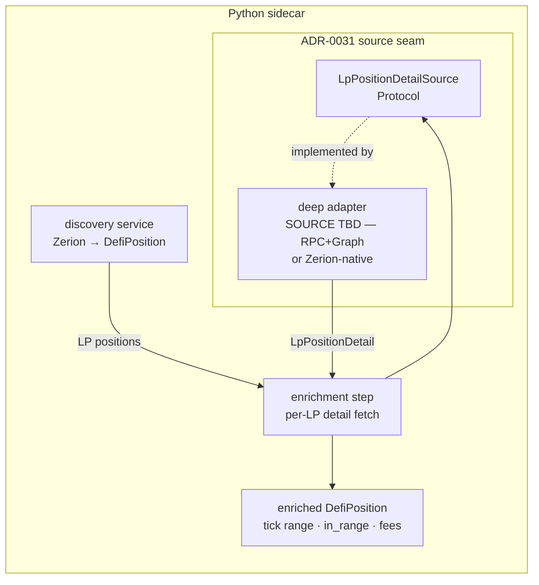

# 0034 — DeFi deep adapters: LP tick/fee detail (Uniswap-v3 / Aerodrome)

> **Status:** draft — **phases 1–2 are source-independent and ready; phases 3–4 are blocked pending a parallel full-Zerion-API investigation** that decides where the deep state is fetched from. Not for implementation (no "go") until the source is chosen and the plan moves to `approved`.
> **Created:** 2026-06-05
> **Owner skill(s):** dev
> **Related ADRs:** [0034](../adrs/0034-defi-portfolio-aggregator.md) (the hybrid — this is its *depth* half; the source choice may **refine** ADR-0034's "deep state comes from our own RPC + The Graph" stance, which would want a small ADR), [0035](../adrs/0035-defi-domain-placement.md) (`defi/` placement; on-chain fetch routed through ADR-0031 sources), [0031](../adrs/0031-data-source-adapter-contract.md) (the per-capability Protocol seam this adds to), [0032](../adrs/0032-data-layer-no-api-dependency.md) (no `data→api`), [0019](../adrs/0019-external-http-adapter-resilience.md) (resilience client a keyed adapter inherits), [0038](../adrs/0038-third-party-api-key-storage.md) (`graph_api_key` / `eth_rpc_url` / `base_rpc_url` already in the secrets schema), [0036](../adrs/0036-defi-pnl-reconstruction.md) / [0037](../adrs/0037-defi-position-risk-forecast.md) (downstream consumers — explicitly out of scope here)

## TL;DR

Plan 0032 discovery surfaces Zerion's *interpreted* positions but deliberately leaves concentrated-LP detail blank — `tick_lower`/`tick_upper`/`in_range` stay `None` and there are no uncollected-fee figures. This plan adds the **depth half for LP positions only**: the precise on-chain state of each Uniswap-v3 / Aerodrome (Slipstream) LP — tick range, current tick / in-range status, and uncollected fees — used to *enrich* the positions discovery already returns. Phase 1 fixes the **F1** live-smoke finding (gauge-staked LPs misclassified as `staking`). Phase 2 adds the source-agnostic deep-state Protocol + the model fields. **Phases 3–4 (the concrete fetch source + enrichment wiring) are deferred** until a parallel investigation of the full Zerion API tells us whether deep LP state is reachable from Zerion directly or needs our own RPC + The Graph. Aave health/liquidation is a separate later plan. No P&L, no risk/forecast.

## Context & problem

The DeFi program's discovery slice (Plan 0032, ADR-0034) is closed and ADR-0034 is accepted: Zerion gives us breadth — *which* positions a wallet holds, decoded and correctly valued. By design it does **not** give the risk-grade depth: ADR-0034 split deep on-chain state (exact tick range, in-range status, uncollected fees, and — later — Aave health factor) onto "our own RPC + The Graph adapters." `DefiPosition` already reserves `tick_lower`/`tick_upper`/`in_range` as `| None` so a future source can fill them without a schema change (`defi/models.py`).

Two concrete prompts make this the right next plan:

- The **2026-06-05 live smoke** (`0xae5b…9790`) confirmed the wallet is concentrated-LP-heavy (Aerodrome Slipstream LPs on Base). The interesting, decision-relevant facts about those positions — am I in range? how much fee is uncollected? — are exactly what's missing.
- The smoke also logged **F1**: gauge-staked LPs arrive from Zerion as `position_type: staked`, so our `_classify_kind` labels them `kind="staking"` with `pool=null` and lists per-leg duplicate token symbols. Before we can enrich LP positions with on-chain detail, discovery has to *recognize them as LPs*.

The scope choice (set at planning, 2026-06-05): **LP detail first**; Aave health/liquidation is a later plan. The **source** choice is deliberately held: a parallel session is mapping the full Zerion API, and its findings may show Zerion exposes more LP depth than ADR-0034 assumed — which would change whether we stand up RPC/Graph infrastructure at all.

## Decision

Build LP deep-state as four `dev` phases, all under the existing seams. **Phase 1** fixes F1 in the discovery adapter (no new source). **Phase 2** adds the source-agnostic `LpPositionDetailSource` Protocol (ADR-0031) + the enrichment fields on `DefiPosition` — both fully decidable now. **Phase 3** implements the concrete deep adapter behind that Protocol; its source — our own **RPC + The Graph** (ADR-0034's assumption) vs **Zerion-native** if the parallel investigation shows Zerion suffices — is **deferred to the findings**. **Phase 4** wires enrichment into the scan flow, surfaces the enriched positions, and runs a live smoke.

Because the source sits behind the ADR-0031 Protocol, the plan's *structure* is independent of the source decision; only phase 3's body and phase 4's smoke target wait. If the chosen source departs from ADR-0034's "RPC + The Graph" stance (e.g. Zerion-native turns out sufficient), that warrants a short ADR refining ADR-0034 §deep-state — flagged, not pre-decided. (Next free ADR: **0040**.)

We reject doing Aave depth in the same plan (keeps the scope to one position kind and one fetch shape), and reject persisting deep state (it is live/volatile like discovery; the durable cache that matters — decoded tx history — belongs to the P&L plan, ADR-0036).

## Architecture diagram



## Implementation phases

### Phase 1 — Fix F1: classify staked LPs as LPs (discovery side)
- **Owner skill:** `dev`
- **What:** In `data/adapters/zerion.py`, distinguish a **gauge-staked LP** (a staked position whose underlying is a multi-token pool — e.g. Aerodrome Slipstream WETH/AERO) from genuine **single-asset staking** (QUICK, OP). Classify the former as `kind="lp"` with the `pool` name set; de-duplicate the per-leg token entries by symbol (sum amounts per symbol) so an LP shows each token once. Single-asset staked positions stay `kind="staking"`.
- **Files touched:** `src/market_analyser/data/adapters/zerion.py`, `tests/fixtures/zerion_positions.json` (extend with a staked-LP entry mirroring the live `0xae5b…9790` shape), `tests/data/test_zerion_adapter.py`.
- **Done when:** a fixture staked-LP entry (multi-token, `position_type: staked`, liquidity-pool-ish `protocol_module`/dapp) decodes to one `kind="lp"` position with the pool name and **de-duped** tokens (each symbol once, amounts summed); a single-asset staked entry stays `kind="staking"`; `usd_value` is unchanged (no double-count — already proven at the smoke); full offline `pytest -m "not network"` + `mypy --strict` + `ruff` green. *(The exact staked-LP vs staking discriminator should be confirmed against Zerion's field semantics from the parallel investigation; the observed shape — `position_type: staked` + ≥2 distinct pool tokens + a liquidity/dex `protocol_module` — is the working rule.)*

### Phase 2 — Deep-state model fields + `LpPositionDetailSource` Protocol
- **Owner skill:** `dev`
- **What:** Add the LP-detail fields `DefiPosition` doesn't yet carry — `current_tick: int | None` and `uncollected_fees: list[PositionToken] | None` (alongside the existing `tick_lower`/`tick_upper`/`in_range`), additive and boundary-validated in the existing style. Define a `LpPositionDetailSource` Protocol in `data/sources.py` (mirroring `WalletPositionsSource`): input is enough to identify an on-chain LP position (chain + pool/pair address + NFT token id / position key); output is a typed `LpPositionDetail` (tick bounds, current tick, in-range, uncollected fees per token). Add the selector-registry seam (ADR-0031). No network in this phase.
- **Files touched:** `src/market_analyser/defi/models.py` (new fields + `LpPositionDetail`), `src/market_analyser/data/sources.py` (new Protocol, `TYPE_CHECKING` import like `WalletPositionsSource`), composition-root registry entry, `tests/`.
- **Done when:** the new model fields exist, are `None` by default, and validate finite/non-negative like the rest; `LpPositionDetailSource` is `@runtime_checkable` and a fake source `isinstance`-satisfies it; `gen-types --check` shows the additive fields with no drift breakage; `mypy --strict` + `ruff` green.

### Phase 3 — Concrete deep adapter  ⛔ BLOCKED: source decision pending parallel Zerion-API findings
- **Owner skill:** `dev`
- **What (finalized once the source is chosen):** implement `LpPositionDetailSource` against the chosen source — **either** (a) our own **RPC** (`eth_call` to the Uni-v3 / Aerodrome Slipstream position manager + pool: `slot0` current tick, `positions(tokenId)` tick bounds + owed fees) **plus The Graph** (decentralized-network subgraph for pool/position lookup), reading `eth_rpc_url`/`base_rpc_url`/`graph_api_key` from `SecretsStore` (ADR-0038) on the `ResilientHttpClient` (ADR-0019); **or** (b) **Zerion-native** endpoints if the investigation shows Zerion exposes tick/fee detail keyed to a discovered position.
- **Done when (to be finalized):** against a fixture, the adapter yields `LpPositionDetail` with correct tick range, in-range flag, and uncollected fees for a Uniswap-v3 and an Aerodrome Slipstream position; typed errors (no bare exceptions); offline-deterministic.
- **Blocking note:** this phase's body **cannot be written** until the parallel investigation answers the open questions below — chiefly *whether Zerion's discovery payload carries a position identifier (NFT token id / pool contract) we can key an RPC/Graph read on*. May require an ADR refining ADR-0034 §deep-state.

### Phase 4 — Enrichment wiring + surface + live smoke  ⛔ depends on phase 3
- **Owner skill:** `dev`
- **What:** an enrichment step in the `defi/` discovery flow that, after discovery, calls the LP-detail source per `kind="lp"` position and folds the detail into the returned `DefiPosition`s; surface the enriched positions through the existing scan path (and/or a dedicated detail tool); run a live smoke against `0xae5b…9790` (holds Aerodrome Slipstream LPs).
- **Files touched:** `src/market_analyser/defi/` (enrichment), the scan job / tool / route as needed, `tests/`.
- **Done when:** enriched LP positions carry non-`None` `tick_lower`/`tick_upper`/`in_range` (+ `current_tick`, `uncollected_fees`); a position keyed to a known Aerodrome LP shows a plausible in-range status and fee figure; the live smoke result (masked wallet, a sample enriched LP) is recorded in the close handoff; offline suite + `mypy --strict` + `ruff` green.

## Data shapes

```python
# illustrative — finalized in phase 2

class LpPositionDetail(BaseModel):       # src/market_analyser/defi/models.py
    tick_lower: int
    tick_upper: int
    current_tick: int
    in_range: bool                       # tick_lower <= current_tick < tick_upper
    uncollected_fees: list[PositionToken]  # per-token owed fees (boundary-validated)

# DefiPosition gains (additive, LP-only, default None):
#   current_tick: int | None
#   uncollected_fees: list[PositionToken] | None
```

## Risks & open questions

- **(Blocking) Source decision is gated on the parallel Zerion-API investigation.** Phases 3–4 finalize only after it lands.
- **(Critical input the investigation must surface) Does Zerion's positions payload carry a position identifier** — an NFT `tokenId` and/or the pool/pair contract address — that we can key an RPC/Graph deep read on? If not, the RPC/Graph path needs another way to locate the on-chain position, which materially changes phase 3 (and may tilt the decision toward Zerion-native).
- **Aerodrome Slipstream specifics.** It's a Uni-v3-style concentrated-liquidity fork on Base; confirm the position-manager/pool ABIs and whether a decentralized-network subgraph exists, or whether RPC-only is required.
- **Keying enrichment to discovered positions.** The enrichment step must reliably match an `LpPositionDetail` back to the `DefiPosition` it enriches (`position_id` stability).
- **Rate limits / keys.** RPC + The Graph each need a credential (already in the secrets schema) and have their own limits; a request-triggered scan stays modest, but enrichment multiplies calls per LP.
- **F1 discriminator semantics** — see phase 1 note; confirm against the investigation's field map.

## What this plan does NOT do

- **No Aave health/liquidation.** Health factor, LTV, liquidation price are a separate later deep-state plan (same Protocol-seam pattern).
- **No P&L / cost basis.** Tx-replay reconstruction is the P&L plan ([ADR-0036](../adrs/0036-defi-pnl-reconstruction.md)).
- **No risk / forecast / scenarios** ([ADR-0037](../adrs/0037-defi-position-risk-forecast.md)).
- **No new chains, no ENS.** Same EVM-majors/raw-address scope as Plan 0032.
- **No persistence.** Deep state is live, like discovery; the durable tx-history cache belongs to the P&L plan.
- **No UI.** Agent-driven, like Plan 0032; the DeFi dashboard is a later UI plan.

## Open decision log (fill when the parallel investigation lands)

- [ ] **Deep-state source:** our RPC + The Graph (ADR-0034 assumption) **vs** Zerion-native **vs** hybrid. → finalizes phase 3, may need ADR-0040.
- [ ] **Position identifier available from discovery?** (NFT tokenId / pool address) → see critical risk above.
- [ ] Then: move Status `draft → approved` and finalize phases 3–4.
