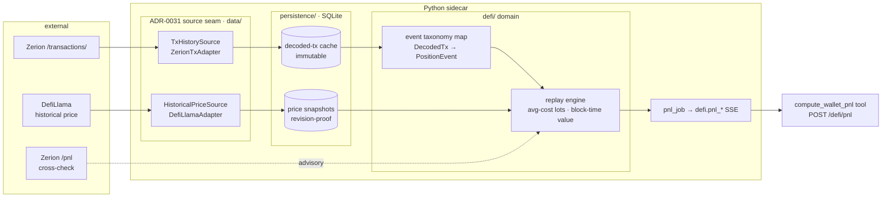

# 0035 — DeFi P&L: decoded tx-history ingestion + transaction-replay reconstruction

> **Status:** approved (2026-06-05) — reviewed against ADR-0036/0035/0034 and the [Zerion-API survey](../references/zerion-api-capabilities.md); no new ADR (implements the three). **Serializes after Plan 0034** — *satisfied:* 0034 closed 2026-06-05, so the `pool_address` join key is inherited (see the resolved sequencing note in the Open decision log); the live constraint (as of 2026-07-03) is the migration chain — this plan's two migrations land after head `0005_watches_alerts` and before Plan 0044's. `dev` runs phases 1–7; `human` runs the phase-8 smoke that gates architect's `proposed → accepted` flip of ADR-0036 at close.
> **Created:** 2026-06-05
> **Owner skill(s):** dev, human (final live-smoke acceptance)
> **Related ADRs:** [0036](../adrs/0036-defi-pnl-reconstruction.md) (the P&L method this **implements** — `proposed` → `accepted` at this plan's close), [0034](../adrs/0034-defi-portfolio-aggregator.md) (Zerion as the decoded-tx-history source; DefiLlama keyless as the historical-price source, Alchemy keyed fallback), [0035](../adrs/0035-defi-domain-placement.md) (the `defi/` home + the `TxHistorySource` / `HistoricalPriceSource` Protocols this builds), [0031](../adrs/0031-data-source-adapter-contract.md) (per-capability Protocol + selector-registry seam), [0032](../adrs/0032-data-layer-no-api-dependency.md) (no `data→api`; progress via the neutral `events/` core), [0019](../adrs/0019-external-http-adapter-resilience.md) (resilience client both adapters inherit), [0006](../adrs/0006-persistence-layout.md) (SQLite cache for the immutable decoded events + the price snapshots), [0018](../adrs/0018-backtest-result-schema.md) (the determinism contract this mirrors), [0038](../adrs/0038-third-party-api-key-storage.md) (Zerion key reuse; DefiLlama keyless adds no secret), [0015](../adrs/0015-claude-code-primary-control-surface.md) (agent + renderer both reach the result). Grounded by the [Zerion-API survey](../references/zerion-api-capabilities.md) §3 group B (the `/transactions/` shape) and §9 (determinism caveats).

## TL;DR

"Calculate my DeFi profitability" — answered by **reconstructing cost basis and P&L from on-chain transaction history**, not by trusting an aggregator's number ([ADR-0036](../adrs/0036-defi-pnl-reconstruction.md), the user's explicit choice). This plan builds the whole vertical: ingest Zerion's decoded `/transactions/` history into a normalized, **SQLite-cached** `DecodedTx` stream; resolve each economic leg's **block-time** USD price via a DefiLlama `HistoricalPriceSource` with a **price-snapshot cache** (the determinism mechanism); replay the history per position under a fixed event taxonomy with **average-cost lots** to produce realized / unrealized P&L (and, for LPs, P&L **vs. HODL**); and surface it through a `compute_wallet_pnl` MCP tool + `POST /defi/pnl` route. First user-visible behavior: ask the agent "what's my P&L on `0xae5b…`" → an auditable per-position and total realized/unrealized breakdown, every number traceable to a decoded event priced at a named block timestamp. Closes ADR-0036.

## Context & problem

The DeFi program's discovery slice is closed (Plan 0032, [ADR-0034](../adrs/0034-defi-portfolio-aggregator.md) accepted): we can say *what* a wallet holds and what it's worth *now*. That is valuation, not profitability — it cannot say whether the user is up or down, which was the explicit ask. [ADR-0036](../adrs/0036-defi-pnl-reconstruction.md) settled the **method** (transaction-replay, block-time pricing, average-cost lots) but is `proposed` and unbuilt; [ADR-0035](../adrs/0035-defi-domain-placement.md) named the two Protocols this needs (`TxHistorySource`, `HistoricalPriceSource`) but neither exists in code.

The [2026-06-05 Zerion-API survey](../references/zerion-api-capabilities.md) verified the raw material is there and rich: `/transactions/` returns fully decoded history — per-transfer `direction`/`value`/`price`, `fee`, semantic `acts`, `operation_type`, `mined_at` + `mined_at_block` — with cursor pagination and `operation_types`/`chain_ids` filters (survey §3 group B). It also confirmed two constraints that bite this plan specifically: the free tier **429s under burst** (a long-history pull is many pages — must be spaced), and the survey deferred **DefiLlama historical-price coverage verification** to exactly this plan.

The non-negotiables are load-bearing here. **No-lookahead** has a P&L corollary: every historical leg is priced at *its own* block timestamp, never at "now". **Determinism** ([ADR-0018](../adrs/0018-backtest-result-schema.md)): same wallet + same block range → byte-identical P&L modulo provenance — but historical-price APIs can revise numbers, so prices must be **snapshotted** on first lookup and re-read thereafter. **Validate at boundaries / never silently zero**: a missing price or a `None`/`NaN`/negative amount fails the position's P&L *loud* (marked incomplete), never coerced to zero — a silently-zeroed leg produces confident, wrong P&L.

## Decision

Build the P&L vertical as eight phases under the existing seams, mirroring the proven Plan 0032 shape (Protocol → adapter → `defi/` domain → async job + SSE → tool + route), extended with the two persistence caches ADR-0035/0036 reserve. **Ingestion** (phases 1–3): a normalized `DecodedTx` model + `TxHistorySource` Protocol, a `ZerionTxAdapter` that paginates `/transactions/` to completion (rate-limit-spaced) and parses it, and an **immutable decoded-tx SQLite cache** so a re-scan re-reads instead of re-pulling. **Pricing** (phase 4): a `HistoricalPriceSource` (DefiLlama keyless primary) with a **`(token, timestamp) → price` snapshot cache** — the determinism mechanism. **Engine** (phases 5–6): map `DecodedTx` → the ADR-0036 economic-event taxonomy, then replay per position with average-cost lots to realized/unrealized P&L + LP-vs-HODL, failing loud on missing data. **Surface** (phase 7): a `compute_wallet_pnl` tool + `POST /defi/pnl` route streaming `defi.pnl_*` progress, carrying Zerion's own `/pnl` figure as an advisory **cross-check** (gross-divergence flag only). **Acceptance** (phase 8, `human`): a live smoke against `0xae5b…9790` that gates architect's `proposed → accepted` flip of ADR-0036 at close — the same acceptance pattern ADR-0034 used.

This plan needs **no new ADR**: it implements ADR-0036 (engine), ADR-0035 (placement + Protocols), and ADR-0034 (the tx + price source choices). Average-cost (not FIFO) and reconstruct-not-trust were already decided in ADR-0036; we implement them, not re-litigate.

## Architecture diagram



## Implementation phases

Each phase ships as its own commit; `dev` runs phases 1–7 in one session, then hands off to `human` for the phase-8 smoke. Phase 1 is the walking skeleton's spine (the shape everything downstream consumes).

### Phase 1 — `DecodedTx` model + `TxHistorySource` Protocol (no network)
- **Owner skill:** `dev`
- **What:** Define the normalized decoded-transaction shape the engine consumes — faithful to Zerion's payload but source-neutral and boundary-validated, carrying **no accounting interpretation** (the economic-event mapping is phase 5). Add the `TxHistorySource` Protocol to `data/sources.py` (mirroring `WalletPositionsSource`) + the selector-registry seam (ADR-0031).
- **Files touched:** `src/market_analyser/defi/tx_models.py` (new — `DecodedTx`, `TxTransfer`, `TxFee`, `TxAct`), `src/market_analyser/data/sources.py` (new `@runtime_checkable` Protocol, `TYPE_CHECKING` import like `WalletPositionsSource`), composition-root registry seam, `tests/defi/test_tx_models.py`.
- **Done when:** a `DecodedTx` constructs from a representative survey-shaped dict and **rejects** a transfer with a `NaN`/negative `usd_value` or non-positive `amount` at the boundary (the "no garbage past the boundary" rule, as `DefiPosition` does); `operation_type` is a closed `Literal` vocabulary covering the survey's observed set (`receive`/`send`/`trade`/`deposit`/`withdraw`/`mint`/`execute`/`approve`/`borrow`/`repay`/…) with an explicit `unknown` fallback (never a raw passthrough); `TxHistorySource` is `@runtime_checkable` and a fake `isinstance`-satisfies it; `gen-types --check` clean; full offline `pytest -m "not network"` + `mypy --strict` + `ruff` green.

### Phase 2 — `ZerionTxAdapter` + parser (cursor pagination, rate-limit-spaced)
- **Owner skill:** `dev`
- **What:** Implement `TxHistorySource` against Zerion `/wallets/{addr}/transactions/`: HTTP Basic via `SecretsStore` (reuse `zerion.py::_basic_auth_header`), `currency=usd`, `filter[chain_ids]` constrained to the target majors, `filter[trash]` to drop spam, **cursor pagination following `links.next` to completion** with deliberate inter-page spacing (survey §1 — burst 429s clear at ~1.1s). Parse `transfers[]`/`fee`/`acts[]`/`operation_type`/`mined_at`/`mined_at_block`/`hash`/`status` into `DecodedTx`. Drop off-target chains. **Deterministic ordering: block number, then in-block index** (never set-iteration). Typed errors reuse the `ZerionAuthError`/`ZerionError`/`RateLimitedError`/`UpstreamUnavailableError` taxonomy.
- **Files touched:** `src/market_analyser/data/adapters/zerion_tx.py` (new — separate module from `zerion.py`; shared auth helper extracted if needed), `tests/data/test_zerion_tx_adapter.py`, `tests/fixtures/zerion_transactions.json` (a multi-page, multi-`operation_type` fixture mirroring the live `0xae5b…9790` shape, incl. a `links.next` page boundary).
- **Done when:** against the fixture, a two-page history parses to an ordered `DecodedTx` list (block-then-index, deterministic across runs) with transfers' `direction`/`value`/`price` and `fee` populated; `operation_types=trade` filtering narrows the set; a 401 raises `ZerionAuthError`, a 429 raises `RateLimitedError`; **no live network in the test** (recorded fixture); offline suite + `mypy --strict` + `ruff` green.

### Phase 3 — Immutable decoded-tx SQLite cache (migration + repository, gap-fetch)
- **Owner skill:** `dev`
- **What:** Persist decoded transactions so a re-scan re-reads instead of re-pulling (ADR-0035/0036: tx history is immutable → caches cleanly). One Alembic migration adding a `defi_tx` table keyed by `(chain, hash)` (insert-or-ignore — immutability means never update); a `DefiTxRepository` in `persistence/`. The ingestion path reads the cache first and **fetches only the gap** (transactions newer than the latest cached block for that wallet), then writes back.
- **Files touched:** `src/market_analyser/persistence/migrations/versions/<rev>_defi_tx_cache.py` (new — confirm it branches off the current single head), `src/market_analyser/persistence/defi_tx_repository.py` (new), the `defi/` ingestion facade that composes adapter + repository, `tests/persistence/test_defi_tx_repository.py`.
- **Done when:** a fresh scan persists N decoded txs; a second scan with no new on-chain activity issues **zero** Zerion page fetches and returns the cached set byte-identical (modulo nothing — these are immutable); a scan after one new tx fetches only the gap; `(chain, hash)` re-insert is idempotent; migration applies cleanly on a temp DB and is the sole new head; offline suite + `mypy --strict` green.

### Phase 4 — `HistoricalPriceSource` (DefiLlama) + price-snapshot cache (migration + repository)
- **Owner skill:** `dev`
- **What:** A `HistoricalPriceSource` Protocol (`data/sources.py`) + a keyless **DefiLlama** adapter (`coins` historical endpoint, keyed by `chain:address` + unix timestamp) on the `ResilientHttpClient`. A **`(token, timestamp) → price` snapshot cache** (Alembic migration + repository): every resolved price is written on first lookup and re-read thereafter, so a re-run is byte-identical even if DefiLlama later revises (the ADR-0036 determinism mechanism, mirroring ADR-0018). A missing price returns a typed "no price" that the engine treats as *incomplete*, **never** zero. **Resolves the survey's deferred DefiLlama-coverage flag**: live-verify coverage for the test wallet's held tokens (AERO, WETH, GHST, USDC, …).
- **Files touched:** `src/market_analyser/data/sources.py` (new Protocol), `src/market_analyser/data/adapters/defillama.py` (new), `src/market_analyser/persistence/migrations/versions/<rev>_price_snapshots.py` (new, chained after phase 3's head), `src/market_analyser/persistence/price_snapshot_repository.py` (new), `tests/data/test_defillama_adapter.py`, `tests/persistence/test_price_snapshot_repository.py`.
- **Done when:** a `(token, block-timestamp)` lookup returns a snapshot-cached price on the second call **without** a second network call (proven by a fake client asserting one call); an uncovered token surfaces a typed "no price" (not `0.0`); a recorded-fixture test plus a **documented live coverage check** against the held tokens (result — which tokens DefiLlama covers at the relevant timestamps — recorded in the close handoff); both migrations form one linear chain; offline suite + `mypy --strict` green.

### Phase 5 — Event taxonomy mapping (`DecodedTx` → `PositionEvent`)
- **Owner skill:** `dev`
- **What:** The classification layer ADR-0036 calls "the heaviest piece and the correctness risk" — kept its own phase/commit for reviewability. Map each `DecodedTx` onto the fixed economic-event taxonomy per position: `add_liquidity`/`remove_liquidity`, `supply`/`withdraw_supply`/`borrow`/`repay`, `swap`, `fee_claim`, `reward_claim`, `liquidation`. Drive classification off `operation_type` + `acts` + transfer directions, joined to the discovered `DefiPosition` by `pool_address`/token. **Events outside the taxonomy are surfaced as `unclassified`, never silently dropped** (an `unclassified` event flagged on the position's P&L).
- **Files touched:** `src/market_analyser/defi/pnl_events.py` (new — `PositionEvent`, the mapper), `tests/defi/test_pnl_events.py`.
- **Done when:** representative fixtures map to the right event kind (an Aerodrome add-liquidity, a reward claim, a swap, a lending borrow/repay); an unrecognized shape yields exactly one `unclassified` event (not a drop, not a crash); mapping is pure + deterministic; offline suite + `mypy --strict` + `ruff` green.

### Phase 6 — P&L replay engine (average-cost lots, block-time valuation, vs-HODL)
- **Owner skill:** `dev`
- **What:** Replay each position's ordered `PositionEvent`s: value every leg at its **block-timestamp** price (via the phase-4 source + snapshot cache), maintain a running **average-cost basis**, realize a proportional share of basis on partial exits, book fees/rewards as **realized income at claim-time price**. Produce per-position **realized** (extracted − proportional basis released) and **unrealized** (current `DefiPosition.usd_value` − remaining basis) P&L, plus, for LPs, P&L **vs. a HODL benchmark** (impermanent loss as a fact). **Loud failure:** a missing required price or any non-finite/negative leg fails *that position* with an explicit `incomplete` flag — never zeroed; a provider history gap marks the total `incomplete`, not a confident wrong number. Deterministic event ordering (block, then in-block index).
- **Files touched:** `src/market_analyser/defi/pnl.py` (new — the engine + `WalletPnl`/`PositionPnl` result models), `tests/defi/test_pnl.py`.
- **Done when:** a hand-built multi-event position (deposit → partial withdraw → fee claim) yields the hand-computed average-cost realized + unrealized figures; a position with a missing price comes back `incomplete` with the offending leg named (asserted **not** `0.0`); an LP position reports a vs-HODL delta; **re-running the engine on the same cached inputs is byte-identical modulo provenance** (the ADR-0018 determinism check, à la the backtest golden test); offline suite + `mypy --strict` + `ruff` green.

### Phase 7 — Surface: P&L job + SSE + `compute_wallet_pnl` tool + `POST /defi/pnl` route
- **Owner skill:** `dev`
- **What:** An async `pnl_job` (`defi/`) streaming `defi.pnl_*` progress on the neutral event bus (masked wallet via `mask_wallet`; "never silently zero" — a failure emits `defi.pnl_failed`, not an empty result); a `compute_wallet_pnl` MCP tool and a renderer-bearer-gated `POST /defi/pnl` route (both reach the same job, ADR-0015), `EVM_ADDRESS_PATTERN`-validated (422 on a non-address), typed-error→status mapping mirroring `routes/defi.py` (auth→400, rate-limit→429, upstream/parse→502). The result carries Zerion's own `/pnl` figure as an **advisory cross-check** (an order-of-magnitude divergence sets a `crosscheck_warning` flag; small method-driven differences are expected and ignored) — wire the Zerion `/pnl` fetch (survey §3 #3, **no trailing slash**) as a small reuse of the existing key/client.
- **Files touched:** `src/market_analyser/defi/pnl_job.py` (new), `src/market_analyser/api/mcp_tools/compute_wallet_pnl.py` (new; its `register_*` call goes in `src/market_analyser/api/mcp_app.py` — the Plan 0017 registration seam), `src/market_analyser/api/routes/defi.py` (add `/pnl`), the Zerion `/pnl` cross-check fetch, `tests/api/test_pnl_route.py`, `tests/api/test_compute_wallet_pnl_tool.py`, `tests/defi/test_pnl_job.py`.
- **Done when:** `POST /defi/pnl` on a valid address returns per-position + total realized/unrealized JSON; a non-address → 422; a missing key → 400; the tool is registered (asserted by the full-toolset registration test — **note:** `tests/api/test_mcp_tools.py` currently asserts only a 3-tool subset, so this phase **extends it to the full expected toolset**, which also closes the standing "no safety-net test that every MCP tool is registered" follow-up); the cross-check flag sets when the reconstructed total diverges grossly from a stubbed Zerion `/pnl`; `gen-types --check` clean; full API + defi suites + `mypy --strict` + `ruff` green.

### Phase 8 — Live-smoke acceptance (the ADR-0036 acceptance gate)
- **Owner skill:** `human`
- **What:** Run `compute_wallet_pnl` against the real test wallet `0xae5b…9790`; confirm the history pulls + caches, prices resolve at block time, and the reconstructed realized/unrealized is plausible and **within an order of magnitude of Zerion's `/pnl` cross-check** (the survey saw `total_gain ≈ +$29,193` for this wallet). Record the masked-wallet summary, the cross-check delta, and any `incomplete`/`unclassified` positions in the close handoff. This is the gate that lets architect flip ADR-0036 `proposed → accepted` at the close ceremony (the same pattern ADR-0034 used after the Plan 0032 smoke).
- **Files touched:** none (a run + a recorded result in the handoff).
- **Done when:** the smoke result is captured (masked wallet, total realized/unrealized, cross-check delta, count of `incomplete`/`unclassified`); no secret in the recorded output; architect has what it needs to accept ADR-0036.

## Data shapes

```python
# illustrative — finalized in phases 1, 5, 6

class TxTransfer(BaseModel):            # defi/tx_models.py — boundary-validated
    direction: Literal["in", "out"]
    symbol: str
    address: str
    amount: float                      # finite, > 0
    usd_value: float                   # finite, >= 0 (Zerion's point-in-time value)
    price: float | None                # informational only; the engine re-prices at block time

class DecodedTx(BaseModel):
    chain: Chain
    hash: str
    operation_type: Literal["receive","send","trade","deposit","withdraw",
                            "mint","execute","approve","borrow","repay","unknown"]
    mined_at: datetime
    mined_at_block: int
    transfers: list[TxTransfer]
    fee_usd: float | None
    # acts/status carried for classification; no accounting interpretation here

class PositionEvent(BaseModel):        # defi/pnl_events.py (phase 5)
    kind: Literal["add_liquidity","remove_liquidity","supply","withdraw_supply",
                  "borrow","repay","swap","fee_claim","reward_claim",
                  "liquidation","unclassified"]
    position_id: str                   # join to DefiPosition (pool_address-keyed)
    block: int; in_block_index: int    # deterministic ordering key
    legs: list[TxTransfer]

class PositionPnl(BaseModel):          # defi/pnl.py (phase 6)
    position_id: str
    realized_usd: float | None         # None when incomplete — never 0.0 as "no data"
    unrealized_usd: float | None
    cost_basis_usd: float | None
    vs_hodl_usd: float | None          # LP only
    incomplete: bool                   # a missing price / unclassified event set this
    notes: list[str]                   # named offending legs / unclassified kinds

class WalletPnl(BaseModel):
    wallet: str                        # masked
    positions: list[PositionPnl]
    realized_usd: float | None
    unrealized_usd: float | None
    crosscheck_zerion_total: float | None   # advisory
    crosscheck_warning: bool                # set on gross divergence
```

## Risks & open questions

- **Event classification is the schedule + correctness risk** (ADR-0036 says so explicitly). Decoding deposits/withdrawals/fees/rewards correctly across Aave / Uni-v3 / Aerodrome is fiddly, and a misclassification produces *plausible-looking* wrong P&L. Mitigation: phase 5 is its own commit with per-kind fixture tests; `unclassified` is surfaced, never dropped, so a gap is visible, not silent. Fallback: if classification slips, discovery + (Plan 0034) deep-state still ship a "what do I hold / how healthy" product without P&L.
- **DefiLlama historical-price coverage** for long-tail / newly-listed tokens may have gaps (the survey deferred this verification here). Phase 4's live coverage check resolves the unknown; uncovered legs fail *loud* (`incomplete`), and Alchemy keyed-prices remains the documented fallback source (ADR-0034) if coverage is too thin — a fallback adapter behind the same Protocol, not a redesign.
- **Free-tier rate limits on a long history.** A multi-year wallet is many `/transactions/` pages; the survey observed burst 429s. Phase 2 spaces pages; phase 3's cache means it's paid **once** (re-scans hit SQLite). Per-event pricing also multiplies DefiLlama calls — the snapshot cache amortizes re-runs, but the first scan is call-heavy and must respect both sources' limits (ADR-0019).
- **Average-cost ≠ FIFO.** Realized figures will differ from Zerion's FIFO `/pnl` and from a tax-lot method — *by design* (ADR-0036), which is why the cross-check flags only **gross** divergence. Document this in the tool output so the user isn't surprised.
- **Determinism vs. an upstream that revises.** Mitigated by snapshotting both decoded events (immutable) and prices (first-write-wins). The phase-6 byte-identical re-run test is the guard; if it flakes, the leak is an un-snapshotted input (wall-clock, set-iteration, or a live re-fetch) — audit there first.
- **Two migrations in one plan.** Phases 3 and 4 each add one; they must form a single linear Alembic chain (3's head → 4's head). Per [plans README § Parallel execution](README.md#parallel-execution), this plan must **not** run in a worktree parallel to any other migration-adding plan.

## What this plan does NOT do

- **No FIFO / tax-lot accounting.** Average-cost only for v1 (ADR-0036 Alt B); FIFO is deferred, not foreclosed.
- **No deep on-chain LP/lending state.** Tick range, uncollected fees, Aave health factor are [Plan 0034](0034-defi-deep-lp-detail.md)'s job; this plan consumes discovery's `DefiPosition.usd_value` for the unrealized leg as-is.
- **No risk / forecast / scenarios** ([ADR-0037](../adrs/0037-defi-position-risk-forecast.md)) — that consumes the cost basis this produces.
- **No UI.** Agent + route only, like Plan 0032; a P&L dashboard view is a later `ui-builder` plan (the result models are JSON-dumpable for it).
- **No new chains, no ENS.** Same EVM-majors / raw-address scope as Plan 0032.
- **No trust in the aggregator's P&L number** — Zerion `/pnl` is wired only as an advisory cross-check (ADR-0036 Alt A / Alt D, the user's explicit choice).

## Followups (after this lands)

- (empty at draft — fill during implementation)

## Open decision log

- [x] **Scope** — ingestion **and** the full ADR-0036 engine, in one plan (set 2026-06-05).
- [x] **Persistence** — yes: an immutable decoded-tx cache (phase 3) + a price-snapshot cache (phase 4), the ADR-0035/0036 reserved seam (set 2026-06-05).
- [x] **User approval** to move Status `draft → approved` (2026-06-05).
- [x] **Sequencing vs. Plan 0034 — resolved: 0034 ran first and closed 2026-06-05** (note re-actualized 2026-07-03). The recommended order held: Plan 0034 phase 1 (`326335c`) added the `pool_address` field to `DefiPosition` (now at `defi/models.py`), so phase 5's `DecodedTx → PositionEvent` join inherits it for free — the run-0035-first contingency is moot. The serialize-don't-parallel rule remains for the *migration chain* only: this plan's two migrations extend head `0005_watches_alerts`.
