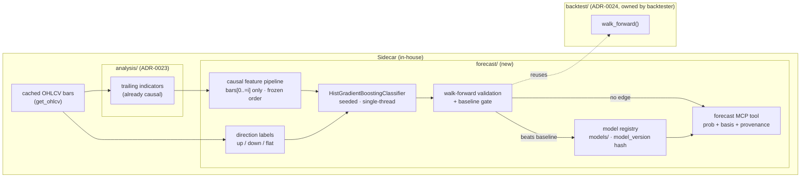

# 0036 — Forecasting subsystem foundation

> **Status:** in-progress (2026-06-05)
> **Created:** 2026-06-05
> **Owner skill(s):** dev, backtester
> **Related ADRs:** [ADR-0030](../adrs/0030-forecasting-subsystem.md) (forecasting posture — accepts at this plan's close), [ADR-0040](../adrs/0040-forecasting-model-artifacts.md) (library + determinism + versioning/provenance — accepts at this plan's close), [ADR-0024](../adrs/0024-extended-backtest-metrics.md) (walk-forward machinery this reuses), [ADR-0023](../adrs/0023-technical-analysis-surface.md) (the feature source), [ADR-0018](../adrs/0018-backtest-result-schema.md) (determinism contract)

## TL;DR

We build the **forecasting subsystem** (`src/market_analyser/forecast/`) that predicts **next-bar (and N-bar-ahead) direction as a calibrated up/down/flat probability** from cached OHLCV — implementing ADR-0030's posture and ADR-0040's library/determinism/versioning decisions. It assembles a **causal, leakage-free feature matrix** from the already-trailing [ADR-0023](../adrs/0023-technical-analysis-surface.md) `analysis/` indicators, trains a deterministic `HistGradientBoostingClassifier`, **validates out-of-sample via walk-forward and rejects any model that does not beat a naive baseline**, and exposes a `forecast` MCP tool. First user-visible behavior: an agent calls `forecast` on a cached symbol and gets back a calibrated probability **with its validation skill, baseline, and model provenance attached** — or an honest "no edge over baseline" verdict. No UI in this plan (Plan 0037); no recommendation synthesis (that is the advisor, [ADR-0029](../adrs/0029-advisory-recommendation-boundary.md)/Plan 0038).

## Context & problem

The app is, by design, a trailing condition-detector and historical backtester ([ADR-0015](../adrs/0015-claude-code-primary-control-surface.md)): it describes what *was* and what *is*, never what *will be*. The user has asked for forward price forecasting. ADR-0030 established that this is **not** a no-lookahead violation — a causal model trained on the past to predict the future respects the grain — but that it introduces two new failure surfaces the repo has never had to discipline: **leakage** in feature construction (a centered indicator, a full-series normalisation, a label that bleeds into its features) and **overfitting** (a model that memorises in-sample noise). ADR-0030 fixed the posture and four invariants; [ADR-0040](../adrs/0040-forecasting-model-artifacts.md) fixed the library (sklearn `HistGradientBoostingClassifier`, no extra native dep), the determinism mechanism (seed + single-thread + frozen feature order), and model versioning/provenance. The prerequisite — [Plan 0020](done/0020-backtest-metrics-walk-forward.md)'s walk-forward machinery — is **done**. What is missing is the subsystem itself: the feature pipeline, the model, the validation gate, and the tool.

## Decision

We implement a `forecast/` package as four phases: a **causal feature pipeline** over the `analysis/` surface (dev), **deterministic label + model training** on `HistGradientBoostingClassifier` (dev), a **walk-forward validation harness with a baseline-beating gate** reusing ADR-0024's machinery (backtester), and **versioned model persistence + the `forecast` MCP tool** carrying full provenance (dev). The subsystem outputs a calibrated up/down/flat probability or an explicit "no edge" verdict; it never outputs a price level, never a recommendation. We reject folding validation into the model phase (the gate is backtester's methodology domain and reuses backtester-owned `backtest/` code) and reject shipping any model that does not beat its baseline (ADR-0030 invariant 3 — "validated edge or nothing").

## Architecture diagram



## Implementation phases

### Phase 1 — Causal feature pipeline
- **Owner skill:** dev
- **What:** A feature builder that assembles a per-bar feature matrix from the `analysis/` indicator surface, computing the row at bar `i` from `bars[0..=i]` only, with a frozen, explicitly-ordered feature set and no full-series statistics.
- **Files touched:** `src/market_analyser/forecast/__init__.py`, `src/market_analyser/forecast/features.py`, `tests/forecast/test_features.py`.
- **Done when:** Building features over a fixture series yields a matrix whose row `i` is **provably independent of any bar after `i`** — a test that truncates the series at `i`, rebuilds, and asserts row `i` is byte-identical to the full-series row `i` (the anti-lookahead/leakage guard). A second test asserts the feature column order is fixed and fails if a feature is added/reordered without updating the frozen list. No centered indicator, no `.mean()` over the whole series, no label column present in the feature set.

### Phase 2 — Direction labels + deterministic model training
- **Owner skill:** dev
- **What:** Construct up/down/flat labels for an N-bar-ahead horizon (with an explicit flat-band threshold), and train a `HistGradientBoostingClassifier` with a fixed `random_state`, single-threaded, over the frozen feature order. Adds `scikit-learn` (and `statsmodels` for the classical baseline/ARIMA-ETS option) as exact-pinned deps under the cooldown.
- **Files touched:** `src/market_analyser/forecast/labels.py`, `src/market_analyser/forecast/model.py`, `pyproject.toml` (+ `uv lock`), `tests/forecast/test_model.py`, `tests/forecast/test_determinism.py`.
- **Done when:** Training on a fixture twice with the same seed produces **byte-identical predicted probabilities** (the golden determinism test, mirroring ADR-0018). The label builder is causal — the label for bar `i` looks *forward* to construct the target but is never exposed as a feature at or before `i` (a test asserts no label leakage into Phase 1's matrix). Adding the deps passes the cooldown gate (`uv lock` resolves with `exclude-newer` honored).

### Phase 3 — Walk-forward validation + baseline-beating gate
- **Owner skill:** backtester
- **What:** A validation harness that runs rolling out-of-sample evaluation reusing [ADR-0024](../adrs/0024-extended-backtest-metrics.md)'s `walk_forward()`, computes directional skill per fold + aggregate, compares against a **naive baseline** (persistence and majority-class), and emits a verdict: a model that does not beat baseline out-of-sample is **rejected, not shipped** (ADR-0030 invariant 3).
- **Files touched:** `src/market_analyser/forecast/validation.py`, `tests/forecast/test_validation.py`. Reuses `src/market_analyser/backtest/` (no edits to backtester-owned code expected; if a seam is needed there, it is called out at handoff).
- **Done when:** A deliberately-overfit model (in-sample-perfect, out-of-sample-random fixture) is **reported as "no edge over baseline"**, not as a passing forecast. The harness reports per-fold and aggregate directional skill computed strictly out-of-sample (folds are contiguous, anti-lookahead — no future fold informs an earlier one). The baseline skill is reported alongside the model skill, never hidden.

### Phase 4 — Model registry + `forecast` MCP tool
- **Owner skill:** dev
- **What:** Persist accepted models as versioned artifacts under a gitignored `models/` root with a `model_version` hash over all prediction-affecting inputs (ADR-0040), and add a `forecast` MCP tool that returns a calibrated up/down/flat probability for a symbol/timeframe/horizon **with its validation basis (skill + baseline) and full provenance**, or an explicit no-edge verdict.
- **Files touched:** `src/market_analyser/forecast/registry.py`, `src/market_analyser/api/mcp_tools/forecast.py`, `src/market_analyser/api/mcp_tools/__init__.py` (registration), `tests/forecast/test_registry.py`, `tests/api/test_forecast_tool.py`, the full-toolset registration test.
- **Done when:** Calling `forecast` on a cached symbol returns a `ForecastResult` carrying `prob_up/prob_down/prob_flat`, the walk-forward `skill` + `baseline_skill`, and provenance (`model_version`, feature-set id, training cutoff, seed, pinned lib versions). Re-running with the same data + seed returns an identical result **modulo provenance timestamps** (the determinism contract at the tool boundary). The `model_version` is stable across reruns with identical inputs and changes when any input (feature set, hyperparameter, training window, pinned lib) changes. The tool is present in the full-toolset registration assertion.

## Data shapes

```python
# illustrative — not the final interface
class ForecastProvenance(BaseModel):
    model_version: str          # hash over (feature-set id, model+hparams, training cutoff, lib versions, seed)
    feature_set_id: str
    training_cutoff: datetime    # last bar the model was trained through (causal boundary)
    seed: int
    lib_versions: dict[str, str] # {"scikit-learn": "1.x.y", "statsmodels": "0.x.y"}

class ForecastValidation(BaseModel):
    horizon_bars: int
    skill: float | None          # aggregate out-of-sample directional skill; None if undefined
    baseline_skill: float | None # persistence / majority-class baseline on the same folds
    beats_baseline: bool         # the gate result — False ⇒ no-edge verdict, no probability shipped

class ForecastResult(BaseModel):
    symbol: str
    timeframe: str               # constrained to the data/timeframes.py registry
    as_of_bar_ts: datetime       # the bar the forecast is made *at* (decision uses bars[0..=this] only)
    horizon_bars: int
    prob_up: float | None        # None when beats_baseline is False (honest no-edge)
    prob_down: float | None
    prob_flat: float | None
    validation: ForecastValidation
    provenance: ForecastProvenance
```

## Risks & open questions

- **Risk: overfitting passes the gate by luck on a short history.** A single walk-forward run can spuriously beat baseline. Mitigation: the gate reports baseline skill alongside, and the honest-uncertainty framing (ADR-0030 invariant 4) means a marginal beat is surfaced as marginal — the tool never dresses 0.52 as conviction. A future plan can add multiple-testing correction; out of scope here.
- **Risk: sklearn nondeterminism via thread count.** `HistGradientBoostingClassifier` can use OpenMP threads. Mitigation: pin single-thread in the training path (the determinism test is the regression guard); document the env/parameter that forces it.
- **Risk: feature leakage slips in silently.** The most likely real bug. Mitigation: Phase 1's truncate-and-compare test is the structural defense, run per feature — not a one-off.
- **Open question: flat-band threshold.** How wide is "flat" (e.g. ±0.1% next-bar return)? Proposed: a configurable parameter with a documented default; the label builder exposes it. Resolved in Phase 2, not pre-committed here.
- **Open question: does `forecast` emit an SSE event** for a future viewer to subscribe to? Deferred — the UI surface (Plan 0037) owns the event contract; this plan stays backend-only to avoid pre-committing an event shape the UI will want to drive.

## What this plan does NOT do

- **No UI.** Rendering the probability + validation on the chart is [Plan 0037](README.md) (`ui-builder`).
- **No recommendation synthesis.** Turning a forecast into "go long, stop here" is the advisor layer — [ADR-0029](../adrs/0029-advisory-recommendation-boundary.md), Plan 0038. This plan produces a *condition* (a calibrated probability), not a call.
- **No deep learning.** LSTM/Transformer sequence models stay deferred behind a future ADR (ADR-0030 Alternative A).
- **No price-level or magnitude regression.** Direction-as-probability only (ADR-0030 Alternative C).
- **No LightGBM/XGBoost.** sklearn `HistGradientBoostingClassifier` only; external boosting libs are a deferred escalation (ADR-0040 Alternative A).
- **No multi-symbol/joint models, no sentiment/news features.** Single-symbol OHLCV-derived features only; cross-source features (including Polymarket odds) are later plans.

## Followups (after this lands)

- Forecast UI surface (Plan 0037, `ui-builder`).
- Optional: classical ARIMA/ETS baseline as a second model class behind the same interface (statsmodels is already pulled in for the baseline).
- Optional: multiple-testing / deflated-skill correction on the walk-forward gate.
