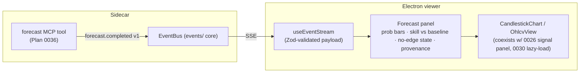

# 0037 — Forecast UI surface

> **Status:** approved (2026-06-05)
> **Created:** 2026-06-05
> **Owner skill(s):** dev, ui-builder
> **Related ADRs:** [ADR-0030](../adrs/0030-forecasting-subsystem.md) (forecasting posture — honest uncertainty), [ADR-0040](../adrs/0040-forecasting-model-artifacts.md) (the provenance the panel surfaces), [ADR-0017](../adrs/0017-live-ui-updates-via-sse.md) (the SSE stream this rides), [ADR-0015](../adrs/0015-claude-code-primary-control-surface.md) (agent-driven viewer)
> **Related plans:** [Plan 0036](0036-forecasting-subsystem-foundation.md) (produces the forecast this renders), [Plan 0026](0026-live-signal-evaluator.md) (the live-signal panel this coexists with)

## TL;DR

We surface Plan 0036's forecast in the Electron viewer: a reactive **Forecast panel** on the chart that renders the up/down/flat probability, the walk-forward **skill vs. baseline**, and the model **provenance** — reacting to a new `forecast.completed v1` SSE event the `forecast` tool emits. The honest-uncertainty contract is enforced *in the presentation*: a 0.52 is shown as marginal, never as conviction, and a model that did not beat baseline renders an explicit **"no edge over baseline"** state, not a fabricated probability. First user-visible behavior: an agent runs `forecast` and the viewer's Forecast panel updates live with the calibrated probability and its validation basis.

## Context & problem

Plan 0036 made the forecast **agent-only** — it lives behind the `forecast` MCP tool and never reaches the viewer. The app's design ([ADR-0015](../adrs/0015-claude-code-primary-control-surface.md)/[ADR-0017](../adrs/0017-live-ui-updates-via-sse.md)) is agent-driven: the agent acts, the viewer subscribes to an SSE stream and renders. So the forecast needs (a) an event on that stream and (b) a panel that renders it. Plan 0036 deliberately deferred the event shape to this plan so the UI could drive it. The hard part is not the plumbing — it is the *presentation discipline*: a probability is the single most over-trusted output the app produces (ADR-0030's named negative — "even a calibrated 0.55 gets read as a certainty"), so the panel must make uncertainty and the no-edge case visually unmistakable.

## Decision

We add `forecast.completed v1` to the SSE event vocabulary (dev), emitted by the `forecast` tool carrying the `ForecastResult`, and build a reactive **Forecast panel** (ui-builder) on the existing chart surface that renders the three probabilities, the skill-vs-baseline comparison, and provenance — with honest-uncertainty framing and a distinct no-edge state. We **reject** a renderer-initiated `GET /forecast` route for v1 (keeping the surface agent-driven, matching Plan 0026's reactive live-signal panel rather than introducing a pull path the agent-first design avoids); it can be added later if on-demand refresh is wanted.

## Architecture diagram

## Implementation phases

### Phase 1 — `forecast.completed v1` event
- **Owner skill:** dev
- **What:** Add a `forecast.completed v1` event to the SSE vocabulary, emitted by the `forecast` tool when a forecast is produced, carrying the `ForecastResult` (probabilities + validation + provenance) in a versioned, validated envelope.
- **Files touched:** the events schema module (`market_analyser/events/…`), `src/market_analyser/api/mcp_tools/forecast.py` (emit), `desktop/**/events` type generation, `tests/api/test_forecast_tool.py` (asserts emission).
- **Done when:** Running the `forecast` tool emits exactly one `forecast.completed v1` envelope carrying the full `ForecastResult`; `pnpm gen-types:check` shows no drift (the generated TS type matches the pydantic event); the no-edge case (`beats_baseline: false`) emits with null probabilities rather than suppressing the event.

### Phase 2 — Reactive Forecast panel
- **Owner skill:** ui-builder
- **What:** A Forecast panel on the chart surface rendering the up/down/flat probabilities, the walk-forward skill alongside its baseline, and a provenance tooltip (`model_version`, training cutoff, lib versions) — with honest-uncertainty styling and an explicit no-edge state. Coexists with Plan 0026's live-signal panel and Plan 0030's scroll-left lazy-load on the same `CandlestickChart`/`OhlcvView`.
- **Files touched:** `desktop/renderer/views/…` (the panel), `desktop/renderer/api`/event-dispatch (Zod `safeParse` of the `forecast.completed` payload — closing the SSE-validation-asymmetry audit note), renderer specs.
- **Done when:** A `forecast.completed` event renders the three probabilities, the skill-vs-baseline pair, and provenance; when `beats_baseline` is false the panel shows a clear **"no edge over baseline"** state and renders *no* probability bars; a marginal probability (e.g. 0.52) is **not** styled as high-conviction (a renderer spec asserts the marginal and no-edge presentations differ from a high-conviction one); the SSE payload is Zod-validated before it reaches the reducer.

## Risks & open questions

- Risk: users over-trust the probability. Mitigation: the no-edge state and marginal-vs-conviction styling are *acceptance criteria*, not polish — a spec asserts them.
- Risk: panel collides with Plan 0026's signal panel / Plan 0030's lazy-load on the shared chart. Mitigation: keep the forecast panel's subscription independent of the visible-range subscription; do not remount the chart on a forecast event.
- Open question: does the panel show only the latest forecast, or a short history? v1 = latest only; a forecast log/timeline is a followup.

## What this plan does NOT do

- No recommendation — turning the probability into "go long" is the advisor (Plan 0038, [ADR-0029](../adrs/0029-advisory-recommendation-boundary.md)).
- No on-demand `GET /forecast` pull route — agent-driven only for v1.
- No historical forecast-log view; latest-only.

## Followups (after this lands)

- Optional on-demand refresh (`GET /forecast` + a request control) if reacting-only proves limiting.
- Optional forecast history/timeline panel.
