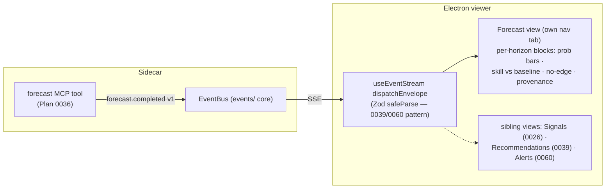

# 0037 — Forecast UI surface

> **Status:** approved (2026-06-05) — **re-actualized 2026-07-03 (architect):** presentation framing updated to the reactive-surface pattern Plans 0026/0039/0060 have since established (a dedicated view + nav tab fed by App-level state from a `useEventStream` handler, with the payload Zod-`safeParse`d in `dispatchEnvelope`), and the phase-1 parity mechanism corrected (event models are hand-mirrored in `events.ts` and guarded by `events.test.ts` — they are not on the OpenAPI surface, so `gen-types` cannot check them). Scope and both phases unchanged. — **re-actualized 2026-07-06 (architect, dev-escalated pre-implementation):** payload shape updated to the multi-horizon reality [Plan 0059](done/0059-forecast-feature-set-v2.md) shipped after the last touch — the `forecast` tool now returns `MultiHorizonForecastResult` (per-horizon `HorizonForecast` blocks; `ForecastResult` survives only as the single-horizon core `recommend` consumes), so the `forecast.completed v1` event carries that model, the no-edge contract applies **per block** (the event always fires, once per call), and the panel renders per-horizon blocks. Phase-1 file list gains the `mcp_app.py` EventBus wiring. Scope and the two-phase structure otherwise unchanged.
> **Created:** 2026-06-05
> **Owner skill(s):** dev, ui-builder
> **Related ADRs:** [ADR-0030](../adrs/0030-forecasting-subsystem.md) (forecasting posture — honest uncertainty), [ADR-0040](../adrs/0040-forecasting-model-artifacts.md) (the provenance the panel surfaces), [ADR-0054](../adrs/0054-exogenous-forecast-features-multi-horizon.md) (the multi-horizon result shape the event carries), [ADR-0017](../adrs/0017-live-ui-updates-via-sse.md) (the SSE stream this rides), [ADR-0015](../adrs/0015-claude-code-primary-control-surface.md) (agent-driven viewer)
> **Related plans:** [Plan 0036](0036-forecasting-subsystem-foundation.md) (produces the forecast this renders), [Plan 0059](done/0059-forecast-feature-set-v2.md) (made the result multi-horizon — the 2026-07-06 re-actualization), [Plan 0026](0026-live-signal-evaluator.md) (the live-signal surface this coexists with — shipped as the standalone **Signals** view, not a chart panel), [Plan 0039](done/0039-advisor-ui-surface.md) (the Recommendations view whose dispatcher-validation + quiet-presentation pattern this follows)

## TL;DR

We surface the forecast in the Electron viewer: a reactive **Forecast surface** (a dedicated view, per the 0026/0039 pattern) that renders the `forecast` tool's **per-horizon blocks** (default 1/5/21 bars on `1d` per ADR-0054) — each block's up/down/flat probability, walk-forward **skill vs. baseline**, edge strength, and model **provenance** — reacting to a new `forecast.completed v1` SSE event the tool emits, one envelope per call. The honest-uncertainty contract is enforced *in the presentation, per block*: a 0.52 is shown as marginal, never as conviction, and a horizon that did not beat baseline renders an explicit **"no edge over baseline"** state, not a fabricated probability — "edge at 1d, no edge at 21d" renders as exactly that, side by side. First user-visible behavior: an agent runs `forecast` and the viewer's Forecast panel updates live with the calibrated per-horizon probabilities and their validation basis.

## Context & problem

Plan 0036 made the forecast **agent-only** — it lives behind the `forecast` MCP tool and never reaches the viewer. The app's design ([ADR-0015](../adrs/0015-claude-code-primary-control-surface.md)/[ADR-0017](../adrs/0017-live-ui-updates-via-sse.md)) is agent-driven: the agent acts, the viewer subscribes to an SSE stream and renders. So the forecast needs (a) an event on that stream and (b) a panel that renders it. Plan 0036 deliberately deferred the event shape to this plan so the UI could drive it. The hard part is not the plumbing — it is the *presentation discipline*: a probability is the single most over-trusted output the app produces (ADR-0030's named negative — "even a calibrated 0.55 gets read as a certainty"), so the panel must make uncertainty and the no-edge case visually unmistakable.

## Decision

We add `forecast.completed v1` to the SSE event vocabulary (dev), emitted by the `forecast` tool carrying the `MultiHorizonForecastResult` (Plan 0059's per-horizon blocks, small and ephemeral — the `signal.evaluated` inline-payload rationale), and build a reactive **Forecast view** (ui-builder) that renders each horizon's block — the three probabilities, the skill-vs-baseline comparison, edge strength, and provenance — with honest-uncertainty framing and a distinct **per-horizon** no-edge state. It follows the established reactive-surface pattern (`LiveSignalView` / `RecommendationsView`): its own nav tab, App-level state set from a `useEventStream` handler, no auto-switch on an incoming event. We **reject** a renderer-initiated `GET /forecast` route for v1 (keeping the surface agent-driven, matching Plan 0026's reactive live-signal view rather than introducing a pull path the agent-first design avoids); it can be added later if on-demand refresh is wanted.

## Architecture diagram

## Implementation phases

### Phase 1 — `forecast.completed v1` event
- **Owner skill:** dev
- **What:** Add a `forecast.completed v1` event to the SSE vocabulary, emitted by the `forecast` tool when a forecast is produced, carrying the full `MultiHorizonForecastResult` (per-horizon blocks + call-level `feature_set_id`; each block's own probabilities/validation/edge/provenance) in a versioned, validated envelope — one envelope per call, however many horizons.
- **Files touched:** the events schema module (`src/market_analyser/events/`, `TYPE_REGISTRY` + payload model), `src/market_analyser/api/mcp_tools/forecast.py` (emit — exactly once per successful run, strictly after the result is built; the `signal.evaluated`/`recommendation.completed` discipline), `src/market_analyser/api/mcp_app.py` (wiring: pass the EventBus into `register_forecast` — the `recommend` precedent), `desktop/renderer/types/events.ts` (hand-mirrored TS payload — event models are not on the OpenAPI surface, so `gen-types` cannot emit them; includes the nested `HorizonForecast` with its nullable per-block `provenance`), `tests/api/test_forecast_tool.py` (asserts emission).
- **Done when:** Running the `forecast` tool emits exactly one `forecast.completed v1` envelope carrying the full `MultiHorizonForecastResult`; the `events.test.ts` pydantic↔TS parity guard covers the new payload (nested blocks included); the no-edge case applies per block — a horizon failing the baseline gate ships in its block with null probabilities rather than being dropped, and an all-no-edge result still emits the one envelope.

### Phase 2 — Reactive Forecast panel
- **Owner skill:** ui-builder
- **What:** A Forecast view (own nav tab) rendering **one block per horizon** (`horizon_bars` labeled, e.g. "1 bar / 5 bars / 21 bars"): the up/down/flat probabilities, the walk-forward skill alongside its baseline, the `edge_strength` label, and a provenance tooltip per block (`model_version`, training cutoff, lib versions) plus the call-level `feature_set_id` — with honest-uncertainty styling and an explicit per-horizon no-edge state. A v1 fallback result (`feature_set_id` = v1, empty `series_inputs`) is stated in the provenance, not hidden. Follows the established reactive-surface pattern (`LiveSignalView` / `RecommendationsView` / `AlertsView`): App-level state set from the `useEventStream` handler, no auto-switch on an incoming event.
- **Files touched:** `desktop/renderer/views/…` (the view) + the `App.tsx` tab wiring, `desktop/renderer/hooks/useEventStream.ts` (`dispatchEnvelope` case + `KNOWN_VERSIONS` entry) + a `desktop/renderer/schemas/` Zod schema for the payload (`safeParse`, loud drop — extending the validation pattern Plans 0039/0060 established), renderer specs.
- **Done when:** A `forecast.completed` event renders one block per horizon with the three probabilities, the skill-vs-baseline pair, and provenance; a block whose `beats_baseline` is false shows a clear **"no edge over baseline"** state and renders *no* probability bars — and a mixed event (edge at one horizon, no edge at another) renders both states side by side (a renderer spec asserts the mixed case); a marginal probability (e.g. 0.52, or any probability under `edge_strength: "marginal"`) is **not** styled as high-conviction (a renderer spec asserts the marginal and no-edge presentations differ from a high-conviction one); the SSE payload is Zod-validated before it reaches the reducer.

## Risks & open questions

- Risk: users over-trust the probability. Mitigation: the no-edge state and marginal-vs-conviction styling are *acceptance criteria*, not polish — a spec asserts them.
- Risk (as drafted: chart-panel collision with Plan 0026 / Plan 0030) — largely moot under the dedicated-view pattern; the residual rule stands: never remount or grab focus from the chart on a forecast event, and keep any future chart-adjacent forecast summary's subscription independent of the visible-range subscription.
- Open question: does the panel show only the latest forecast, or a short history? v1 = latest only; a forecast log/timeline is a followup.

## What this plan does NOT do

- No recommendation — turning the probability into "go long" is the advisor (Plan 0038, [ADR-0029](../adrs/0029-advisory-recommendation-boundary.md)).
- No on-demand `GET /forecast` pull route — agent-driven only for v1.
- No historical forecast-log view; latest-only.

## Followups (after this lands)

- Optional on-demand refresh (`GET /forecast` + a request control) if reacting-only proves limiting.
- Optional forecast history/timeline panel.
