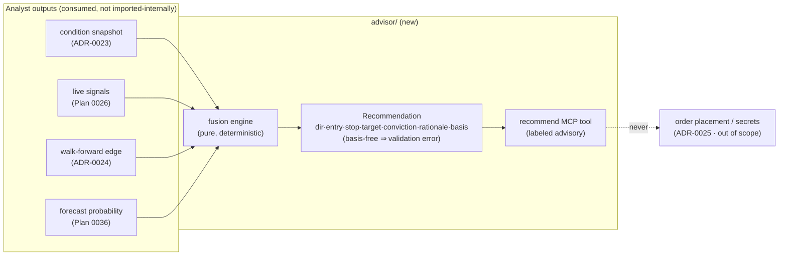

# 0038 — Advisor layer (the app may recommend, not act)

> **Status:** approved (2026-06-05)
> **Created:** 2026-06-05
> **Owner skill(s):** dev
> **Related ADRs:** [ADR-0029](../adrs/0029-advisory-recommendation-boundary.md) (the advisory boundary this implements — accepts at this plan's close), [ADR-0025](../adrs/0025-trade-execution-feasibility.md) (the execution layer *above* this — explicitly out of scope), [ADR-0004](../adrs/0004-strategy-interface.md) (strategy signals fused), [ADR-0023](../adrs/0023-technical-analysis-surface.md) (conditions fused), [ADR-0024](../adrs/0024-extended-backtest-metrics.md) (backtested basis), [ADR-0030](../adrs/0030-forecasting-subsystem.md) (forecast conviction input)
> **Related plans:** [Plan 0026](0026-live-signal-evaluator.md) (live signals — prereq), [Plan 0036](0036-forecasting-subsystem-foundation.md) (forecasts — prereq), [Plan 0020](done/0020-backtest-metrics-walk-forward.md) (walk-forward edge — done)

## TL;DR

We add the **advisor layer** (`src/market_analyser/advisor/`) — the contained crossing of the "conditions are facts, decisions are the user's" line that [ADR-0029](../adrs/0029-advisory-recommendation-boundary.md) sanctions. It **fuses** conditions ([ADR-0023](../adrs/0023-technical-analysis-surface.md) snapshot), live strategy signals ([Plan 0026](0026-live-signal-evaluator.md)), backtested edge ([ADR-0024](../adrs/0024-extended-backtest-metrics.md) walk-forward), and forecasts ([Plan 0036](0036-forecasting-subsystem-foundation.md)) into a single **labeled trade recommendation**: direction (long/short/flat) + entry zone + stop + target(s) + conviction + the rationale that fired + the backtested/forecasted basis. Surfaced via a `recommend` MCP tool. It is **advisory output the user acts on manually** — no trade-permissioned secret, no order layer, no money movement. First user-visible behavior: an agent calls `recommend AAPL` and gets back a labeled, basis-carrying recommendation it can act on elsewhere — or an honest "no actionable edge" when the inputs don't support a call.

## Context & problem

Every analyst surface in this app stops at conditions by contract ([ADR-0015](../adrs/0015-claude-code-primary-control-surface.md)): it can detect patterns, classify regime, evaluate a live signal, run walk-forward validation, produce a calibrated forecast — but it has never *synthesised* those into an actionable directional call. The user asked for exactly that. [ADR-0029](../adrs/0029-advisory-recommendation-boundary.md) decided the crossing is real but **containable**: a recommendation crosses only the principle line (it moves no money, holds no key, runs no order machine — unlike execution, [ADR-0025](../adrs/0025-trade-execution-feasibility.md)), and the crossing is contained to **one labeled layer** so the fact/decision boundary survives in every analyst skill. The problem this plan solves: build that one layer, with the discipline ADR-0029 mandates baked into the artifact shape so a confident-but-groundless call cannot ship.

## Decision

We implement a downstream `advisor/` package that imports the analyst skills' **outputs, not their internals**, and a `recommend` MCP tool. The core is a `Recommendation` model that **structurally requires its rationale and basis** — a recommendation constructed without a backtested/forecasted basis is a validation error, not a soft warning (ADR-0029's "an unexplained or basis-free recommendation is a review finding," enforced in code). The fusion is a pure, deterministic function of its inputs; conviction is *derived* from the forecast probability and backtested edge, never invented. The advisor **stops short of order placement** — no key, no order, no auto-action. We reject relaxing the analyst skills to emit calls themselves (ADR-0029 Alt A — pollutes every analyst contract) and reject folding recommendations into the execution layer (ADR-0029 Alt C — conflates two decisions with very different costs).

## Architecture diagram



## Implementation phases

### Phase 1 — `advisor/` package: Recommendation model + fusion engine
- **Owner skill:** dev
- **What:** The `Recommendation` model (direction, entry zone, stop, target(s), conviction, rationale list, basis) and the pure fusion function that maps the four inputs to a recommendation. The model enforces the basis requirement at construction.
- **Files touched:** `src/market_analyser/advisor/__init__.py`, `src/market_analyser/advisor/models.py`, `src/market_analyser/advisor/fusion.py`, `tests/advisor/test_fusion.py`, `tests/advisor/test_models.py`.
- **Done when:** Given fixture inputs (a condition snapshot + live signals + walk-forward stats + a forecast), the fusion function returns a `Recommendation` carrying a non-empty rationale and a basis referencing the backtest + forecast that supported it. Constructing a `Recommendation` with an empty/absent basis **raises a validation error** (a test asserts this — the ADR-0029 rule enforced structurally). The fusion is deterministic: identical inputs produce an identical recommendation. The package imports only analyst *outputs* — a test (or an import-lint) asserts no import of analyst-internal modules.

### Phase 2 — `recommend` MCP tool
- **Owner skill:** dev
- **What:** A `recommend` tool that assembles the live inputs for a symbol/timeframe (condition snapshot, live signals, walk-forward edge, forecast), runs the fusion, and returns the labeled advisory `Recommendation` with honest uncertainty — or an explicit "no actionable edge" when inputs don't support a directional call.
- **Files touched:** `src/market_analyser/api/mcp_tools/recommend.py`, `src/market_analyser/api/mcp_tools/__init__.py` (registration), `tests/api/test_recommend_tool.py`, the full-toolset registration test.
- **Done when:** Calling `recommend SYMBOL` returns a `Recommendation` **explicitly labeled advisory**, carrying all four basis components and a conviction that *maps from* the forecast probability + backtested edge (not a constant — a test varies the forecast/edge and asserts conviction moves). When the forecast shows no edge and signals conflict, the tool returns a flat/"no actionable edge" recommendation rather than a fabricated call. **No trade-permissioned secret, no order, no network write path exists anywhere in the tool** (a test/grep asserts the advisor holds no key and submits no order). The tool is present in the full-toolset registration assertion.

## Data shapes

```python
# illustrative — not the final interface
class RecommendationBasis(BaseModel):
    conditions: list[str]          # which condition facts fired (ADR-0023)
    signals: list[str]             # which live strategy signals fired (Plan 0026)
    backtest: dict | None          # the walk-forward edge that backs this (ADR-0024) — None only if flat
    forecast: dict | None          # the calibrated forecast that backs this (Plan 0036)

class Recommendation(BaseModel):
    symbol: str
    timeframe: str
    direction: Literal["long", "short", "flat"]
    entry_zone: tuple[float, float] | None   # None when flat
    stop: float | None
    targets: list[float]
    conviction: float                         # derived from forecast prob + backtested edge; never invented
    rationale: list[str]                      # human-readable "why"; non-empty for a directional call
    basis: RecommendationBasis                # REQUIRED — empty basis is a validation error
    label: Literal["advisory"]                # always advisory; the app recommends, the user acts
    as_of_bar_ts: datetime                    # decision uses bars[0..=this] only
```

## Risks & open questions

- Risk: the user anchors on the app's call and under-exercises judgment (ADR-0029's central negative). Mitigation: the `advisory` label and mandatory basis are structural; honest conviction (a marginal forecast yields low conviction) is enforced by the conviction-mapping test.
- Risk: **the slide toward execution.** Entry/stop/target *look like* an order ticket. Mitigation: this plan introduces no order path, no key, no submit — and a test asserts their absence. Any "just submit it" belongs to ADR-0025/Pillar 5, never here by accretion.
- Risk: the advisor is the most integration-coupled component in the repo (consumes `analysis/`, `strategies/`, `backtest/`, `forecast/`), so it is sensitive to drift in all four. Mitigation: consume their *outputs* through stable surfaces; pin the consumed shapes in fixtures so drift surfaces as a failing advisor test.
- Open question: conviction formula. How exactly do forecast probability and walk-forward edge combine into one conviction scalar? Proposed: a documented, monotone combination (higher forecast skill + higher out-of-sample edge ⇒ higher conviction), resolved in Phase 1 with the mapping test as its guard.

## What this plan does NOT do

- **No execution, no orders, no trade-permissioned secret, no auto-action** — that is [ADR-0025](../adrs/0025-trade-execution-feasibility.md) / Pillar 5. The advisor recommends; the user acts.
- **No UI** — the recommendations view is [Plan 0039](README.md) (`ui-builder`).
- **No DeFi rebalance engine.** Reconciling the `defi-analyst` skill's "rebalance suggestion" mode (a recommendation that belongs in *this* layer, per [ADR-0037](../adrs/0037-defi-position-risk-forecast.md)'s note) is a **skill-frontmatter edit**, handled as the companion step below — not a code feature of this plan.

## Companion work (not code phases — tracked here so it isn't lost)

- **Create the `advisor` skill** via `skill-creator` (owner: `human`) so future advisory work routes to a dedicated skill, distinct from the read-only analysts. ADR-0029 step (3). Can land alongside or just after this plan.
- **Reconcile the `defi-analyst` charter:** its frontmatter advertises a "rebalance suggestion" mode, which is a recommendation and belongs to the advisor, not a read-only analyst ([ADR-0037](../adrs/0037-defi-position-risk-forecast.md) flagged this). A `skill-creator`/`human` edit to move that capability's framing to the advisor.

## Followups (after this lands)

- Advisor UI (Plan 0039, `ui-builder`).
- The `advisor` skill + `defi-analyst` charter reconciliation (companion work above).
- If/when execution is ever built ([ADR-0025](../adrs/0025-trade-execution-feasibility.md)), the `Recommendation` is exactly the artifact its assisted-first invariant expects to "prepare and size" — the advisor feeds execution with no rework.
