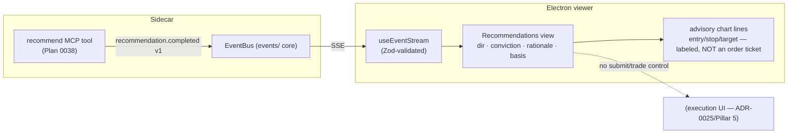

# 0039 — Advisor UI surface (recommendations view)

> **Status:** approved (2026-06-05)
> **Created:** 2026-06-05
> **Owner skill(s):** dev, ui-builder
> **Related ADRs:** [ADR-0029](../adrs/0029-advisory-recommendation-boundary.md) (the advisory boundary — labeling + honest uncertainty are acceptance criteria), [ADR-0025](../adrs/0025-trade-execution-feasibility.md) (the execution boundary the UI must visibly *not* cross), [ADR-0017](../adrs/0017-live-ui-updates-via-sse.md) (SSE stream), [ADR-0015](../adrs/0015-claude-code-primary-control-surface.md) (agent-driven viewer)
> **Related plans:** [Plan 0038](0038-advisor-layer.md) (produces the recommendation this renders)

## TL;DR

We surface Plan 0038's recommendation in the viewer: a **Recommendations view** rendering direction, entry/stop/target levels, conviction, rationale, and the backtested/forecasted basis — reacting to a `recommendation.completed v1` SSE event. The defining constraint is that the recommendation must read as **unmistakably advisory**: the levels may be drawn on the chart as labeled advisory lines, but there is **no submit/trade affordance anywhere** — the UI visibly stops at the [ADR-0025](../adrs/0025-trade-execution-feasibility.md) boundary. First user-visible behavior: an agent calls `recommend` and the viewer shows the labeled recommendation with its basis, conviction, and (advisory) levels.

## Context & problem

Plan 0038 makes the recommendation agent-only. Per the agent-driven viewer design ([ADR-0015](../adrs/0015-claude-code-primary-control-surface.md)/[ADR-0017](../adrs/0017-live-ui-updates-via-sse.md)), the viewer subscribes and renders. The risk here is sharper than the forecast panel's: a recommendation with entry/stop/target levels *looks like an order ticket* (ADR-0029's named negative; ADR-0025's "standing pressure to just submit it"). The UI must render the call usefully while making the advisory-only boundary visually obvious and offering **no** path to act on it in-app — that path, if ever built, is Pillar 5's confirm-UX behind ADR-0025's six invariants.

## Decision

We add a `recommendation.completed v1` SSE event (dev) emitted by the `recommend` tool, and a **Recommendations view/panel** (ui-builder) rendering all recommendation fields with a prominent, unmissable **advisory** label and honest-uncertainty framing (conviction shown as what it is — a derived, often-modest number). Entry/stop/target may render as clearly-labeled advisory chart lines; **no submit, buy, sell, or "send to broker" control exists**. We reject any in-app action affordance for v1 (it belongs to ADR-0025/Pillar 5) and reject rendering conviction as a single reassuring verdict without its basis (ADR-0029 requires the basis travel with the call).

## Architecture diagram

## Implementation phases

### Phase 1 — `recommendation.completed v1` event
- **Owner skill:** dev
- **What:** Add a `recommendation.completed v1` event to the SSE vocabulary, emitted by the `recommend` tool, carrying the `Recommendation` (direction, levels, conviction, rationale, basis, advisory label) in a versioned, validated envelope.
- **Files touched:** the events schema module (`market_analyser/events/…`), `src/market_analyser/api/mcp_tools/recommend.py` (emit), TS type generation, `tests/api/test_recommend_tool.py` (asserts emission).
- **Done when:** Calling `recommend` emits exactly one `recommendation.completed v1` envelope carrying the full `Recommendation` including its `advisory` label and basis; `pnpm gen-types:check` shows no drift.

### Phase 2 — Recommendations view
- **Owner skill:** ui-builder
- **What:** A Recommendations view/panel rendering direction, conviction (honestly framed), the rationale list, and the basis breakdown (which conditions/signals/backtest/forecast fired), with entry/stop/target optionally drawn as labeled advisory lines on the chart. A prominent advisory label; no actionable trade control.
- **Files touched:** `desktop/renderer/views/…` (the view + nav tab), `desktop/renderer/api`/event-dispatch (Zod `safeParse` of the payload), renderer specs.
- **Done when:** A `recommendation.completed` event renders direction, conviction, rationale, and the four basis components; the **advisory label is rendered prominently** and a renderer spec asserts it is present; entry/stop/target render as visibly advisory (a spec asserts there is **no** submit/buy/sell/trade control in the view — the ADR-0025 boundary, enforced as a test); a low-conviction recommendation is not styled as a strong call; the SSE payload is Zod-validated before reaching the reducer.

## Risks & open questions

- Risk: the levels read as an order ticket and invite "just submit it." Mitigation: the no-action-control assertion is a *spec*, not a guideline; advisory labeling is an acceptance criterion. The in-app action path is deliberately absent until ADR-0025/Pillar 5.
- Risk: over-trust of conviction. Mitigation: conviction is shown with its basis, never as a standalone verdict; low-conviction styling is asserted.
- Open question: do advisory entry/stop/target lines live on the main chart or a separate panel? Proposed: labeled lines on the chart, gated behind a clearly-advisory visual treatment; resolved in Phase 2.

## What this plan does NOT do

- **No order placement, no confirm UX, no "send to broker"** — that is [ADR-0025](../adrs/0025-trade-execution-feasibility.md) / Plan 0046 (Pillar 5), behind the six invariants. This view stops at displaying advice.
- No autonomous action; no portfolio sizing (the advisor recommends a single symbol's call, not a portfolio allocation).
- No editing/overriding the recommendation in-app (read-only display of the agent's output).

## Followups (after this lands)

- If/when execution is built, the confirm-UX (Plan 0046) is where an *explicitly-gated* action affordance would attach — never retrofitted into this advisory view.
