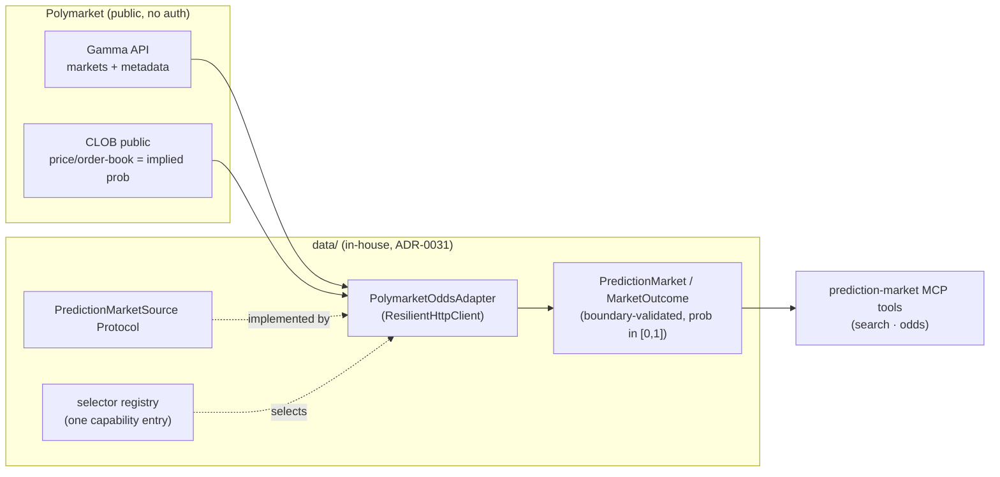

# 0040 — Polymarket odds read adapter

> **Status:** approved (2026-06-05)
> **Created:** 2026-06-05
> **Owner skill(s):** dev
> **Related ADRs:** [ADR-0041](../adrs/0041-polymarket-odds-read-source.md) (Polymarket as a read-only odds source — accepts at this plan's close), [ADR-0031](../adrs/0031-data-source-adapter-contract.md) (the per-capability source contract this extends), [ADR-0019](../adrs/0019-external-http-adapter-resilience.md) (resilience module), [ADR-0009](../adrs/0009-rewrite-data-layer-in-house.md) (in-house read adapter)

## TL;DR

We add **Polymarket prediction-market odds** as a read-only data source: a new `PredictionMarketSource` per-capability Protocol ([ADR-0031](../adrs/0031-data-source-adapter-contract.md)) and a `PolymarketOddsAdapter` that reads the **public, auth-free** Gamma + CLOB endpoints, where an outcome's price *is* its market-implied probability. Surfaced via MCP tools (search markets, get odds). It holds **no key, signs nothing, moves no funds** — a charter-safe signal the forecaster and advisor can consume. First user-visible behavior: an agent searches Polymarket for a market and gets back its outcomes with implied probabilities (0–1) and metadata. **No trading** (that is the execution pillar, [ADR-0025](../adrs/0025-trade-execution-feasibility.md), and must target the maintained `py-sdk` — the old `py-clob-client` is archived). Pillar 3 of the trade/predict/portfolio program; file-disjoint and key-free, so it can run in parallel with Pillar 1.

## Context & problem

The user wants Polymarket integrated, split (per [ADR-0041](../adrs/0041-polymarket-odds-read-source.md)) into a **read-only odds signal now** and a trading venue later. Prediction-market odds are a genuinely new signal class — a money-weighted probability of a discrete event — distinct from OHLCV, sentiment, or regime. The data layer's per-capability Protocol contract ([ADR-0031](../adrs/0031-data-source-adapter-contract.md)) is built for exactly this: a new capability gets a new Protocol + adapter + a registry entry. The 2026-06-05 research pass confirmed the reads need no auth and the price is the probability directly, so the only real work is the Protocol shape, the adapter, boundary validation, and the tool surface.

## Decision

We implement a `PredictionMarketSource` Protocol and a `PolymarketOddsAdapter` reading the public Gamma + CLOB endpoints through the [ADR-0019](../adrs/0019-external-http-adapter-resilience.md) resilient client, returning boundary-validated markets + outcomes (with implied probability), wired into the selector registry as one capability entry, and exposed via read-only MCP tools. UI is deferred (a followup, matching how other data sources surfaced before getting a view). We reject building any trading/signing path (out of scope — [ADR-0041](../adrs/0041-polymarket-odds-read-source.md) Alt C) and reject folding odds into the sentiment capability ([ADR-0041](../adrs/0041-polymarket-odds-read-source.md) Alt A).

## Architecture diagram



## Implementation phases

### Phase 1 — `PredictionMarketSource` Protocol + Polymarket adapter
- **Owner skill:** dev
- **What:** A `@runtime_checkable` `PredictionMarketSource` Protocol (per [ADR-0031](../adrs/0031-data-source-adapter-contract.md)), the `PolymarketOddsAdapter` reading public Gamma (markets/metadata) + CLOB (price = implied probability) over the resilient client, boundary-validated `PredictionMarket`/`MarketOutcome` models, and a selector-registry entry for the new capability.
- **Files touched:** `src/market_analyser/data/sources.py` (add the Protocol), `src/market_analyser/data/adapters/polymarket.py`, the models module, the selector registry, `tests/data/test_polymarket_adapter.py`.
- **Done when:** Against a recorded fixture of the public Gamma + CLOB responses, the adapter returns a `PredictionMarket` with its outcomes, each carrying an `implied_probability` in `[0, 1]` and the outcome label; a malformed/missing-field response raises the typed error taxonomy (never silently zeros a probability); the adapter satisfies `isinstance(adapter, PredictionMarketSource)` and is reachable through one registry entry. No auth header, no key, no signing anywhere in the adapter (a test/grep asserts it).

### Phase 2 — Prediction-market MCP tools
- **Owner skill:** dev
- **What:** Read-only MCP tools to search prediction markets by query and fetch a market's current odds, returning implied probabilities + metadata. Charter-safe — reports odds as facts, never a recommendation.
- **Files touched:** `src/market_analyser/api/mcp_tools/prediction_markets.py`, `src/market_analyser/api/mcp_app.py` (the `register_*` calls — the Plan 0017 registration seam; `mcp_tools/__init__.py` is a docstring-only package marker), `tests/api/test_prediction_market_tools.py`, the full-toolset registration test.
- **Done when:** A search tool returns matching markets (question + ids) for a query, and an odds tool returns a market's outcomes with implied probabilities for a market id; both go through the registry-selected source (swappable); the tools are present in the full-toolset registration assertion; outputs carry a `queried_at` and the source identity (provenance), and no output contains advice.

## Data shapes

```python
# illustrative — not the final interface
class MarketOutcome(BaseModel):
    label: str                       # e.g. "Yes" / a candidate name
    implied_probability: float       # the CLOB price; validated into [0.0, 1.0]
    # optional liquidity/volume hints for honest-uncertainty downstream
    volume_usd: float | None = None

class PredictionMarket(BaseModel):
    market_id: str
    question: str
    outcomes: list[MarketOutcome]
    closes_at: datetime | None        # resolution/close time, if published
    queried_at: datetime              # provenance (seam-routed _now)
    source: str                       # "polymarket" — the selected source identity
```

## Risks & open questions

- Risk: thin/illiquid markets give stale or manipulable "probabilities." Mitigation: surface volume/liquidity hints when available so downstream consumers (forecaster/advisor) can weight honestly; never present a thin-book probability as ground truth.
- Risk: Polymarket changes its public API shape. Mitigation: boundary validation + the typed error taxonomy turn a shape change into a clean typed failure, not a silent bad number; the resilient client handles transient failures.
- Open question: **historical odds time-series** for backtest features. The public reads give *current* odds reliably; a historical-odds series (to use odds as a forecasting feature over history) is **not** built here and its availability is uncertain — a followup/separate source if the forecaster wants odds as a historical feature.
- Open question: rate limits on the public endpoints. Inherit the resilient client's backoff; confirm the live limits at build and pin any documented ceiling.

## What this plan does NOT do

- **No trading, no order placement, no signing, no key, no wallet** — Polymarket *trading* is the execution pillar ([ADR-0025](../adrs/0025-trade-execution-feasibility.md)), a deferred second venue that must target the maintained `py-sdk`.
- **No UI** — surfacing odds in the viewer is a followup (a small `ui-builder` plan), matching how other data sources landed before their views.
- **No historical-odds backfill** — current odds only; historical series is a separate concern (open question above).
- **No market resolution/settlement tracking** — odds + metadata only.

## Followups (after this lands)

- Optional UI surface for prediction-market odds (`ui-builder`).
- Optional historical-odds source if the forecaster (Plan 0036) wants odds as a historical feature.
- The Polymarket *trading* venue — deferred to the execution pillar ([ADR-0025](../adrs/0025-trade-execution-feasibility.md)), targeting `py-sdk`.
