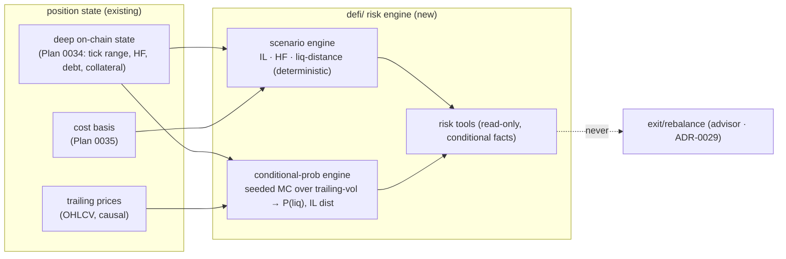

# 0042 — DeFi position risk & forecast (conditional facts)

> **Status:** approved (2026-06-05)
> **Created:** 2026-06-05
> **Owner skill(s):** dev
> **Related ADRs:** [ADR-0037](../adrs/0037-defi-position-risk-forecast.md) (this engine — accepts at close), [ADR-0034](../adrs/0034-defi-portfolio-aggregator.md) (the deep on-chain state scenarios depend on), [ADR-0036](../adrs/0036-defi-pnl-reconstruction.md) (cost basis scenarios value against), [ADR-0018](../adrs/0018-backtest-result-schema.md) (the determinism contract the simulation mirrors), [ADR-0030](../adrs/0030-forecasting-subsystem.md) (the market-forecasting subsystem this is deliberately *distinct* from), [ADR-0029](../adrs/0029-advisory-recommendation-boundary.md) (the recommend line this stays on the report side of)
> **Related plans:** [Plan 0034](done/0034-defi-deep-lp-detail.md) (deep state — prereq, **satisfied**: closed 2026-06-05; `defi/enrichment.py` + tick/HF/debt fields shipped), [Plan 0035](0035-defi-pnl-reconstruction.md) (cost basis — prereq, still active/unbuilt), [Plan 0041](0041-cross-venue-portfolio-aggregation.md) (holdings this runs over)

## TL;DR

We add the **DeFi risk/forecast engine** in `src/market_analyser/defi/` ([ADR-0037](../adrs/0037-defi-position-risk-forecast.md)), producing two kinds of **conditional facts** about a position — never a market view, never an action: **(1) deterministic scenario sensitivity** (given a supplied price move, recompute IL, value, Aave health factor, liquidation distance via position math) and **(2) conditional probabilistic risk** (seeded Monte Carlo over a trailing-vol model → probability of liquidation within N days, IL distribution — every number stating its vol assumption). Surfaced via read-only tools. First user-visible behavior: an agent asks "if ETH −30%, what happens to this position" and gets HF/IL/liquidation-distance from unit-testable math, plus "≈X% liquidation in 30d *under realized-vol-from-the-last-90-days*" with the assumption attached.

## Context & problem

"Forecast the future of positions and risks" was the most charter-sensitive part of the ask. [ADR-0037](../adrs/0037-defi-position-risk-forecast.md) resolved the shape: this is **not** [ADR-0030](../adrs/0030-forecasting-subsystem.md)'s market forecasting (which predicts *direction* and is gated by walk-forward-beats-baseline). It forecasts *the position given assumed moves* — the scenario engine asserts **no market view** (deterministic math on a supplied shock), and the probabilistic layer is explicitly conditional on a stated vol model. There is no directional claim to validate; correctness is unit-testable position math, and the probabilities are honest about their assumptions. The engine **never** emits exit/rebalance (that is [ADR-0029](../adrs/0029-advisory-recommendation-boundary.md)'s advisor). Prereqs: the deep on-chain state ([Plan 0034](done/0034-defi-deep-lp-detail.md) — **shipped**, closed 2026-06-05) for accurate current HF/debt/collateral, and the cost basis ([Plan 0035](0035-defi-pnl-reconstruction.md) — still active/unbuilt) scenarios value against.

## Decision

We implement a `defi/` risk engine with two outputs framed as conditional facts: a **deterministic scenario engine** (IL formula, Aave HF formula, liquidation distance, as pure functions of an assumed price move) and a **seeded conditional-probability engine** (trailing-vol-fit → Monte Carlo / analytic liquidation probability + IL distribution, each carrying its vol assumption). Both surfaced via read-only tools, both on the [ADR-0015](../adrs/0015-claude-code-primary-control-surface.md) facts side. We reject treating this as an [ADR-0030](../adrs/0030-forecasting-subsystem.md) instance (walk-forward gate is category-mismatched — [ADR-0037](../adrs/0037-defi-position-risk-forecast.md) Alt A), reject scenario-only (the user wanted likelihoods too — Alt B), and reject any exit/rebalance output (Alt C — advisor's job).

## Architecture diagram

## Implementation phases

### Phase 1 — Deterministic scenario sensitivity
- **Owner skill:** dev
- **What:** Pure functions recomputing a position's impermanent loss, value, Aave health factor, and liquidation distance for a **supplied** price move on the underlying(s), over the deep on-chain state ([Plan 0034](0034-defi-deep-lp-detail.md)).
- **Files touched:** `src/market_analyser/defi/scenario.py`, `tests/defi/test_scenario.py`.
- **Done when:** Given a position and a supplied shock (e.g. ETH −30%), the engine returns IL, new value, new HF, and liquidation distance computed by the documented formulas; results are **unit-tested against hand-computed known inputs** (correctness is provable, not statistical); the engine asserts **no** market view (a supplied shock is an input, never a prediction — a test/comment makes this explicit); deterministic.

### Phase 2 — Conditional probabilistic risk
- **Owner skill:** dev
- **What:** A **seeded** Monte Carlo / analytic engine over a **trailing** realized-vol fit producing probability of liquidation within N days and an IL distribution, each output carrying its explicit vol assumption. Adds a deterministic-friendly stats/simulation dependency (exact-pinned, cooldown).
- **Files touched:** `src/market_analyser/defi/risk.py`, `pyproject.toml` (+ `uv lock`), `tests/defi/test_risk.py`, `tests/defi/test_risk_determinism.py`.
- **Done when:** A liquidation-probability estimate is reproducible across two runs with the same seed (determinism test, mirroring [ADR-0018](../adrs/0018-backtest-result-schema.md)); the vol model is fit on **trailing** data only (causal — a test asserts no future price informs the fit); every probability output **states its assumption** ("under realized-vol-from-last-90-days") and a bare probability without the assumption fails a presentation test.

### Phase 3 — Risk tools (conditional-facts surface)
- **Owner skill:** dev
- **What:** Read-only MCP tools surfacing scenario sensitivity and conditional risk for a position/portfolio, framed strictly as conditional facts.
- **Files touched:** `src/market_analyser/api/mcp_tools/defi_risk.py`, registration, `tests/api/test_defi_risk_tools.py`, the full-toolset registration test.
- **Done when:** A scenario tool returns IL/HF/liquidation-distance for a supplied shock, and a risk tool returns liquidation probability + IL distribution with assumptions attached; a test asserts the outputs contain **no** exit/rebalance/de-risk language (the [ADR-0037](../adrs/0037-defi-position-risk-forecast.md) invariant-4 boundary); tools are in the full-toolset assertion. This phase's close **accepts [ADR-0037](../adrs/0037-defi-position-risk-forecast.md)**.

## Risks & open questions

- Risk: "12% chance of liquidation" reads as a prediction. Mitigation: the assumption-attached framing is a *presentation test*, enforced in every output and (Plan 0043) every UI surface.
- Risk: garbage-in vol model — a trailing fit is stale exactly when a regime breaks. Mitigation: the engine states the assumption; it cannot see a future shock — a documented limitation, not a bug.
- Risk: scenario accuracy depends on accurate current HF/debt/collateral. Mitigation: consume the deep on-chain state ([Plan 0034](0034-defi-deep-lp-detail.md)), not the aggregator's approximations.
- Open question: simulation library. Proposed: a deterministic-friendly stats lib (e.g. `numpy`'s seeded generator / `scipy`), exact-pinned; final pick in Phase 2.

## What this plan does NOT do

- **No exit/rebalance/de-risk recommendation** — advisor only ([ADR-0029](../adrs/0029-advisory-recommendation-boundary.md)).
- **No market-direction forecast** — that is [ADR-0030](../adrs/0030-forecasting-subsystem.md)/Plan 0036; this makes no directional claim.
- **No UI** — [Plan 0043](0043-portfolio-ui-surface.md).
- **No TradFi/CEX scenario math** — DeFi positions (IL/HF/liquidation) only; CEX futures liquidation risk is a possible later extension.

## Followups (after this lands)

- Portfolio UI risk panel ([Plan 0043](0043-portfolio-ui-surface.md)).
- Optional CEX-futures liquidation-distance scenarios (the same conditional-facts framing applied to Binance positions).
