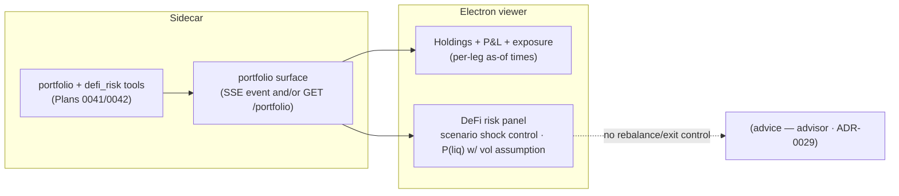

# 0043 — Portfolio UI surface

> **Status:** in-progress (2026-07-21)
> **Created:** 2026-06-05
> **Owner skill(s):** dev, ui-builder
> **Related ADRs:** [ADR-0042](../adrs/0042-cross-venue-portfolio-aggregation.md) (the aggregation this renders), [ADR-0037](../adrs/0037-defi-position-risk-forecast.md) (the conditional-risk framing the UI must preserve), [ADR-0017](../adrs/0017-live-ui-updates-via-sse.md) (SSE), [ADR-0029](../adrs/0029-advisory-recommendation-boundary.md) (no advice in a facts view)
> **Related plans:** [Plan 0041](0041-cross-venue-portfolio-aggregation.md) (holdings/P&L), [Plan 0042](0042-defi-position-risk-forecast.md) (risk/scenarios)

## TL;DR

We surface the portfolio in the viewer: a **Portfolio view** rendering unified holdings, cost-basis, unrealized P&L, and exposure-by-asset/venue (Plan 0041), plus a **risk panel** for DeFi positions — scenario sensitivity (a price-shock control → IL/HF/liquidation distance) and conditional probabilities **with their vol assumptions shown** (Plan 0042). Each venue leg shows its own **as-of time** (no blended "now"), and risk probabilities are rendered as assumption-conditional, never as predictions. First user-visible behavior: the user opens Portfolio and sees their cross-venue holdings + P&L + exposure, and can dial a scenario shock to see a position's risk response.

## Context & problem

Plans 0041–0042 make holdings/P&L and risk agent-only. The viewer needs to render them. Two presentation hazards drive the design: (1) the three legs have **different freshness** ([ADR-0042](../adrs/0042-cross-venue-portfolio-aggregation.md)'s named negative — a stale manual file must not look "live"), and (2) a conditional liquidation probability **reads as a prediction** ([ADR-0037](../adrs/0037-defi-position-risk-forecast.md)'s named negative). The UI must surface per-leg as-of times and keep every risk number visibly tied to its assumption.

## Decision

We add the SSE events/route for portfolio + risk (dev) and a **Portfolio view** (ui-builder) rendering holdings/P&L/exposure with per-leg as-of times and a DeFi risk panel whose scenario control and conditional probabilities are framed as conditional facts. No advice, no rebalance affordance ([ADR-0029](../adrs/0029-advisory-recommendation-boundary.md)). We reject any blended single-"now" presentation and reject showing a bare probability without its vol assumption.

## Architecture diagram

## Implementation phases

### Phase 1 — Portfolio + risk surface (events/route)
- **Owner skill:** dev
- **What:** A renderer-gated surface for the portfolio summary and the risk/scenario outputs — an SSE event (`portfolio.updated v1`) and/or a renderer-gated `GET /portfolio` + a scenario request path so the UI can request a shock recompute.
- **Files touched:** the events schema and/or a `portfolio` route module, TS type generation, `tests/api/test_portfolio_surface.py`.
- **Done when:** The renderer can obtain the `PortfolioSummary` (holdings + P&L + exposure + per-leg as-of) and request a scenario recompute; payloads are validated; `pnpm gen-types:check` shows no drift; the route is renderer-bearer-gated.

### Phase 2 — Portfolio view + risk panel
- **Owner skill:** ui-builder
- **What:** A Portfolio view (nav tab) rendering holdings, average-cost basis, unrealized P&L, and exposure-by-asset/venue with **per-leg as-of times**, plus a DeFi risk panel with a scenario-shock control (→ IL/HF/liquidation distance) and conditional probabilities displayed **with their vol assumptions**. No rebalance/exit control anywhere.
- **Files touched:** `desktop/renderer/views/PortfolioView…`, event/route client + Zod validation, renderer specs.
- **Done when:** The view renders holdings/P&L/exposure with each venue leg showing its **own** as-of time (a spec asserts the legs are not blended into one timestamp); the scenario control recomputes IL/HF/liquidation distance for a dialed shock; every conditional probability is rendered **with its vol assumption visible** (a spec asserts no bare probability); there is **no** rebalance/exit/buy/sell control in the view (a spec asserts it — the [ADR-0029](../adrs/0029-advisory-recommendation-boundary.md) boundary); SSE payloads Zod-validated.

## Risks & open questions

- Risk: stale legs look live. Mitigation: per-leg as-of is an acceptance criterion (asserted), not optional polish.
- Risk: conditional probability read as prediction. Mitigation: assumption-visible rendering asserted by spec; the framing matches [ADR-0037](../adrs/0037-defi-position-risk-forecast.md).
- Open question: scenario control UX — single-asset shock slider vs multi-asset. Proposed: start single-underlying shock; multi-asset is a followup.

## What this plan does NOT do

- **No rebalance/exit/buy/sell control** — facts view only; advice is the advisor ([ADR-0029](../adrs/0029-advisory-recommendation-boundary.md)) and action is execution ([ADR-0025](../adrs/0025-trade-execution-feasibility.md)).
- No portfolio *editing* in-app beyond the manual positions file (which is edited outside the app).
- No multi-asset scenario shocks in v1 (single-underlying first).

## Followups (after this lands)

- Multi-asset scenario shocks.
- Realized-P&L history view if Plan 0041's followup adds it.
