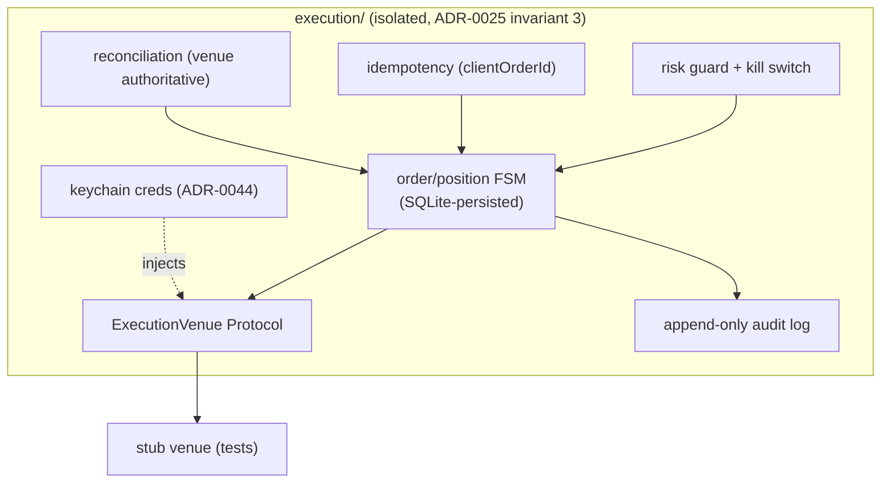

# 0044 — Execution skeleton (venue-independent machinery)

> **Status:** approved (2026-06-05)
> **Created:** 2026-06-05
> **Owner skill(s):** dev, human
> **Related ADRs:** [ADR-0043](../adrs/0043-execution-venue-protocol.md) (ExecutionVenue Protocol + state machine — accepts at close), [ADR-0044](../adrs/0044-trade-secret-store.md) (secret store — accepts at close), [ADR-0025](../adrs/0025-trade-execution-feasibility.md) (the six invariants), [ADR-0006](../adrs/0006-persistence-layout.md) (order/position persistence)
> **Related plans:** [Plan 0045](0045-binance-futures-testnet-adapter.md) (first adapter), [Plan 0046](0046-pending-order-confirm-ux.md) (confirm UX)

## TL;DR

We build the **venue-independent execution machinery** ([ADR-0025](../adrs/0025-trade-execution-feasibility.md)'s "build-once" surface) in an isolated `src/market_analyser/execution/` package: the `ExecutionVenue` Protocol, a **persisted order/position state machine** (`intended → submitted → acknowledged → (partially_)filled → closed | canceled | rejected`), **idempotency** (`clientOrderId`, no double-submit on retry), **reconciliation** (venue truth authoritative on reconnect), a **risk guard + kill switch**, and an **append-only audit log** — all proven against a **stub venue** before any real adapter. Trade credentials come from the keychain ([ADR-0044](../adrs/0044-trade-secret-store.md)). First behavior: the full lifecycle runs against a stub venue with idempotent submission, reconciliation, guard enforcement, and a working kill switch. **No real venue, no real funds in this plan.** Companion: the `trader` skill is created to own `execution/`.

## Context & problem

[ADR-0025](../adrs/0025-trade-execution-feasibility.md) named the venue-independent core; [ADR-0043](../adrs/0043-execution-venue-protocol.md) fixed its shape; [ADR-0044](../adrs/0044-trade-secret-store.md) fixed the secret mechanism (keychain via `keyring`). This plan builds that core — the hard, stateful, correctness-critical part — independent of any venue, so idempotency, reconciliation, the guard, and the kill switch are proven once against an adversarial stub before Binance ([Plan 0045](0045-binance-futures-testnet-adapter.md)) plugs in. It adds order/position tables, so it **serializes with any other migration-touching plan**.

## Decision

We implement `execution/` with the `ExecutionVenue` Protocol, a SQLite-persisted order/position FSM, idempotent submission keyed on `clientOrderId`, a reconciliation routine (venue authoritative), a risk guard (caps) + global kill switch, and an append-only audit log — tested end-to-end against a stub venue. The package imports no analyst internals ([ADR-0025](../adrs/0025-trade-execution-feasibility.md) invariant 3). We reject in-memory state ([ADR-0043](../adrs/0043-execution-venue-protocol.md) Alt C) and a Binance-specific shortcut ([ADR-0043](../adrs/0043-execution-venue-protocol.md) Alt A).

## Architecture diagram



## Implementation phases

### Phase 1 — Protocol + persisted state machine + idempotency + reconciliation
- **Owner skill:** dev
- **What:** The `ExecutionVenue` Protocol, the SQLite-persisted order/position FSM, `clientOrderId`-keyed idempotent submission, and a reconciliation routine — exercised by a stub venue. Adds the order/position migration.
- **Files touched:** `src/market_analyser/execution/__init__.py`, `execution/venue.py` (Protocol), `execution/state.py` (FSM), `execution/reconcile.py`, `persistence/migrations/` (order/position tables), `tests/execution/test_state.py`, `tests/execution/test_idempotency.py`, `tests/execution/test_reconcile.py`.
- **Done when:** An order transitions through the full lifecycle against a stub venue; **a retry with the same `clientOrderId` does not create a second order** (idempotency test); a divergent local-vs-venue state **reconciles to the venue's truth** on reconnect, including a partial-fill and a cancel-vs-fill race (reconciliation tests against adversarial stub scenarios); state persists across a simulated restart (it is read back from SQLite, not memory).

### Phase 2 — Risk guard + kill switch + audit log
- **Owner skill:** dev
- **What:** A guard layer between intent and venue (max position size, max leverage, max daily loss, per-symbol exposure cap), a global kill switch (cancel-all + block new submissions), and an append-only audit log of every intent/confirmation/submission/fill/error.
- **Files touched:** `execution/guard.py`, `execution/killswitch.py`, `execution/audit.py`, `tests/execution/test_guard.py`, `tests/execution/test_killswitch.py`, `tests/execution/test_audit.py`.
- **Done when:** An order exceeding any cap is **blocked by the guard before reaching the venue** (a test per cap); the kill switch **blocks new submissions and triggers cancel-all** (test); every intent, confirmation, submission, fill, and error is **appended to the audit log** and the log is append-only (a test asserts no in-place mutation/delete).

### Phase 3 — Trade-secret store integration
- **Owner skill:** dev
- **What:** Wire the keychain ([ADR-0044](../adrs/0044-trade-secret-store.md), `keyring`) so the venue receives injected credentials, never logged or serialized. Adds `keyring` (exact-pinned, cooldown).
- **Files touched:** `execution/secrets.py`, `pyproject.toml` (+ `uv lock`), `tests/execution/test_secrets.py`.
- **Done when:** The venue receives credentials sourced from the OS keychain; **no secret appears in any log, error, or serialization** (a test/grep asserts it across the package); a missing credential yields a typed error, not a crash; the store reads/writes only the isolated trade-key namespace (not the [ADR-0038](../adrs/0038-third-party-api-key-storage.md) read-key file).

### Phase 4 — Create the `trader` skill
- **Owner skill:** human
- **What:** Create the `trader`/`execution` skill via `skill-creator` to own `src/market_analyser/execution/`, isolated from the read-only analyst skills ([ADR-0025](../adrs/0025-trade-execution-feasibility.md) invariant 3).
- **Files touched:** `.claude/skills/trader/SKILL.md` (+ references).
- **Done when:** A `trader` skill exists whose description triggers on execution/order/venue work and which owns `execution/`; it does **not** overlap the read-only analysts; its charter states assisted-first + testnet-first + the kill switch as non-negotiables.

## Data shapes

```python
# illustrative — not the final interface
class OrderState(str, Enum):
    INTENDED = "intended"; SUBMITTED = "submitted"; ACKNOWLEDGED = "acknowledged"
    PARTIALLY_FILLED = "partially_filled"; FILLED = "filled"
    CLOSED = "closed"; CANCELED = "canceled"; REJECTED = "rejected"

class Order(BaseModel):
    client_order_id: str          # client-generated idempotency key
    venue: str
    symbol: str
    side: Literal["buy", "sell"]
    type: Literal["market", "limit"]
    quantity: float
    limit_price: float | None
    state: OrderState
    venue_order_id: str | None    # filled in on acknowledge
    # timestamps per transition → audit trail
```

## Risks & open questions

- Risk: reconciliation edge cases (partial fills, cancel-vs-fill races, stream gaps) lose money in production. Mitigation: adversarial stub-venue tests in Phase 1; residual risk acknowledged ([ADR-0043](../adrs/0043-execution-venue-protocol.md)) and only fully exposed by real testnet traffic ([Plan 0045](0045-binance-futures-testnet-adapter.md)).
- Risk: migration-chain collision. Mitigation: this plan adds a migration → do **not** run it in parallel with another migration-touching plan; serialize.
- Open question: guard cap defaults and where they're configured. Proposed: a config block with conservative defaults; resolved in Phase 2.

## What this plan does NOT do

- **No real venue** — a stub venue only; Binance is [Plan 0045](0045-binance-futures-testnet-adapter.md).
- **No order submission UX / human-confirm** — [Plan 0046](0046-pending-order-confirm-ux.md) (this plan builds the queue's backing FSM, not the confirm surface).
- **No autonomous submission** — assisted-first; submission is gated by the confirm step in [Plan 0046](0046-pending-order-confirm-ux.md).
- **No real funds, no hot-wallet key** — testnet CEX keys only; the wallet key is deferred ([ADR-0044](../adrs/0044-trade-secret-store.md)).

## Followups (after this lands)

- Binance USDⓈ-M Futures testnet adapter ([Plan 0045](0045-binance-futures-testnet-adapter.md)).
- Pending-order queue + human-confirm UX ([Plan 0046](0046-pending-order-confirm-ux.md)).
