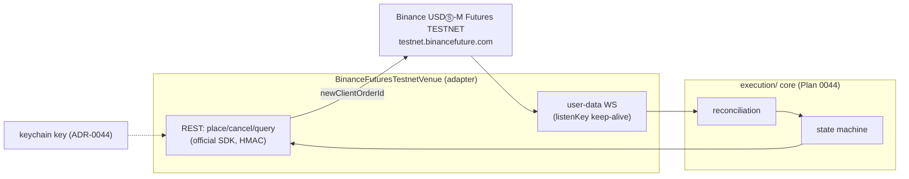

# 0045 — Binance USDⓈ-M Futures testnet adapter

> **Status:** approved (2026-06-05)
> **Created:** 2026-06-05
> **Owner skill(s):** dev
> **Related ADRs:** [ADR-0043](../adrs/0043-execution-venue-protocol.md) (the Protocol this implements), [ADR-0044](../adrs/0044-trade-secret-store.md) (the keychain the key comes from), [ADR-0025](../adrs/0025-trade-execution-feasibility.md) (testnet-first invariant), [ADR-0019](../adrs/0019-external-http-adapter-resilience.md) (resilience)
> **Related plans:** [Plan 0044](0044-execution-skeleton.md) (the machinery this plugs into)

## TL;DR

We implement the first `ExecutionVenue` adapter (first *execution* venue — distinct from Plan 0056's read-only `BinanceDerivativesAdapter` data source over `fapi.binance.com`, which shipped 2026-06-10): **Binance USDⓈ-M Futures testnet** via the **official modular SDK** (`binance-sdk-derivatives-trading-usds-futures`), against `testnet.binancefuture.com` (the *futures* testnet — **not** the spot `testnet.binance.vision`, a 2026-06-05 research correction). It places market + limit orders with a client-supplied `newClientOrderId` (idempotency), cancels, queries, and consumes the **user-data WebSocket stream** (with `listenKey` keep-alive) to reconcile fills/positions into the state machine. **Testnet only — no real funds.** First behavior: against the testnet, the full intent→submit→fill→reconcile→close loop runs green for a market and a limit order, with no double-submit on retry.

## Context & problem

[Plan 0044](0044-execution-skeleton.md) built the venue-independent machinery against a stub. This plan proves it against a real venue — Binance USDⓈ-M Futures **testnet**, the [ADR-0025](../adrs/0025-trade-execution-feasibility.md)-recommended prototype (excellent full-parity sandbox, no real money). The 2026-06-05 research pinned the integration facts: order via `POST /fapi/v1/order`, HMAC-signed; `newClientOrderId` is the idempotency key; the user-data stream's `listenKey` **expires after 60 minutes** and needs keep-alive; a weight + order rate-limit model; and the **official modular SDK** is the maintained, exact-pinnable wrapper (the old `binance-futures-connector-python` is superseded). The user chose that SDK (2026-06-05).

## Decision

We implement a `BinanceFuturesTestnetVenue` satisfying the `ExecutionVenue` Protocol via the official SDK against the futures testnet, with HMAC auth (key from the keychain, [ADR-0044](../adrs/0044-trade-secret-store.md)), `newClientOrderId`-based idempotent submission, and a user-data-stream consumer with `listenKey` keep-alive feeding reconciliation. We reject `python-binance`/`ccxt` for this venue ([ADR-0025](../adrs/0025-trade-execution-feasibility.md) library survey — the official SDK is the focused, maintained fit) and reject hardcoding the testnet host from memory (verified at build, per the research correction).

## Architecture diagram

## Implementation phases

### Phase 1 — REST adapter (place / cancel / query)
- **Owner skill:** dev
- **What:** The `BinanceFuturesTestnetVenue` REST side via the official SDK: place market + limit orders with `newClientOrderId`, cancel, and query order/position state; HMAC-signed; key injected from the keychain. Adds the SDK (exact-pinned, cooldown).
- **Files touched:** `src/market_analyser/execution/venues/binance_futures.py`, `pyproject.toml` (+ `uv lock`), `tests/execution/test_binance_futures_rest.py`.
- **Done when:** Against the futures testnet (or a recorded fixture of its responses), a **market** and a **limit** order are placed carrying a client-supplied `newClientOrderId`, then queried back; **the testnet base host is the futures testnet (`testnet.binancefuture.com`), verified at build — not hardcoded from memory and not the spot host**; a retry with the same `newClientOrderId` does **not** create a second order (idempotency holds end-to-end through the real API path); rate-limit responses are handled (backoff), not crashed on.

### Phase 2 — User-data stream + reconciliation
- **Owner skill:** dev
- **What:** Consume the user-data WebSocket stream for fills/position updates, manage the `listenKey` lifecycle (start, **keep-alive before the 60-minute expiry**, close), and reconcile fills into the [Plan 0044](0044-execution-skeleton.md) state machine.
- **Files touched:** `execution/venues/binance_futures.py` (WS), `tests/execution/test_binance_futures_ws.py`.
- **Done when:** The adapter consumes the user-data stream and reconciles fills into the FSM; the `listenKey` is **kept alive before its 60-minute expiry** (a test asserts the keep-alive cadence); a **dropped-and-reconnected** stream reconciles local state to the venue's truth (no lost or duplicated fill); a partial fill advances the FSM to `partially_filled` correctly.

### Phase 3 — Live testnet smoke
- **Owner skill:** dev
- **What:** A documented live testnet smoke running the full loop end-to-end against the real testnet (gated, not in the offline suite).
- **Files touched:** a smoke script/doc under the execution tests; no production-code change expected.
- **Done when:** A documented manual/gated run against `testnet.binancefuture.com` completes **intent → submit → acknowledge → fill → reconcile → close** for a market and a limit order, with the audit log showing every transition and no double-submit across an induced retry. (This is the real-venue evidence [ADR-0043](../adrs/0043-execution-venue-protocol.md) needs; the broader [ADR-0025](../adrs/0025-trade-execution-feasibility.md) graduates at [Plan 0046](0046-pending-order-confirm-ux.md) close once the confirm UX gates it.)

## Risks & open questions

- Risk: testnet/prod parity gaps (testnet quirks not in prod or vice versa). Mitigation: keep venue-specific quirks in the adapter; the core stays venue-independent so a quirk is a localized adapter fix.
- Risk: `listenKey` expiry mishandled → missed fills. Mitigation: keep-alive cadence is an acceptance criterion (asserted); reconciliation on reconnect is the backstop.
- Open question: exact rate-limit ceilings. Inherit the resilient client's backoff; confirm live weights/order limits at build and pin documented ceilings.

## What this plan does NOT do

- **No real-funds / mainnet trading** — testnet only ([ADR-0025](../adrs/0025-trade-execution-feasibility.md) invariant 2).
- **No human-confirm UX** — [Plan 0046](0046-pending-order-confirm-ux.md) (this adapter is driven by the core; the confirm gate lives there).
- **No second venue** (DeFi perp, Polymarket trading) — later adapters behind the same Protocol.
- **No `python-binance`/`ccxt`** — official SDK only for this venue.

## Followups (after this lands)

- Pending-order queue + human-confirm UX ([Plan 0046](0046-pending-order-confirm-ux.md)) — the gate that makes this assisted.
- Future venues (DeFi perp; Polymarket trading via `py-sdk`) as additional adapters.
