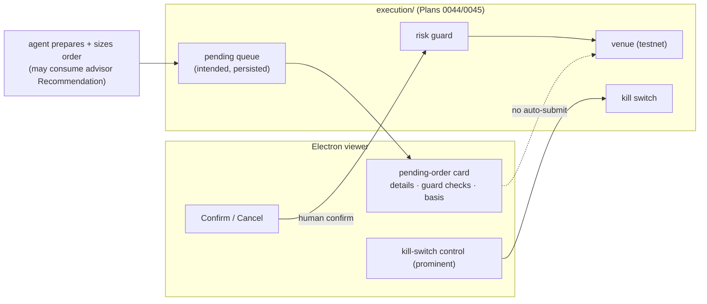

# 0046 — Pending-order queue + human-confirm UX

> **Status:** approved (2026-06-05)
> **Created:** 2026-06-05
> **Owner skill(s):** dev, ui-builder
> **Related ADRs:** [ADR-0025](../adrs/0025-trade-execution-feasibility.md) (assisted-first invariant 1 — this is its UX; **accepts at this plan's close** once the testnet loop is gated by confirmation), [ADR-0043](../adrs/0043-execution-venue-protocol.md) (the FSM the queue sits on), [ADR-0029](../adrs/0029-advisory-recommendation-boundary.md) (the Recommendation that feeds a prepared order), [ADR-0017](../adrs/0017-live-ui-updates-via-sse.md) (SSE)
> **Related plans:** [Plan 0044](0044-execution-skeleton.md) (FSM + guard + kill switch), [Plan 0045](0045-binance-futures-testnet-adapter.md) (the testnet venue)

## TL;DR

We build the **assisted-first carve-out** ([ADR-0025](../adrs/0025-trade-execution-feasibility.md) invariant 1): the agent **prepares and sizes** an order, it lands in a **pending-order queue** in the `intended` state, and it is submitted **only** after an **explicit human confirmation** — in the Electron viewer (Confirm/Cancel) or via a distinct second MCP call. The viewer renders each pending order with its details, the guard checks, and (if it came from the advisor) the [Recommendation](0038-advisor-layer.md) basis, and surfaces the **kill switch** as a prominent control. **No order reaches the venue without confirmation** — asserted as a test. This plan's close, with the testnet loop now gated by confirmation, is the gate that **accepts [ADR-0025](../adrs/0025-trade-execution-feasibility.md)**.

## Context & problem

[Plan 0044](0044-execution-skeleton.md) built the FSM/guard/kill-switch and [Plan 0045](0045-binance-futures-testnet-adapter.md) the testnet venue — but submission must never be autonomous ([ADR-0025](../adrs/0025-trade-execution-feasibility.md) invariant 1: "the agent prepares and sizes; the user confirms"). This plan is the human-in-the-loop gate: a pending queue between intent and submission, and a confirm surface. It is the carve-out that honors "decisions are the user's" while letting the agent do the analytical/preparatory work — and the standing pressure to "just auto-submit" is exactly what it exists to resist.

## Decision

We add a persisted **pending-order queue** (orders enter `intended`, never auto-advance) and a **confirm action** (UI Confirm/Cancel + a distinct second MCP call) that moves an order `intended → submitted` through the guard and venue; plus a viewer surface rendering pending orders, guard status, advisory basis, and a prominent kill switch. We reject any auto-submit path for v1 (autonomous mode is a separate later ADR, [ADR-0025](../adrs/0025-trade-execution-feasibility.md) invariant 1) and reject attaching a submit control to the advisory recommendations view ([Plan 0039](0039-advisor-ui-surface.md)) — action lives only here, behind the confirm gate.

## Architecture diagram

## Implementation phases

### Phase 1 — Pending-order queue + confirm action
- **Owner skill:** dev
- **What:** A persisted pending-order queue (orders enter `intended`) and a confirm action (a distinct second MCP call) that advances `intended → submitted` through the guard + venue; an un-confirmed order never reaches the venue.
- **Files touched:** `src/market_analyser/execution/queue.py`, `src/market_analyser/api/mcp_tools/prepare_order.py` + `confirm_order.py`, registration, `tests/execution/test_queue.py`, `tests/api/test_order_confirm.py`, the full-toolset registration test.
- **Done when:** An agent-prepared order **enters the pending queue and is not submitted** until confirmed (a test asserts no venue call before confirm); the confirm action submits it through the guard (a guard rejection blocks even a confirmed order); an order can be canceled from `intended` without ever submitting; **there is no code path that submits without an explicit confirm call** (a test asserts it). The prepare tool can ingest an advisor `Recommendation` ([Plan 0038](0038-advisor-layer.md)) as the order's basis.

### Phase 2 — Confirm UX + kill switch in the viewer
- **Owner skill:** ui-builder
- **What:** A viewer surface rendering pending orders (symbol, side, size, type, limit, guard checks, advisory basis), with explicit **Confirm/Cancel**, and the **kill switch** as a prominent, always-visible control. Reacts to order-lifecycle SSE events.
- **Files touched:** `desktop/renderer/views/ExecutionView…` (pending list + confirm + kill switch), event client + Zod validation, renderer specs.
- **Done when:** A pending order renders with its full details + guard status + (if present) the advisory basis; **Confirm** submits and **Cancel** discards; the **kill switch is a prominent control** that triggers cancel-all + blocks new submissions (a spec asserts its presence and effect); a spec asserts there is **no auto-submit** (confirmation is always required); lifecycle SSE payloads are Zod-validated.

### Phase 3 — ADR-0025 acceptance gate (assisted testnet loop)
- **Owner skill:** human
- **What:** A documented run of the **assisted** loop end-to-end on testnet: agent prepares → human confirms in the viewer → submit → fill → reconcile → close, with the kill switch exercised. This is the evidence that graduates [ADR-0025](../adrs/0025-trade-execution-feasibility.md).
- **Files touched:** a smoke doc; no production-code change expected.
- **Done when:** The full **assisted** loop completes on testnet with a human confirmation gating submission and the kill switch demonstrably halting new orders + cancelling open ones; the audit log shows the intent, the confirmation, the submission, the fill, and the close. On this evidence, the close ceremony **accepts [ADR-0025](../adrs/0025-trade-execution-feasibility.md)** (and [ADR-0043](../adrs/0043-execution-venue-protocol.md)/[ADR-0044](../adrs/0044-trade-secret-store.md) if not already accepted at [Plan 0044](0044-execution-skeleton.md)).

## Risks & open questions

- Risk: the confirm step is treated as a rubber-stamp. Mitigation: the pending card shows guard checks + basis so confirmation is informed, not reflexive; this is UX discipline, partly outside code.
- Risk: pressure to add auto-submit. Mitigation: the no-auto-submit assertion is a test in both Phase 1 and Phase 2; autonomous mode requires its own future ADR.
- Open question: confirm via UI vs a second MCP call as the primary path. Proposed: support both (UI for the viewer-present user, second MCP call for agent-mediated flows), with the UI as primary; resolved in Phase 1/2.

## What this plan does NOT do

- **No autonomous submission** — every order requires explicit human confirmation ([ADR-0025](../adrs/0025-trade-execution-feasibility.md) invariant 1); autonomous mode is a separate later ADR.
- **No real funds** — testnet only; the acceptance gate runs on `testnet.binancefuture.com`.
- **No second venue** — Binance testnet only; other venues are later adapters.
- **No submit control in the advisory view** ([Plan 0039](0039-advisor-ui-surface.md)) — action lives only here, behind the confirm gate.

## Followups (after this lands)

- Real-funds graduation — a **separate, deliberate** decision once the assisted testnet loop is proven ([ADR-0025](../adrs/0025-trade-execution-feasibility.md)); not implied by this plan.
- Autonomous mode — its own future ADR; explicitly out of scope.
- Additional venues (DeFi perp; Polymarket trading) behind the same Protocol + confirm gate.
